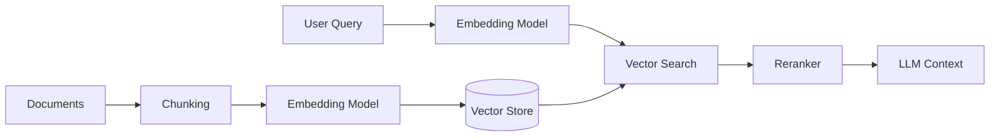

# Pattern: RAG Pipeline

> **Goal**: Standardize how agents ingest, embed, and retrieve knowledge to ground their responses.

---

## 1. Architecture



## 2. Ingestion Strategy

### Chunking
- **Fixed Size**: 512-1024 tokens (Overlap: 10-15%).
- **Semantic**: Break by header/paragraph (Markdown/Code).
- **AgentX Default**: Use `RecursiveCharacterTextSplitter` with 1024 chunks / 100 overlap.

### Embedding
- **Model**: `text-embedding-3-small` (or Azure OpenAI `text-embedding-ada-002`).
- **Dimensions**: 1536.
- **Batch Size**: 100 docs per batch max.

## 3. Retrieval Strategy

### Hybrid Search (Recommended)
Combine **Keyword Search** (BM25) with **Vector Search** (Cosine Similarity).

```python
# Pseudo-code for Hybrid Retrieval
def search(query):
    # 1. Vector Search
    vector_results = vector_store.similarity_search(query, k=10)
    
    # 2. Keyword Search
    keyword_results = keyword_store.search(query, k=10)
    
    # 3. Reciprocal Rank Fusion (RRF)
    combined = rrf_merge(vector_results, keyword_results)
    
    return combined[:5]
```

### Reranking
Always use a reranker step for high-precision agents.
- **Tools**: Azure AI Search Semantic Ranker, Cohere Rerank.

## 4. Implementation Schema

**Document Payload (Vector Store)**:
```json
{
  "id": "uuid",
  "content": "Text chunk...",
  "embedding": [0.12, -0.05, ...],
  "metadata": {
    "source": "manual.pdf",
    "page": 12,
    "last_updated": "2024-01-01",
    "access_level": "public"
  }
}
```
