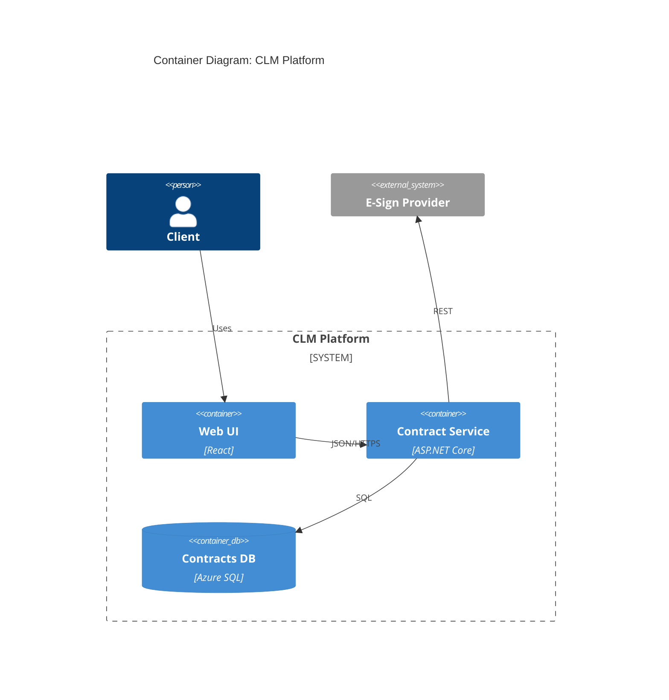

# C4 Model and Structurizr DSL

> **Parent skill**: [diagrams/diagram-as-code](../SKILL.md)
> **Use when**: describing system architecture at Context, Container, Component, or Code level.

---

## The Four Levels

| Level | Scope | Audience | Typical format |
|-------|-------|----------|----------------|
| 1. Context | System + actors + external systems | Execs, stakeholders | Mermaid C4Context, Structurizr |
| 2. Container | Apps, services, datastores | Architects, engineers | Mermaid C4Container, Structurizr |
| 3. Component | Modules inside a container | Engineers | PlantUML component, Structurizr |
| 4. Code | Classes inside a component | Engineers (rare) | PlantUML class, Mermaid class |

Rule: one level per diagram. Never mix levels in a single view.

---

## Structurizr DSL

Recommended when multiple C4 levels are needed from one source of truth. Structurizr renders all views from a single model file.

```
workspace "CLM Platform" {
  model {
    client = person "Client"
    clm = softwareSystem "CLM Platform" {
      web = container "Web UI" "React SPA"
      api = container "Contract Service" "ASP.NET Core"
      db = container "Contracts DB" "Azure SQL"
    }
    esign = softwareSystem "E-Sign Provider" "External"

    client -> web "Uses"
    web -> api "JSON/HTTPS"
    api -> db "SQL"
    api -> esign "REST"
  }
  views {
    systemContext clm { include * autolayout }
    container clm { include * autolayout }
    theme default
  }
}
```

## Mermaid C4 (Context + Container only)

Good for inline rendering in markdown; container/context only.



## Rules

- Every element has a responsibility label (one sentence)
- Every relationship has a verb + protocol (e.g. "JSON/HTTPS", "gRPC")
- External systems are styled differently (use C4 `System_Ext` / Structurizr tags)
- No level-mixing (a container view does not show classes; a context view does not show database tables)
- Include a legend in Structurizr via `styles` / `theme`
