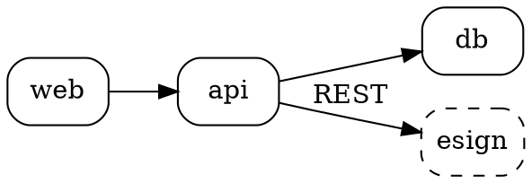
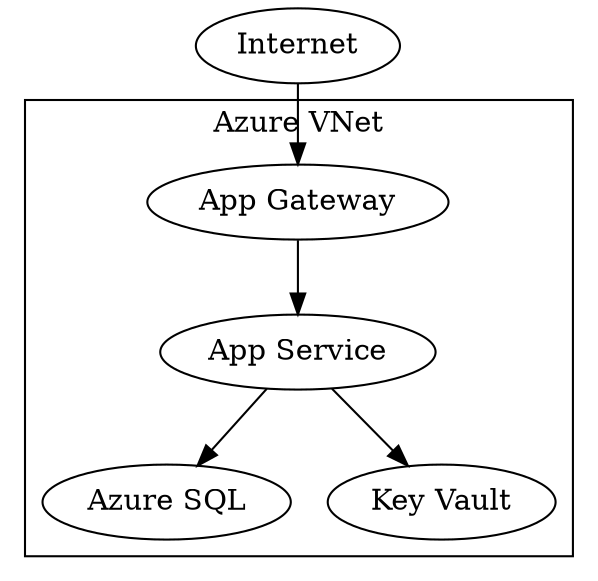
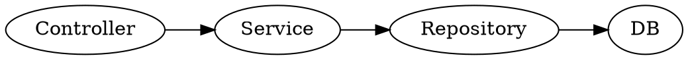

# Graphviz DOT Patterns

> **Parent skill**: [diagrams/diagram-as-code](../SKILL.md)
> **Use when**: rendering dependency graphs, call graphs, network topologies, or any diagram driven from machine-generated data.

---

## Dependency Graph

## Network Topology

## Call Graph

## Rendering

- `dot -Tsvg file.dot -o file.svg`
- VS Code "Graphviz (dot) language support" extension renders inline
- Import SVG to draw.io for Visio export

## Tips

- Prefer DOT over Mermaid when the graph is generated from code (easy to emit)
- Use `rankdir=LR` for left-to-right dependency flow, `TB` for trees
- Apply `cluster_*` subgraphs for grouping (VPCs, namespaces, layers)
- Keep nodes <= 50; beyond that, pre-filter or break into sub-graphs
