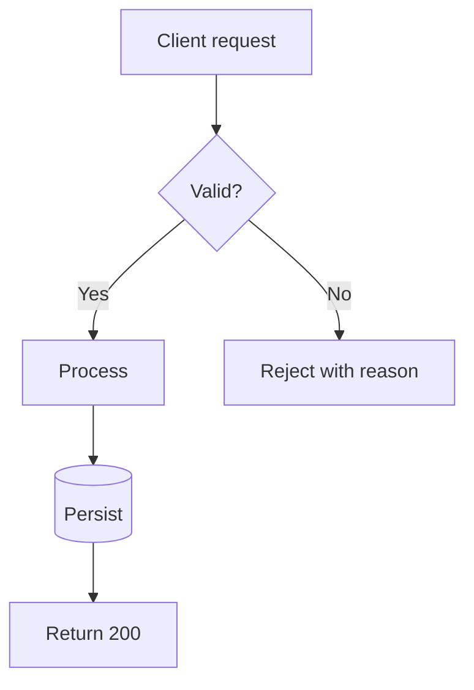
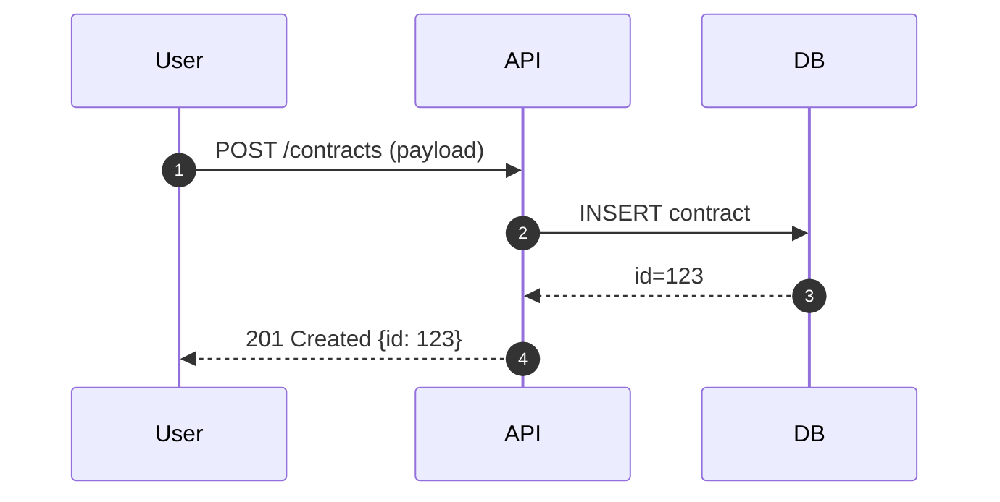
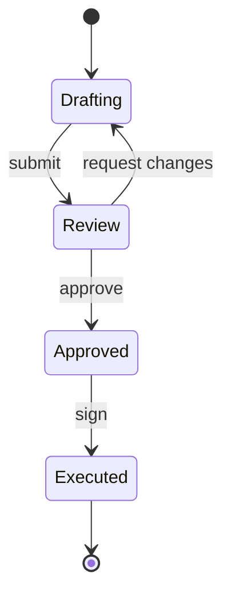
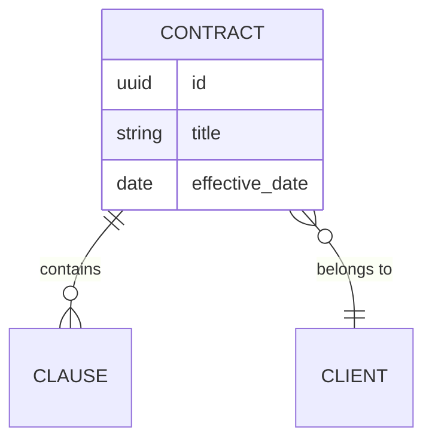
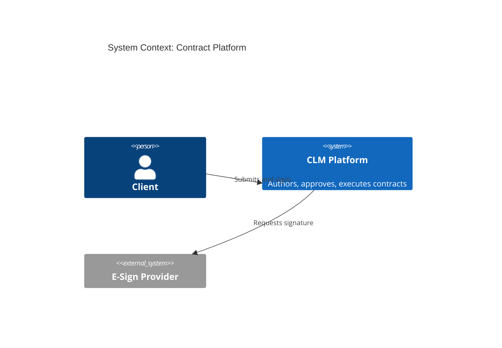
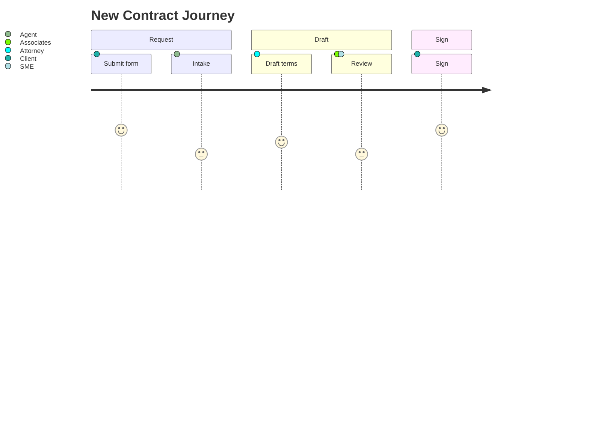

# Mermaid Patterns

> **Parent skill**: [diagrams/diagram-as-code](../SKILL.md)
> **Use when**: diagram must render natively in GitHub markdown, VS Code preview, or issue/PR comments.

---

## Flowchart

## Sequence

## State

## ER

## C4 Context (Mermaid C4 plugin)

## Journey

## Tips

- Prefer `flowchart LR` for journey-style left-to-right stories; `TD` for decision trees
- Use `%%{init: {'theme':'neutral'}}%%` directive for consistent rendering in light + dark themes
- Keep node labels under ~30 characters; put detail in a linked artifact
- For sequence diagrams, `autonumber` helps reviewers cite specific steps
