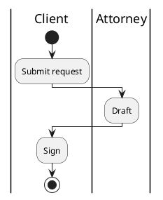
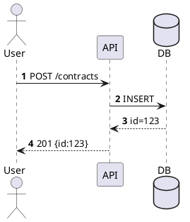
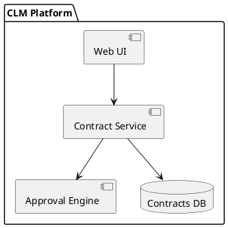
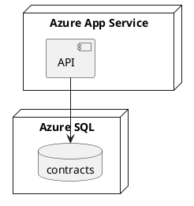
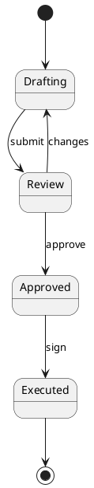

# PlantUML Patterns

> **Parent skill**: [diagrams/diagram-as-code](../SKILL.md)
> **Use when**: need strong UML semantics, swimlane activity flows, or when rendering via PlantUML server / VS Code extension.

---

## Activity (beta) with Swimlanes

See [swimlane-patterns.md](swimlane-patterns.md) for the full swimlane pattern. Quick form:

## Sequence

## Component

## Deployment

## State

## Tips

- Activity beta (`|Role|` swimlanes) is the right choice for CFFs rendered in CI pipelines
- Use `!include` to share skinparam themes across diagrams
- Export SVG for docs, `.vsdx` via draw.io import when Visio is required
- Validate via `plantuml -tsvg file.puml` locally or public PlantUML server
