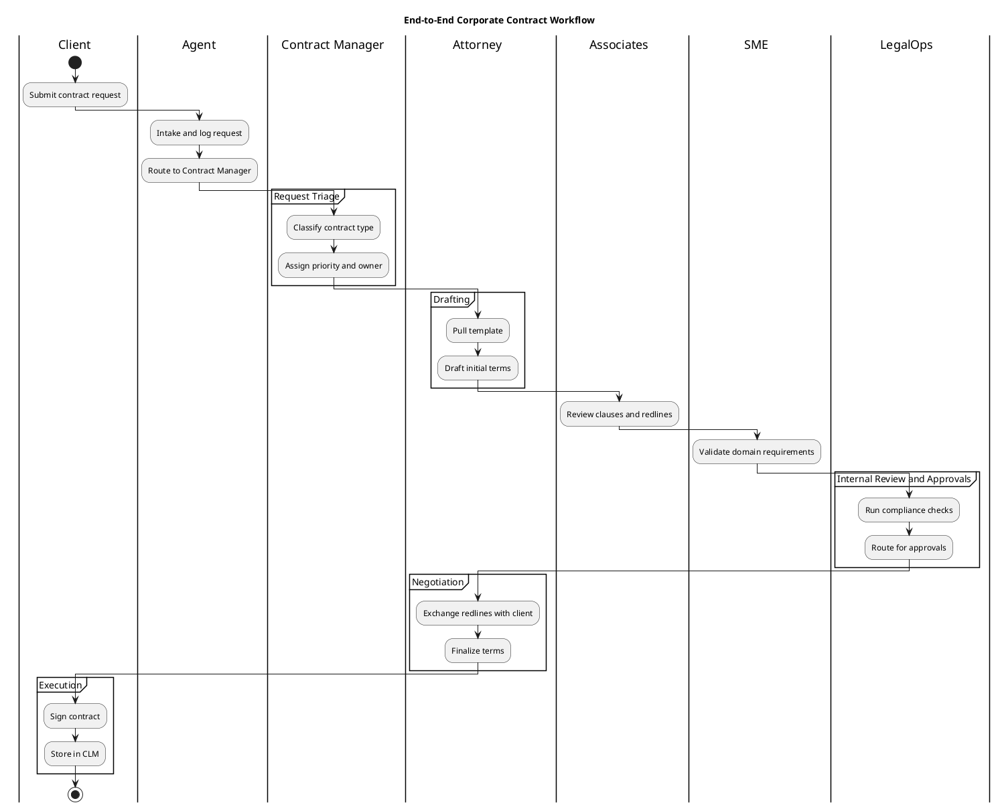
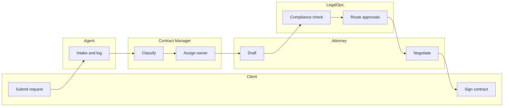

# Swimlane and Cross-Functional Flowchart Patterns

> **Parent skill**: [diagrams/diagram-as-code](../SKILL.md)
> **Use when**: representing a process that crosses two or more roles/systems with explicit handoffs -- CLM workflows, incident response, order-to-cash, PR review, onboarding, etc.

---

## Format Comparison

| Format | Native lanes | Phase bands | Rendering | Visio round-trip |
|--------|--------------|-------------|-----------|------------------|
| **PlantUML activity beta** | Yes (`\|Role\|`) | Via `partition` | PlantUML server, VS Code preview | SVG -> draw.io -> `.vsdx` |
| **draw.io / diagrams.net** | Yes (CFF shape library: pools + lanes) | Yes (horizontal pools) | draw.io desktop/web, VS Code plugin | Native `.vsdx` export |
| **Mermaid flowchart + subgraphs** | Partial (subgraph = lane) | Weak (styled nodes) | GitHub markdown, VS Code | Mermaid -> Visio-for-web import |
| **BPMN (via bpmn.io, draw.io)** | Yes (pools + lanes) | Yes | bpmn.io | Via draw.io `.vsdx` |

Picking rule:

- **Must render in GitHub markdown + simple swimlane** -> Mermaid subgraphs
- **Must round-trip to native `.vsdx`** -> draw.io CFF (preferred) or BPMN
- **Code-first + CI-renderable + strong swimlane semantics** -> PlantUML activity beta
- **Formal BPMN notation required (events, gateways, messages)** -> BPMN via draw.io

---

## Pattern 1: PlantUML Activity (beta) -- code-first swimlane

Use for: CLM workflows, incident response, operational runbooks, approval chains.



Maps the attached example directly: 7 lanes (Client, Agent, Contract Manager, Attorney, Associates, SME, LegalOps) and 6 phase bands (Request Triage, Intake & Request, Drafting, Internal Review and Approvals, Negotiation, Execution).

---

## Pattern 2: draw.io CFF (XML) -- Visio-compatible swimlane

Use when the output must open in Visio (`.vsdx`) or needs pixel-perfect rendering for stakeholders.

Minimal skeleton (simplified; draw.io generates the full XML through its UI):

```xml
<mxfile host="app.diagrams.net">
  <diagram name="Contract Workflow">
    <mxGraphModel>
      <root>
        <mxCell id="0"/>
        <mxCell id="1" parent="0"/>

        <!-- Pool (the whole matrix) -->
        <mxCell id="pool" value="End-to-End Corporate Contract Workflow"
                style="shape=swimlane;horizontal=0;startSize=30;" vertex="1" parent="1">
          <mxGeometry x="0" y="0" width="1400" height="900" as="geometry"/>
        </mxCell>

        <!-- Role columns (lanes) -->
        <mxCell id="laneClient" value="Client" style="shape=swimlane;horizontal=0;" vertex="1" parent="pool">
          <mxGeometry x="30" y="0" width="200" height="900" as="geometry"/>
        </mxCell>
        <!-- ...repeat lane cells for Agent, Contract Manager, Attorney, Associates, SME, LegalOps... -->

        <!-- Phase bands are separate rectangles overlaid as horizontal sections -->
        <mxCell id="phaseTriage" value="Request Triage"
                style="shape=rectangle;rotation=-90;fillColor=#2a9d8f;fontColor=#ffffff;" vertex="1" parent="pool">
          <mxGeometry x="0" y="30" width="30" height="130" as="geometry"/>
        </mxCell>
        <!-- ...repeat for Intake, Drafting, Review, Negotiation, Execution... -->

        <!-- Start pill -->
        <mxCell id="start" value="Start" style="ellipse;fillColor=#2a9d8f;fontColor=#ffffff;"
                vertex="1" parent="pool">
          <mxGeometry x="60" y="60" width="60" height="30" as="geometry"/>
        </mxCell>

      </root>
    </mxGraphModel>
  </diagram>
</mxfile>
```

In practice: build the matrix in draw.io UI, save as `.drawio` (committed to git), and export `.vsdx` on demand.

---

## Pattern 3: Mermaid flowchart with subgraph lanes -- lightweight

Use for simple 2-4 lane flows rendered inline in markdown (PRDs, ADRs, issues).



Limitations:
- No native phase bands (use color or labels to suggest phases)
- No pool/lane separators drawn as real boxes; subgraphs are the proxy
- Good up to ~4 lanes; beyond that switch to PlantUML or draw.io

---

## Mapping the Attached Template (End-to-End Corporate Contract Workflow)

| Image element | Maps to |
|---------------|---------|
| Column header (Client, Agent, Contract Manager, Attorney, Associates, SME, LegalOps) | PlantUML `\|Role\|` or draw.io lane |
| Row band (Request Triage, Intake & Request, Drafting, Internal Review and Approvals, Negotiation, Execution) | PlantUML `partition "..."` or draw.io phase-band rectangle |
| Green "Start" pill in Client/Request Triage | PlantUML `start` node inside `|Client|` + `partition "Request Triage"` |
| Teal color palette | Skin param in PlantUML or fillColor in draw.io (`#2a9d8f`) |

---

## Authoring Rules (Swimlane-Specific)

1. **One activity per lane cell** -- never span a shape across two lanes; use a labeled arrow for handoff.
2. **Phase bands go top-to-bottom** in execution order (matching stakeholder mental model).
3. **Start and end are explicit** -- mark them with distinct shapes (pill, double-ring).
4. **Label every handoff arrow** with the action and (optionally) the artifact: `"Send draft (PDF)"`, not just `-->`.
5. **Cap lane count at 7** -- if you need more, split into sub-process diagrams and link them.
6. **Cap phase count at 6** -- deeper processes belong in separate CFFs chained by a parent flow.
7. **Include a legend** for any non-default color or shape (e.g. red = exception path).

---

## Review Checklist (Swimlane)

- [ ] Chosen format supports native lanes (PlantUML activity beta, draw.io CFF, or BPMN)
- [ ] Every activity belongs to exactly one lane
- [ ] Phase bands are ordered and named
- [ ] Start and end nodes present
- [ ] Handoff arrows carry action labels (not bare arrows)
- [ ] Lane count <= 7, phase count <= 6
- [ ] Legend present for non-default colors/shapes
- [ ] For `needs:visio` work: `.vsdx` export exists next to the source file
- [ ] Title and source-of-truth link (PRD/ADR/spec issue) in the header
