---
inputs:
  decision_id:
    description: "ADR sequential ID number"
    required: true
    default: ""
  decision_title:
    description: "Short title of the architectural decision"
    required: true
    default: ""
  issue_number:
    description: "GitHub issue number for this decision"
    required: true
    default: ""
  epic_id:
    description: "Parent Epic issue number"
    required: false
    default: ""
  date:
    description: "Decision date (YYYY-MM-DD)"
    required: false
    default: "${current_date}"
  status:
    description: "Decision status"
    required: false
    default: "Accepted"
  author:
    description: "Author of this architectural decision"
    required: false
    default: ""
---

# ADR-${decision_id}: ${decision_title}

**Status**: ${status}
**Date**: ${date}  
**Author**: ${author}  
**Epic**: #${epic_id}  
**Issue**: #${issue_number}  
**PRD**: [PRD-${epic_id}.md](../prd/PRD-${epic_id}.md)  
**UX**: [UX-${issue_number}.md](../ux/UX-${issue_number}.md)

---

## Table of Contents

1. [Context](#context)
2. [Decision](#decision)
3. [Options Considered](#options-considered)
4. [Rationale](#rationale)
5. [Consequences](#consequences)
6. [Implementation](#implementation)
7. [References](#references)
8. [Review History](#review-history)

---

## Context

{What is the issue we're addressing? Why is this decision needed?}

**Requirements:**
- {Requirement from PRD}
- {Requirement from UX}
- {Functional requirement}

**Constraints:**
- {Technical constraint (e.g., must use PostgreSQL)}
- {Resource constraint (e.g., 2-week timeline)}
- {Team constraint (e.g., team knows .NET, not Java)}

**Background:**
{Any additional context: existing system limitations, business drivers, regulatory requirements}

---

## Decision

We will {architectural decision - be specific and actionable}.

**Key architectural choices:**
- {Choice 1: e.g., Use repository pattern for data access}
- {Choice 2: e.g., Implement JWT authentication}
- {Choice 3: e.g., Use Redis for caching}

---

## Options Considered

### Option 1: {Name}

**Description:**
{Brief explanation of this approach}

**Pros:**
- {Pro 1 - specific benefit}
- {Pro 2}
- {Pro 3}

**Cons:**
- {Con 1 - specific drawback}
- {Con 2}
- {Con 3}

**Effort**: S | M | L | XL  
**Risk**: Low | Medium | High

---

### Option 2: {Name}

**Description:**
{Brief explanation of this approach}

**Pros:**
- {Pro 1}
- {Pro 2}

**Cons:**
- {Con 1}
- {Con 2}

**Effort**: S | M | L | XL  
**Risk**: Low | Medium | High

---

### Option 3: {Name} (if applicable)

**Description:**
{Brief explanation of this approach}

**Pros:**
- {Pro 1}
- {Pro 2}

**Cons:**
- {Con 1}
- {Con 2}

**Effort**: S | M | L | XL  
**Risk**: Low | Medium | High

---

## Rationale

We chose **Option X** because:

1. **{Reason 1}**: {Detailed explanation}
2. **{Reason 2}**: {Detailed explanation}
3. **{Reason 3}**: {Detailed explanation}

**Key decision factors:**
- {Factor 1: e.g., Performance requirements}
- {Factor 2: e.g., Team expertise}
- {Factor 3: e.g., Cost constraints}

---

## Consequences

### Positive
- {Benefit 1: e.g., Improved scalability}
- {Benefit 2: e.g., Better maintainability}
- {Benefit 3: e.g., Reduced complexity}

### Negative
- {Trade-off 1: e.g., Increased initial development time}
- {Trade-off 2: e.g., Additional infrastructure cost}
- {Trade-off 3: e.g., Learning curve for team}

### Neutral
- {Change 1: e.g., New dependency on Redis}
- {Change 2: e.g., Different testing approach required}

---

## Implementation

**Detailed technical specification**: [SPEC-{issue}.md](../specs/SPEC-{issue}.md)

**High-level implementation plan:**
1. {Step 1}
2. {Step 2}
3. {Step 3}

**Key milestones:**
- Phase 1: {Milestone with timeline}
- Phase 2: {Milestone with timeline}
- Phase 3: {Milestone with timeline}

---

## AI/ML Architecture (if applicable)

> **Trigger**: Include this section when the issue has `needs:ai` label or the PRD includes AI/ML Requirements. If the product does NOT involve AI/ML, skip this section entirely.

### Model Selection Decision

| Model | Provider | Context Window | Cost (per 1M tokens) | Latency | Selected? |
|-------|----------|---------------|----------------------|---------|-----------|
| {Model 1} | {Provider} | {window} | {cost} | {latency} | ✅ / ❌ |
| {Model 2} | {Provider} | {window} | {cost} | {latency} | ✅ / ❌ |
| {Model 3} | {Provider} | {window} | {cost} | {latency} | ✅ / ❌ |

### Agent Architecture Pattern

- [ ] **Single Agent** — simple tool use, one model call chain
- [ ] **Multi-Agent Orchestration** — sequential, parallel, or hierarchical agent coordination
- [ ] **Human-in-the-Loop** — agent proposes, human approves
- [ ] **Reflection / Self-Correction** — agent evaluates and refines its own output
- [ ] **RAG Pipeline** — retrieval-augmented generation with knowledge base
- [ ] **Hybrid** — rule-based preprocessing + AI/ML core + deterministic post-processing

### Inference Pipeline

```mermaid
graph LR
    A["📥 Request"] --> B["⚙️ Preprocessing"]
    B --> C["📚 Context / RAG"]
    C --> D["🧠 Model Invocation"]
    D --> E["📤 Output Parsing"]
    E --> F["✅ Validation"]
    F --> G["📨 Response"]

    style A fill:#E3F2FD,stroke:#1565C0
    style D fill:#F3E5F5,stroke:#6A1B9A
    style G fill:#E8F5E9,stroke:#2E7D32
```

{Describe each stage with specific implementation decisions}

### Evaluation Strategy

| Metric | Evaluator | Threshold | How Measured |
|--------|-----------|-----------|--------------|
| {Quality metric} | {Built-in / Custom} | {≥ X} | {Method} |
| {Latency} | {Timer} | {< Xms} | {P50/P95/P99} |
| {Cost} | {Token counter} | {< $X/req} | {Aggregated} |

### AI-Specific Risks

| Risk | Impact | Mitigation |
|------|--------|------------|
| Model hallucination | High | Grounding, RAG, structured output, validation |
| API rate limits | Medium | Retry with backoff, fallback model, caching |
| Cost overrun | Medium | Token budgets, model tiering, caching |
| Latency spikes | Medium | Streaming, async, timeout with fallback |

> **Reference**: Read `.github/skills/ai-systems/ai-agent-development/SKILL.md` for architecture patterns and model guidance.

---

## References

### Internal
- [Related ADR](ADR-X.md)
- [PRD](../prd/PRD-{epic-id}.md)
- [UX Design](../ux/UX-{feature-id}.md)

### External
- [Technology documentation](https://...)
- [Industry best practices](https://...)
- [Research article](https://...)

---

## Review History

| Date | Reviewer | Status | Notes |
|------|----------|--------|-------|
| {date} | {name} | Approved | {comments} |

---

**Author**: {Agent/Person Name}  
**Last Updated**: {YYYY-MM-DD}
