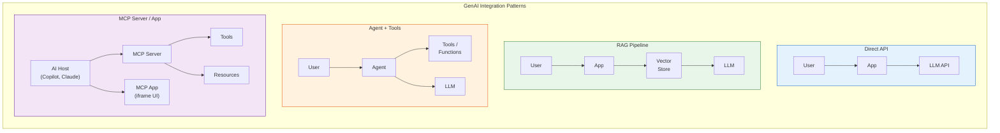

---
inputs:
 epic_title:
 description: "Title of the Epic"
 required: true
 default: ""
 issue_number:
 description: "GitHub issue number for this Epic"
 required: true
 default: ""
 priority:
 description: "Priority level"
 required: false
 default: "p2"
 author:
 description: "Document author (agent or person name)"
 required: false
 default: "Product Manager Agent"
 date:
 description: "Creation date (YYYY-MM-DD)"
 required: false
 default: "${current_date}"
---

# PRD: ${epic_title}

**Epic**: #${issue_number} 
**Status**: Draft | Review | Approved 
**Author**: ${author} 
**Date**: ${date} 
**Stakeholders**: {Names/Roles}
**Priority**: ${priority}

---

## Table of Contents

1. [Problem Statement](#1-problem-statement)
2. [Target Users](#2-target-users)
3. [Goals & Success Metrics](#3-goals--success-metrics)
4. [Requirements](#4-requirements)
5. [User Stories & Features](#5-user-stories--features)
6. [User Flows](#6-user-flows)
7. [Dependencies & Constraints](#7-dependencies--constraints)
8. [Risks & Mitigations](#8-risks--mitigations)
9. [Timeline & Milestones](#9-timeline--milestones)
10. [Out of Scope](#10-out-of-scope)
11. [Open Questions](#11-open-questions)
12. [Appendix](#12-appendix)

---

## 1. Problem Statement

### What problem are we solving?
{Clear, concise description of the user problem or business need. 2-3 sentences.}

### Why is this important?
{Business value, user impact, competitive advantage}

### What happens if we don't solve this?
{Consequences of inaction}

---

## 2. Target Users

### Primary Users
**User Persona 1: {Name/Role}**
- **Demographics**: {Age, location, tech-savviness}
- **Goals**: {What they want to achieve}
- **Pain Points**: {Current frustrations}
- **Behaviors**: {How they currently solve this}

**User Persona 2: {Name/Role}**
- **Demographics**: {Details}
- **Goals**: {Details}
- **Pain Points**: {Details}
- **Behaviors**: {Details}

### Secondary Users
{Additional user groups who benefit indirectly}

---

## 3. Goals & Success Metrics

### Business Goals
1. {Goal 1}: {Measurable target}
2. {Goal 2}: {Measurable target}
3. {Goal 3}: {Measurable target}

### Success Metrics (KPIs)
| Metric | Current | Target | Timeline |
|--------|---------|--------|----------|
| {Metric 1} | {Baseline} | {Goal} | {When} |
| {Metric 2} | {Baseline} | {Goal} | {When} |
| {Metric 3} | {Baseline} | {Goal} | {When} |

### User Success Criteria
- {How users will know the feature is successful}
- {Observable user outcomes}

---

## 4. Requirements

### 4.1 Functional Requirements

#### Must Have (P0)
1. **{Requirement}**: {Description}
 - **User Story**: As a {role}, I want {capability} so that {benefit}
 - **Acceptance Criteria**: 
 - [ ] {Criterion 1}
 - [ ] {Criterion 2}

2. **{Requirement}**: {Description}
 - **User Story**: As a {role}, I want {capability} so that {benefit}
 - **Acceptance Criteria**: 
 - [ ] {Criterion 1}

#### Should Have (P1)
1. **{Requirement}**: {Description}
 - **User Story**: As a {role}, I want {capability} so that {benefit}

#### Could Have (P2)
1. **{Requirement}**: {Description}
 - **User Story**: As a {role}, I want {capability} so that {benefit}

#### Won't Have (Out of Scope)
- {Feature explicitly excluded}
- {Feature deferred to later}

### 4.2 AI/ML Requirements

> **Trigger**: Include this section when the user request involves AI, ML, LLM, intelligent automation, or agent capabilities. If the product does NOT involve AI/ML, mark "Technology Classification" as rule-based and skip the rest.

#### Technology Classification
- [ ] **AI/ML powered** - requires model inference (LLM, vision, embeddings, etc.)
- [ ] **Rule-based / statistical** - no model needed (deterministic logic only)
- [ ] **Hybrid** - rule-based foundation with AI/ML enhancement

> [WARN] **Intent Preservation**: If the user explicitly requested AI/ML capabilities (e.g., "build an AI agent"), do NOT classify as rule-based without explicit user confirmation. Do NOT add constraints like "no external API required" that contradict AI intent.

#### Model Requirements (if AI/ML powered)
| Requirement | Specification |
|-------------|---------------|
| **Model Type** | LLM / Vision / Embedding / Speech / Custom |
| **Provider** | Microsoft Foundry / OpenAI / Anthropic / Google / Local / Any |
| **Latency** | Real-time (<2s) / Near-real-time (<10s) / Batch (minutes+) |
| **Quality Threshold** | Accuracy {X}% / Coherence {Y} / {custom metric} |
| **Cost Budget** | ${amount} per 1M tokens / per request / per month |
| **Data Sensitivity** | PII / Confidential / Internal / Public |

#### Product-Facing AI Contract
| Requirement | Specification |
|-------------|---------------|
| **Primary AI Job** | {What user-visible reasoning, generation, classification, or decision-support task the AI must perform} |
| **Grounding Sources** | {Docs, KBs, APIs, files, databases, or none} |
| **Tool / Action Boundaries** | {What the AI may read, write, trigger, or recommend; what it MUST NOT do autonomously} |
| **Response Contract** | {Free-form text / structured JSON / citations / action plan / draft output} |
| **Fallback Behavior** | {What the product should do when confidence is low, retrieval fails, or the model is unavailable} |
| **Human Review Trigger** | {When a human must approve, edit, or confirm the result before completion} |

> **Depth rule**: Keep this section product-facing, not implementation-facing. The goal is to make the intended AI behavior, boundaries, and failure posture explicit so Architect and Data Scientist can turn it into a concrete technical contract later.

#### Inference Pattern
- [ ] Real-time API (user-facing, low latency)
- [ ] Batch processing (offline, high throughput)
- [ ] RAG (retrieval-augmented generation)
- [ ] Fine-tuned model
- [ ] Agent with tools (function calling / tool use)
- [ ] Multi-agent orchestration (sequential / parallel / hierarchical)
- [ ] MCP Server (Model Context Protocol - expose tools/resources for AI hosts)
- [ ] MCP App (interactive UI rendered inside an AI host via iframe)

#### Integration Pattern

> **Which pattern?** Direct API for simple Q&A. RAG for knowledge-grounded answers.
> Agent for multi-step tasks. MCP Server to expose capabilities to external AI hosts.
> MCP App for interactive UI within AI hosts.

#### Data Requirements
- **Training / Evaluation data**: {source, format, volume}
- **Grounding data**: {knowledge base, documents, APIs}
- **Data sensitivity**: {PII / Confidential / Public}
- **Volume**: {requests per hour/day/month}
- **Freshness requirement**: {static corpus / daily sync / near-real-time / user-provided only}

#### MCP Requirements (if MCP Server or MCP App)

| Requirement | Specification |
|-------------|---------------|
| **Protocol** | MCP Server (tools/resources) / MCP App (interactive UI) / Both |
| **Transport** | stdio (local) / SSE (remote) / Streamable HTTP |
| **AI Host** | VS Code Copilot / Claude Desktop / GitHub Copilot / Custom |
| **Tools Exposed** | {list of tool names and purposes} |
| **Resources Exposed** | {list of resource URIs and content types} |
| **UI Views** | {list of interactive views, if MCP App} |
| **Authentication** | {OAuth / API key / none (local stdio)} |

#### Responsible AI Requirements

| Concern | Requirement |
|---------|-------------|
| **Guardrails** | {Input/output filtering, content safety, topic boundaries} |
| **Transparency** | {Disclosure to users that AI is generating content} |
| **Fairness** | {Bias testing strategy, diverse evaluation dataset} |
| **Privacy** | {PII handling, data retention, opt-out mechanism} |
| **Human Oversight** | {Human-in-the-loop for high-stakes decisions} |
| **Accountability** | {Logging, audit trail, explainability} |

#### AI-Specific Acceptance Criteria
- [ ] Model produces responses meeting quality threshold
- [ ] Inference latency meets requirements
- [ ] Cost per request within budget
- [ ] Evaluation dataset created with {N} test cases
- [ ] Evaluation dataset covers expected happy paths, edge cases, refusals, and fallback scenarios
- [ ] Graceful fallback when model is unavailable
- [ ] Guardrails block harmful/off-topic content
- [ ] Human-review path is defined for high-risk or low-confidence outcomes
- [ ] MCP tools/resources respond within latency budget (if MCP)
- [ ] MCP App renders correctly in target AI host (if MCP App)

> **Reference**: Read `.github/skills/ai-systems/ai-agent-development/SKILL.md` for agent patterns,
> `.github/skills/ai-systems/mcp-server-development/SKILL.md` for MCP Server guidance,
> `.github/skills/ai-systems/mcp-apps-development/SKILL.md` for MCP App guidance.

### 4.3 Non-Functional Requirements

#### Performance
- **Response Time**: {e.g., Page load < 2 seconds}
- **Throughput**: {e.g., Handle 1000 requests/second}
- **Uptime**: {e.g., 99.9% availability}

#### Security
- **Authentication**: {Method - e.g., OAuth 2.0, JWT}
- **Authorization**: {Model - e.g., RBAC, ABAC}
- **Data Protection**: {e.g., Encryption at rest and in transit}
- **Compliance**: {e.g., GDPR, HIPAA, SOC 2}

#### Scalability
- **Concurrent Users**: {e.g., Support 10,000 concurrent users}
- **Data Volume**: {e.g., Handle 1TB of data}
- **Growth**: {e.g., Scale to 2x capacity within 6 months}

#### Usability
- **Accessibility**: WCAG 2.1 AA compliance
- **Browser Support**: {e.g., Chrome, Firefox, Safari, Edge (latest 2 versions)}
- **Mobile**: Responsive design for mobile/tablet
- **Localization**: {Languages supported}

#### Reliability
- **Error Handling**: Graceful degradation, user-friendly error messages
- **Recovery**: {e.g., Auto-retry on transient failures}
- **Monitoring**: {e.g., Real-time health checks}

---

## 5. User Stories & Features

### Feature 1: {Feature Name}
**Description**: {Brief description of feature} 
**Priority**: P0 | P1 | P2 
**Epic**: #{epic-id}

| Story ID | As a... | I want... | So that... | Acceptance Criteria | Priority | Estimate |
|----------|---------|-----------|------------|---------------------|----------|----------|
| US-1.1 | {role} | {capability} | {benefit} | - [ ] {criterion 1} - [ ] {criterion 2} | P0 | 3 days |
| US-1.2 | {role} | {capability} | {benefit} | - [ ] {criterion 1} | P0 | 2 days |

### Feature 2: {Feature Name}
**Description**: {Brief description} 
**Priority**: P0 | P1 | P2

| Story ID | As a... | I want... | So that... | Acceptance Criteria | Priority | Estimate |
|----------|---------|-----------|------------|---------------------|----------|----------|
| US-2.1 | {role} | {capability} | {benefit} | - [ ] {criterion 1} | P1 | 2 days |

### Feature 3: {Feature Name}
**Description**: {Brief description} 
**Priority**: P0 | P1 | P2

| Story ID | As a... | I want... | So that... | Acceptance Criteria | Priority | Estimate |
|----------|---------|-----------|------------|---------------------|----------|----------|
| US-3.1 | {role} | {capability} | {benefit} | - [ ] {criterion 1} | P2 | 1 day |

---

## 6. User Flows

### Primary Flow: {Flow Name}
**Trigger**: {What initiates this flow} 
**Preconditions**: {Required state before flow starts}

**Steps**:
1. User {action}
2. System {response}
3. User {action}
4. System {response}
5. **Success State**: {Outcome}

**Alternative Flows**:
- **6a. Error scenario**: {How system handles error}
- **6b. Edge case**: {How system handles edge case}

### Secondary Flow: {Flow Name}
{Repeat structure}

---

## 7. Dependencies & Constraints

### Technical Dependencies
| Dependency | Type | Status | Owner | Impact if Unavailable |
|------------|------|--------|-------|----------------------|
| {External API} | External | Available | {Team} | High - Feature blocked |
| {Internal Service} | Internal | In Development | {Team} | Medium - Workaround possible |

### Business Dependencies
- **Marketing Launch**: {Date} - Feature must be ready
- **Legal Review**: {Date} - Privacy policy update required
- **Training**: {Date} - Support team needs documentation

### Technical Constraints
- Must use existing PostgreSQL database (no NoSQL)
- Must integrate with existing authentication system
- Must support legacy API (v1) during migration

### Resource Constraints
- Development team: 2 engineers
- Timeline: 4 weeks
- Budget: ${amount}

---

## 8. Risks & Mitigations

| Risk | Impact | Probability | Mitigation | Owner |
|------|--------|-------------|------------|-------|
| {Risk 1} | High/Med/Low | High/Med/Low | {Mitigation plan} | {Name} |
| Third-party API downtime | High | Low | Implement circuit breaker, fallback mechanism | Engineer |
| Performance degradation at scale | Medium | Medium | Load testing in staging, caching strategy | Architect |
| Scope creep | High | High | Strict change control process, prioritization | PM |

---

## 9. Timeline & Milestones

### Phase 1: Foundation (Weeks 1-2)
**Goal**: Backend API and database ready 
**Deliverables**:
- Database schema and migrations
- API endpoints (CRUD operations)
- Unit and integration tests

**Stories**: #{story-1}, #{story-2}, #{story-3}

### Phase 2: Integration (Week 3)
**Goal**: Frontend components connected 
**Deliverables**:
- React components
- API client integration
- E2E tests

**Stories**: #{story-4}, #{story-5}

### Phase 3: Optimization (Week 4)
**Goal**: Production-ready with performance tuning 
**Deliverables**:
- Caching implementation
- Load testing results
- Documentation complete

**Stories**: #{story-6}

### Launch Date
**Target**: {YYYY-MM-DD} 
**Launch Criteria**:
- [ ] All P0 stories completed
- [ ] Security audit passed
- [ ] Performance benchmarks met
- [ ] Documentation complete
- [ ] Support team trained

---

## 10. Out of Scope

**Explicitly excluded from this Epic**:
- {Feature 1} - Deferred to Epic #{future-epic-id}
- {Feature 2} - Not aligned with current goals
- {Feature 3} - Requires infrastructure we don't have

**Future Considerations**:
- {Enhancement 1} - Revisit in Q2
- {Enhancement 2} - Evaluate after MVP launch

---

## 11. Open Questions

| Question | Owner | Status | Resolution |
|----------|-------|--------|------------|
| {Question 1} | {Name} | Open | TBD |
| {Question 2} | {Name} | Resolved | {Answer} |

---

## 12. Appendix

### Research & References
- [Market Research](link)
- [Competitor Analysis](link)
- [User Interviews](link)
- [Technical Feasibility Study](link)

### Glossary
- **{Term}**: {Definition}
- **{Term}**: {Definition}

### Related Documents
- [Technical Specification](../specs/SPEC-{feature-id}.md)
- [UX Design](../ux/UX-{feature-id}.md)
- [Architecture Decision Record](../adr/ADR-{epic-id}.md)

---

## Review & Approval

| Stakeholder | Role | Status | Date | Comments |
|-------------|------|--------|------|----------|
| {Name} | Product Manager | Approved | {date} | {comments} |
| {Name} | Engineering Lead | Approved | {date} | {comments} |
| {Name} | UX Lead | Approved | {date} | {comments} |

---

**Generated by AgentX Product Manager Agent** 
**Last Updated**: {YYYY-MM-DD} 
**Version**: 1.0
