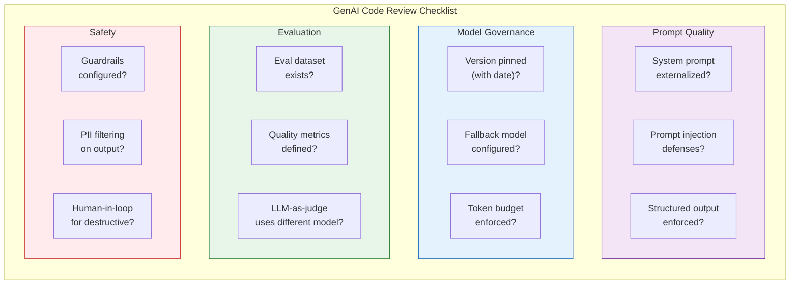

---
inputs:
 story_title:
 description: "Title of the story being reviewed"
 required: true
 default: ""
 issue_number:
 description: "GitHub issue number for this story"
 required: true
 default: ""
 feature_id:
 description: "Parent Feature issue number"
 required: false
 default: ""
 epic_id:
 description: "Parent Epic issue number"
 required: false
 default: ""
 engineer:
 description: "Engineer GitHub username"
 required: true
 default: ""
 reviewer:
 description: "Reviewer name (agent or person)"
 required: false
 default: "Code Reviewer Agent"
 commit_sha:
 description: "Full commit SHA being reviewed"
 required: true
 default: ""
 date:
 description: "Review date (YYYY-MM-DD)"
 required: false
 default: "${current_date}"
---

# Code Review: ${story_title}

**Story**: #${issue_number} 
**Feature**: #${feature_id} (if applicable) 
**Epic**: #${epic_id} (if applicable) 
**Engineer**: ${engineer} 
**Reviewer**: ${reviewer} 
**Commit SHA**: ${commit_sha} 
**Review Date**: ${date} 
**Review Duration**: {time spent}

---

## Table of Contents

1. [Executive Summary](#1-executive-summary)
2. [Code Quality](#2-code-quality)
3. [Architecture & Design](#3-architecture--design)
4. [Testing](#4-testing)
5. [Security Review](#5-security-review)
6. [Performance Review](#6-performance-review)
7. [Documentation Review](#7-documentation-review)
8. [Acceptance Criteria Verification](#8-acceptance-criteria-verification)
9. [GenAI Review](#9-genai-review) *(if applicable)*
10. [MCP Review](#10-mcp-review) *(if applicable)*
11. [Technical Debt](#11-technical-debt)
12. [Compliance & Standards](#12-compliance--standards)
13. [Recommendations](#13-recommendations)
14. [Decision](#14-decision)
15. [Next Steps](#15-next-steps)
16. [Related Issues & PRs](#16-related-issues--prs)
17. [Reviewer Notes](#17-reviewer-notes)

---

## 1. Executive Summary

### Overview
{1-2 sentence summary of what was implemented}

### Files Changed
- **Total Files**: {count}
- **Lines Added**: {count}
- **Lines Removed**: {count}
- **Test Files**: {count}

### Verdict
**Status**: [PASS] APPROVED | [WARN] CHANGES REQUESTED | [FAIL] REJECTED

**Confidence Level**: High | Medium | Low 
**Recommendation**: {Merge | Request Changes | Reject}

---

## 2. Code Quality

### [PASS] Strengths
1. **{Strength 1}**: {Description with file reference}
 - Example: Well-structured service layer with clear separation of concerns ([ServiceName.cs](path/to/ServiceName.cs#L20-L45))

2. **{Strength 2}**: {Description}
 - Example: Comprehensive error handling with custom exceptions

3. **{Strength 3}**: {Description}
 - Example: Excellent use of async/await patterns

### [WARN] Issues Found

| Severity | Issue | File:Line | Recommendation |
|----------|-------|-----------|----------------|
| **Critical** | {Issue requiring immediate fix} | [file.cs](path#L10) | {Specific fix} |
| **High** | {Major issue} | [file.cs](path#L25) | {Specific fix} |
| **Medium** | {Moderate issue} | [file.cs](path#L40) | {Specific fix} |
| **Low** | {Minor issue/suggestion} | [file.cs](path#L55) | {Specific fix} |

### Detailed Issues

#### Critical Issue 1: {Title}
**Location**: [file.cs](path/to/file.cs#L20-L25) 
**Severity**: Critical 
**Category**: Security | Performance | Correctness

**Problem**:
```csharp
// Current problematic code
public async Task<User> GetUserAsync(string userId)
{
 var sql = $"SELECT * FROM users WHERE id = '{userId}'"; // SQL injection!
 return await _db.QueryAsync<User>(sql);
}
```

**Issue**: SQL injection vulnerability - user input concatenated into query.

**Recommendation**:
```csharp
// Fixed code
public async Task<User> GetUserAsync(string userId)
{
 var sql = "SELECT * FROM users WHERE id = @userId";
 return await _db.QueryFirstOrDefaultAsync<User>(sql, new { userId });
}
```

**Reference**: [Security Skill](../skills/architecture/security/SKILL.md#sql-injection)

#### High Issue 1: {Title}
{Repeat structure}

#### Medium Issue 1: {Title}
{Repeat structure}

#### Low Issue 1: {Title}
{Repeat structure}

---

## 3. Architecture & Design

### Design Patterns Used
- [x] Repository Pattern ([IEntityRepository.cs](path))
- [x] Dependency Injection
- [x] Factory Pattern ([EntityFactory.cs](path))
- [ ] Observer Pattern (not needed)

### SOLID Principles
- **Single Responsibility**: [PASS] Pass - Each class has one clear purpose
- **Open/Closed**: [PASS] Pass - Extensions possible without modification
- **Liskov Substitution**: [PASS] Pass - Interfaces properly implemented
- **Interface Segregation**: [WARN] Warning - `IEntityService` has too many methods (consider splitting)
- **Dependency Inversion**: [PASS] Pass - Depends on abstractions, not concretions

### Code Organization
- **Folder Structure**: [PASS] Follows standard conventions
- **Naming**: [PASS] Clear, descriptive names
- **File Size**: [WARN] `EntityService.cs` is 450 lines (consider splitting)
- **Complexity**: [PASS] Methods are small and focused (avg 15 lines)

---

## 4. Testing

### Coverage Summary
- **Total Coverage**: {XX.X}% (Target: 80%)
- **Line Coverage**: {XX.X}%
- **Branch Coverage**: {XX.X}%
- **Files with <80% coverage**: {count}

### Test Breakdown
| Test Type | Count | % of Total | Target |
|-----------|-------|------------|--------|
| **Unit Tests** | {count} | {XX}% | 70% |
| **Integration Tests** | {count} | {XX}% | 20% |
| **E2E Tests** | {count} | {XX}% | 10% |
| **Total** | {count} | 100% | - |

### Test Quality Assessment

#### [PASS] Well-Tested
- `EntityService.CreateAsync()` - Comprehensive unit tests with edge cases
- `EntityController.Post()` - Integration tests cover happy + error paths
- Authorization logic - All permission scenarios tested

#### [WARN] Needs More Tests
- `EntityService.UpdateAsync()` - Missing null input test
- `EntityValidator.Validate()` - Missing edge case tests
- Error handling - Need tests for network failures

#### [FAIL] Not Tested
- `EntityMapper.ToDto()` - No tests found
- Retry logic in `EntityRepository` - Not covered

### Test Code Review

**Example Well-Written Test**:
```csharp
[Fact]
public async Task CreateAsync_ValidDto_ReturnsEntity()
{
 // Arrange
 var dto = new CreateEntityDto("Test Name", "Description");
 var mockRepo = new Mock<IEntityRepository>();
 mockRepo.Setup(r => r.AddAsync(It.IsAny<Entity>()))
 .ReturnsAsync(new Entity { Id = Guid.NewGuid(), Name = "Test Name" });
 var service = new EntityService(mockRepo.Object);

 // Act
 var result = await service.CreateAsync(dto);

 // Assert
 result.Should().NotBeNull();
 result.Name.Should().Be("Test Name");
 mockRepo.Verify(r => r.AddAsync(It.IsAny<Entity>()), Times.Once);
}
```
[PASS] **Good**: AAA pattern, clear naming, verifies behavior, uses FluentAssertions

**Example Test Needing Improvement**:
```csharp
[Fact]
public async Task Test1()
{
 var result = await _service.CreateAsync(new CreateEntityDto("", ""));
 Assert.NotNull(result);
}
```
[FAIL] **Issues**: Vague name, unclear intent, doesn't test meaningful scenario

---

## 5. Security Review

### Security Checklist
- [x] **No Hardcoded Secrets**: Checked all files, secrets in Key Vault [PASS]
- [x] **SQL Parameterization**: All queries use parameters [PASS]
- [x] **Input Validation**: FluentValidation applied to all DTOs [PASS]
- [x] **Authentication**: JWT tokens validated correctly [PASS]
- [x] **Authorization**: Role checks present on sensitive endpoints [PASS]
- [ ] **HTTPS Only**: [WARN] Missing HTTPS redirect middleware
- [x] **CORS Configuration**: Properly restricted origins [PASS]
- [x] **Dependency Scan**: No known vulnerabilities [PASS]

### Vulnerabilities Found
**None** | **{count} found**

#### Vulnerability 1: {Title}
**Severity**: Critical | High | Medium | Low 
**CWE**: [CWE-{ID}](https://cwe.mitre.org/data/definitions/{ID}.html) 
**OWASP**: [A01:2021](https://owasp.org/Top10/)

**Location**: [file.cs](path/to/file.cs#L50)

**Description**:
{What is the vulnerability and how it can be exploited}

**Impact**:
{What an attacker could do}

**Fix**:
```csharp
// Secure implementation
```

**Reference**: [Security Skill](../skills/architecture/security/SKILL.md)

### Security Headers
```csharp
// Missing security headers - add to middleware
app.Use(async (context, next) =>
{
 context.Response.Headers.Add("X-Content-Type-Options", "nosniff");
 context.Response.Headers.Add("X-Frame-Options", "DENY");
 context.Response.Headers.Add("X-XSS-Protection", "1; mode=block");
 context.Response.Headers.Add("Strict-Transport-Security", "max-age=31536000");
 await next();
});
```

---

## 6. Performance Review

### Performance Checklist
- [x] **Async/Await**: Used correctly for all I/O operations [PASS]
- [ ] **N+1 Queries**: [WARN] Found in `GetEntitiesWithRelated()` method
- [x] **Database Indexes**: Added indexes on frequently queried fields [PASS]
- [x] **Caching**: Redis caching implemented for read-heavy operations [PASS]
- [x] **Pagination**: Implemented on list endpoints [PASS]
- [ ] **Connection Pooling**: [WARN] Not configured in `DbContext`

### Performance Issues

#### [WARN] N+1 Query Problem
**Location**: [EntityService.cs](path/to/EntityService.cs#L120)

**Problem**:
```csharp
public async Task<IEnumerable<EntityDto>> GetAllWithRelatedAsync()
{
 var entities = await _repo.GetAllAsync();

 foreach (var entity in entities) // N+1 query!
 {
 entity.Related = await _repo.GetRelatedAsync(entity.Id);
 }

 return entities.Select(e => e.ToDto());
}
```

**Fix**:
```csharp
public async Task<IEnumerable<EntityDto>> GetAllWithRelatedAsync()
{
 // Use eager loading to fetch related data in one query
 var entities = await _repo.Query()
 .Include(e => e.Related)
 .ToListAsync();

 return entities.Select(e => e.ToDto());
}
```

### Load Testing Results
{If applicable - include benchmark results}

---

## 7. Documentation Review

### Documentation Checklist
- [x] **XML Documentation**: All public APIs documented [PASS]
- [x] **Inline Comments**: Complex logic explained [PASS]
- [ ] **README Updated**: [WARN] New feature not mentioned in README
- [x] **API Documentation**: OpenAPI/Swagger updated [PASS]
- [ ] **Migration Guide**: [WARN] Breaking changes need migration guide

### Documentation Quality

**Well-Documented**:
```csharp
/// <summary>
/// Creates a new entity with the specified details.
/// </summary>
/// <param name="dto">The entity creation details.</param>
/// <returns>The created entity with generated ID.</returns>
/// <exception cref="ValidationException">Thrown when dto validation fails.</exception>
public async Task<Entity> CreateAsync(CreateEntityDto dto)
```
[PASS] **Good**: Describes parameters, return value, and exceptions

**Needs Improvement**:
```csharp
// Process the entity
public async Task<Entity> ProcessAsync(Entity entity)
```
[FAIL] **Issues**: Vague XML doc, unclear what "process" means

---

## 8. Acceptance Criteria Verification

### Story Acceptance Criteria
From Issue #{story-id}:

- [x] **AC1**: User can create entity via API [PASS]
 - **Verified**: POST /api/v1/entities returns 201 with entity

- [x] **AC2**: Validation prevents invalid data [PASS]
 - **Verified**: Returns 400 with error details for invalid input

- [ ] **AC3**: Email notification sent on creation [WARN]
 - **Issue**: Email service integration missing

- [x] **AC4**: All operations logged [PASS]
 - **Verified**: Structured logging with correlation IDs

### Regression Testing
- [x] Existing features still work [PASS]
- [x] No breaking changes to public APIs [PASS]
- [x] Backward compatibility maintained [PASS]

---

## 9. GenAI Review (if applicable)

> **Trigger**: Include this section when the code involves LLM calls, AI agents, GenAI inference,
> prompt engineering, or evaluation pipelines. Skip if no GenAI components.

### GenAI Review Flow



### GenAI Checklist

| Category | Check | Status | Notes |
|----------|-------|--------|-------|
| **Prompt Engineering** | System prompt externalized (not inline strings) | [PASS] / [FAIL] | |
| **Prompt Engineering** | Prompt injection defenses present | [PASS] / [FAIL] | |
| **Prompt Engineering** | Structured output schema enforced | [PASS] / [FAIL] | |
| **Model Governance** | Model version pinned with date suffix | [PASS] / [FAIL] | |
| **Model Governance** | Fallback model from different provider configured | [PASS] / [FAIL] | |
| **Model Governance** | Token budget enforced per request | [PASS] / [FAIL] | |
| **Evaluation** | Evaluation dataset exists with {N}+ test cases | [PASS] / [FAIL] | |
| **Evaluation** | Quality thresholds defined (coherence, relevance, etc.) | [PASS] / [FAIL] | |
| **Evaluation** | LLM-as-judge uses different model than agent | [PASS] / [FAIL] | |
| **Safety** | Input/output guardrails configured | [PASS] / [FAIL] | |
| **Safety** | PII detection on model outputs | [PASS] / [FAIL] | |
| **Safety** | Human-in-the-loop for high-risk actions | [PASS] / [FAIL] | |
| **Observability** | All LLM calls traced (OpenTelemetry / equivalent) | [PASS] / [FAIL] | |
| **Observability** | Token usage and cost tracked per request | [PASS] / [FAIL] | |
| **Error Handling** | Graceful fallback when model unavailable | [PASS] / [FAIL] | |
| **Error Handling** | Timeout configured with fallback response | [PASS] / [FAIL] | |

### GenAI Issues Found

| Severity | Issue | Location | Recommendation |
|----------|-------|----------|--------------|
| {Critical/High/Medium/Low} | {description} | [file](path#L10) | {fix} |

---

## 10. MCP Review (if applicable)

> **Trigger**: Include this section when the code implements an MCP Server or MCP App.
> Skip if no MCP components.

### MCP Server Checklist (if applicable)

| Check | Status | Notes |
|-------|--------|-------|
| Tool input parameters validated with JSON Schema | [PASS] / [FAIL] | |
| One action per tool (no multi-mode mega-tools) | [PASS] / [FAIL] | |
| Tool names use `verb_noun` convention | [PASS] / [FAIL] | |
| Resource URIs follow consistent naming scheme | [PASS] / [FAIL] | |
| Path traversal prevention on file-access tools | [PASS] / [FAIL] | |
| SSRF prevention on URL-accepting tools | [PASS] / [FAIL] | |
| Error responses are structured MCP errors (not raw exceptions) | [PASS] / [FAIL] | |
| Destructive tools require confirmation | [PASS] / [FAIL] | |
| Transport security (TLS for SSE/HTTP) | [PASS] / [FAIL] | |
| All tool calls logged with context | [PASS] / [FAIL] | |

### MCP App Checklist (if applicable)

| Check | Status | Notes |
|-------|--------|-------|
| registerAppTool() calls have clear descriptions | [PASS] / [FAIL] | |
| Views render correctly in target host widths | [PASS] / [FAIL] | |
| WCAG 2.1 AA accessibility in iframe content | [PASS] / [FAIL] | |
| Dark/light theme support | [PASS] / [FAIL] | |
| State management handles host disconnection gracefully | [PASS] / [FAIL] | |
| Event cleanup on view unmount | [PASS] / [FAIL] | |

### MCP Issues Found

| Severity | Issue | Location | Recommendation |
|----------|-------|----------|--------------|
| {Critical/High/Medium/Low} | {description} | [file](path#L10) | {fix} |

---

## 11. Technical Debt

### New Technical Debt Introduced
1. **{Debt Item 1}**: {Description}
 - **Location**: [file.cs](path)
 - **Reason**: {Why it was introduced}
 - **Remediation**: {How to fix in future}
 - **Priority**: High | Medium | Low

2. **{Debt Item 2}**: {Description}

### Technical Debt Addressed
1. **{Resolved Item 1}**: {What was fixed}
 - **Before**: {Old code/approach}
 - **After**: {New code/approach}

---

## 12. Compliance & Standards

### Coding Standards
- [x] Follows C# naming conventions [PASS]
- [x] Follows project code style (EditorConfig) [PASS]
- [x] No compiler warnings [PASS]
- [x] No linter errors [PASS]
- [x] Follows Skills.md guidelines [PASS]

### Production Requirements (Skills.md)
- [x] 80% test coverage [PASS]
- [x] Security checklist completed [PASS]
- [x] Performance considerations addressed [PASS]
- [x] Documentation complete [PASS]
- [x] Error handling implemented [PASS]

---

## 13. Recommendations

### Must Fix (Blocking)
1. ** {Critical Issue}**: {Brief description}
 - **Impact**: Blocks deployment
 - **ETA**: {time estimate}

2. ** {Critical Issue}**: {Brief description}

### Should Fix (High Priority)
1. ** {High Issue}**: {Brief description}
 - **Impact**: Reduces quality/performance
 - **ETA**: {time estimate}

### Nice to Have (Low Priority)
1. ** {Low Issue}**: {Brief description}
 - **Impact**: Code improvement
 - **Can be addressed in future PR**

---

## 14. Decision

### Verdict
**Status**: [PASS] APPROVED | [WARN] CHANGES REQUESTED | [FAIL] REJECTED

### Rationale
{Explain the decision}

**If APPROVED**:
- Code meets all acceptance criteria
- Quality standards satisfied
- Security/performance concerns addressed
- Ready for production deployment

**If CHANGES REQUESTED**:
- {count} critical issues must be fixed
- {count} high-priority issues should be fixed
- Engineer should address feedback and re-submit

**If REJECTED**:
- {Fundamental issues requiring redesign}
- {Architectural changes needed}
- {Start over with different approach}

---

## 15. Next Steps

### For Engineer (if changes requested)
1. Address all Critical issues
2. Address all High-priority issues
3. Consider Medium and Low suggestions
4. Re-run tests and verify coverage
5. Update documentation if needed
6. Comment on issue when ready for re-review

### For Reviewer (if approved)
1. Merge PR to main branch
2. Close Story issue (move to Done in Projects)
3. Notify team in Slack/Teams
4. Monitor deployment to production

### For PM/Architect (if applicable)
{Any follow-up items for other roles}

---

## 16. Related Issues & PRs

### Related Issues
- Blocks: #{issue-id}
- Related to: #{issue-id}
- Depends on: #{issue-id}

### Related PRs
- [PR #{number}](link) - {Description}

---

## 17. Reviewer Notes

### Review Process
- **Review Method**: Line-by-line | High-level | Pair review
- **Tools Used**: VS Code, GitHub, SonarQube, CodeQL
- **Time Spent**: {duration}

### Follow-Up
- [ ] Schedule follow-up review after changes
- [ ] Pair with engineer on complex sections
- [ ] Document learnings in team wiki

---

## Appendix

### Files Reviewed
```
src/
 Controllers/EntityController.cs (150 lines, 85% coverage)
 Services/EntityService.cs (450 lines, 92% coverage)
 Models/Entity.cs (80 lines, 100% coverage)
 Validators/EntityValidator.cs (60 lines, 95% coverage)
tests/
 EntityServiceTests.cs (350 lines)
 EntityControllerTests.cs (280 lines)
 EntityApiTests.cs (200 lines)
```

### Test Coverage Report
[Link to coverage report](path/to/coverage.html)

### CI/CD Pipeline Results
- [PASS] Build: Passed
- [PASS] Unit Tests: Passed (all 45 tests)
- [PASS] Integration Tests: Passed (all 12 tests)
- [PASS] Security Scan: No vulnerabilities
- [PASS] Linting: No errors

---

**Generated by AgentX Reviewer Agent** 
**Last Updated**: {YYYY-MM-DD} 
**Review Version**: 1.0

---

**Signature**: 
Reviewed by: {Reviewer Name/Agent} 
Date: {YYYY-MM-DD} 
Status: {APPROVED | CHANGES REQUESTED | REJECTED}
