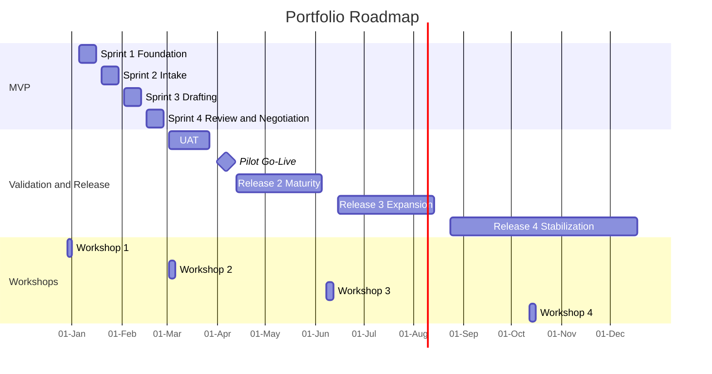

---
inputs:
 portfolio_title:
 description: "Portfolio or program title"
 required: true
 default: ""
 portfolio_scope:
 description: "Short description of the workstreams or product scope covered by the roadmap"
 required: true
 default: ""
 status:
 description: "Roadmap status"
 required: false
 default: "Draft"
 author:
 description: "Document author (agent or person name)"
 required: false
 default: "Product Manager Agent"
 date:
 description: "Creation date (YYYY-MM-DD)"
 required: false
 default: "${current_date}"
 portfolio_start_date:
 description: "Planned start date for the roadmap horizon"
 required: false
 default: "{YYYY-MM-DD}"
 portfolio_horizon:
 description: "Overall roadmap horizon"
 required: false
 default: "{YYYY-MM-DD to YYYY-MM-DD}"
 related_prds:
 description: "Bullet list of related PRD paths"
 required: false
 default: "- docs/artifacts/prd/PRD-{workstream}.md"
---

# Portfolio Roadmap and Release Plan: ${portfolio_title}

**Portfolio Scope**: ${portfolio_scope}
**Status**: ${status}
**Author**: ${author}
**Date**: ${date}
**Portfolio Start Date**: ${portfolio_start_date}
**Portfolio Horizon**: ${portfolio_horizon}
**Related PRDs**:
${related_prds}

---

## 1. Purpose

This document provides the dated portfolio roadmap and release plan for the workstreams in scope. It complements the roadmap sections embedded in each PRD by giving one shared calendar, one milestone model, and one visual planning view.

This plan assumes:
- Sprint 1 starts on {YYYY-MM-DD}.
- Sprint length is {N} weeks.
- MVP is capped at {N} sprints.
- Quality and stability take precedence over speed.
- Planning workshops are used at the start of major delivery waves so each workshop shapes multiple sprints or a full release wave.
- Production releases include explicit stabilization windows before the next expansion wave.

---

## 2. Portfolio Planning Rules

- The first {N} sprints are reserved for MVP only.
- Sprint 1 is technical foundation only.
- Early sprints focus on intake, drafting, review, and core operational flows.
- UAT is a formal release phase with entry and exit criteria.
- Pilot production is narrow by design and must prove stability before expansion.
- Scope should be cut before quality is compromised.
- New breadth should only be added after the prior release wave is operationally stable.
- Workshops should gather enough detail for the next 2-3 sprints or release wave, not act as a recurring checkpoint after every milestone.

---

## 3. Dated MVP Sprint Calendar

| Sprint | Dates | Focus | Primary Outcome |
|--------|-------|-------|-----------------|
| Sprint 1 | {YYYY-MM-DD to YYYY-MM-DD} | Technical foundation | {Environment, CI/CD, telemetry, audit/event model, shared workspace baseline} |
| Sprint 2 | {YYYY-MM-DD to YYYY-MM-DD} | Intake | {Standardized intake, validation, routing, decomposition foundations} |
| Sprint 3 | {YYYY-MM-DD to YYYY-MM-DD} | Drafting | {Template-driven generation and editing workflow maturity} |
| Sprint 4 | {YYYY-MM-DD to YYYY-MM-DD} | Review and negotiation | {Reviewer workflow, findings, tracked changes, release candidate readiness} |

### MVP Gate Dates

| Gate | Target Date | Meaning |
|------|-------------|---------|
| Foundation Baseline Complete | {YYYY-MM-DD} | Technical foundation passed and reusable across workstreams |
| Intake Gate Complete | {YYYY-MM-DD} | Intake flows stable enough for ongoing MVP build |
| Drafting Gate Complete | {YYYY-MM-DD} | Draft generation and fidelity acceptable for pilot workflows |
| MVP Build Complete | {YYYY-MM-DD} | MVP complete and ready for formal QA/UAT preparation |

---

## 4. Dated Release Plan

| Release or Milestone | Dates | Scope | Exit Standard |
|----------------------|-------|-------|---------------|
| Release 0: Foundation Baseline | {YYYY-MM-DD to YYYY-MM-DD} | Technical foundation only | {Environment, security, telemetry, and deployment readiness signed off} |
| Release 1 RC: MVP Candidate | {YYYY-MM-DD to YYYY-MM-DD} | Final MVP sprint and release candidate hardening | {Core workflows pass regression and SME review} |
| Release 1 UAT | {YYYY-MM-DD to YYYY-MM-DD} | Controlled UAT for MVP | {UAT sign-off with no unresolved critical blockers} |
| Milestone 4: Pilot Production Go-Live | {YYYY-MM-DD} | First controlled production release | {Go-live approval, rollback readiness, monitoring live} |
| Release 2: Operational Maturity | {YYYY-MM-DD to YYYY-MM-DD} | Execution maturity, archive/search maturity, and operational resilience | {Production defect trend acceptable and support load stable} |
| Release 3: Controlled Expansion | {YYYY-MM-DD to YYYY-MM-DD} | Broader workflow coverage, governance growth, and bounded breadth expansion | {Prior wave stable and approved for breadth expansion} |
| Release 4: Stabilization | {YYYY-MM-DD to YYYY-MM-DD} | Hardening, reporting maturity, lifecycle foundations, and next-phase readiness | {Stability targets met and runbooks complete} |

### 4.1 Release Objectives and Primary Owners

| Release or Milestone | Primary Objective | Primary Owner | Supporting Owners |
|----------------------|-------------------|---------------|-------------------|
| Release 0: Foundation Baseline | {Establish one secure, observable, repeatable delivery baseline} | {Product Manager} | {Engineering Lead, Platform Lead} |
| Release 1 RC: MVP Candidate | {Prove the MVP is internally testable end to end} | {Engineering Lead} | {Product Manager, Workstream Leads} |
| Release 1 UAT | {Validate pilot users can execute the MVP on real scenarios with acceptable quality} | {UAT Lead} | {Product Manager, Business SMEs, Support Lead} |
| Milestone 4: Pilot Production Go-Live | {Launch a narrow production cohort with safe rollback and live monitoring} | {Operations Lead} | {Product Manager, Engineering Lead, Support Lead} |
| Release 2: Operational Maturity | {Make the workflow operationally dependable before adding breadth} | {Workstream Leads} | {Operations Lead, Engineering Lead, Support Lead} |
| Release 3: Controlled Expansion | {Add bounded breadth only after proving readiness and supportability} | {Product Manager} | {Workstream Leads, Engineering Lead, Training Lead} |
| Release 4: Stabilization | {Hardening, reporting maturity, and next-phase readiness planning} | {Product Manager} | {Operations Lead, Engineering Lead, Support Lead} |

### 4.2 Release Readiness Status Model

| Status | Meaning |
|--------|---------|
| Drafted | Release intent exists, but scope and dates are still being refined |
| Scope Locked | In-scope capabilities, pilot cohort, and success criteria are approved |
| In Build | Delivery is active and the release scope is being implemented |
| QA Ready | Core regression evidence exists and the release candidate is suitable for formal validation |
| UAT Ready | Training, pilot scripts, environments, and support path are ready for structured user testing |
| Go-Live Ready | Quality gates, communications, monitoring, rollback, and support ownership are all confirmed |
| Live | Release is in production for the approved cohort |
| Hypercare | Release is live but under elevated monitoring, support, and change restraint |
| Stable | Hypercare exit criteria are met and the next breadth wave can be considered |

---

## 5. Capability Waves and Planning Logic

### 5.1 Functional Decomposition by Wave

| Wave | Dates | Planning Logic | Workstream A Scope | Workstream B Scope |
|------|-------|----------------|--------------------|--------------------|
| Wave 1: MVP | {YYYY-MM-DD to YYYY-MM-DD} | {One discovery shape-up feeds tightly bounded MVP sprints} | {Foundation, intake, drafting, review, and a bounded operational slice} | {Foundation, intake, drafting, review, and a bounded operational slice} |
| Wave 2: Pilot and Operational Maturity | {YYYY-MM-DD to YYYY-MM-DD} | {One planning workshop after MVP shapes UAT, pilot production, and the next maturity wave} | {UAT, pilot release, execution maturity, archive/search maturity, resilience} | {UAT, pilot release, execution maturity, filing/archive quality, resilience} |
| Wave 3: Controlled Expansion | {YYYY-MM-DD to YYYY-MM-DD} | {One expansion workshop shapes the next controlled breadth wave} | {Broader workflow support, approvals maturity, analytics or intelligence refinement} | {Governance foundations, dashboards, and broader coverage} |
| Wave 4: Stabilization and Next-Phase Readiness | {YYYY-MM-DD to YYYY-MM-DD} | {A midpoint workshop validates stabilization progress and shapes the next planning horizon} | {Post-release hardening, reporting, resilience} | {Lifecycle foundations, reporting, resilience} |

### 5.2 Planning Workshops

| Workshop | Dates | Purpose | Feeds |
|----------|-------|---------|-------|
| Workshop 1: MVP Discovery and Scope Lock | {YYYY-MM-DD to YYYY-MM-DD} | {Confirm MVP boundaries, pilot personas, initial scope, and quality gates before Sprint 1 starts} | Wave 1 |
| Workshop 2: UAT, Pilot, and Release 2 Planning | {YYYY-MM-DD to YYYY-MM-DD} | {Use MVP outputs to plan UAT, pilot release, and the next operational-maturity wave} | Wave 2 |
| Workshop 3: Expansion Planning | {YYYY-MM-DD to YYYY-MM-DD} | {Review pilot and Release 2 evidence, then define the next controlled breadth expansion} | Wave 3 |
| Workshop 4: Stabilization and Next-Phase Strategy | {YYYY-MM-DD to YYYY-MM-DD} | {Review stabilization progress, confirm remaining priorities, and shape the next delivery horizon} | Wave 4 and next-phase planning |

### 5.3 Cross-Workstream Dependencies

| Dependency | Why It Matters | Dependent Waves |
|------------|----------------|-----------------|
| Shared authoring or workflow surface | {Both workstreams depend on the same governed user-facing delivery surface} | Waves 1-4 |
| Shared identity, RBAC, and audit/event model | {Pilot rollout, approvals, and production governance fail without common access and traceability controls} | Waves 1-4 |
| Shared telemetry, monitoring, and release controls | {UAT exit and production expansion require one operational evidence model across workstreams} | Waves 1-4 |
| Template and playbook governance | {Workstream-specific rules need approved change control before expansion} | Waves 1-4 |
| Support, training, and communications readiness | {Pilot adoption and broader rollout depend on business-facing enablement, not just engineering completion} | Waves 2-4 |

---

## 6. One-Year Roadmap by Milestone

| Milestone | Date | Portfolio Meaning | Workstream A Focus | Workstream B Focus | Planning Input |
|-----------|------|-------------------|--------------------|--------------------|----------------|
| Milestone 1: Foundation Baseline | {YYYY-MM-DD} | {Shared delivery and platform foundation complete} | {Workspace, telemetry, audit, release controls} | {Workspace, telemetry, lineage, release controls} | {Execute Wave 1 plan from Workshop 1} |
| Milestone 2: MVP Build Complete | {YYYY-MM-DD} | {MVP build complete} | {Intake, drafting, review, bounded negotiation or execution slice} | {Intake, drafting, review, bounded change-handling or execution slice} | {Workshop 2 prepares UAT, pilot, and Release 2} |
| Milestone 3: UAT Exit | {YYYY-MM-DD} | {Controlled UAT signed off} | {MVP accepted for pilot production} | {MVP accepted for pilot production} | {Execute Workshop 2 outputs} |
| Milestone 4: Pilot Production Go-Live | {YYYY-MM-DD} | {Narrow production cohort live} | {Initial pilot cohort live} | {Initial pilot cohort live} | {Continue Wave 2 without a new workshop} |
| Milestone 5: Release 2 Operational Maturity | {YYYY-MM-DD} | {First operational maturity wave complete} | {Execution, archive/search, resilience} | {Execution, filing/archive, resilience} | {Workshop 3 prepares controlled expansion} |
| Milestone 6: Release 3 Controlled Expansion | {YYYY-MM-DD} | {Controlled breadth expansion complete} | {Broader support and approvals maturity} | {Governance foundations and broader coverage} | {Execute Workshop 3 outputs} |
| Milestone 7: Release 4 Stabilization | {YYYY-MM-DD} | {End-of-horizon hardening complete} | {Reporting, resilience, post-release maturity} | {Reporting, resilience, lifecycle maturity} | {Workshop 4 prepares the next horizon} |

---

## 7. Visual Timeline

### 7.1 Portfolio Gantt

Replace the sample dates below with real values so the Mermaid diagram renders correctly.



### 7.2 Milestone Sequence

```mermaid
flowchart LR
    M1[Milestone 1<br/>Foundation Baseline<br/>{YYYY-MM-DD}] --> M2[Milestone 2<br/>MVP Build Complete<br/>{YYYY-MM-DD}]
    M2 --> M3[Milestone 3<br/>UAT Exit<br/>{YYYY-MM-DD}]
    M3 --> M4[Milestone 4<br/>Pilot Production Go-Live<br/>{YYYY-MM-DD}]
    M4 --> M5[Milestone 5<br/>Release 2 Operational Maturity<br/>{YYYY-MM-DD}]
    M5 --> M6[Milestone 6<br/>Release 3 Controlled Expansion<br/>{YYYY-MM-DD}]
    M6 --> M7[Milestone 7<br/>Release 4 Stabilization<br/>{YYYY-MM-DD}]
```

### 7.3 MVP Release Shape

```mermaid
flowchart LR
    S1[Sprint 1<br/>Technical Foundation<br/>{YYYY-MM-DD to YYYY-MM-DD}] --> S2[Sprint 2<br/>Intake<br/>{YYYY-MM-DD to YYYY-MM-DD}]
    S2 --> S3[Sprint 3<br/>Drafting<br/>{YYYY-MM-DD to YYYY-MM-DD}]
    S3 --> S4[Sprint 4<br/>Review and Negotiation<br/>{YYYY-MM-DD to YYYY-MM-DD}]
    S4 --> UAT[UAT<br/>{YYYY-MM-DD to YYYY-MM-DD}]
    UAT --> PROD[Pilot Production<br/>{YYYY-MM-DD}]
```

---

## 8. Quality Gates

### 8.1 Sprint Gates

| Sprint | Entry Gate | Exit Gate |
|--------|------------|-----------|
| Sprint 1 | {ADR, spec, UX, and scope baseline approved} | {CI/CD, observability, audit trail, and workspace foundation validated} |
| Sprint 2 | {Foundation exit achieved and intake scope frozen for MVP} | {Intake flows stable, validation rules working, routing demos accepted} |
| Sprint 3 | {Intake exit achieved and templates or rules approved} | {Draft fidelity acceptable, SME review passed, no blocking defects} |
| Sprint 4 | {Drafting exit achieved and review scope frozen for MVP} | {Review and negotiation stable, release candidate ready for UAT} |

### 8.2 UAT and Production Gates

| Gate | Minimum Standard |
|------|------------------|
| UAT Start | {Release candidate deployed, pilot scenarios approved, training material ready} |
| UAT Exit | {No unresolved critical defects; high-severity issues resolved or explicitly approved for deferment} |
| Pilot Production Go-Live | {Monitoring active, rollback tested, support ownership named, communications ready} |
| Release 2 and beyond | {Prior wave stable, support load acceptable, no unresolved severity trend that threatens adoption} |

### 8.3 Cross-Functional Release Readiness Checklist

| Readiness Area | Minimum Expectation Before Go-Live |
|----------------|------------------------------------|
| Business owner sign-off | {Pilot cohort, business goals, and success metrics approved} |
| Training readiness | {Role-based training material and pilot walkthroughs complete} |
| Support readiness | {Named support owner, triage path, escalation contacts, and coverage window confirmed} |
| Communications readiness | {Release notes, pilot communications, and issue-reporting path distributed} |
| Operational readiness | {Monitoring dashboards, alert thresholds, and incident channels active} |
| Data and reporting readiness | {Core KPIs and adoption evidence visible for the active cohort} |
| Security and compliance readiness | {Access, auditability, retention, and approval evidence reviewed} |

### 8.4 Rollback and Hypercare Expectations

- Every production release must define a rollback decision owner, rollback trigger conditions, and the last known good build or configuration state.
- Pilot production and broader releases enter Hypercare immediately after go-live and remain there until support load, defect trend, and user adoption evidence meet the exit threshold.
- Hypercare should include daily triage for the active cohort, restricted change volume, explicit defect prioritization, and business-owner review of release health.
- No new breadth wave should start until the current release exits Hypercare and is marked Stable in the readiness model.

---

## 9. Workstream Mapping

### 9.1 Workstream A

- MVP: {core MVP capabilities for the first workstream}
- Release 2: {operational maturity capabilities}
- Release 3: {controlled expansion capabilities}
- Release 4: {hardening, reporting, and scale maturity}

### 9.2 Workstream B

- MVP: {core MVP capabilities for the second workstream}
- Release 2: {operational maturity capabilities}
- Release 3: {controlled expansion capabilities}
- Release 4: {hardening, reporting, and scale maturity}

---

## 10. Notes for the Product Manager

- Keep this roadmap synchronized with related PRDs, ADRs, UX artifacts, and release-readiness evidence.
- Use one roadmap for shared platform or portfolio planning; avoid duplicating milestone dates across multiple PRDs unless each PRD needs a local summary.
- Update dates and readiness status when major scope, release sequencing, or operational assumptions change.