---
inputs:
  project_name:
    description: "Name of the project or system"
    required: true
    default: ""
  issue_number:
    description: "GitHub issue number"
    required: true
    default: ""
  author:
    description: "Document author"
    required: false
    default: "Security Architect"
  date:
    description: "Creation date (YYYY-MM-DD)"
    required: false
    default: "${current_date}"
---

# Security Plan: ${project_name}

**Issue**: #${issue_number}
**Status**: Draft | Review | Approved
**Author**: ${author}
**Date**: ${date}
**Classification**: {Public | Internal | Confidential}

---

## Table of Contents

1. [Security Overview](#1-security-overview)
2. [Threat Model](#2-threat-model)
3. [Authentication & Authorization](#3-authentication--authorization)
4. [Data Protection](#4-data-protection)
5. [Network Security](#5-network-security)
6. [Secrets Management](#6-secrets-management)
7. [Monitoring & Incident Response](#7-monitoring--incident-response)
8. [Compliance](#8-compliance)
9. [Security Checklist](#9-security-checklist)

---

## 1. Security Overview

### System Description

{Brief description of what is being secured — 2-3 sentences.}

### Security Objectives

| Objective | Priority | Description |
|-----------|----------|-------------|
| Confidentiality | {High/Med/Low} | {Protect sensitive data from unauthorized access} |
| Integrity | {High/Med/Low} | {Ensure data is not tampered with} |
| Availability | {High/Med/Low} | {Maintain service uptime requirements} |

### Trust Boundaries

```mermaid
graph TD
    subgraph Public["🌐 Internet / Public"]
        direction LR
        GW["API Gateway"]
        CDN["CDN / WAF"]
    end

    subgraph Internal["🔒 Internal Network"]
        direction LR
        APP["Application Tier"]
        BG["Background Services"]
    end

    subgraph Data["🗄️ Data Tier"]
        direction LR
        DB["Database Tier"]
        CACHE["Cache Tier"]
    end

    Public --> Internal --> Data

    style Public fill:#FFEBEE,stroke:#C62828
    style Internal fill:#FFF3E0,stroke:#E65100
    style Data fill:#E8F5E9,stroke:#2E7D32
```

---

## 2. Threat Model

### STRIDE Analysis

| Category | Threat | Likelihood | Impact | Mitigation | Status |
|----------|--------|-----------|--------|------------|--------|
| **Spoofing** | {Unauthorized identity claim} | {Low/Med/High} | {Low/Med/High} | {Mitigation strategy} | {Open/Mitigated} |
| **Tampering** | {Data modification in transit} | {Low/Med/High} | {Low/Med/High} | {Mitigation strategy} | {Open/Mitigated} |
| **Repudiation** | {Action without audit trail} | {Low/Med/High} | {Low/Med/High} | {Mitigation strategy} | {Open/Mitigated} |
| **Info Disclosure** | {Sensitive data leak} | {Low/Med/High} | {Low/Med/High} | {Mitigation strategy} | {Open/Mitigated} |
| **Denial of Service** | {Service unavailability} | {Low/Med/High} | {Low/Med/High} | {Mitigation strategy} | {Open/Mitigated} |
| **Elevation** | {Unauthorized privilege gain} | {Low/Med/High} | {Low/Med/High} | {Mitigation strategy} | {Open/Mitigated} |

### Risk Register

| ID | Risk | Probability | Impact | Risk Score | Owner | Mitigation | Target Date |
|----|------|------------|--------|-----------|-------|------------|-------------|
| R1 | {Description} | {1-5} | {1-5} | {P x I} | {Name} | {Plan} | {Date} |

---

## 3. Authentication & Authorization

### Authentication Method

| Component | Method | Provider |
|-----------|--------|----------|
| User-facing app | {OAuth 2.0 / OIDC / SAML} | {Azure AD / Auth0 / Custom} |
| API | {JWT / API Key / mTLS} | {Azure AD / Custom} |
| Service-to-service | {Managed Identity / Client Credentials} | {Azure AD} |

### Authorization Model

- [ ] RBAC (Role-Based Access Control)
- [ ] ABAC (Attribute-Based Access Control)
- [ ] Least privilege principle enforced
- [ ] Permission boundaries documented

### Roles

| Role | Permissions | Assignment |
|------|------------|------------|
| Admin | Full access | {Manual assignment} |
| User | Read/Write own data | {Self-registration} |
| Service | API access only | {Managed Identity} |

---

## 4. Data Protection

### Data Classification

| Data Type | Classification | Encryption at Rest | Encryption in Transit |
|-----------|---------------|--------------------|-----------------------|
| User PII | Confidential | AES-256 | TLS 1.2+ |
| Auth tokens | Secret | AES-256 | TLS 1.2+ |
| App config | Internal | {Yes/No} | TLS 1.2+ |
| Public content | Public | N/A | TLS 1.2+ |

### Encryption Standards

- **At rest**: AES-256 (Azure Storage Service Encryption / SQL TDE)
- **In transit**: TLS 1.2+ (enforce `HTTPS only`)
- **Key management**: Azure Key Vault with HSM backing
- **Rotation**: Keys rotated every {90/180/365} days

---

## 5. Network Security

### Network Architecture

- [ ] Virtual Network with subnet isolation
- [ ] Network Security Groups (NSGs) with deny-all default
- [ ] Private Endpoints for PaaS services (no public endpoints)
- [ ] WAF (Web Application Firewall) for internet-facing services
- [ ] DDoS Protection Standard enabled

### Allowed Traffic

| Source | Destination | Port | Protocol | Purpose |
|--------|------------|------|----------|---------|
| Internet | WAF/LB | 443 | HTTPS | User traffic |
| App subnet | DB subnet | {5432/1433} | TCP | Database access |
| App subnet | Redis subnet | 6380 | TCP | Cache access |

---

## 6. Secrets Management

### Secret Storage

| Secret Type | Storage | Rotation | Access Method |
|-------------|---------|----------|---------------|
| DB password | Key Vault | 90 days | Managed Identity |
| API keys | Key Vault | 180 days | Managed Identity |
| Certificates | Key Vault | Auto-renew | Managed Identity |
| Connection strings | App Configuration | Reference to KV | Managed Identity |

### Rules

- MUST NOT hardcode secrets in source code
- MUST NOT store secrets in environment variables (use Key Vault references)
- MUST use Managed Identity for all Azure service authentication
- MUST enable secret scanning in CI/CD pipeline
- MUST audit secret access via Key Vault diagnostics

---

## 7. Monitoring & Incident Response

### Security Monitoring

| Signal | Tool | Alert Threshold | Response |
|--------|------|----------------|----------|
| Failed logins | {Azure Monitor / Application Insights} | >{5} in {5} min | Auto-block IP |
| Privilege escalation | {Microsoft Defender} | Any occurrence | Page on-call |
| Secret access | {Key Vault diagnostics} | Outside business hours | Alert team |
| Dependency vulnerability | {Dependabot / Snyk} | Critical/High | Block deploy |

### Incident Response Plan

1. **Detect**: Automated alerts via monitoring stack
2. **Triage**: On-call classifies severity (P0-P3)
3. **Contain**: Isolate affected component (network rules, disable access)
4. **Eradicate**: Patch vulnerability, rotate credentials
5. **Recover**: Restore from backup, verify integrity
6. **Post-mortem**: Document timeline, root cause, prevention measures

---

## 8. Compliance

### Applicable Standards

- [ ] OWASP Top 10 (2021) reviewed
- [ ] OWASP AI Top 10 reviewed (if AI/ML components)
- [ ] Azure Well-Architected Framework Security Pillar
- [ ] {GDPR / HIPAA / SOC 2 / PCI-DSS — as applicable}

### Compliance Checklist

- [ ] Data residency requirements met
- [ ] Right to deletion (GDPR Art. 17) implemented
- [ ] Audit logging enabled for compliance-relevant operations
- [ ] Data processing agreements in place with third parties

---

## 9. Security Checklist

### Pre-Deployment

- [ ] STRIDE threat model completed (Section 2)
- [ ] Authentication and authorization configured (Section 3)
- [ ] Data encryption enabled (at rest + in transit) (Section 4)
- [ ] Network isolation applied (private endpoints, NSGs) (Section 5)
- [ ] Secrets stored in Key Vault (not in code) (Section 6)
- [ ] Monitoring and alerts configured (Section 7)
- [ ] Dependency vulnerability scan passed
- [ ] Security code review completed
- [ ] Penetration testing scheduled (if applicable)

### Post-Deployment

- [ ] Security alerts validated (test fire)
- [ ] Incident response plan tested
- [ ] Access reviews scheduled (quarterly)
- [ ] Secret rotation verified
