---
inputs:
  feature_name:
    description: "Name of the feature being specified"
    required: true
    default: ""
  issue_number:
    description: "GitHub issue number for this feature"
    required: true
    default: ""
  epic_id:
    description: "Parent Epic issue number"
    required: false
    default: ""
  author:
    description: "Spec author (agent or person)"
    required: false
    default: "Solution Architect Agent"
  date:
    description: "Specification date (YYYY-MM-DD)"
    required: false
    default: "${current_date}"
---

# Technical Specification: ${feature_name}

**Issue**: #${issue_number}
**Epic**: #${epic_id}
**Status**: Draft | Review | Approved
**Author**: ${author}
**Date**: ${date}
**Related ADR**: [ADR-${epic_id}.md](../adr/ADR-${epic_id}.md)
**Related UX**: [UX-${issue_number}.md](../ux/UX-${issue_number}.md)

> **Acceptance Criteria**: Defined in the PRD user stories — see [PRD-${epic_id}.md](../prd/PRD-${epic_id}.md#5-user-stories--features). Engineers should track AC completion against the originating Story issue.

---

## Table of Contents

1. [Overview](#1-overview)
2. [Architecture Diagrams](#2-architecture-diagrams)
3. [API Design](#3-api-design)
4. [Data Model Diagrams](#4-data-model-diagrams)
5. [Service Layer Diagrams](#5-service-layer-diagrams)
6. [Security Diagrams](#6-security-diagrams)
7. [Performance](#7-performance)
8. [Testing Strategy](#8-testing-strategy)
9. [Implementation Notes](#9-implementation-notes)
10. [Rollout Plan](#10-rollout-plan)
11. [Risks & Mitigations](#11-risks--mitigations)
12. [Monitoring & Observability](#12-monitoring--observability)
13. [AI/ML Specification](#13-aiml-specification-if-applicable) *(if applicable)*
---

## 1. Overview

{Brief description of what will be built - 2-3 sentences}

**Scope:**
- In scope: {What this spec covers}
- Out of scope: {What this spec doesn't cover}

**Success Criteria:**
- {Measurable success criterion 1}
- {Measurable success criterion 2}

---

## 2. Architecture Diagrams

### 2.1 High-Level System Architecture

```mermaid
graph TD
    subgraph CL["🖥️ Client Layer"]
        C1["Web App<br/>(Browser)"]
        C2["Mobile App<br/>(iOS/Android)"]
        C3["Desktop App<br/>(Electron)"]
        C4["Third-Party<br/>Clients"]
    end

    subgraph GW["🔒 API Gateway Layer"]
        G1["Load Balancing · Rate Limiting · Authentication<br/>SSL Termination · Request Routing · API Versioning"]
    end

    subgraph AL["⚙️ Application Layer"]
        A1["REST<br/>Controller"]
        A2["GraphQL<br/>Controller"]
        A3["WebSocket<br/>Controller"]
    end

    subgraph SL["🧩 Service Layer"]
        S1["Service A<br/>(Business)"]
        S2["Service B<br/>(Domain)"]
        S3["Service C<br/>(Workflow)"]
        S4["Service D<br/>(Integration)"]
    end

    subgraph DL["📦 Data Access Layer"]
        D1["Repository<br/>(ORM)"]
        D2["Repository<br/>(Cache)"]
        D3["Repository<br/>(Search)"]
        D4["External Client<br/>(HTTP/gRPC)"]
    end

    subgraph IL["🏗️ Infrastructure Layer"]
        I1[("Database<br/>SQL/NoSQL")]
        I2[("Cache<br/>Redis/Memcache")]
        I3[("Search<br/>Elastic/Solr")]
        I4[("Queue<br/>Rabbit/Kafka")]
        I5["External<br/>APIs"]
    end

    CL -->|HTTPS| GW
    GW --> AL
    AL --> SL
    SL --> DL
    D1 --> I1
    D2 --> I2
    D3 --> I3
    D4 --> I5
```



**Component Responsibilities:**
| Layer | Responsibility | Technology Examples |
|-------|---------------|---------------------|
| **Client Layer** | User interface, user experience | Web (React, Vue), Mobile (Swift, Kotlin) |
| **API Gateway** | Routing, auth, rate limiting, SSL | Kong, AWS API Gateway, NGINX |
| **Application Layer** | Request handling, orchestration | Any web framework |
| **Service Layer** | Business logic, domain rules | Language-agnostic services |
| **Data Access Layer** | Data persistence, caching | ORM, Repository pattern |
| **Infrastructure** | Storage, messaging, external APIs | Database, Cache, Queue |

---

### 2.2 Sequence Diagram: User Authentication


---

### 2.3 Sequence Diagram: CRUD Operations


---

### 2.4 Class/Interface Diagram: Domain Model


---

### 2.5 Class/Interface Diagram: Service Layer


---

### 2.6 Dependency Injection Diagram

```mermaid
graph TD
    subgraph Scoped["🔄 SCOPED — Per Request"]
        EC[EntityController] --> IES["IEntityService\n«interface»"]
        IES -.->|resolves to| ES[EntityService]
        ES --> IER["IEntityRepository\n«interface»"]
        IER -.->|resolves to| ER[EntityRepository]
        ER --> DC[DbContext]
    end

    subgraph Singleton["🏠 SINGLETON — App Lifetime"]
        ICS["ICacheService\n«interface»"] -.->|resolves to| RCS[RedisCacheService]
        RCS --> RC[RedisConnection]
        IL["ILogger‹T›"] -.->|resolves to| LOG["Logger\n(Structured Logging)"]
        ICfg[IConfiguration] -.->|resolves to| CR[ConfigurationRoot]
    end

    subgraph Transient["⚡ TRANSIENT — New Each Time"]
        IV["IValidator‹T›"] -.->|resolves to| EV[EntityValidator]
        IHF[IHttpClientFactory] -.->|resolves to| HC["HttpClient\n(per external service)"]
    end

    ES --> ICS
    ES --> IV
```




---

## 3. API Design

### 3.1 Endpoints

| Method | Endpoint | Description | Auth | Rate Limit |
|--------|----------|-------------|------|------------|
| GET | `/api/v1/{resource}` | List all resources | Yes | 100/min |
| GET | `/api/v1/{resource}/{id}` | Get single resource | Yes | 200/min |
| POST | `/api/v1/{resource}` | Create resource | Yes | 50/min |
| PUT | `/api/v1/{resource}/{id}` | Update resource | Yes | 50/min |
| PATCH | `/api/v1/{resource}/{id}` | Partial update | Yes | 50/min |
| DELETE | `/api/v1/{resource}/{id}` | Delete resource | Yes | 20/min |

### 3.2 Request/Response Contracts

#### POST /api/v1/{resource}

**Request Headers:**
```
Content-Type: application/json
Authorization: Bearer {jwt-token}
X-Request-ID: {uuid}
```

**Request Body:**
```json
{
  "name": "string (required, max 255)",
  "description": "string (optional)",
  "status": "DRAFT | ACTIVE | INACTIVE",
  "metadata": {
    "key": "value"
  }
}
```

**Response (201 Created):**
```json
{
  "id": "uuid",
  "name": "string",
  "description": "string",
  "status": "DRAFT",
  "createdAt": "2026-01-27T12:00:00Z",
  "updatedAt": "2026-01-27T12:00:00Z"
}
```

### 3.3 Error Responses

```
+-----------------------------------------------------------------------------+
|                           ERROR RESPONSE FORMAT                              |
+-----------------------------------------------------------------------------+
|                                                                              |
|  400 Bad Request              |  401 Unauthorized                           |
|  +-------------------------+  |  +-------------------------+                |
|  | {                       |  |  | {                       |                |
|  |   "error": "Validation",|  |  |   "error": "Unauthorized|                |
|  |   "message": "...",     |  |  |   "message": "Invalid   |                |
|  |   "details": {          |  |  |     token",             |                |
|  |     "field": "name",    |  |  |   "requestId": "uuid"   |                |
|  |     "reason": "required"|  |  | }                       |                |
|  |   },                    |  |  +-------------------------+                |
|  |   "requestId": "uuid"   |  |                                             |
|  | }                       |  |  403 Forbidden                              |
|  +-------------------------+  |  +-------------------------+                |
|                               |  | {                       |                |
|  404 Not Found                |  |   "error": "Forbidden", |                |
|  +-------------------------+  |  |   "message": "Access    |                |
|  | {                       |  |  |     denied",            |                |
|  |   "error": "NotFound",  |  |  |   "requestId": "uuid"   |                |
|  |   "message": "Resource  |  |  | }                       |                |
|  |     not found",         |  |  +-------------------------+                |
|  |   "requestId": "uuid"   |  |                                             |
|  | }                       |  |  500 Internal Server Error                  |
|  +-------------------------+  |  +-------------------------+                |
|                               |  | {                       |                |
|  429 Too Many Requests        |  |   "error": "Internal",  |                |
|  +-------------------------+  |  |   "message": "An error  |                |
|  | {                       |  |  |     occurred",          |                |
|  |   "error": "RateLimit", |  |  |   "requestId": "uuid"   |                |
|  |   "message": "Too many  |  |  | }                       |                |
|  |     requests",          |  |  +-------------------------+                |
|  |   "retryAfter": 60,     |  |                                             |
|  |   "requestId": "uuid"   |  |                                             |
|  | }                       |  |                                             |
|  +-------------------------+  |                                             |
|                                                                              |
+------------------------------------------------------------------------------+
```

---

## 4. Data Model Diagrams

### 4.1 Entity Relationship Diagram (ERD)


> **Indexes**: `idx_entities_status`, `idx_entities_created_at DESC`, `idx_entities_name`, `idx_related_entity_id`
>
> **Constraints**: `fk_related_entity FOREIGN KEY (entity_id) REFERENCES entities(id)`, `chk_status CHECK (status IN ('DRAFT','ACTIVE','INACTIVE','ARCHIVED'))`

### 4.2 Database Schema Table

| Column | Type | Constraints | Description |
|--------|------|-------------|-------------|
| id | UUID | PK, NOT NULL | Unique identifier |
| name | VARCHAR(255) | NOT NULL | Entity name |
| description | TEXT | NULLABLE | Optional description |
| status | VARCHAR(20) | NOT NULL, DEFAULT 'DRAFT' | Status enum |
| metadata | JSONB | NULLABLE | Flexible metadata |
| created_at | TIMESTAMP | NOT NULL, DEFAULT NOW() | Creation timestamp |
| updated_at | TIMESTAMP | NOT NULL | Last update timestamp |
| version | INTEGER | NOT NULL, DEFAULT 1 | Optimistic lock version |


---

## 5. Service Layer Diagrams

### 5.1 Service Architecture

```mermaid
graph TD
    subgraph Controller["📡 CONTROLLER LAYER"]
        EC["EntityController<br/>Handles HTTP · Maps DTOs · Returns responses"]
    end

    subgraph Service["⚙️ SERVICE LAYER"]
        IS["IEntityService «interface»<br/>getAll() · getById() · create() · update() · delete()"]
        ES["EntityService<br/>Business logic · Validation · Caching · Error handling"]
        IS -.->|implements| ES
    end

    subgraph Repo["📦 REPOSITORY LAYER"]
        IR["IEntityRepository «interface»<br/>findAll() · findById() · save() · update() · delete()"]
    end

    DB[("🗄️ DATABASE")]

    EC -->|calls| IS
    ES -->|calls| IR
    IR -->|queries| DB
```



---

## 6. Security Diagrams

### 6.1 Authentication Flow


### 6.2 Authorization Model (RBAC)

```mermaid
graph TD
    U["👤 User"] -->|has role| R["🎭 Role"]
    R -->|has permissions| P["🔑 Permissions"]

    subgraph Roles["Role Definitions"]
        R1["Admin → Full access"]
        R2["User → Read/Write own data"]
        R3["Guest → Read only"]
    end

    subgraph AdminPerms["Admin Permissions"]
        AP1["entities:read"]
        AP2["entities:write"]
        AP3["entities:delete"]
        AP4["users:manage"]
    end

    subgraph UserPerms["User Permissions"]
        UP1["entities:read (own)"]
        UP2["entities:write (own)"]
    end

    subgraph GuestPerms["Guest Permissions"]
        GP1["entities:read"]
    end

    R --> Roles
    R1 --> AdminPerms
    R2 --> UserPerms
    R3 --> GuestPerms
```



### 6.3 Defense in Depth

```mermaid
graph TD
    L1["🌐 Layer 1: Network Security<br/>HTTPS (TLS 1.3) · Firewall rules · DDoS protection"]
    L2["🚪 Layer 2: Application Gateway<br/>Rate limiting · CORS policy · Security headers"]
    L3["🔑 Layer 3: Authentication<br/>JWT validation · Token expiration · MFA (optional)"]
    L4["🛡️ Layer 4: Authorization<br/>Role-based access · Resource ownership · Permission checks"]
    L5["✅ Layer 5: Input Validation<br/>Schema validation · Data sanitization · Type checking"]
    L6["💾 Layer 6: Data Access<br/>Parameterized queries · ORM · SQL injection prevention"]
    L7["🔒 Layer 7: Data Storage<br/>Encryption at rest · Access controls · Backup encryption"]

    L1 --> L2 --> L3 --> L4 --> L5 --> L6 --> L7

    style L1 fill:#E3F2FD,stroke:#1565C0,color:#0D47A1
    style L2 fill:#E8F5E9,stroke:#2E7D32,color:#1B5E20
    style L3 fill:#FFF3E0,stroke:#E65100,color:#BF360C
    style L4 fill:#FCE4EC,stroke:#C62828,color:#B71C1C
    style L5 fill:#F3E5F5,stroke:#6A1B9A,color:#4A148C
    style L6 fill:#E0F7FA,stroke:#00838F,color:#006064
    style L7 fill:#EFEBE9,stroke:#4E342E,color:#3E2723
```




---

## 7. Performance

### 7.1 Caching Strategy

```mermaid
graph LR
    subgraph CacheLayer["Distributed Cache (Redis/Memcached)"]
        SE["🗂️ Single Entity<br/>Key: type:id<br/>TTL: 1 hour<br/>Invalidate: on update/delete"]
        LQ["📋 List / Query<br/>Key: type:list:hash<br/>TTL: 5 minutes<br/>Invalidate: on any write"]
        SA["🔐 Session / Auth<br/>Key: session:id<br/>TTL: 24 hours<br/>Invalidate: on logout"]
    end

    subgraph Patterns["Invalidation Patterns"]
        WT["Write-through<br/>Update cache on every write"]
        WB["Write-behind<br/>Async update (eventual consistency)"]
        CA["Cache-aside<br/>Check → miss → load → store"]
    end

    Patterns -.-> CacheLayer
```



### 7.2 Performance Requirements

| Metric | Target | Measurement |
|--------|--------|-------------|
| API Response Time (p50) | < 100ms | Average response time |
| API Response Time (p95) | < 500ms | 95th percentile |
| API Response Time (p99) | < 1000ms | 99th percentile |
| Cache Hit Rate | > 80% | Cache hits / total requests |
| Database Query Time | < 50ms | Average query execution |
| Concurrent Users | 1000+ | Simultaneous connections |
| Requests per Second | 500+ | Throughput capacity |

### 7.3 Optimization Strategies

- **Database**: Indexes, query optimization, connection pooling, read replicas
- **Caching**: Distributed cache, cache headers, CDN for static assets
- **Async**: Async I/O operations, background jobs, message queues
- **Pagination**: Cursor-based pagination, limit results (max 100 items)

---

## 8. Testing Strategy

### 8.1 Test Pyramid

```mermaid
graph TD
    E2E["🌐 E2E Tests · 10%<br/>Full user flows (Playwright/Selenium)"]
    INT["🔗 Integration Tests · 20%<br/>API endpoints, DB (WebApplicationFactory)"]
    UNIT["🧪 Unit Tests · 70%<br/>Services, Controllers (xUnit/Jest/pytest)"]
    COV["📊 Coverage Target: ≥ 80%"]

    E2E --- INT --- UNIT --- COV

    style E2E fill:#F44336,color:#fff,stroke:#D32F2F
    style INT fill:#FF9800,color:#fff,stroke:#F57C00
    style UNIT fill:#4CAF50,color:#fff,stroke:#388E3C
    style COV fill:#2196F3,color:#fff,stroke:#1565C0
```



### 8.2 Test Types

| Test Type | Coverage | Framework | Scope |
|-----------|----------|-----------|-------|
| **Unit Tests** | 80%+ | Any unit test framework | Services, Controllers, Validators |
| **Integration Tests** | Key flows | Test framework + test server | API endpoints, Database |
| **E2E Tests** | Happy paths | Playwright/Selenium/Cypress | Full user journeys |
| **Performance Tests** | Critical paths | k6/JMeter/Locust | Load, stress, spike tests |

---

## 9. Implementation Notes

### 9.1 Directory Structure (Language Agnostic)

```
src/
  controllers/           # HTTP request handlers
    entity_controller    # API endpoints
  services/              # Business logic
    entity_service       # Service implementation
    interfaces/          # Service interfaces
  models/                # Domain models
    entity               # Entity model
    dtos/                # Data transfer objects
  repositories/          # Data access
    entity_repository    # Repository implementation
    interfaces/          # Repository interfaces
  validators/            # Input validation
    entity_validator     # Validation rules
  middleware/            # Cross-cutting concerns
    auth_middleware      # Authentication
    error_handler        # Global error handling
  config/                # Configuration
    database             # DB connection config
    cache                # Cache config

tests/
  unit/                  # Unit tests
    services/
    controllers/
  integration/           # Integration tests
    api/
  e2e/                   # End-to-end tests
```

### 9.2 Development Workflow

1. Create database migration
2. Implement service (TDD - write tests first)
3. Implement controller
4. Write integration tests
5. Add validation rules
6. Configure caching
7. Add rate limiting
8. Update API documentation

---

## 10. Rollout Plan

### Phase 1: Development (Week 1-2)
**Stories**: #{story-1}, #{story-2}
- Database migration
- Service implementation
- API endpoints
- Unit + integration tests

**Deliverable**: Working API (dev environment)

### Phase 2: Testing (Week 3)
**Stories**: #{story-3}
- E2E tests
- Performance testing
- Security review
- Bug fixes

**Deliverable**: Tested, stable API

### Phase 3: Deployment (Week 4)
**Stories**: #{story-4}
- Staging deployment
- Production deployment
- Monitoring setup
- Documentation

**Deliverable**: Production-ready feature

---

## 11. Risks & Mitigations

| Risk | Impact | Probability | Mitigation |
|------|--------|-------------|------------|
| Database migration fails | High | Low | Test on staging with production data copy |
| Cache invalidation bugs | Medium | Medium | Implement cache versioning, monitor hit rates |
| Rate limiting too restrictive | Low | Medium | Start conservative, adjust based on metrics |
| Third-party API downtime | High | Low | Circuit breaker, fallback mechanism |
| Performance degradation | High | Medium | Load testing, performance monitoring |

---

## 12. Monitoring & Observability

### 12.1 Metrics Dashboard

```mermaid
graph LR
    subgraph Dashboard["📈 Monitoring Dashboard"]
        direction TB
        subgraph Row1["Real-time Metrics"]
            direction LR
            RR["📊 Request Rate<br/>450 req/sec"]
            ER["⚠️ Error Rate<br/>0.5%"]
            RT["⏱️ Response Time<br/>p95: 230ms"]
        end
        subgraph Row2["System Health"]
            direction LR
            CH["💾 Cache Hit Rate<br/>92%"]
            DQ["🗄️ DB Query Time<br/>avg: 15ms"]
            AU["👥 Active Users<br/>1,250"]
        end
    end

    style RR fill:#E8F5E9,stroke:#2E7D32
    style ER fill:#FFEBEE,stroke:#C62828
    style RT fill:#E3F2FD,stroke:#1565C0
    style CH fill:#E8F5E9,stroke:#2E7D32
    style DQ fill:#FFF3E0,stroke:#E65100
    style AU fill:#F3E5F5,stroke:#6A1B9A
```



### 12.2 Alerts

| Alert | Condition | Severity | Action |
|-------|-----------|----------|--------|
| High Error Rate | > 5% for 5 min | Critical | Page on-call |
| High Latency | p95 > 1000ms for 5 min | High | Investigate |
| Cache Miss Spike | Hit rate < 70% | Medium | Check cache health |
| DB Connection Pool | > 80% utilization | Medium | Scale or optimize |

### 12.3 Logging

- Structured logging (JSON format)
- Correlation IDs for request tracing
- Log levels: DEBUG (dev), INFO (prod)
- Sensitive data masking
- Log aggregation (ELK/Datadog/CloudWatch)

---

## 13. AI/ML Specification (if applicable)

> **Trigger**: Include this section when the issue has `needs:ai` label or the ADR includes an AI/ML Architecture section. If the product does NOT involve AI/ML, skip this section entirely.

### 13.1 Model Configuration

| Parameter | Value |
|-----------|-------|
| **Model** | {e.g., gpt-4o, claude-sonnet-4, o3} |
| **Provider** | {Microsoft Foundry / OpenAI / Anthropic / Google / Local} |
| **Endpoint** | {URL or environment variable name} |
| **Authentication** | {API key env var / Managed Identity / OAuth} |
| **System Prompt** | {Summary — full prompt in separate file if >200 tokens} |
| **Temperature** | {0.0 - 2.0} |
| **Top-P** | {0.0 - 1.0} |
| **Max Tokens** | {output token limit} |
| **Structured Output** | {JSON schema reference, if applicable} |
| **Timeout** | {seconds} |
| **Retry Policy** | {max retries, backoff strategy} |

### 13.2 Agent Tools / Functions

| Tool Name | Purpose | Input Schema | Output Schema | Side Effects |
|-----------|---------|-------------|---------------|--------------|
| {tool_1} | {what it does} | {params} | {return type} | {DB write / API call / none} |
| {tool_2} | {what it does} | {params} | {return type} | {side effects} |

### 13.3 Inference Pipeline

```mermaid
graph LR
    A["📥 Request"] --> B["⚙️ Preprocess<br/>Validate · Sanitize · Context"]
    B --> C["🧠 Model / Agent<br/>System prompt · Tools/RAG · Inference"]
    C --> D["📤 Postprocess<br/>Parse · Validate · Format"]
    D --> E["✅ Response"]

    style A fill:#E3F2FD,stroke:#1565C0
    style B fill:#FFF3E0,stroke:#E65100
    style C fill:#F3E5F5,stroke:#6A1B9A
    style D fill:#E8F5E9,stroke:#2E7D32
    style E fill:#E3F2FD,stroke:#1565C0
```



**Stage Details:**
1. **Preprocessing**: {Input validation, context assembly, RAG retrieval}
2. **Model Invocation**: {Single call / multi-turn / agent loop}
3. **Postprocessing**: {Output parsing, structured output validation, safety filtering}
4. **Error Handling**: {Fallback model, cached response, graceful degradation}

### 13.4 Context / RAG Design (if applicable)

| Parameter | Value |
|-----------|-------|
| **Knowledge Source** | {Documents / Database / API / Vector Store} |
| **Embedding Model** | {model name} |
| **Vector Store** | {Azure AI Search / Chroma / Pinecone / FAISS} |
| **Chunk Strategy** | {size, overlap, method} |
| **Top-K Results** | {number of chunks retrieved} |
| **Relevance Threshold** | {minimum similarity score} |

### 13.5 Evaluation Strategy

| Metric | Evaluator | Threshold | Test Dataset |
|--------|-----------|-----------|--------------|
| **Relevance** | {Built-in / LLM-as-judge} | ≥ {score} | {dataset location} |
| **Groundedness** | {Built-in / Custom} | ≥ {score} | {dataset location} |
| **Coherence** | {Built-in / Custom} | ≥ {score} | {dataset location} |
| **Latency** | {Timer} | < {ms} P95 | {N requests} |
| **Cost** | {Token counter} | < ${amount}/req | {N requests} |
| {Custom metric} | {Custom evaluator} | {threshold} | {dataset} |

**Evaluation Dataset**: {Location, format, number of test cases, how generated}

### 13.6 Observability

- **Tracing**: {OpenTelemetry / Azure Monitor / Custom} — trace all model calls with input/output
- **Token Tracking**: Log prompt tokens, completion tokens, total cost per request
- **Quality Monitoring**: Log evaluation scores in production, alert on degradation
- **Dashboard**: {Link to monitoring dashboard}

> **Reference**: Read `.github/skills/ai-systems/ai-agent-development/SKILL.md` for implementation patterns, model guidance, and production checklist.

---

## Cross-Cutting Concerns Diagram

```mermaid
graph TD
    subgraph Pipeline["🔄 Middleware Pipeline"]
        direction LR
        REQ[Request] --> LOG[Logging] --> AUTH[Auth] --> RL[RateLimit] --> CTRL[Controller]
        CTRL --> EH[ErrorHandler] --> FMT[Formatting] --> RES[Response]
    end

    subgraph Row1[" "]
        direction LR
        L["📋 LOGGING<br/>Structured logs · Log levels<br/>Context data · Sensitive mask"]
        M["📊 MONITORING<br/>Health checks · Metrics<br/>Dashboards · Alerting"]
        T["🔍 TRACING<br/>Correlation IDs · Distributed<br/>tracing · Request timing"]
    end

    subgraph Row2[" "]
        direction LR
        V["✅ VALIDATION<br/>Input validation · Schema check<br/>Business rules · Sanitization"]
        E["⚠️ ERROR HANDLING<br/>Global handler · Error responses<br/>Retry policies · Circuit breaker"]
        C["💾 CACHING<br/>Response cache · Distributed<br/>Invalidation · TTL management"]
    end

    Pipeline --- Row1
    Row1 --- Row2
```



---

**Generated by AgentX Architect Agent**
**Last Updated**: {YYYY-MM-DD}
**Version**: 1.0
