---
inputs:
  feature_name:
    description: "Name of the feature being designed"
    required: true
    default: ""
  issue_number:
    description: "GitHub issue number for this feature"
    required: true
    default: ""
  epic_id:
    description: "Parent Epic issue number"
    required: false
    default: ""
  designer:
    description: "Designer name (agent or person)"
    required: false
    default: "UX Designer Agent"
  date:
    description: "Design date (YYYY-MM-DD)"
    required: false
    default: "${current_date}"
---

# UX Design: ${feature_name}

**Feature**: #${issue_number}  
**Epic**: #${epic_id}  
**Status**: Draft | Review | Approved  
**Designer**: ${designer}  
**Date**: ${date}  
**Related PRD**: [PRD-${epic_id}.md](../prd/PRD-${epic_id}.md)

---

## Table of Contents

1. [Overview](#1-overview)
2. [User Research](#2-user-research)
3. [User Flows](#3-user-flows)
4. [Wireframes](#4-wireframes)
5. [Component Specifications](#5-component-specifications)
6. [Design System](#6-design-system)
7. [Interactions & Animations](#7-interactions--animations)
8. [Accessibility (WCAG 2.1 AA)](#8-accessibility-wcag-21-aa)
9. [Responsive Design](#9-responsive-design)
10. [Interactive Prototypes](#10-interactive-prototypes)
11. [Implementation Notes](#11-implementation-notes)
12. [Open Questions](#12-open-questions)
13. [References](#13-references)

---

## 1. Overview

### Feature Summary
{Brief 2-3 sentence description of what this feature does}

### Design Goals
1. {Goal 1: e.g., Simplify user onboarding process}
2. {Goal 2: e.g., Reduce clicks to complete primary action}
3. {Goal 3: e.g., Ensure mobile-first experience}

### Success Criteria
- {Measurable UX metric 1: e.g., Task completion rate > 90%}
- {Measurable UX metric 2: e.g., Average time to complete < 30 seconds}
- {Measurable UX metric 3: e.g., User satisfaction score > 4.5/5}

---

## 2. User Research

### User Personas (from PRD)
**Primary Persona: {Name}**
- **Goals**: {What they want to achieve}
- **Pain Points**: {Current frustrations}
- **Technical Skill**: Beginner | Intermediate | Advanced
- **Device Preference**: Mobile | Desktop | Both

**Secondary Persona: {Name}**
- **Goals**: {What they want to achieve}
- **Pain Points**: {Current frustrations}

### User Needs
1. **{Need 1}**: {Description and why it matters}
2. **{Need 2}**: {Description and why it matters}
3. **{Need 3}**: {Description and why it matters}

---

## 3. User Flows

### 3.1 Primary Flow: {Action Name}
**Trigger**: {What initiates this flow - e.g., User clicks "Create Account"}  
**Goal**: {What user wants to accomplish}  
**Preconditions**: {Required state - e.g., User is logged out}

**Flow Diagram**:

```mermaid
flowchart TD
    A["🏠 Start: Landing Page"] --> B["User clicks 'Sign Up'"]
    B --> C["📝 Registration Form"]
    C --> D{Validation}
    D -->|Valid| E["✅ Success"]
    D -->|Invalid| F["❌ Error Message"]
    E --> G["📊 Dashboard"]
    F --> H["Re-enter Data"]
    H --> C

    style A fill:#E3F2FD,stroke:#1565C0
    style E fill:#E8F5E9,stroke:#2E7D32
    style F fill:#FFEBEE,stroke:#C62828
    style G fill:#E8F5E9,stroke:#2E7D32
```


**Detailed Steps**:
1. **User Action**: Clicks "Sign Up" button
   - **System Response**: Displays registration form modal
   - **Screen**: [Screen 1: Registration Modal](#screen-1-registration-modal)

2. **User Action**: Fills form (name, email, password)
   - **System Response**: Real-time validation feedback
   - **Validation**: Email format, password strength indicator

3. **User Action**: Clicks "Create Account"
   - **System Response**: Shows loading spinner
   - **API Call**: POST /api/v1/users

4. **Success State**: Redirect to dashboard with welcome message
   - **Screen**: [Screen 2: Dashboard](#screen-2-dashboard)

**Alternative Flows**:
- **4a. Validation Error**: Highlight invalid fields, show inline error messages
- **4b. Email Already Exists**: Show "Email already registered" with "Login instead?" link
- **4c. Network Error**: Show error toast with "Retry" button

### 3.2 Secondary Flow: {Action Name}
{Repeat structure for additional user flows}

**Error Scenarios**:
- **Scenario 1**: {Description and recovery path}
- **Scenario 2**: {Description and recovery path}

---

## 4. Wireframes

### Screen 1: Registration Modal
**Purpose**: Capture user information for account creation  
**Context**: Overlay on landing page

**Layout**:
```
╔═══════════════════════════════════════════════════════╗
║                   [✕ Close]                           ║
║                                                       ║
║   Create Your Account                                 ║
║   ━━━━━━━━━━━━━━━━━━━━━━━━━━━━━━━━━━━━━━━━━━━━━   ║
║                                                       ║
║   Full Name                                           ║
║   [_______________________________]                   ║
║                                                       ║
║   Email Address                                       ║
║   [_______________________________]                   ║
║   ✓ Valid email format                                ║
║                                                       ║
║   Password                                            ║
║   [_______________________________] [👁]              ║
║   ░░░░░░░░░░░░░░░░░░░░ Weak | Medium | Strong        ║
║                                                       ║
║   [ ] I agree to Terms of Service                     ║
║                                                       ║
║   ┌────────────────────────┐                          ║
║   │   Create Account   →   │                          ║
║   └────────────────────────┘                          ║
║                                                       ║
║   Already have an account? [Log in]                   ║
║                                                       ║
╚═══════════════════════════════════════════════════════╝
```

**Responsive Behavior**:
- **Desktop (>1024px)**: Modal 500px wide, centered
- **Tablet (768-1024px)**: Modal 80% width, centered
- **Mobile (<768px)**: Full screen with padding

### Screen 2: Dashboard
**Purpose**: Landing page after successful registration  
**Context**: Authenticated user view

**Layout**:
```
╔═══════════════════════════════════════════════════════════╗
║ ☰ Logo          [Search...]      [🔔] [Profile ▼]        ║
╠═══════════════════════════════════════════════════════════╣
║ ┌─────────┐   ┌────────────────────────────────────────┐ ║
║ │         │   │                                        │ ║
║ │ Nav 1   │   │   Welcome, {Name}! 🎉                 │ ║
║ │         │   │                                        │ ║
║ │ Nav 2   │   │   Get started with these quick steps: │ ║
║ │         │   │                                        │ ║
║ │ Nav 3   │   │   1. [ ] Complete your profile        │ ║
║ │         │   │   2. [ ] Connect your first app       │ ║
║ │ Nav 4   │   │   3. [ ] Invite team members          │ ║
║ │         │   │                                        │ ║
║ └─────────┘   │   ┌─────────────────┐                 │ ║
║               │   │  Get Started →  │                 │ ║
║               │   └─────────────────┘                 │ ║
║               │                                        │ ║
║               └────────────────────────────────────────┘ ║
╚═══════════════════════════════════════════════════════════╝
```

### Screen 3: {Screen Name}
{Repeat structure for additional screens}

---

## 5. Component Specifications

### 5.1 Button: Primary CTA
**Purpose**: Main call-to-action for forms and critical actions  
**Usage**: Submit buttons, primary actions

**States**:
- **Default**: Solid fill, large text
- **Hover**: Slightly darker shade, subtle lift shadow
- **Active/Pressed**: Pressed effect (scale 0.98)
- **Disabled**: 50% opacity, no interactions
- **Loading**: Spinner icon, disabled state

**Variants**:
- **Primary**: Blue (#007bff), white text
- **Secondary**: Gray (#6c757d), white text
- **Danger**: Red (#dc3545), white text
- **Success**: Green (#28a745), white text

**Specifications**:
```css
.btn-primary {
  padding: 12px 24px;
  font-size: 16px;
  font-weight: 600;
  border-radius: 8px;
  border: none;
  transition: all 0.2s ease;
}
```

### 5.2 Input Field: Text Input
**Purpose**: Single-line text entry  
**Usage**: Forms, search boxes

**States**:
- **Default**: Light gray border, placeholder text
- **Focus**: Blue border, no placeholder
- **Error**: Red border, error message below
- **Success**: Green border, checkmark icon
- **Disabled**: Gray background, no interactions

**Specifications**:
```css
.input-field {
  padding: 10px 12px;
  font-size: 14px;
  border: 1px solid #ced4da;
  border-radius: 4px;
  transition: border-color 0.2s;
}
```

### 5.3 Component: {Name}
{Repeat for all custom components}

---

## 6. Design System

### 6.1 Layout & Grid
- **Grid System**: 12-column responsive grid
- **Container Max Width**: 1200px
- **Gutter Width**: 24px
- **Breakpoints**:
  - Mobile: 0-767px
  - Tablet: 768-1023px
  - Desktop: 1024px+
  - Large Desktop: 1440px+

### 6.2 Typography
**Font Family**: 
- Primary: 'Inter', -apple-system, BlinkMacSystemFont, 'Segoe UI', sans-serif
- Monospace: 'Fira Code', 'Courier New', monospace

**Scale**:
- **H1**: 32px / 1.25 line-height / 700 weight
- **H2**: 24px / 1.3 line-height / 600 weight
- **H3**: 20px / 1.4 line-height / 600 weight
- **Body**: 16px / 1.5 line-height / 400 weight
- **Small**: 14px / 1.4 line-height / 400 weight
- **Caption**: 12px / 1.3 line-height / 400 weight

### 6.3 Color Palette
**Primary Colors**:
- Primary: #007bff (Blue)
- Secondary: #6c757d (Gray)
- Success: #28a745 (Green)
- Warning: #ffc107 (Yellow)
- Danger: #dc3545 (Red)
- Info: #17a2b8 (Cyan)

**Neutral Colors**:
- Background: #ffffff
- Surface: #f8f9fa
- Border: #dee2e6
- Text Primary: #212529
- Text Secondary: #6c757d
- Text Disabled: #adb5bd

**Semantic Colors**:
- Error Text: #721c24
- Error Background: #f8d7da
- Success Text: #155724
- Success Background: #d4edda
- Warning Text: #856404
- Warning Background: #fff3cd

### 6.4 Spacing System
**Base Unit**: 8px

**Scale**:
- xs: 4px (0.5 × base)
- sm: 8px (1 × base)
- md: 16px (2 × base)
- lg: 24px (3 × base)
- xl: 32px (4 × base)
- xxl: 48px (6 × base)

### 6.5 Elevation (Shadows)
- **Level 1**: `box-shadow: 0 1px 3px rgba(0,0,0,0.12)`
- **Level 2**: `box-shadow: 0 3px 6px rgba(0,0,0,0.16)`
- **Level 3**: `box-shadow: 0 10px 20px rgba(0,0,0,0.19)`
- **Level 4**: `box-shadow: 0 14px 28px rgba(0,0,0,0.25)`

### 6.6 Border Radius
- **Small**: 4px (buttons, inputs)
- **Medium**: 8px (cards, modals)
- **Large**: 16px (hero sections)
- **Circle**: 50% (avatars, icons)

---

## 7. Interactions & Animations

### 7.1 Transitions
**Standard Duration**: 200ms  
**Easing**: ease-in-out

**Common Transitions**:
- Hover effects: 200ms ease
- Modal open/close: 300ms ease-out
- Toast notifications: 200ms ease-in-out
- Page transitions: 400ms ease

### 7.2 Micro-Interactions
- **Button Click**: Scale down to 0.98, return on release
- **Form Submit**: Button shows loading spinner, form fields disabled
- **Success Feedback**: Checkmark animation (200ms)
- **Error Shake**: Horizontal shake animation (300ms)

### 7.3 Loading States
- **Skeleton Screens**: Show content structure while loading
- **Progress Indicators**: For uploads/downloads with percentage
- **Spinners**: For indeterminate waits < 3 seconds
- **Progress Bars**: For multi-step processes

---

## 8. Accessibility (WCAG 2.1 AA)

### 8.1 Keyboard Navigation
- **Tab Order**: Logical flow (top-to-bottom, left-to-right)
- **Focus Indicators**: 2px solid blue outline on all focusable elements
- **Keyboard Shortcuts**: 
  - `Escape`: Close modals/dropdowns
  - `Enter`: Submit forms, activate buttons
  - `Space`: Toggle checkboxes
  - `Arrow Keys`: Navigate lists/menus

### 8.2 Screen Readers
- **ARIA Labels**: All interactive elements labeled
- **ARIA Live Regions**: Dynamic content updates announced
- **Alt Text**: All images have descriptive alt text
- **Semantic HTML**: Use `<button>`, `<nav>`, `<main>`, `<article>`

### 8.3 Color Contrast
**Minimum Ratios (WCAG AA)**:
- Normal Text: 4.5:1
- Large Text (18pt+): 3:1
- UI Components: 3:1

**Tested Combinations**:
- Primary Blue (#007bff) on White: 4.68:1 ✅
- Text Primary (#212529) on White: 16.07:1 ✅
- Text Secondary (#6c757d) on White: 4.67:1 ✅

### 8.4 Other Considerations
- **Focus Management**: Auto-focus on modal open, return focus on close
- **Error Identification**: Icons + text (not color alone)
- **Resizable Text**: Layout works at 200% zoom
- **Motion Sensitivity**: Respect `prefers-reduced-motion`

---

## 9. Responsive Design

### Mobile (<768px)
- **Layout**: Single column, full width
- **Navigation**: Hamburger menu
- **Touch Targets**: Minimum 44×44px
- **Font Size**: Minimum 16px (prevent zoom on focus)

### Tablet (768-1023px)
- **Layout**: Two-column grid where appropriate
- **Navigation**: Collapsed sidebar or top nav
- **Touch Targets**: Minimum 44×44px

### Desktop (1024px+)
- **Layout**: Multi-column, max 1200px container
- **Navigation**: Full sidebar or horizontal nav
- **Hover States**: Enabled for mouse interactions

---

## 10. Interactive Prototypes

> **⚠️ MANDATORY**: HTML/CSS prototypes are REQUIRED per AGENTS.md. Output to `docs/ux/prototypes/`.
> Prototypes must be production-ready HTML/CSS that engineers can reference for implementation.

### Prototype Links
- [HTML/CSS Prototype](../prototypes/{feature-name}/index.html) **(MANDATORY)**
- [Figma Prototype](https://figma.com/...) _(optional)_
- [Interactive Demo](https://demo.example.com/feature-name) _(optional)_

### Prototype Scope
- ✅ Primary user flow (happy path)
- ✅ Error states and validation
- ✅ Loading states
- ⚠️ Edge cases (documented, not prototyped)
- ❌ Backend integration (simulated data)

---

## 11. Implementation Notes

### 11.1 For Engineers

**Existing Components to Reuse**:
- `Button` component from `src/components/Button.tsx`
- `Input` component from `src/components/Input.tsx`
- `Modal` component from `src/components/Modal.tsx`

**New Components to Create**:
- `RegistrationForm` in `src/components/auth/RegistrationForm.tsx`
- `PasswordStrengthIndicator` in `src/components/auth/PasswordStrengthIndicator.tsx`
- `WelcomeBanner` in `src/components/dashboard/WelcomeBanner.tsx`

**CSS/Styling Approach**:
- Use CSS Modules for component-scoped styles
- Use design tokens from `src/styles/tokens.css`
- Follow BEM naming convention

**Responsive Implementation**:
```css
/* Mobile first */
.container { width: 100%; }

/* Tablet */
@media (min-width: 768px) {
  .container { width: 80%; }
}

/* Desktop */
@media (min-width: 1024px) {
  .container { max-width: 1200px; }
}
```

**Animation Implementation**:
```css
.button {
  transition: transform 0.2s ease;
}

.button:active {
  transform: scale(0.98);
}
```

### 11.2 Assets Needed
- [ ] Icon set (from design system)
- [ ] Illustrations (if any)
- [ ] Logo files (SVG format)
- [ ] Favicon (multiple sizes)

### 11.3 Testing Checklist
- [ ] Test on Chrome, Firefox, Safari, Edge
- [ ] Test on iOS Safari, Android Chrome
- [ ] Test with keyboard only (no mouse)
- [ ] Test with screen reader (NVDA/JAWS)
- [ ] Test at 200% zoom
- [ ] Test with slow 3G network

---

## 12. Open Questions

| Question | Owner | Status | Resolution |
|----------|-------|--------|------------|
| {Question 1} | {Name} | Open | TBD |
| {Question 2} | {Name} | Resolved | {Answer} |

---

## 13. References

### Design Inspiration
- [Example 1](link)
- [Example 2](link)

### Research
- [User Interview Notes](link)
- [Usability Test Results](link)

### Standards
- [WCAG 2.1 Guidelines](https://www.w3.org/WAI/WCAG21/quickref/)
- [Material Design Guidelines](https://material.io)

---

**Generated by AgentX UX Designer Agent**  
**Last Updated**: {YYYY-MM-DD}  
**Version**: 1.0
