# AI Agent Guidelines for Production Code

> **Purpose**: Defines how AI agents should behave when writing production-ready code.  
> **Scope**: Behavior principles, workflow, quality standards, and delivery practices.  
> **Standard**: Follows [github/awesome-copilot](https://github.com/github/awesome-copilot) recommended patterns.  
> **Repository**: [github.com/jnPiyush/AgentX](https://github.com/jnPiyush/AgentX)

---

## Prerequisites

Before using these agent guidelines, ensure you have:

### Required
- **Git** - Version control ([git-scm.com](https://git-scm.com))
- **VS Code** - Editor with GitHub Copilot extension

### Recommended (for full workflow)
- **GitHub CLI** - For GitHub Issues task management ([cli.github.com](https://cli.github.com))

```bash
# Install GitHub CLI (Windows)
winget install GitHub.cli

# Authenticate
gh auth login

# Verify installation
gh --version
```

> **Note**: Without GitHub CLI, Layer 3 memory (GitHub Issues) won't function. Use `manage_todo_list` for session-scoped task tracking as an alternative.

---

## Execution Modes

### Standard Mode (Default)
Agent pauses for confirmation at critical decision points (architecture changes, deployments, breaking changes).

### YOLO Mode 🚀
**Fully autonomous execution** - Agent completes entire development workflow without stopping.

**Activation**: User says "YOLO", "go YOLO", "YOLO mode", or "execute without stopping"

**YOLO Mode Rules**:
- Execute entire workflow from requirement to deployment without pausing
- Make all reasonable decisions autonomously
- Only stop for: authentication failures, critical errors, or explicit blockers
- Create GitHub Issues for all decisions made (audit trail)
- Commit and push frequently (every logical unit of work)
- Run all quality gates automatically
- Deploy to staging automatically (production requires explicit approval even in YOLO)

**YOLO Workflow**:
```
Requirement → Research → Design → Create Issues → Implement → Test → 
Quality Gates → Commit → Push → Deploy Staging → Report Summary
```

**Exit YOLO**: User says "stop", "pause", "exit YOLO", or critical error occurs

---

## Security Architecture (4-Layer Model)

> **Philosophy**: Full autonomy doesn't mean zero safety. Security by architecture, not by interruption.
> **Reference**: → [04-security.md](skills/04-security.md)

```
┌─────────────────────────────────────────────────────────────────┐
│              4-Layer Security Architecture                       │
├─────────────────────────────────────────────────────────────────┤
│  Layer 1: Actor Allowlist                                        │
│  ├── ✅ @copilot → Authorized for auto-merge                     │
│  ├── ✅ @your-username → Authorized for auto-merge               │
│  └── ❌ Unknown actors → Requires manual review                  │
├─────────────────────────────────────────────────────────────────┤
│  Layer 2: Protected Paths                                        │
│  ├── 🔒 .github/workflows/** → Human review required             │
│  ├── 🔒 **/secrets.*, *.env → Human review required              │
│  ├── 🔒 package.json, *.lock → Human review required             │
│  └── ✅ src/**/*.* → Auto-merge allowed                          │
├─────────────────────────────────────────────────────────────────┤
│  Layer 3: Kill Switch                                            │
│  ├── enabled: false → Disable all autonomous ops instantly       │
│  └── enabled: true  → Resume autonomous operations               │
├─────────────────────────────────────────────────────────────────┤
│  Layer 4: Audit Trail                                            │
│  ├── GitHub Issues for all decisions                             │
│  ├── PR comments documenting security check results              │
│  └── Full logs for every autonomous action                       │
└─────────────────────────────────────────────────────────────────┘
```

### Command Safety (Whitelist/Blocklist)

**Auto-Approved Commands** ✅:
```bash
git add, git commit, git push, git pull, git fetch, git checkout, git branch
npm test, npm run build, npm run lint, npm install
dotnet build, dotnet test, dotnet run
python -m pytest, pip install
```

**Blocked Commands** ❌ (Always require human approval):
```bash
rm -rf, rm -r, del /s /q          # Destructive file operations
git reset --hard, git clean -fd   # Destructive git operations
kill, pkill, taskkill             # Process termination
chmod 777, icacls /grant Everyone # Dangerous permissions
drop database, truncate table     # Database destruction
curl | bash, Invoke-Expression    # Remote code execution
```

### Iteration Limits

| Context | Max Iterations | Action on Limit |
|---------|----------------|------------------|
| Single task | 15 | Stop, create issue for human review |
| Bug fix loop | 5 | Stop, escalate with diagnostics |
| Test retry | 3 | Stop, report failure details |
| Deployment retry | 2 | Stop, require manual intervention |

### Kill Switch Configuration

> **Configuration File**: `.github/autonomous-mode.yml`
> 
> See the file for complete configuration including:
> - `autonomous.enabled` - Kill switch (true/false)
> - `protected_paths` - Files requiring human review
> - `allowed_actors` - Authorized users for auto-merge
> - `iteration_limits` - Loop prevention settings
> - `commands.allowed/blocked` - Command safety lists
> - `quality_gates` - Required checks before deployment

---

## Core Principles

### 1. Implementation Over Suggestion
Implement changes directly using available tools. Users expect working solutions, not recommendations. Also Promptify yourself to ensure completeness.

### 2. Research → Design → Implement
- **Research**: Gather requirements, understand context, analyze existing code
- **Design**: Plan architecture, data models, interfaces before coding
- **Implement**: Write code incrementally with continuous verification

### 3. Complete Task Execution
Continue until fully resolved. Never stop midway or hand back prematurely without exhausting all available tools.

### 4. Proactive Problem Solving
Research and deduce solutions when encountering uncertainty. Minimize unnecessary questions when information can be discovered.

### 5. Incremental Progress
Make incremental changes while maintaining focus on overall goals. Avoid attempting too many changes at once.

### 6. Issue-First Workflow (Mandatory)
**NEVER start work without an associated GitHub Issue.** This is non-negotiable.

```
┌─────────────────────────────────────────────────────────────────┐
│                 MANDATORY WORKFLOW SEQUENCE                      │
├─────────────────────────────────────────────────────────────────┤
│                                                                  │
│   1. CREATE ISSUE FIRST     gh issue create --title "..."       │
│          │                  --label "type:task,status:ready"    │
│          ▼                                                       │
│   2. CLAIM THE ISSUE        gh issue edit <ID>                  │
│          │                  --add-label "status:in-progress"    │
│          ▼                                                       │
│   3. DO THE WORK            Code, test, document                │
│          │                                                       │
│          ▼                                                       │
│   4. COMMIT WITH REF        git commit -m "type: desc (#ID)"    │
│          │                                                       │
│          ▼                                                       │
│   5. CLOSE THE ISSUE        gh issue close <ID>                 │
│                                                                  │
│   ⚠️  VIOLATION: Working without an issue = broken audit trail  │
│   ⚠️  VIOLATION: Retroactive issues = workflow failure          │
│                                                                  │
└─────────────────────────────────────────────────────────────────┘
```

**Why This Matters**:
- Audit trail is only meaningful if created BEFORE work begins
- Retroactive issues indicate workflow failure, not compliance
- Other agents cannot coordinate without visible task tracking
- Session handoffs require issue context to be established first

---

## Memory & State Management

> **Challenge**: Agents have limited context windows and sessions end. Persistent memory is critical for complex tasks.

### Memory Hierarchy

```
┌─────────────────────────────────────────────────────────────────────────────┐
│                          Agent Memory Architecture                           │
├─────────────────────────────────────────────────────────────────────────────┤
│                                                                              │
│  ┌─────────────────────────────────────────────────────────────────────┐    │
│  │  LAYER 1: Working Memory (Session-Scoped)                          │    │
│  │  ├── manage_todo_list → Track current session tasks                 │    │
│  │  ├── Terminal state → Active processes, environment vars            │    │
│  │  └── Open files → Current context from workspace                    │    │
│  └─────────────────────────────────────────────────────────────────────┘    │
│                                                                              │
│  ┌─────────────────────────────────────────────────────────────────────┐    │
│  │  LAYER 2: Short-Term Persistence (Repository-Scoped)               │    │
│  │  ├── Git commits → Checkpoint progress                              │    │
│  │  ├── Branch state → Isolate parallel work                           │    │
│  │  └── Local files → WIP documentation, scratch notes                 │    │
│  └─────────────────────────────────────────────────────────────────────┘    │
│                                                                              │
│  ┌─────────────────────────────────────────────────────────────────────┐    │
│  │  LAYER 3: Long-Term Memory (Cloud-Native)                          │    │
│  │  ├── GitHub Issues → Persistent task state, decisions, context      │    │
│  │  ├── Pull Requests → Review feedback, implementation details        │    │
│  │  ├── ADRs (docs/adr/) → Architecture decisions                      │    │
│  │  └── Wiki/Docs → Project knowledge base                             │    │
│  └─────────────────────────────────────────────────────────────────────┘    │
│                                                                              │
└─────────────────────────────────────────────────────────────────────────────┘
```

### Session State Tools

| Tool | Purpose | When to Use |
|------|---------|-------------|
| `manage_todo_list` | Track tasks within session | Complex multi-step work |
| `get_terminal_output` | Check async process state | After background commands |
| `get_changed_files` | Review uncommitted changes | Before commits, handoffs |
| `get_errors` | Check compilation/lint state | After code changes |
| `test_failure` | Get test failure details | After test runs |

### Context Window Management

When approaching context limits:

1. **Prioritize** - Focus on current task, defer unrelated context
2. **Checkpoint** - Commit current progress to Git
3. **Summarize** - Create issue comment with state summary
4. **Handoff** - If session must end, create proper handoff issue

### Repository Detection

Always detect the repository dynamically instead of hardcoding:

```bash
# Get repo from git remote (recommended)
REPO=$(git remote get-url origin | sed 's/.*github.com[:/]\(.*\)\.git/\1/')

# Or via GitHub CLI
REPO=$(gh repo view --json nameWithOwner -q .nameWithOwner)

# Use in commands
gh issue list --repo $REPO --state open
```

### State Persistence Protocol

```bash
# 0. Detect repository (run once per session)
REPO=$(gh repo view --json nameWithOwner -q .nameWithOwner 2>/dev/null || git remote get-url origin | sed 's/.*github.com[:/]\(.*\)\.git/\1/')
echo "Working on: $REPO"

# 1. Start of session - Load state
gh issue list --repo $REPO --label "status:in-progress" --assignee @me
git status
git log --oneline -5

# 2. During session - Update state regularly
# Use manage_todo_list for tracking
# Commit frequently (every 15-30 min of work)
git add -A && git commit -m "wip: Progress on #123 - [description]"

# 3. End of session - Persist state
gh issue comment <ID> --body "Session state: [summary]"
git push
```

---

## Task Management with GitHub Issues

> **Memory & Context**: GitHub Issues serve as persistent, distributed memory for the agent across sessions. Cloud-native and collaborative.

### Why GitHub Issues
- **Persistent Memory**: Survives session boundaries, context windows, and agent restarts
- **Distributed**: Multiple agents can coordinate on the same repository
- **Auditable**: Full history of decisions, progress, and context
- **Integrated**: Links to commits, PRs, code, and discussions
- **Searchable**: Find past decisions and patterns across projects

### Issue Hierarchy (Labels)
```
type:epic        → Large initiative (multiple features)
type:feature     → User-facing capability
type:story       → User story within a feature
type:task        → Atomic unit of work
type:subtask     → Breakdown of a task
type:bug         → Defect to fix
type:spike       → Research/investigation
type:adr         → Architecture Decision Record
```

### Priority Labels
```
priority:p0      → Critical/Blocker - Do immediately
priority:p1      → High - Do next
priority:p2      → Medium - Do soon
priority:p3      → Low - Backlog
```

### Status Labels
```
status:ready     → No blockers, can start
status:blocked   → Waiting on dependency
status:in-progress → Currently working
status:review    → Needs review
status:done      → Completed
```

> **⚠️ CRITICAL**: Always update status label to `status:done` BEFORE closing an issue. `gh issue close` does NOT automatically update labels. Closed issues with `status:in-progress` indicate workflow violation.

### GitHub CLI Commands (Essential)

```bash
# === ISSUE MANAGEMENT ===

# Create issue with full context
gh issue create --title "Title" --body "Description" --label "type:task,priority:p1,status:ready"

# Create issue from file (for complex descriptions)
gh issue create --title "Title" --body-file issue-body.md --label "type:feature"

# List ready tasks (no blockers)
gh issue list --label "status:ready" --state open

# List my in-progress work
gh issue list --label "status:in-progress" --assignee @me

# View issue details
gh issue view 123

# Update issue status
gh issue edit 123 --add-label "status:in-progress" --remove-label "status:ready"

# Close issue with comment (MUST update status label first)
gh issue edit 123 --add-label "status:done" --remove-label "status:in-progress"
gh issue close 123 --comment "Completed in PR #456"

# Add comment (progress update)
gh issue comment 123 --body "Progress: Implemented validation logic, tests pending"

# Link issues (parent-child via comment)
gh issue comment 123 --body "Parent of #124, #125, #126"

# Search issues
gh issue list --search "auth in:title,body"

# === DEPENDENCY TRACKING ===
# Use issue body or comments to track dependencies:
# "Blocked by: #101, #102"
# "Blocks: #201"

# === SESSION WORKFLOW ===

# Start session - find ready work
gh issue list --label "status:ready,priority:p0" --limit 5
gh issue list --label "status:ready,priority:p1" --limit 10

# Claim work
gh issue edit 123 --add-label "status:in-progress" --remove-label "status:ready" --add-assignee @me

# Progress update
gh issue comment 123 --body "$(cat <<EOF
## Progress Update
- [x] Research complete
- [x] Design documented
- [ ] Implementation
- [ ] Tests
- [ ] Documentation
EOF
)"

# Complete work (ALWAYS update status label before closing)
gh issue edit 123 --add-label "status:done" --remove-label "status:in-progress"
gh issue close 123 --comment "Completed. PR #456 merged."

# === PR INTEGRATION ===

# Create PR linked to issue
gh pr create --title "feat: Add validation" --body "Closes #123" --label "type:feature"

# Link PR to issue (auto-close on merge)
# In PR body: "Fixes #123" or "Closes #123"
```

### Issue Templates

#### Task Issue Body
```markdown
## Description
[What needs to be done]

## Acceptance Criteria
- [ ] Criterion 1
- [ ] Criterion 2

## Technical Notes
[Implementation details, constraints]

## Dependencies
- Blocked by: #xxx (if any)
- Blocks: #xxx (if any)

## Context
[Links to related issues, PRs, docs]
```

#### Epic Issue Body
```markdown
## Overview
[High-level description of the initiative]

## Goals
- Goal 1
- Goal 2

## Features
- [ ] #xxx - Feature 1
- [ ] #xxx - Feature 2
- [ ] #xxx - Feature 3

## Success Metrics
[How we measure success]

## Timeline
[Target dates if applicable]
```

### Agent Session Protocol

#### Session Start
```bash
# 0. Detect repository dynamically
REPO=$(gh repo view --json nameWithOwner -q .nameWithOwner 2>/dev/null || git remote get-url origin | sed 's/.*github.com[:/]\(.*\)\.git/\1/')
echo "Repository: $REPO"

# 1. Sync with remote
git pull --rebase

# 2. Check current state
gh issue list --repo $REPO --label "status:in-progress" --assignee @me

# 3. If no in-progress work, find ready work
gh issue list --repo $REPO --label "status:ready" --label "priority:p0" --state open
gh issue list --repo $REPO --label "status:ready" --label "priority:p1" --state open

# 4. Claim work
gh issue edit <ID> --add-label "status:in-progress" --remove-label "status:ready"
```

#### During Session
```bash
# Regular progress updates (every significant milestone)
gh issue comment <ID> --body "Progress: [what was done]"

# If blocked, update status
gh issue edit <ID> --add-label "status:blocked" --remove-label "status:in-progress"
gh issue comment <ID> --body "Blocked by: [reason or issue link]"

# Commit with issue reference
git commit -m "feat: Add validation logic (#123)"
```

#### Session End ("Land the Plane")
```bash
# 1. Update all touched issues
gh issue comment <ID> --body "Session end: [summary of progress]"

# 2. If complete, update status label AND close
gh issue edit <ID> --add-label "status:done" --remove-label "status:in-progress"
gh issue close <ID> --comment "Completed in commit abc123 / PR #456"

# 3. If incomplete, ensure status is accurate
gh issue edit <ID> --add-label "status:ready" --remove-label "status:in-progress"

# 4. Commit and push everything
git add -A
git commit -m "wip: Session checkpoint (#123)"
git push

# 5. Verify clean state
git status  # Should be clean
gh issue list --label "status:in-progress" --assignee @me  # Should match reality
```

### Context Preservation

When creating issues, include enough context for future sessions:
- **What**: Clear description of the task
- **Why**: Business/technical reason
- **How**: Implementation approach (if known)
- **Where**: Files, modules, or areas affected
- **Links**: Related issues, PRs, documentation

### Multi-Agent Coordination

When multiple agents work on same repo:
1. **Claim before work**: Always mark `status:in-progress` before starting
2. **Check for conflicts**: Review in-progress issues before claiming
3. **Frequent pushes**: Push after each logical unit to avoid merge conflicts
4. **Clear handoffs**: Document state clearly when stopping mid-task

---

## Multi-Agent Orchestration

> **Scalability**: Designed for multiple agents working on different tasks in parallel.
> **Reference**: → [17-ai-agent-development.md](skills/17-ai-agent-development.md)

### Orchestration Architecture

```mermaid
graph TB
    subgraph Orchestrator
        O[🎯 Task Orchestrator]
    end
    
    subgraph TaskQueue["GitHub Issues Queue"]
        Q1[P0: Critical]
        Q2[P1: High]
        Q3[P2: Medium]
    end
    
    subgraph Agents["Parallel Agents"]
        A1[Agent 1: Feature A]
        A2[Agent 2: Feature B]
        A3[Agent 3: Bug Fix]
    end
    
    subgraph Coordination["Coordination Layer"]
        L1[🔒 Lock Manager]
        L2[📋 State Sync]
        L3[🔀 Conflict Resolution]
    end
    
    O --> TaskQueue
    TaskQueue --> Agents
    Agents --> Coordination
    Coordination --> O
```



### Agent Assignment Rules

| Agent Type | Assigned Tasks | Parallelization |
|------------|----------------|------------------|
| 🎨 UX Designer | User research, wireframes, flows | Sequential per feature |
| 🏗️ Solution Architect | Architecture, specs, ADRs | Sequential (single source of truth) |
| 💻 Engineer | Implementation, tests, fixes | **Parallel** (different features/files) |
| 🔍 Reviewer | Code review, security audit | Parallel (different PRs) |

### Parallel Execution Protocol

```bash
# === BEFORE STARTING WORK ===

# 1. Check for conflicts - don't work on files another agent is modifying
gh issue list --label "status:in-progress" --json title,assignee,body

# 2. Claim task with file lock hints
gh issue edit 123 --add-label "status:in-progress" --add-label "files:src/auth/**"

# 3. Create working branch
git checkout -b agent/<agent-id>/<issue-id>-<short-description>

# === DURING PARALLEL WORK ===

# 4. Frequent commits and pushes (every 15-30 min)
git add -A && git commit -m "wip: Progress on #123" && git push

# 5. Sync main frequently to catch conflicts early
git fetch origin main && git rebase origin/main

# === COORDINATION ===

# 6. If conflict detected, coordinate via issue comment
gh issue comment 123 --body "⚠️ Conflict detected with #456. @agent-2 please sync."

# 7. Complete and create PR
gh pr create --title "feat: Implement auth (#123)" --body "Closes #123"
```

### File Locking Convention

Use labels to indicate file ownership during parallel work:

```
files:src/auth/**      → Agent working on auth module
files:src/api/**       → Agent working on API layer  
files:tests/**         → Agent working on tests
files:docs/**          → Agent working on documentation
```

**Conflict Resolution Priority**:
1. P0 tasks take precedence
2. Earlier `status:in-progress` timestamp wins
3. Architect decisions override Engineer conflicts
4. When in doubt, create coordination issue

### Session State Persistence

Each agent maintains state in GitHub Issues:

```markdown
## Agent Session State

**Agent ID**: engineer-01  
**Session Started**: 2026-01-16T10:30:00Z  
**Current Task**: #123 - Implement email validation  
**Files Modified**: 
- src/validators/email.ts
- tests/validators/email.test.ts

**Progress**:
- [x] Research existing patterns
- [x] Implement validator
- [ ] Add unit tests
- [ ] Update documentation

**Blockers**: None  
**Next Action**: Complete unit tests
```

---

## Agent Handoff Protocol

> **Purpose**: Seamless transition between agents without conflicts or lost context.

### Handoff Flow

```
┌─────────────────────────────────────────────────────────────────────────────┐
│                         Agent Handoff Workflow                               │
├─────────────────────────────────────────────────────────────────────────────┤
│                                                                              │
│   AGENT A (Source)                           AGENT B (Target)               │
│   ────────────────                           ───────────────                 │
│                                                                              │
│   ┌─────────────┐                                                           │
│   │ 1. PREPARE  │  Complete current unit of work                            │
│   │    HANDOFF  │  Commit & push all changes                                │
│   └──────┬──────┘  Run tests to verify state                                │
│          │                                                                   │
│          ▼                                                                   │
│   ┌─────────────┐                                                           │
│   │ 2. CREATE   │  Create handoff issue with:                               │
│   │    PACKAGE  │  • Current state summary                                  │
│   └──────┬──────┘  • Files modified                                         │
│          │         • Decisions made                                         │
│          │         • Next steps                                             │
│          ▼         • Blockers/risks                                         │
│   ┌─────────────┐                                                           │
│   │ 3. RELEASE  │  Remove file lock labels                                  │
│   │    LOCKS    │  Update issue: status:handoff                             │
│   └──────┬──────┘  Unassign self                                            │
│          │                                                                   │
│          │         ┌─────────────────────────────────────┐                  │
│          └────────►│      HANDOFF ISSUE CREATED          │                  │
│                    │   (Persistent State Transfer)       │                  │
│                    └──────────────────┬──────────────────┘                  │
│                                       │                                      │
│                                       ▼                                      │
│                              ┌─────────────┐                                │
│                              │ 4. CLAIM    │  Assign to self                │
│                              │    HANDOFF  │  Add status:in-progress        │
│                              └──────┬──────┘  Pull latest changes           │
│                                     │                                        │
│                                     ▼                                        │
│                              ┌─────────────┐                                │
│                              │ 5. VERIFY   │  Review handoff package        │
│                              │    STATE    │  Run tests locally             │
│                              └──────┬──────┘  Confirm understanding         │
│                                     │                                        │
│                                     ▼                                        │
│                              ┌─────────────┐                                │
│                              │ 6. ACK &    │  Comment: "Handoff accepted"   │
│                              │    CONTINUE │  Add file lock labels          │
│                              └─────────────┘  Resume work                   │
│                                                                              │
└─────────────────────────────────────────────────────────────────────────────┘
```

### Handoff Types

| Type | Trigger | From → To | Protocol |
|------|---------|-----------|----------|
| **Design → Implement** | ADR approved | Architect → Engineer | Design handoff |
| **Implement → Review** | PR created | Engineer → Reviewer | Review handoff |
| **Review → Fix** | Changes requested | Reviewer → Engineer | Feedback handoff |
| **UX → Implement** | Wireframes approved | UX Designer → Engineer | Spec handoff |
| **Session End** | Time/context limit | Any Agent → Any Agent | State handoff |
| **Escalation** | Blocker hit | Any Agent → Architect | Escalation handoff |

### Handoff Issue Template

```markdown
## 🔄 Handoff: [Task Description]

**From**: @agent-source (Role)  
**To**: @agent-target (Role)  
**Parent Issue**: #123  
**Handoff Type**: [Design→Implement | Implement→Review | Session End | etc.]

---

### Current State

**Status**: [Percentage complete or phase]  
**Branch**: `feature/issue-123-description`  
**Last Commit**: `abc1234` - "feat: Add validation logic"

### Files Modified
- `src/validators/email.ts` - New email validator (complete)
- `src/validators/email.test.ts` - Tests (partial - 3/5 done)
- `docs/api/validation.md` - Not started

### Decisions Made
1. Used regex pattern from RFC 5322 for email validation
2. Added rate limiting (10 req/min) per ADR-005
3. Chose async validation for external domain checks

### Work Remaining
- [ ] Complete unit tests (edge cases: unicode, long domains)
- [ ] Add integration test with user service
- [ ] Update API documentation
- [ ] Add logging for failed validations

### Context & Notes
- Related PR: #456 (dependency on user service changes)
- Performance: Current implementation ~2ms per validation
- Risk: External domain check may timeout - consider circuit breaker

### Blockers
- [ ] Waiting on #789 for user service API changes

### How to Continue
1. `git checkout feature/issue-123-email-validation`
2. `git pull origin feature/issue-123-email-validation`
3. Run `npm test -- --grep "email"` to see current state
4. Continue from `email.test.ts` line 45
```

### Handoff Commands

```bash
# === AGENT A: INITIATING HANDOFF ===

# 1. Ensure clean state
git add -A
git commit -m "wip: Checkpoint before handoff (#123)"
git push

# 2. Run verification
npm test  # or: dotnet test, pytest

# 3. Create handoff issue
gh issue create \
  --title "🔄 Handoff: Email validation (#123)" \
  --body-file handoff-template.md \
  --label "type:handoff,priority:p1,status:handoff" \
  --assignee @target-agent

# 4. Update original issue
gh issue edit 123 --add-label "status:handoff" --remove-label "status:in-progress"
gh issue comment 123 --body "Handoff created: #456. State preserved, ready for pickup."

# 5. Release file locks
gh issue edit 123 --remove-label "files:src/validators/**"

# === AGENT B: ACCEPTING HANDOFF ===

# 1. Claim handoff
gh issue edit 456 --add-label "status:in-progress" --remove-label "status:handoff"
gh issue edit 456 --add-assignee @me

# 2. Sync and verify
git fetch origin
git checkout feature/issue-123-email-validation
git pull
npm test

# 3. Acknowledge
gh issue comment 456 --body "✅ Handoff accepted. State verified. Continuing from unit tests."

# 4. Re-establish file locks
gh issue edit 123 --add-label "files:src/validators/**"

# 5. Continue work...
```

### Design → Implementation Handoff

When Architect hands off to Engineer:

```markdown
## 🔄 Design Handoff: [Feature Name]

**ADR**: docs/adr/ADR-007-feature-name.md  
**Specs**: docs/specs/feature-name-spec.md

### Architecture Summary
[High-level description of the design]

### Key Design Decisions
| Decision | Rationale | Constraints |
|----------|-----------|-------------|
| Use PostgreSQL | ACID compliance needed | Must support 10K TPS |
| Event-driven | Decoupling requirement | Max 100ms latency |

### Implementation Guidance
1. Start with data models in `src/models/`
2. Implement repository pattern for data access
3. Add API endpoints after core logic tested
4. Follow existing patterns in `src/services/auth/`

### Interfaces to Implement
```typescript
interface IFeatureService {
  create(input: CreateInput): Promise<Feature>;
  validate(id: string): Promise<ValidationResult>;
}
```

### Success Criteria
- [ ] All acceptance criteria from spec met
- [ ] 80%+ test coverage
- [ ] Performance: <100ms p99 latency
- [ ] Security review passed
```

### Review → Fix Handoff

When Reviewer hands back to Engineer:

```markdown
## 🔄 Review Feedback: PR #456

**PR**: #456  
**Review Status**: Changes Requested

### Required Changes (Must Fix)
1. **Security**: Line 45 - SQL injection vulnerability
   ```diff
   - query = f"SELECT * FROM users WHERE id = {user_id}"
   + query = "SELECT * FROM users WHERE id = %s"
   ```

2. **Bug**: Line 89 - Null reference not handled
   - Add null check before accessing `user.email`

### Suggested Improvements (Should Fix)
1. Extract validation logic to separate method (lines 30-55)
2. Add logging for failed authentication attempts

### Positive Feedback
- Good test coverage for happy path
- Clean separation of concerns in service layer

### Next Steps
1. Address required changes
2. Re-request review when ready
3. No need to address suggestions in this PR (can be follow-up)
```

### Conflict-Free Handoff Rules

```
┌─────────────────────────────────────────────────────────────────┐
│                    Handoff Safety Rules                          │
├─────────────────────────────────────────────────────────────────┤
│                                                                  │
│  ✅ DO                           ❌ DON'T                        │
│  ─────                           ────────                        │
│  Commit before handoff           Leave uncommitted changes       │
│  Push all branches               Keep local-only branches        │
│  Document decisions              Assume context is obvious       │
│  Release file locks              Hold locks during handoff       │
│  Wait for ACK before leaving     Abandon without confirmation    │
│  Include "how to continue"       Just list what was done         │
│  Link related issues/PRs         Reference by memory only        │
│  Run tests before handoff        Hand off broken state           │
│                                                                  │
└─────────────────────────────────────────────────────────────────┘
```

### Handoff Labels

```
status:handoff          → Ready for another agent to pick up
type:handoff            → Issue is a handoff package
handoff:design          → Design → Implementation transition
handoff:review          → Implementation → Review transition  
handoff:feedback        → Review → Fix transition
handoff:session         → Session end state transfer
handoff:escalation      → Escalation to senior/architect
```

---

## Development Workflow

### Step 0: Create GitHub Issue (MANDATORY)

> **⚠️ CRITICAL**: Before ANY work begins, create a GitHub Issue. No exceptions.

```bash
# 0. Detect repository dynamically (run once per session)
REPO=$(gh repo view --json nameWithOwner -q .nameWithOwner 2>/dev/null || git remote get-url origin | sed 's/.*github.com[:/]\(.*\)\.git/\1/')
echo "Repository: $REPO"

# ALWAYS START HERE - Create issue BEFORE doing anything else
gh issue create --repo $REPO \
  --title "[Type] Brief description" \
  --body "## Description\n[What needs to be done]\n\n## Acceptance Criteria\n- [ ] Criterion 1" \
  --label "type:task,status:ready"

# Then claim it
gh issue edit <ID> --add-label "status:in-progress" --remove-label "status:ready"
```

**Issue Creation Checklist**:
- [ ] Title clearly describes the work
- [ ] Body includes description and acceptance criteria
- [ ] Appropriate labels applied (type, priority, status)
- [ ] Issue number noted for commit references

### Planning Phase
1. **Research**: Analyze requirements, existing code, and patterns
2. **Design**: Plan architecture, data models, interfaces, data flows, design diagrams (High-level architecture, Class diagram, Sequence diagram, Data flow diagram, Component diagram, Low-level design) as needed
3. **ADRs**: Document significant decisions in `docs/adr/` (context, decision, consequences, alternatives)
4. **Specification**: Create detailed functional and technical specs including acceptance criteria
5. **Backlog**: Break down into Epic → Features → User Stories → Tasks with good descriptions and acceptance criteria. Make sure you create sepearate file for each EPIC and its associated features, user stories and tasks. Create tasks for every work (research, design, implementation, testing, documentation, deployment, etc.)
6. **GitHub Issues**: Create issues for all backlog items with proper labels, descriptions, and dependencies

### Implementation Phase
7. **Claim Work**: Mark issue `status:in-progress`, assign to self (issue MUST already exist)
8. **Code**: Implement one backlog item at a time, following production standards
9. **Progress Updates**: Comment on issue with progress at milestones
10. **Self-Review**: Verify quality, correctness, pattern adherence
11. **Quality Checks**: Run linters, static analysis, formatters
12. **Tests**: Write unit, integration, e2e tests with clear coverage goals
13. **Execute Tests**: Run all tests and verify passing
14. **Documentation**: Update README, API docs, inline comments, examples

### Security & Delivery Phase
15. **Security Review**: Check vulnerabilities, validate input handling
16. **Commit**: Create atomic commits with clear messages and issue references
17. **Push**: Push to remote and create pull requests (link to issues with "Closes #xxx")
18. **Close Issues**: Mark issues complete immediately after PR merge

### Quality Assurance Phase
19. **Bug Tracking**: Create GitHub issues for bugs discovered during testing
20. **Fix & Iterate**: Resolve bugs, re-test, close bug issues
21. **Refactor**: Improve code structure if needed

### Operations Phase
22. **Deployment Prep**: configs, scripts, infrastructure as code
23. **CI/CD**: Configure automated pipelines
24. **Operationalize**: Add health checks, monitoring, alerts
25. **Staging**: Deploy and test in staging environment
26. **Production**: Deploy using proper strategy (rolling, blue-green, canary)
27. **Verify**: Confirm success, monitor metrics and logs

**Critical Don'ts**: 
- ❌ **START WORK WITHOUT A GITHUB ISSUE** (most critical violation)
- ❌ Create issues retroactively (defeats audit trail purpose)
- ❌ Skip planning 
- ❌ Work without structure 
- ❌ Leave incomplete issues 
- ❌ Skip testing 
- ❌ Commit untested code 
- ❌ Commit without issue reference in message
- ❌ Deploy without staging 
- ❌ Make architectural decisions without ADRs 
- ❌ Deploy without monitoring 
- ❌ Forget to update issue status
- ❌ Close issues without completion comment

---

## Quality Standards

> See [Skills.md](Skills.md) for complete technical guidelines and production rules.

---

## Task Execution

> **Rule**: ALL tasks that modify code, documentation, or configuration require a GitHub Issue.
> Only pure research/reading tasks with no artifacts are exempt.

### Simple Tasks (Quick Changes)
1. **Create GitHub Issue** (even for simple tasks)
2. Implement directly
3. Commit with issue reference (`#ID`)
4. Close issue immediately
5. Report completion

### Complex Tasks (Multi-Step Work)
1. **Create GitHub Issue FIRST** (mandatory)
2. Create todo list (break into actionable items)
3. Mark issue `status:in-progress`
4. Implement incrementally
5. Update issue with progress comments
6. Test and validate
7. Commit with issue reference (`Closes #ID`)
8. Close issue immediately after finishing
9. Iterate to next item


---

## Production Checklist

> **Full Checklist**: See [Skills.md → Pre-Deployment Checklist](Skills.md#pre-deployment-checklist)

**Quick Reference**:
- ✅ Tests passing (80%+ coverage)
- ✅ No linter/compiler errors
- ✅ Security scan passed
- ✅ Health checks working
- ✅ Rollback strategy defined

---

## Communication

Be concise, informative, professional. Explain non-trivial decisions.

---

## Error Recovery

1. **Analyze**: Read error messages and stack traces
2. **Research**: Search codebase for patterns
3. **Fix & Verify**: Implement and test solution
4. **Document**: Add comments if non-obvious

Never give up without exhausting available tools.


---

## Version Control

- **Check Status**: Review changes before proceeding
- **Atomic Commits**: Single logical change per commit
- **Clear Messages**: Descriptive commits with issue references → [12-version-control.md](skills/12-version-control.md)
- **Remote Ops**: Push changes and PRs → [16-remote-git-operations.md](skills/16-remote-git-operations.md)
- **Issue Links**: Reference issues in commits (`feat: Add validation (#123)`)

---

## Guiding Principles

**When in doubt, favor**:  
Safety > Speed • Clarity > Cleverness • Quality > Quantity

**For detailed technical practices**: See [Skills.md](Skills.md)

---

## Document Hierarchy

> Follows [github/awesome-copilot](https://github.com/github/awesome-copilot) patterns.

| Location | Purpose |
|----------|----------|
| `Agents.md` | Behavior, workflow, security |
| `Skills.md` | Technical standards index |
| `.github/agents/*.agent.md` | Agent role definitions |
| `.github/instructions/*.md` | Language-specific rules |
| `.github/prompts/*.md` | Reusable templates |
| `.github/skills/*/SKILL.md` | Agent Skills (bundled resources) |
| `.github/autonomous-mode.yml` | Security configuration |
| `skills/*.md` | Detailed technical docs |

---

## Quick Reference

| Need To... | Reference |
|------------|----------|
| Enable/disable YOLO | `.github/autonomous-mode.yml` → `enabled: true/false` |
| Add protected paths | `.github/autonomous-mode.yml` → `protected_paths` |
| Create new agent | `.github/agents/<agent-name>.agent.md` (with frontmatter) |
| Add instruction file | `.github/instructions/<context>.instructions.md` (with `applyTo`) |
| Add Agent Skill | `.github/skills/<skill-name>/SKILL.md` (with `name`, `description`) |
| Add reusable prompt | `.github/prompts/<name>.prompt.md` (with `description`) |
| Check blocked commands | Security Architecture section above |
| Coordinate parallel work | Multi-Agent Orchestration section above |
| Manage tasks | Task Management with GitHub Issues section above |
| Track session state | Memory & State Management section above |
| awesome-copilot patterns | [github/awesome-copilot](https://github.com/github/awesome-copilot) |

---

**Last Updated**: January 17, 2026

