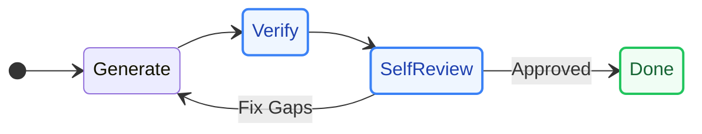
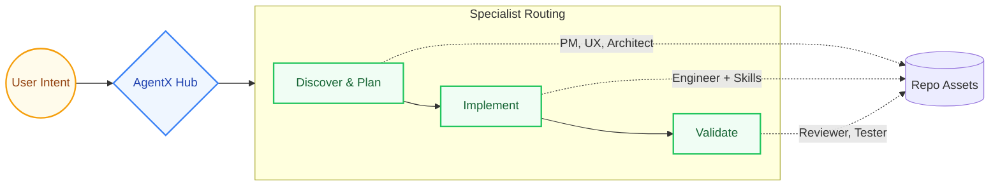

<div align="center">
  
  <h1>AgentX</h1>
  <p><strong>The Multi-Agent Workflow System for Software Delivery</strong></p>
  <p>
    <a href="https://github.com/jnPiyush/AgentX/releases/tag/v8.4.4"></a>
    <a href="LICENSE"></a>
    <a href="https://securityscorecards.dev/viewer/?uri=github.com/jnPiyush/AgentX"></a>
  </p>
  <p><em>Turn AI coding agents into a structured, highly capable development team with routing, domain skills, execution templates, long-term memory, and validation.</em></p>
</div>

---

## Why AgentX?

Zero-shot AI generation is unpredictable for complex software engineering. AgentX introduces a **Harness-Oriented Architecture** that forces AI models to plan, execute, iterate, review, and validate -- just like a high-performing engineering team.

> **"Stop passively generating code. Start autonomously delivering software."**

---

## The AI Development Team

AgentX acts as an autonomous orchestrator, routing tasks to **20 specialized agents** based on required skills.

| Domain | Agents | Deliverables |
|:-------|:-------|:-------------|
| **Product & Design** | Product Manager, UX Designer | PRDs, Wireframes, Prototypes |
| **Architecture** | Architect, Data Scientist | ADRs, Tech Specs, ML Pipelines |
| **Engineering** | Engineer, DevOps | Code, CI/CD, Containerization |
| **Quality & Review** | Reviewer, Tester, Auto-Fix | Code Reviews, Tests, Quality Gates |
| **Analytics & Gov.** | Power BI Analyst, Research | Datasets, M metrics, Industry Briefs |

---

## Domain Skills Library

AgentX is powered by a rich knowledge layer of **67 production skills** distributed across key categories. Agents read peer-reviewed patterns before writing code, ensuring repo-driven accuracy instead of model-memory guesses.

| Category | Example Skills | Purpose |
|:---------|:---------------|:--------|
| **Architecture** | `api-design`, `security`, `database` | System design, performance, and scaling |
| **AI Systems** | `rag-pipelines`, `agent-dev`, `azure-foundry` | Foundation models, agents, and evaluations |
| **Development** | `testing`, `error-handling`, `type-safety` | Code robustness, linting, and quality |
| **Languages & UI** | `python`, `react`, `prototype-craft` | Specific technical stacks and frontend visuals |
| **Ops & Infra** | `github-actions`, `terraform`, `azure` | CI/CD pipelines, containerization, and IaC |
| **Data & Testing** | `databricks`, `fabric-analytics`, `e2e-testing` | Analytics pipelines, MLops, and verification |

---

## Core Capabilities

### 1. The Agentic Loop


AgentX leverages a robust, iterative execution model. The agent researches the repo, classifies the task, writes code against clear criteria, verifies the result, and loops until the task is definitively "Done."

### 2. Deep Domain Skills
**Repo-driven knowledge, not model-memory guesses.**
AgentX is powered by the explicit knowledge layer defined above. Agents read exact, peer-reviewed technical standards before writing a single line of code.

### 3. Context Compaction
**Long sessions without context amnesia.**
Long-running AI tasks often break token limits. AgentX intelligently compacts conversational history, preserving system rules and essential facts while summarizing older history, ensuring the agent remains stable and focused.

### 4. Self Review & Validation Gates
**Trust, but mechanically verify.**
Before any handoff, the active agent rigorously reviews its own work. Complex tasks require evidence-backed execution plans, and HIGH/MEDIUM severity issues block the workflow from advancing until resolved.

### 5. Standardized Templates
Every deliverable -- from PRDs to Tech Specs to Security Plans -- is written into predictable, structured templates. This makes inter-agent handoffs seamless and ensures a consistent paper trail.

### 6. Harness Engineering
Make AI execution durable and resumable. AgentX treats the workspace as the state, utilizing tracked progress files, memory files, and formal architecture decisions to keep execution grounded in reality.

### 7. Knowledge Compounding And Review Intelligence
AgentX now adds explicit brainstorm and compound-loop entry points, ranked planning and review learnings, learning-capture scaffolds tied to the active issue context, advisory agent-native review parity checks, durable review-finding records, and one-step promotion of important findings into the normal backlog workflow.

---

## New In 8.4.4

- Explicit `brainstorm`, `compound`, and `create learning capture` surfaces in chat, sidebars, and commands
- Ranked curated learnings for planning and review entry points
- Explicit knowledge-capture guidance, scaffolding, and durable learnings artifacts
- Advisory agent-native review with parity and context checks
- Harness evaluation summaries in the Quality sidebar
- Durable review findings with promotion into standard AgentX issues

## Architecture at a Glance



- **User Surface:** VS Code extension, Copilot Chat, sidebar views, and CLI
- **Execution Layer:** AgentX Auto orchestrator, specialist phases, iterative loops
- **Knowledge Layer:** 67 skills, 20 agents, 7 instructions, 8 templates, 12 prompts -- all Markdown-defined
- **Control Layer:** Execution plans, repo-local state, automated validation gates

---

## Quick Start

```powershell
irm https://raw.githubusercontent.com/jnPiyush/AgentX/master/install.ps1 | iex
```

```bash
curl -fsSL https://raw.githubusercontent.com/jnPiyush/AgentX/master/install.sh | bash
```

Default install mode is local. GitHub and Azure DevOps modes are available for remote workflow integration.

If AgentX detects Azure-oriented files such as `azure.yaml`, `.azure/`, Azure Functions config, or Bicep, it can also recommend or install the Azure MCP Extension so the Azure Skills plugin is available when the app targets Azure.

---

## Main Repo Areas

- `AGENTS.md` - Top-level guidance and routing rules
- `docs/WORKFLOW.md` - Workflow and handoffs
- `Skills.md` - Complete skill index
- `.github/agents/` - Individual agent definitions
- `.github/skills/` - Reusable implementation knowledge
- `vscode-extension/` - VS Code extension source
- `.agentx/` - CLI runtime and local workflow utilities

## Read More

- [AGENTS.md](AGENTS.md)
- [docs/WORKFLOW.md](docs/WORKFLOW.md)
- [docs/GUIDE.md](docs/GUIDE.md)
- [Skills.md](Skills.md)


