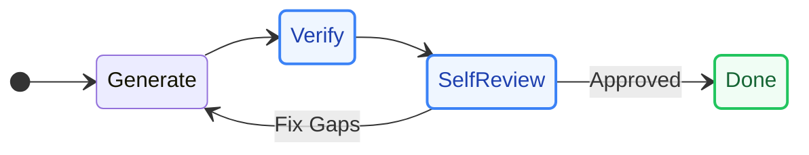
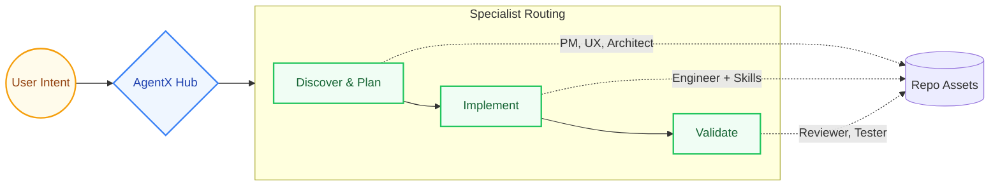
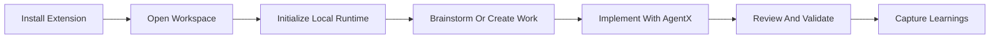

<div align="center">
  
  <h1>AgentX</h1>
  <p><strong>The Multi-Agent Workflow System for Software Delivery</strong></p>
  <p>
    <a href="https://github.com/jnPiyush/AgentX/releases/tag/v8.4.17"></a>
    <a href="LICENSE"></a>
    <a href="https://securityscorecards.dev/viewer/?uri=github.com/jnPiyush/AgentX"></a>
  </p>
  <p><em>Turn AI coding agents into a structured, highly capable development team with routing, domain skills, execution templates, long-term memory, and validation.</em></p>
</div>

---

## Why AgentX?

Zero-shot AI generation is unpredictable for complex software engineering. AgentX introduces a **Harness-Oriented Architecture** that forces AI models to plan, execute, iterate, review, and validate -- just like a high-performing engineering team.

> **"Stop passively generating code. Start autonomously delivering software."**

---

## The AI Development Team

AgentX acts as an autonomous orchestrator, routing tasks to **20 specialized agents** based on required skills.

| Domain | Agents | Deliverables |
|:-------|:-------|:-------------|
| **Product & Design** | Product Manager, UX Designer | PRDs, Wireframes, Prototypes |
| **Architecture** | Architect, Data Scientist | ADRs, Tech Specs, ML Pipelines |
| **Engineering** | Engineer, DevOps | Code, CI/CD, Containerization |
| **Quality & Review** | Reviewer, Tester, Auto-Fix | Code Reviews, Tests, Quality Gates |
| **Analytics & Gov.** | Power BI Analyst, Research | Datasets, M metrics, Industry Briefs |

---

## Domain Skills Library

AgentX is powered by a rich knowledge layer of **69 production skills** distributed across key categories. Agents read peer-reviewed patterns before writing code, ensuring repo-driven accuracy instead of model-memory guesses.

| Category | Example Skills | Purpose |
|:---------|:---------------|:--------|
| **Architecture** | `api-design`, `security`, `database` | System design, performance, and scaling |
| **AI Systems** | `rag-pipelines`, `agent-dev`, `azure-foundry` | Foundation models, agents, and evaluations |
| **Development** | `testing`, `error-handling`, `type-safety` | Code robustness, linting, and quality |
| **Languages & UI** | `python`, `react`, `prototype-craft` | Specific technical stacks and frontend visuals |
| **Ops & Infra** | `github-actions`, `terraform`, `azure` | CI/CD pipelines, containerization, and IaC |
| **Data & Testing** | `databricks`, `fabric-analytics`, `e2e-testing` | Analytics pipelines, MLops, and verification |

---

## Core Capabilities

### 1. The Agentic Loop


AgentX leverages a robust, iterative execution model. The agent researches the repo, classifies the task, writes code against clear criteria, verifies the result, and loops until the task is definitively "Done."

### 2. Deep Domain Skills
**Repo-driven knowledge, not model-memory guesses.**
AgentX is powered by the explicit knowledge layer defined above. Agents read exact, peer-reviewed technical standards before writing a single line of code.

### 3. Context Compaction
**Long sessions without context amnesia.**
Long-running AI tasks often break token limits. AgentX compacts conversational history once estimated prompt usage crosses 70% of the active model context window, preserving system rules, keeping recent turns verbatim, and replacing older history with a structured continuation summary so the agent remains stable and focused.

### 4. Self Review & Validation Gates
**Trust, but mechanically verify.**
Before any handoff, the active agent rigorously reviews its own work. Complex tasks require evidence-backed execution plans, and HIGH/MEDIUM severity issues block the workflow from advancing until resolved.

### 5. Standardized Templates
Every deliverable -- from PRDs to Tech Specs to Security Plans -- is written into predictable, structured templates. This makes inter-agent handoffs seamless and ensures a consistent paper trail.

### 6. Harness Engineering
Make AI execution durable and resumable. AgentX treats the workspace as the state, utilizing tracked progress files, memory files, and formal architecture decisions to keep execution grounded in reality.

### 7. Knowledge Compounding And Review Intelligence
AgentX now adds explicit brainstorm and compound-loop entry points, ranked planning and review learnings, learning-capture scaffolds tied to the active issue context, advisory agent-native review parity checks, durable review-finding records, and one-step promotion of important findings into the normal backlog workflow.

---

## Architecture at a Glance



- **User Surface:** VS Code extension, Copilot Chat, sidebar views, and CLI
- **Execution Layer:** AgentX Auto orchestrator, specialist phases, iterative loops
- **Knowledge Layer:** 69 skills, 21 agents, 7 instructions, 10 templates, 20 prompts -- all Markdown-defined
- **Control Layer:** Execution plans, repo-local state, automated validation gates

---

## Quick Start

For script-based repo setup and contributor bootstrap steps, see [CONTRIBUTING.md](CONTRIBUTING.md).

If you want to use AgentX from VS Code, the setup flow below covers Marketplace installation, per-workspace initialization, and the basic delivery workflow.

## Setup AgentX In VS Code

If you want to use AgentX from the VS Code Marketplace instead of bootstrapping from the install scripts, use the extension workflow below.

### 1. Install The Extension

Install [AgentX on the Visual Studio Marketplace](https://marketplace.visualstudio.com/items?itemName=jnPiyush.agentx).

Recommended prerequisites:

- VS Code 1.85.0 or newer
- Git available on your PATH
- PowerShell 7.4+ on Windows, or Bash on Linux/macOS
- GitHub Copilot and GitHub Copilot Chat enabled in VS Code

### 2. Initialize Each Workspace

AgentX initialization is workspace-scoped. After you open a repo or project folder in VS Code, run:

```text
AgentX: Initialize Local Runtime
```

You can launch it from the Command Palette with `Ctrl+Shift+P` or `Cmd+Shift+P`.

What initialization does for the current workspace:

- creates the local AgentX runtime folders and state files
- prepares repo-local execution artifacts such as plans, progress, reviews, and learnings
- writes stable `.agentx/*` workspace entrypoints that delegate into the bundled runtime
- keeps the executable runtime bundled with AgentX while workspace state remains local to the repo

Repeat this step for every new workspace where you want AgentX to run.

### 3. Optionally Connect Remote Systems

If the workspace needs GitHub or Azure DevOps issue and workflow operations, run:

```text
AgentX: Add Remote Adapter
```

Use local runtime only when you want repo-local planning, implementation, and review without remote backlog integration.

## Build Software With AgentX

Once a workspace is initialized, AgentX can drive delivery from planning through review.



### Recommended Flow

One practical way to use AgentX is to walk a small product idea through the same roles your team would normally use. For example, imagine you want to build a simple task-tracker app with user sign-in, a task list, and a status dashboard.

In VS Code, select the role in chat first, then send a prompt like the ones below.

| Step | Role | What To Ask AgentX | Sample Prompt |
|:-----|:-----|:-------------------|:--------------|
| **1. Define the product** | **Product Manager** | Start with the user problem, goals, and acceptance criteria | `Create a PRD for a task-tracker app for small teams with email login, task CRUD, due dates, and a dashboard for overdue work.` |
| **2. Shape the UX** | **UX Designer** | Turn the PRD into flows, screens, and interaction patterns | `Create the user flow and prototype plan for the task-tracker app, covering sign-in, task creation, task filtering, and dashboard views.` |
| **3. Design the architecture** | **Architect** | Define the technical approach, tradeoffs, and implementation boundaries | `Create an ADR and tech spec for the task-tracker app using a web frontend, backend API, persistence, and role-based access.` |
| **4. Implement the app** | **Engineer** | Build the code and tests from the approved scope and spec | `Implement the task-tracker app from the PRD and spec, including authentication, task CRUD APIs, dashboard data, and automated tests.` |
| **5. Review and verify** | **Reviewer** | Run the review workflow and call out risks before completion | `Review the task-tracker implementation for correctness, security, regressions, and missing tests.` |
| **6. Capture reusable learning** | **AgentX Auto** | Save the outcome if the workflow, architecture, or review produced reusable guidance | `Create a learning capture for the task-tracker delivery workflow and major implementation lessons.` |

If you prefer a single orchestrated session, select **AgentX Auto** in chat and use one prompt that lets it route internally:

```text
Build a task-tracker app for small teams. Start by creating the PRD, then produce UX and architecture guidance, implement the app, review it, and capture reusable learnings.
```

### Typical Chat Prompts

```text
[Product Manager selected] Create a PRD for a task-tracker app for small teams
[UX Designer selected] Create the primary flows and screen plan for the task-tracker app
[Architect selected] Create an ADR and implementation spec for the task-tracker app
[Engineer selected] Implement the task-tracker app and its tests from the approved artifacts
[Reviewer selected] Review the task-tracker app implementation before sign-off
[AgentX Auto selected] Create a learning capture
```

### When To Use Which Mode

- Use **AgentX Auto** when you want end-to-end orchestration in one session.
- Use a specialist role such as **Engineer**, **Architect**, or **Reviewer** when you want tighter control over one phase.
- Use the Command Palette and sidebars when you want a more guided, visual workflow inside VS Code.

---

## New In 8.4.17

- Summary-based context compaction in the runner while keeping the existing 70% threshold trigger
- Per-agent `reasoning` frontmatter support in the runner, including Copilot-mode request options for GPT-5 and Claude 4.6 mappings
- User-visible `Clarification Discussion` blocks in VS Code chat so inter-agent clarification stays visible during execution
- Lightweight cross-role validation checkpoints between Architect and PM, plus conditional Engineer alignment with Architect or Data Scientist
- Runtime resolution of frontmatter `agents:` collaborators for visible cross-role clarification and validation flows
- Dependency-scanning hardening for the VS Code extension package with the latest audited lockfile state

## Main Repo Areas

- `AGENTS.md` - Top-level guidance and routing rules
- `docs/WORKFLOW.md` - Workflow and handoffs
- `Skills.md` - Complete skill index
- `.github/agents/` - Individual agent definitions
- `.github/skills/` - Reusable implementation knowledge
- `vscode-extension/` - VS Code extension source
- `.agentx/` - workspace launchers and local workflow state

## Read More

- [AGENTS.md](AGENTS.md)
- [docs/WORKFLOW.md](docs/WORKFLOW.md)
- [docs/GUIDE.md](docs/GUIDE.md)
- [Skills.md](Skills.md)


