# AgentX Features

> **Complete reference for all AgentX capabilities beyond the core workflow.**  
> For core workflow, agent roles, and classification, see [AGENTS.md](../AGENTS.md).

---

## Table of Contents

- [Agent Memory System](#agent-memory-system)
- [CLI Specification](#cli-specification)
- [Cross-Repository Orchestration](#cross-repository-orchestration)
- [Session Persistence & Auto-Resume](#session-persistence--auto-resume)
- [Template Input Variables](#template-input-variables)
- [Visualization & Debugging](#visualization--debugging)
- [Agent Analytics](#agent-analytics)

---

## Agent Memory System

Long-term memory for personalized agent responses. Memory stays local (never sent to external APIs).

### Structure

```
.agentx/memory/
├── patterns.json       # Code patterns observed
├── preferences.json    # User/team preferences
├── errors.json         # Common mistakes to avoid
└── libraries.json      # Preferred libraries/tools
```

### Memory Files

**patterns.json** — Code patterns agents have observed:
```json
{
  "patterns": [
    {
      "name": "Repository Pattern",
      "context": "data-access",
      "description": "Uses Repository + Unit of Work for data access",
      "frequency": 12,
      "lastSeen": "2026-02-07",
      "example": "src/Repositories/UserRepository.cs"
    }
  ]
}
```

**preferences.json** — User/team coding preferences:
```json
{
  "preferences": [
    {
      "category": "naming",
      "preference": "PascalCase for public methods",
      "strength": "strong",
      "source": "observed"
    }
  ]
}
```

**errors.json** — Common mistakes agents learn to avoid:
```json
{
  "errors": [
    {
      "pattern": "Missing null check on user input",
      "context": "api-controllers",
      "frequency": 3,
      "fix": "Add null/empty validation before processing"
    }
  ]
}
```

**libraries.json** — Preferred libraries:
```json
{
  "libraries": [
    {
      "name": "MediatR",
      "category": "cqrs",
      "preferred": true,
      "reason": "Team standard for command/query separation"
    }
  ]
}
```

### Agent Integration

Agents reference memory at session start:

```markdown
# In agent prompt context:
Before implementing, check .agentx/memory/ for:
- patterns.json: Follow established code patterns
- preferences.json: Respect naming/style preferences
- errors.json: Avoid known mistake patterns
- libraries.json: Use preferred libraries
```

### Commands

```bash
# View memory
cat .agentx/memory/patterns.json | jq

# Clear specific memory
echo '{"patterns": []}' > .agentx/memory/patterns.json

# Back up memory
cp -r .agentx/memory/ .agentx/memory-backup/
```

### Privacy

- All memory stored locally in `.agentx/memory/`
- Add `.agentx/memory/` to `.gitignore` to keep private
- Or commit to share team-wide patterns

---

## CLI Specification

Command-line interface for AgentX operations.

### Core Commands

| Command | Description |
|---------|-------------|
| `agentx init` | Initialize AgentX in a repository |
| `agentx route <issue>` | Route an issue to the correct agent |
| `agentx handoff <issue> <from> <to>` | Hand off issue between agents |
| `agentx status [issue]` | Show issue/project status |
| `agentx validate <issue> <role>` | Validate handoff prerequisites |

### Analytics Commands

| Command | Description |
|---------|-------------|
| `agentx metrics [--week]` | Show performance metrics |
| `agentx report [--format md\|json]` | Generate weekly report |

### Utility Commands

| Command | Description |
|---------|-------------|
| `agentx agents` | List available agents and status |
| `agentx skills` | List available skills |

### Examples

```bash
# Initialize in current repo
agentx init

# Route issue to correct agent
agentx route 42
# → Detected: type:story, Status: Ready → Routing to Engineer

# Validate before handoff
agentx validate 42 engineer
# → ✓ ADR exists, ✓ Spec exists, ✓ Tests planned

# Generate weekly report
agentx report --format md > docs/analytics/report-2026-02-07.md
```

### CI/CD Integration

```yaml
# .github/workflows/agentx-validate.yml
name: AgentX Validation
on:
  issues:
    types: [labeled]
jobs:
  validate:
    runs-on: ubuntu-latest
    steps:
      - uses: actions/checkout@v4
      - name: Validate handoff
        run: agentx validate ${{ github.event.issue.number }} engineer
```

---

## Cross-Repository Orchestration

Coordinate agent workflows across multiple repositories.

### Repository Registry

```json
// .agentx/repos.json
{
  "repos": [
    {
      "name": "frontend",
      "owner": "myorg",
      "repo": "app-frontend",
      "type": "react",
      "labels": ["component:frontend", "component:ui"]
    },
    {
      "name": "backend",
      "owner": "myorg",
      "repo": "app-backend",
      "type": "dotnet",
      "labels": ["component:api", "component:backend"]
    },
    {
      "name": "shared",
      "owner": "myorg",
      "repo": "app-shared",
      "type": "library",
      "labels": ["component:shared"]
    }
  ]
}
```

### Routing Rules

Issues are routed to repositories based on component labels:

| Label | Target Repo | Agent |
|-------|-------------|-------|
| `component:frontend` | app-frontend | Engineer |
| `component:api` | app-backend | Engineer |
| `component:shared` | app-shared | Architect |
| (no component) | Current repo | Agent X routes |

### Cross-Repo Feature Workflow

1. **Epic in main repo** → PM creates PRD, breaks into component stories
2. **Stories labeled** with `component:*` → routed to target repos
3. **Shared specs** created in `app-shared` for API contracts
4. **Engineers** work in parallel across repos
5. **Integration testing** coordinated via main repo issue

### Shared Specs Pattern

For cross-repo features, create shared API specs:

```yaml
# app-shared/specs/user-auth-api.yaml
openapi: "3.0.0"
info:
  title: User Auth API Contract
  version: "1.0"
paths:
  /api/auth/login:
    post:
      summary: User login
      # Both frontend and backend implement against this spec
```

### Monorepo Support

For monorepos, use folder-based routing instead:

```json
{
  "monorepo": true,
  "components": [
    { "name": "frontend", "path": "apps/web", "labels": ["component:frontend"] },
    { "name": "backend", "path": "apps/api", "labels": ["component:api"] }
  ]
}
```

### Limitations

- Cross-repo status sync is manual (no real-time sync)
- Each repo needs its own `.agentx/` configuration
- GitHub Projects V2 can span repos (recommended for tracking)

---

## Session Persistence & Auto-Resume

Enable long-running tasks (>200K tokens) without manual intervention by persisting progress and auto-resuming across context windows.

### Three-Tier Persistence

```
┌─────────────────────────────────────────────────┐
│ Tier 1: GitHub Issues (Coarse-Grained)         │
│ - Status field in Projects V2                   │
│ - Acceptance criteria checkboxes                │
└─────────────────────────────────────────────────┘
                      ↓
┌─────────────────────────────────────────────────┐
│ Tier 2: Progress Notes (Medium-Grained)        │
│ - docs/progress/ISSUE-{id}-log.md              │
│ - Session summaries by agent                    │
└─────────────────────────────────────────────────┘
                      ↓
┌─────────────────────────────────────────────────┐
│ Tier 3: Git Commits (Fine-Grained)             │
│ - Code changes with issue references            │
│ - Atomic progress checkpoints                   │
└─────────────────────────────────────────────────┘
```

### Session Lifecycle

**Phase 1 — Pre-Session (Context Loading):**
1. Read issue acceptance criteria and labels
2. Load `docs/progress/ISSUE-{id}-log.md` if exists
3. Review recent commits: `git log --grep="#105" --since="7 days ago"`
4. Verify environment: run tests to ensure stability

**Phase 2 — Active Session (Work Execution):**
1. Implement features (focus on 1-3 acceptance criteria per session)
2. Write tests (≥80% coverage)
3. Update progress log with session notes
4. Commit atomically with issue references

**Phase 3 — Session End (Checkpoint & Handoff):**
1. Commit all work (clean working directory)
2. Update progress log with summary and next steps
3. Update issue checkboxes
4. Trigger next session if work incomplete

### Auto-Resume Pattern

**When to auto-resume:**
- Context >80% full — proactively resume before hitting limit
- Work incomplete — acceptance criteria remaining
- Agent signals continuation

**Continuation prompt:**
```markdown
# CONTINUATION SESSION
You are resuming work on #105 from a previous session.
CRITICAL: Read these FIRST:
1. docs/progress/ISSUE-105-log.md (previous session notes)
2. Recent commits: git log --grep="#105" --oneline -10
3. Issue #105 acceptance criteria (unchecked items are TODO)
DO NOT repeat work already completed.
```

### Progress Log

**Location**: `docs/progress/ISSUE-{id}-log.md`

Each session appends:
- What was accomplished
- Testing & verification results
- Issues & blockers
- Next steps
- Context usage estimate

### Token Budget Management

| Platform | Limit | Safe Threshold |
|----------|-------|----------------|
| Claude Sonnet 4.5 | 200K tokens | 160K (80%) |
| GitHub Copilot (VS Code) | Varies | Monitor via agent feedback |

### Best Practices

- **DO**: Commit frequently, update progress log, verify tests, document blockers
- **DON'T**: Leave uncommitted work, skip log updates, exceed 90% context, work on multiple issues

### Error Recovery

**Session interrupted mid-work:**
```bash
git status                          # Check uncommitted changes
git log --oneline -1                # Last commit
cat docs/progress/ISSUE-105-log.md  # What was being done
dotnet test                         # Verify stability
```

### Session Metrics

| Metric | Target |
|--------|--------|
| Session Duration | <30 min |
| Context Efficiency | <80% per session |
| Commits per Session | 3-10 |
| Regression Rate | <5% |

---

## Template Input Variables

Templates use `${variable_name}` syntax for dynamic content when agents create documents.

### Variable Declaration

Templates declare inputs in YAML frontmatter:

```yaml
---
inputs:
  epic_title:
    description: "Title of the Epic"
    required: true
    default: ""
  issue_number:
    description: "GitHub issue number"
    required: true
    default: ""
  priority:
    description: "Priority level"
    required: false
    default: "p2"
  date:
    description: "Creation date"
    required: false
    default: "${current_date}"
---
```

### Template Variables by Type

**PRD Template** (`.github/templates/PRD-TEMPLATE.md`):
- `epic_title` (required), `issue_number` (required), `priority`, `author`, `date`

**ADR Template** (`.github/templates/ADR-TEMPLATE.md`):
- `decision_id` (required), `decision_title` (required), `issue_number` (required), `epic_id`, `date`, `status`, `author`

**UX Template** (`.github/templates/UX-TEMPLATE.md`):
- `feature_name` (required), `issue_number` (required), `epic_id`, `designer`, `date`

**Spec Template** (`.github/templates/SPEC-TEMPLATE.md`):
- `feature_name` (required), `issue_number` (required), `epic_id`, `author`, `date`, `acceptance_criteria` (required, array)

**Review Template** (`.github/templates/REVIEW-TEMPLATE.md`):
- `story_title` (required), `issue_number` (required), `engineer` (required), `commit_sha` (required), `feature_id`, `epic_id`, `reviewer`, `date`

### How Agents Use Variables

**Automatic substitution:**
```markdown
<!-- Template -->
# PRD: ${epic_title}
**Epic**: #${issue_number}

<!-- Result -->
# PRD: User Dashboard Redesign
**Epic**: #42
```

**Handoff buttons:**
```yaml
handoffs:
  - label: "🎨 Hand off to UX"
    agent: ux-designer
    prompt: "Design user interface for issue #${issue_number}"
```

**Interactive prompting** — when required variables are missing, agents prompt the user.

### Naming Conventions

| Pattern | Use Case | Example |
|---------|----------|---------|
| `{entity}_id` | Identifiers | `epic_id`, `feature_id` |
| `{entity}_number` | Issue numbers | `issue_number` |
| `{entity}_title` | Titles | `epic_title`, `story_title` |
| `{entity}_name` | Names | `feature_name`, `author` |

### Best Practices

- Always use variables for IDs (never hardcode)
- Provide sensible defaults for optional fields
- Make critical fields required
- Use descriptive variable names

---

## Visualization & Debugging

Generate visual diagrams of AgentX workflows for understanding, debugging, and documentation.

### Workflow Diagrams

**Full Pipeline:**

```mermaid
flowchart LR
    subgraph Planning
        PM[📋 PM]
    end
    subgraph Design
        UX[🎨 UX]
        Arch[🏗️ Architect]
    end
    subgraph Build
        Eng[🔧 Engineer]
    end
    subgraph Quality
        Rev[🔍 Reviewer]
    end
    
    PM -->|PRD| UX
    PM -->|PRD| Arch
    UX -->|Designs| Eng
    Arch -->|Spec| Eng
    Eng -->|Code| Rev
    Rev -->|Approved| Done[✅ Done]
    Rev -->|Changes| Eng
```


**Bug Fix (Simplified):**

```mermaid
flowchart LR
    Bug[🐛 Bug] --> Eng[🔧 Engineer]
    Eng -->|Fix| Rev[🔍 Reviewer]
    Rev -->|Approved| Done[✅ Done]
    Rev -->|Changes| Eng
```


### Issue Status Diagram

```mermaid
flowchart LR
    Backlog[📝 Backlog] --> InProgress[⏳ In Progress]
    InProgress --> InReview[🔎 In Review]
    InReview --> Done[✅ Done]
    InReview -->|needs:changes| InProgress
```



Highlight current status by adding a style line:
- `style Backlog fill:#93C5FD,color:#000`
- `style InProgress fill:#FCD34D,color:#000`
- `style InReview fill:#C4B5FD,color:#000`
- `style Done fill:#86EFAC,color:#000`

### Debug Mode

Validate handoffs step by step:
```bash
./.github/scripts/validate-handoff.sh <issue_number> <role>

# Example output:
# ✓ Tech Spec exists: docs/specs/SPEC-123.md
# ✓ All tests passing (coverage: 85%)
# ✗ Progress log missing: docs/progress/ISSUE-123-log.md
# VALIDATION FAILED - 1 issue(s) found
```

**Debugging checklist for stuck workflows:**

| Check | Command |
|-------|---------|
| Issue status | `gh issue view <number> --json state,labels` |
| Progress log | `cat docs/progress/ISSUE-<number>-log.md` |
| Recent commits | `git log --oneline --grep="#<number>"` |
| Test status | `dotnet test` / `pytest` / `npm test` |
| Validation | `./.github/scripts/validate-handoff.sh <number> <role>` |

### Export Diagrams

```bash
# Install mermaid-cli
npm install -g @mermaid-js/mermaid-cli

# Export to PNG/SVG
mmdc -i workflow.mmd -o workflow.png
mmdc -i workflow.mmd -o workflow.svg
```

VS Code: Install `bierner.markdown-mermaid` extension for inline preview.

---

## Agent Analytics

Track agent performance, workflow efficiency, and identify bottlenecks.

### Metrics

**Handoff Time:**

| Transition | Target | Alert If |
|------------|--------|----------|
| PM → Architect | < 2 hrs | > 4 hrs |
| PM → UX | < 2 hrs | > 4 hrs |
| Architect → Engineer | < 1 hr | > 3 hrs |
| Engineer → Reviewer | < 4 hrs | > 8 hrs |
| Reviewer → Done | < 2 hrs | > 4 hrs |

**Issue Throughput:**

| Metric | How to Measure |
|--------|----------------|
| Issues completed/week | Count issues moved to Done |
| Average cycle time | Created → Done duration |
| WIP (Work in Progress) | Issues in In Progress status |

**Rework Rate:**

| Metric | Formula |
|--------|---------|
| Rework Rate | Issues with `needs:changes` / Total reviewed |
| Target | < 20% |
| Alert | > 30% |

### Data Collection

**From Git:**
```bash
# Issues completed this week
git log --since="7 days ago" --oneline --grep="closes\|fixes\|resolves" | wc -l

# Commits per issue
git log --oneline --grep="#123" | wc -l
```

**From GitHub:**
```bash
# Issues closed this week
gh issue list --state closed --json closedAt,number,title \
  --jq '.[] | select(.closedAt > "2026-01-31")'

# Issues with rework
gh issue list --label "needs:changes" --state all --json number,title
```

### Weekly Report Template

```markdown
# AgentX Weekly Report - Week of YYYY-MM-DD

## Summary
- **Issues Completed**: X
- **Average Cycle Time**: X hours
- **Rework Rate**: X%
- **Active WIP**: X issues

## Handoff Times (Average)
| Transition | This Week | Target |
|------------|-----------|--------|
| PM → Arch | X hrs | < 2 hrs |
| Arch → Eng | X hrs | < 1 hr |
| Eng → Rev | X hrs | < 4 hrs |
| Rev → Done | X hrs | < 2 hrs |

## Actions
- [What to improve next week]
```

### Visualization


### Grafana Export

```json
{
  "week": "2026-02-07",
  "issues_completed": 10,
  "avg_cycle_time_hours": 12.5,
  "rework_rate": 0.15,
  "handoff_times": {
    "pm_to_architect": 1.5,
    "architect_to_engineer": 0.8,
    "engineer_to_reviewer": 3.2,
    "reviewer_to_done": 1.1
  }
}
```

### Scripts

```powershell
# Collect metrics weekly
.\.github\scripts\collect-metrics.ps1
# Output: docs/analytics/report-YYYY-MM-DD.md
```

---

## Declarative Workflows

Workflow templates define the step-by-step sequence each issue type follows. Stored as TOML files in `.agentx/workflows/`, they replace hard-coded routing rules with simple, editable declarations.

### Format

```toml
[workflow]
name = "feature"
description = "Feature workflow: PM → UX → Architect → Engineer → Reviewer"

[[steps]]
id = "prd"
title = "Create PRD"
agent = "product-manager"
status_on_start = "In Progress"
status_on_complete = "Ready"
template = ".github/templates/PRD-TEMPLATE.md"

[[steps]]
id = "architecture"
title = "Create ADR and Tech Spec"
agent = "architect"
needs = ["prd"]
```

### Available Workflows

| File | Type | Steps |
|------|------|-------|
| `feature.toml` | Feature | PRD → UX → Architecture → Implement → Review |
| `epic.toml` | Epic | PRD (children follow their own workflows) |
| `story.toml` | Story | Implement → Review |
| `bug.toml` | Bug | Fix → Review |
| `spike.toml` | Spike | Research |
| `devops.toml` | DevOps | Implement → Review |
| `docs.toml` | Docs | Write |

### CLI

```bash
./.agentx/agentx.sh workflow            # List all workflows
./.agentx/agentx.sh workflow feature     # Show steps for a workflow
```

---

## Smart Ready Queue

The `ready` command scans issues, filters out any that have unresolved blockers (via the dependency convention), and sorts by priority label. It works in both Local and GitHub modes automatically.

### Mode Behavior

| Mode | Data Source | Filter |
|------|-------------|--------|
| **Local** | `.agentx/issues/*.json` | `state=open` + `status=Ready` |
| **GitHub** | `gh issue list` (live API) | `state=open` |

The CLI reads `.agentx/config.json` to detect the mode. In GitHub mode, it calls `gh issue list --json` and gracefully falls back to local files if the `gh` CLI is unavailable.

### Usage

```powershell
.\.agentx\agentx.ps1 ready
```

```bash
./.agentx/agentx.sh ready
```

### Output

```
  Ready Work (unblocked, sorted by priority):
  ─────────────────────────────────────────────
  [P0] #5 (bug) Fix login timeout
  [P1] #8 (feature) Add export to CSV
  [P2] #12 (story) Update onboarding flow
```

Issues with open blockers are silently excluded. If no unblocked work exists, the command reports "No ready work found."

---

## Agent State Tracking

Real-time tracking of which agent is doing what. State is stored in `.agentx/state/agent-status.json`.

### States

| State | Meaning |
|-------|---------|
| `idle` | Agent has no active work |
| `working` | Agent is implementing |
| `reviewing` | Agent is reviewing |
| `stuck` | Agent is blocked |
| `done` | Agent completed current task |

### Usage

```powershell
# View all agent states
.\.agentx\agentx.ps1 state

# Update an agent's state
.\.agentx\agentx.ps1 state engineer working 42
```

### Data Format

```json
{
  "engineer": {
    "status": "working",
    "issue": 42,
    "lastActivity": "2026-02-15T10:30:00Z"
  }
}
```

---

## Dependency Management

Issues can declare dependencies using a `## Dependencies` section in the issue body. The CLI validates these before surfacing work in the ready queue. Works in both Local and GitHub modes — in GitHub mode, dependencies are checked via `gh issue view`.

### Convention

```markdown
## Dependencies
Blocked-by: #10, #12
Blocks: #15
```

### Validation

```powershell
.\.agentx\agentx.ps1 deps 42
```

```
  Dependency Check: #42 — Add user export
  ─────────────────────────────────────────────
  Blocked by:
    ✓ #10 — Database migration [closed]
    ✗ #12 — API endpoint design [open]

  ⚠ BLOCKED — resolve open blockers first.
```

The `ready` command automatically excludes issues with open blockers.

---

## Issue Digests

Weekly summaries of completed work, generated into `.agentx/digests/`. In GitHub mode, pulls closed issues directly from the repository via `gh issue list --state closed`.

### Usage

```powershell
.\.agentx\agentx.ps1 digest
```

### Output

Generates `DIGEST-YYYY-WNN.md` containing:
- Table of all closed issues with type, title, and close date
- Key decisions section (for manual annotation)
- Summary statistics

---

**Related**: [AGENTS.md](../AGENTS.md) | [Skills.md](../Skills.md) | [SETUP.md](SETUP.md) | [TROUBLESHOOTING.md](TROUBLESHOOTING.md)

**Last Updated**: February 2026
