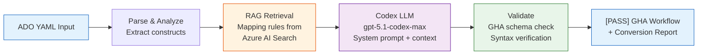
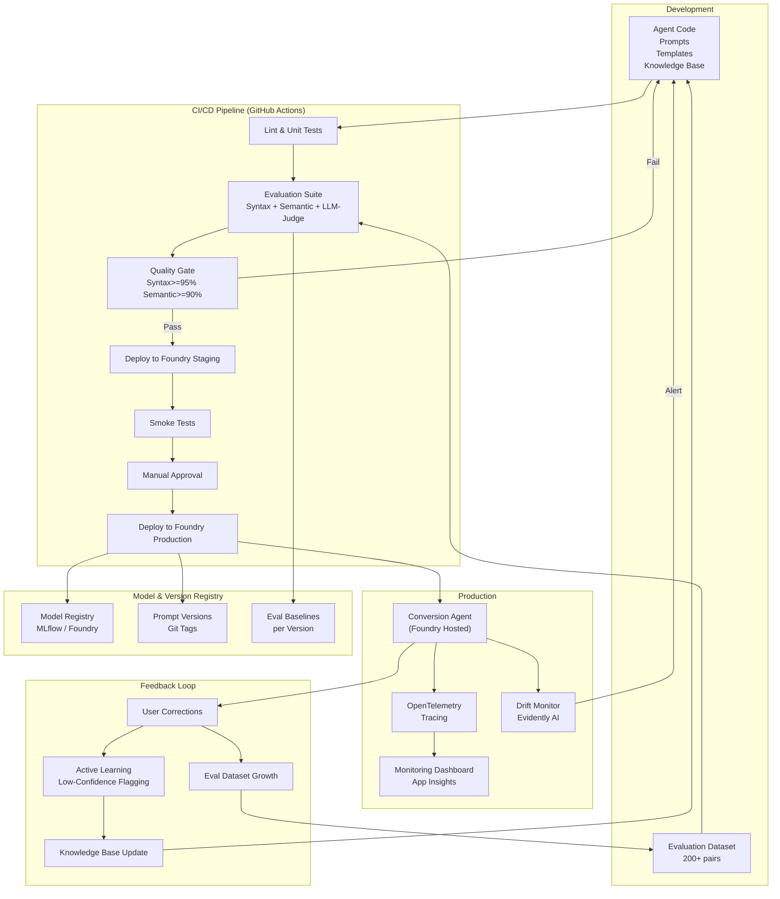

# ADR-ADO-GHA: ADO Pipeline to GitHub Actions Conversion Agent Architecture

**Status**: Accepted
**Date**: 2026-03-03
**Author**: Solution Architect Agent
**Epic**: ADO-to-GHA-Agent
**Issue**: ADO-GHA-001
**PRD**: [PRD-ADO-to-GHA-Agent.md](../prd/PRD-ADO-to-GHA-Agent.md)

---

## Table of Contents

1. [Context](#context)
2. [Decision](#decision)
3. [Options Considered](#options-considered)
4. [Rationale](#rationale)
5. [Consequences](#consequences)
6. [Implementation](#implementation)
7. [AI/ML Architecture](#aiml-architecture)
8. [References](#references)

---

## Context

Organizations migrating from Azure DevOps to GitHub require automated pipeline conversion. The agent must:
- Accept ADO YAML pipelines and produce equivalent GitHub Actions workflows
- Use Codex LLM (gpt-5.1-codex-max) via Microsoft Foundry for intelligent code translation
- Demonstrate a production-grade Agentic DevOps Lifecycle including CI/CD, model drift management, evaluations, versioning, observability, and governance
- Achieve >= 95% syntax correctness and >= 90% semantic equivalence

**Requirements:**
- Near-real-time conversion (< 30 seconds per pipeline)
- RAG-augmented generation using ADO task -> GHA action mapping knowledge base
- Full observability with OpenTelemetry tracing
- CI/CD pipeline with automated evaluation quality gates
- Model drift detection and alerting
- Model and prompt version management

**Constraints:**
- Must use Microsoft Foundry for model hosting and agent deployment
- Must use gpt-5.1-codex-max as primary model
- Must support pipelines up to 5,000 lines (within 272K context window)
- 8-week timeline to MVP with 2 AI engineers + 1 DevOps engineer

---

## Decision

We will build a **Foundry Hosted Agent** using a **RAG-augmented single-agent pattern** with structured tool use, deployed as a container on Microsoft Foundry, backed by a comprehensive DevOps lifecycle pipeline.

**Key architectural choices:**
- **Agent Pattern**: Single agent with RAG + structured tools (not multi-agent -- conversion is a single-domain task)
- **Hosting**: Microsoft Foundry Hosted Agent (container-based) for production; Foundry Prompt Agent for prototyping
- **Model**: gpt-5.1-codex-max (primary) + gpt-5.1 (fallback), both pinned to specific date versions
- **Knowledge Base**: Azure AI Search vector index containing ADO task -> GHA action mappings, syntax rules, and best practices
- **Evaluation**: RAGAS-inspired scoring (faithfulness/correctness) + custom syntax validation + LLM-as-judge (gpt-5.2)
- **CI/CD**: GitHub Actions pipeline with evaluation quality gates, Foundry deployment via `azd`
- **Drift Monitoring**: Evidently AI for output distribution monitoring + custom eval scoring on production samples
- **Observability**: OpenTelemetry tracing + Application Insights + structured logging

---

## Options Considered

### Option 1: Rule-Based Converter (No LLM)

**Description:**
Build a deterministic YAML-to-YAML transformer using a hand-coded mapping table of ADO constructs to GHA equivalents.

**Pros:**
- Deterministic, reproducible output
- No LLM cost or latency
- Simpler to test and debug

**Cons:**
- Cannot handle novel or complex pipeline patterns
- Requires constant maintenance as ADO/GHA evolve
- No ability to reason about intent behind pipeline configurations
- Does not demonstrate agentic DevOps lifecycle

**Effort**: L
**Risk**: Medium (high maintenance burden)

---

### Option 2: RAG-Augmented Single Agent on Foundry (Selected)

**Description:**
Deploy a Codex LLM agent on Microsoft Foundry that uses retrieval-augmented generation to ground its conversions in a curated mapping knowledge base. The agent preprocesses the ADO YAML, retrieves relevant mapping rules, invokes the LLM with structured context, and validates the output.

**Pros:**
- Handles novel and complex pipeline patterns through LLM reasoning
- RAG grounding reduces hallucination and improves accuracy
- Demonstrates full agentic DevOps lifecycle on Microsoft Foundry
- Single agent is simpler to operate and debug than multi-agent
- Foundry provides built-in scaling, monitoring, and deployment tooling

**Cons:**
- LLM inference cost (mitigated by caching and model tiering)
- Non-deterministic output requires evaluation framework
- Requires evaluation dataset curation effort

**Effort**: L
**Risk**: Medium (mitigated by evaluation gates and drift monitoring)

---

### Option 3: Multi-Agent Orchestration

**Description:**
Deploy multiple specialized agents: Parser Agent (ADO YAML analysis), Mapper Agent (construct mapping), Generator Agent (GHA YAML generation), Validator Agent (output validation), each as separate Foundry agents.

**Pros:**
- Clear separation of concerns
- Each agent can be independently updated and evaluated
- Parallelizable for batch processing

**Cons:**
- Significantly more complex to orchestrate and debug
- Higher latency (multiple LLM calls in sequence)
- Higher cost (4x model invocations per conversion)
- Overkill for a single-domain task
- More complex CI/CD and drift monitoring (4 agents to manage)

**Effort**: XL
**Risk**: High (complexity, latency, cost)

---

## Rationale

We chose **Option 2: RAG-Augmented Single Agent on Foundry** because:

1. **Right complexity for the task**: Pipeline conversion is a single-domain task that benefits from LLM reasoning but does not require multi-agent coordination
2. **Best lifecycle demonstration**: A single agent with full CI/CD, eval, drift, and versioning demonstrates all agentic DevOps lifecycle areas cleanly
3. **RAG improves accuracy**: Grounding in curated mapping rules significantly reduces hallucination compared to pure LLM generation
4. **Foundry alignment**: Hosted agent on Foundry leverages built-in deployment, scaling, and observability infrastructure
5. **Manageable cost and latency**: Single LLM call per conversion keeps costs < $0.50 and latency < 30 seconds

**Key decision factors:**
- Microsoft Foundry is the required hosting platform
- The primary goal is demonstrating agentic DevOps lifecycle (CI/CD, drift, evals, versioning)
- Codex model's code specialization provides the best accuracy for YAML-to-YAML translation

---

## Consequences

### Positive
- Single agent simplifies the entire lifecycle (one container, one model, one eval suite)
- RAG knowledge base provides a clear path for continuous improvement (add new mappings)
- Foundry hosting provides production-grade infrastructure out of the box
- Full lifecycle demonstration covers all 8 areas from PRD appendix

### Negative
- LLM non-determinism requires robust evaluation framework
- RAG knowledge base requires curation and maintenance effort
- Context window limit (272K) constrains maximum pipeline size

### Neutral
- Dependency on Microsoft Foundry platform and Codex model availability
- Need to maintain evaluation dataset as ADO/GHA syntax evolves

---

## Implementation

**Detailed technical specification**: [SPEC-ADO-to-GHA-Agent.md](../specs/SPEC-ADO-to-GHA-Agent.md)

**High-level implementation plan:**
1. Scaffold Foundry hosted agent project (Python, Microsoft Agent Framework)
2. Build ADO YAML parser and construct analyzer
3. Create RAG knowledge base (Azure AI Search) with ADO/GHA mapping rules
4. Implement conversion system prompt and tool definitions
5. Build post-processing validation pipeline
6. Create evaluation dataset and automated eval pipeline
7. Set up CI/CD with evaluation quality gates
8. Deploy to Foundry staging and production with drift monitoring

**Key milestones:**
- Phase 1 (Weeks 1-3): Core conversion agent + evaluation framework + CI/CD
- Phase 2 (Weeks 4-6): Quality gates + drift monitoring + observability
- Phase 3 (Weeks 7-8): Batch mode + template support + production hardening

---

## AI/ML Architecture

### Model Selection Decision

| Model | Provider | Context Window | Cost (per 1M tokens) | Latency | Selected? |
|-------|----------|---------------|----------------------|---------|-----------|
| gpt-5.1-codex-max | Microsoft Foundry | 272K/128K | $3.44 | ~10s | [PASS] Primary |
| gpt-5.1 | Microsoft Foundry | 200K/100K | $3.44 | ~8s | [PASS] Fallback |
| gpt-5.2 | Microsoft Foundry | 200K/100K | TBD | ~12s | [PASS] Judge model |
| claude-opus-4-5 | Microsoft Foundry | 200K/64K | $10 | ~15s | [FAIL] Higher cost |
| o3 | Microsoft Foundry | 200K/100K | $3.50 | ~20s | [FAIL] Slower, overkill |

### Agent Architecture Pattern

- [x] **Single Agent** - RAG-augmented agent with structured tools for pipeline conversion

### Inference Pipeline

### Evaluation Strategy

| Metric | Evaluator | Threshold | How Measured |
|--------|-----------|-----------|--------------|
| Syntax Correctness | Custom YAML schema validator | >= 95% | GHA schema validation on output |
| Semantic Equivalence | LLM-as-judge (gpt-5.2) | >= 90% | Side-by-side comparison with ground truth |
| Task Mapping Accuracy | Custom evaluator | >= 85% | ADO task -> GHA action correctness |
| Trigger Mapping | Custom evaluator | >= 95% | Trigger event equivalence |
| Variable Mapping | Custom evaluator | >= 90% | Variable/secret reference correctness |
| Conversion Latency | Timer | < 30s P95 | End-to-end timing |
| Cost per Conversion | Token counter | < $0.50 | Aggregated token usage |

### AI-Specific Risks

| Risk | Impact | Mitigation |
|------|--------|------------|
| Model hallucinates GHA actions that don't exist | High | RAG grounding + post-processing validation against Actions marketplace |
| Model produces invalid YAML syntax | High | Schema validation + retry with error context injected |
| Model version deprecated by provider | Medium | Pinned versions + multi-model testing + fallback model ready |
| Prompt injection via malicious YAML | Medium | Input sanitization + YAML-only parsing (no code execution) |
| RAG retrieval returns irrelevant mappings | Medium | Relevance scoring + top-K tuning + periodic knowledge base audit |
| Cost spike from large pipelines | Low | Token budget per request + model tiering for simple pipelines |

---

## Agentic DevOps Lifecycle Architecture

This section documents how all 8 lifecycle areas are implemented as a coherent system.

### Lifecycle Area Mapping

| # | Area | Key Components | Foundry Integration |
|---|------|---------------|---------------------|
| 1 | **CI/CD** | GitHub Actions pipeline, eval gates, `azd deploy` | Foundry MCP deploy, container versioning |
| 2 | **Model Drift** | Evidently AI, PSI monitoring, production eval sampling | Foundry model metrics, Azure Monitor alerts |
| 3 | **Evaluations** | RAGAS-style scorers, LLM-as-judge, custom validators | Foundry evaluation runs, baseline tracking |
| 4 | **Versioning** | Git tags, `config/models.yaml`, model registry | Foundry model registry, container tags |
| 5 | **Observability** | OpenTelemetry, App Insights, structured logging | Foundry tracing, container logs |
| 6 | **Security** | RBAC, Key Vault, input/output validation | Foundry RBAC, Entra ID |
| 7 | **Infrastructure** | Bicep/Terraform, ACR, AI Search, Foundry project | `azd provision`, Foundry project setup |
| 8 | **Feedback** | User corrections, active learning, KB updates | Foundry feedback collection |

---

## References

### Internal
- [PRD-ADO-to-GHA-Agent.md](../prd/PRD-ADO-to-GHA-Agent.md)
- [SPEC-ADO-to-GHA-Agent.md](../specs/SPEC-ADO-to-GHA-Agent.md)

### External
- [Microsoft Foundry Documentation](https://ai.azure.com)
- [GitHub Actions Workflow Syntax](https://docs.github.com/en/actions/using-workflows/workflow-syntax-for-github-actions)
- [Azure Pipelines YAML Schema](https://learn.microsoft.com/en-us/azure/devops/pipelines/yaml-schema)
- [RAGAS Evaluation Framework](https://docs.ragas.io)
- [Evidently AI Drift Monitoring](https://docs.evidentlyai.com)
- [OpenTelemetry Python SDK](https://opentelemetry.io/docs/languages/python)

---

## Review History

| Date | Reviewer | Status | Notes |
|------|----------|--------|-------|
| 2026-03-03 | Solution Architect Agent | Accepted | Initial ADR |

---

**Generated by AgentX Architect Agent**
**Last Updated**: 2026-03-03
**Version**: 1.0
