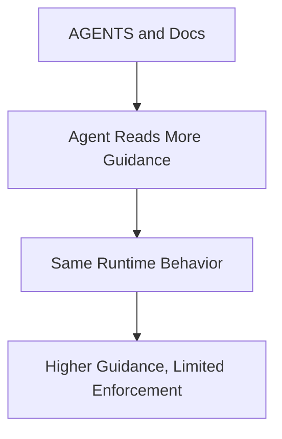
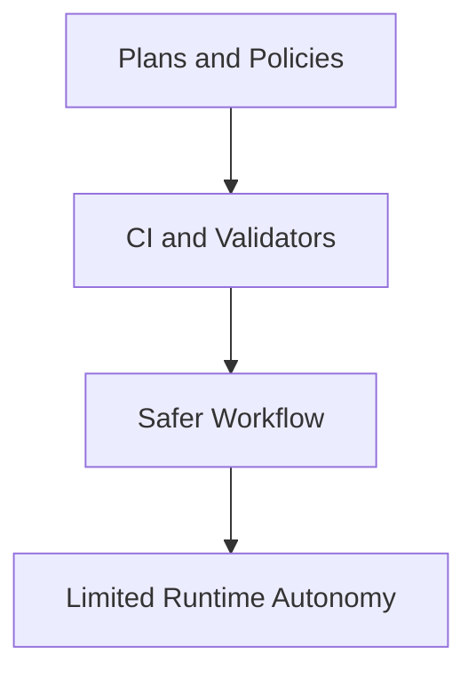
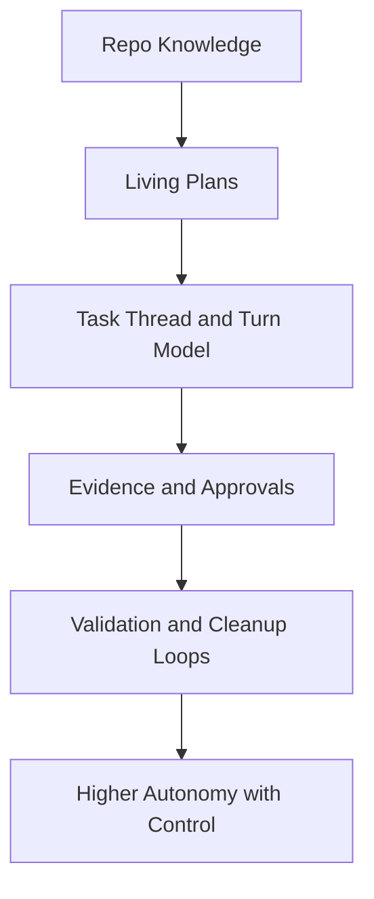
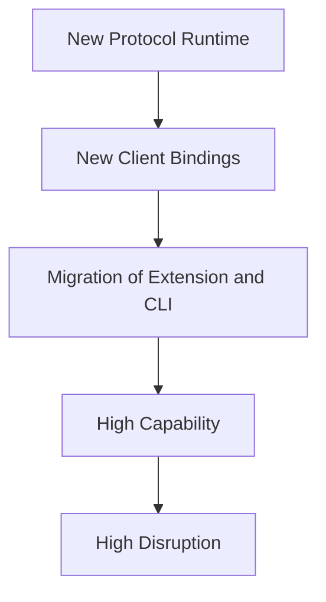

# ADR-Harness-Engineering: Adopt A Phased Harness Engineering Architecture For AgentX

**Status**: Proposed
**Date**: 2026-03-08
**Author**: GitHub Copilot, Solution Architect Agent
**Epic**: N/A
**Issue**: N/A

---

## Table of Contents

1. [Context](#context)
2. [Decision](#decision)
3. [Options Considered](#options-considered)
4. [Evaluation](#evaluation)
5. [Rationale](#rationale)
6. [Consequences](#consequences)
7. [Implementation](#implementation)
8. [References](#references)

---

## Context

AgentX already contains several foundations that align with an agent-first software workflow: retrieval-led reasoning in [AGENTS.md](../AGENTS.md), workflow routing and iteration in [WORKFLOW.md](../WORKFLOW.md), mechanical rules in [GOLDEN_PRINCIPLES.md](../GOLDEN_PRINCIPLES.md), quality grading in [QUALITY_SCORE.md](../QUALITY_SCORE.md), execution-plan and progress templates in [.github/templates/EXEC-PLAN-TEMPLATE.md](../../.github/templates/EXEC-PLAN-TEMPLATE.md) and [.github/templates/PROGRESS-TEMPLATE.md](../../.github/templates/PROGRESS-TEMPLATE.md), and extension-side loop and command safety primitives in [vscode-extension/src/commands/loopCommand.ts](../../vscode-extension/src/commands/loopCommand.ts), [vscode-extension/src/utils/loopStateChecker.ts](../../vscode-extension/src/utils/loopStateChecker.ts), and [vscode-extension/src/utils/commandValidator.ts](../../vscode-extension/src/utils/commandValidator.ts). [Confidence: HIGH]

The external research shows that these foundations are necessary but not sufficient for high-autonomy agent work. The main lesson from OpenAI's Harness Engineering article is that throughput and reliability come from better harness design, not only better prompts. The most important patterns were:

- Make repository knowledge the system of record, with a short table-of-contents style AGENTS file and deeper structured docs.
- Treat execution plans as living, self-contained artifacts for multi-hour work.
- Expose runtime state, validation evidence, logs, traces, and UI behavior directly to the agent.
- Encode architecture and taste as mechanical invariants, not informal guidance.
- Run continuous cleanup to prevent agent-generated drift from compounding.

These findings are reinforced by the related App Server article, which emphasizes stable thread and turn lifecycles, explicit item-based events, durable task history, approval checkpoints, and a client-friendly protocol surface for rich agent interaction. The execution-plan article adds that complex work should use living plans with progress, discoveries, decision logs, and observable acceptance criteria. [Confidence: HIGH]

### AI-First Assessment

Could this problem be solved better by GenAI or agentic AI alone? No. A purely prompt-driven approach would increase variance and architectural drift. A hybrid architecture is preferred: use AI for generation, review, evaluation, and adaptation, but place it inside a deterministic harness that provides structure, evidence, policies, and measurable gates. [Confidence: HIGH]

### Requirements

- Preserve AgentX's existing issue-first, retrieval-led, and role-based workflow model.
- Improve agent autonomy without weakening safety or legibility.
- Keep the repository as the primary system of record for agent-usable knowledge.
- Make complex work resumable, inspectable, and reproducible across sessions and clients.
- Increase mechanical enforcement of architectural and workflow invariants.
- Add measurable progress toward a richer runtime harness without requiring a disruptive rewrite. [Confidence: HIGH]

### Constraints

- AgentX currently has a lighter-weight VS Code extension runtime than the richer agentic architecture described in some internal docs.
- The project must remain cross-platform and ASCII-only.
- The repo should not adopt a fragile, highly stateful orchestration layer that is difficult to explain or validate.
- Safety controls around command execution, approvals, and user-facing escalation must remain explicit. [Confidence: HIGH]

### Research Evidence

| Source | Relevant Finding | Implication For AgentX |
|-------|------------------|------------------------|
| OpenAI, Harness Engineering, 2026-02-11 | Legibility, observability, structured docs, and recurring cleanup drive agent effectiveness | AgentX should invest in harness surfaces and cleanup automation, not just prompt depth |
| OpenAI, Unlocking the Codex Harness, 2026-02-04 | Rich clients benefit from stable thread, turn, item, approval, and event primitives | AgentX should define stronger runtime primitives for task evidence and progress streaming |
| OpenAI Cookbook, Using PLANS.md for multi-hour problem solving, 2025-10-07 | Complex tasks need living plans with progress, discoveries, decision logs, and observable acceptance | AgentX should make execution plans mandatory for complex tasks, not optional templates |
| Internal docs: [WORKFLOW.md](../WORKFLOW.md), [GOLDEN_PRINCIPLES.md](../GOLDEN_PRINCIPLES.md), [QUALITY_SCORE.md](../QUALITY_SCORE.md) | Strong workflow and policy foundations already exist | AgentX should extend current strengths rather than re-platform from scratch |

### Known Failure Modes And Anti-Patterns

- Monolithic instruction files become stale, crowd context, and reduce signal.
- Documentation-only governance does not prevent agent drift.
- Runtime features that are not legible to the agent effectively do not exist.
- Advisory checks accumulate debt because agents can learn around them instead of through them.
- High-autonomy loops without durable progress and evidence make retries and human review expensive. [Confidence: HIGH]

### Security And Long-Term Viability

The proposed direction improves security posture if implemented carefully because it strengthens structured approvals, evidence capture, boundary validation, and measurable policy enforcement. The main long-term risk is complexity creep in the extension runtime. To manage that, the harness must be phased and centered on stable primitives rather than ad hoc features. The 3-5 year viability outlook is positive because the architecture relies on durable patterns: structured docs, execution plans, event models, validations, and observability. These are robust across model changes. [Confidence: HIGH]

---

## Decision

We will adopt a phased Harness Engineering architecture for AgentX.

**Key architectural choices:**

- Introduce a formal Harness layer in AgentX's architecture, centered on five first-class concepts: Plans, Threads, Turns, Items, and Evidence. [Confidence: HIGH]
- Make execution plans mandatory for complex or multi-phase work, with living-document updates recorded during progress. [Confidence: HIGH]
- Extend mechanical enforcement from documentation structure into workflow, evidence, and architecture invariants. [Confidence: HIGH]
- Add repo-native garbage collection through recurring doc-gardening and drift-remediation automation. [Confidence: HIGH]
- Evolve the VS Code extension and CLI incrementally toward richer runtime primitives rather than replacing them with a new protocol immediately. [Confidence: MEDIUM]
- Preserve the existing user-mediated hub-and-spoke model as the default control boundary, while allowing more autonomous sub-agent review and validation inside bounded tasks. [Confidence: HIGH]

---

## Options Considered

### Option 1: Documentation-Only Uplift

**Description:** Improve AGENTS, workflow docs, and templates, but do not change runtime behavior or enforcement.

**Pros:**
- Low implementation cost
- Fastest path to visible documentation improvements
- Minimal disruption to current extension and CLI flows

**Cons:**
- Does not solve runtime legibility gaps
- Does not create stronger validation evidence
- Drift remains likely because enforcement stays weak

**Effort**: S
**Risk**: Low

---

### Option 2: Workflow And Policy Harness Without Runtime Expansion

**Description:** Add mandatory execution plans, stronger CI validation, and cleanup automation, but keep the runtime surface largely unchanged.

**Pros:**
- High leverage from repository-native changes
- Builds on current strengths in docs and quality gates
- Safer than introducing a larger runtime model immediately

**Cons:**
- Does not fully expose task evidence, app state, or observability to agents
- Leaves extension runtime thinner than target architecture
- Gains in autonomy are moderate, not step-change

**Effort**: M
**Risk**: Medium

---

### Option 3: Full Phased Harness Architecture

**Description:** Add mandatory plans, stronger invariants, recurring cleanup, and a richer runtime model for task progress, evidence, approvals, and validation artifacts.

**Pros:**
- Best match to external research
- Addresses both repository and runtime legibility
- Creates a scalable path toward richer agent autonomy
- Enables measurable harness maturity over time

**Cons:**
- More design and implementation work
- Requires disciplined scoping to avoid over-engineering
- Exposes architecture/runtime drift quickly if docs are not updated in lockstep

**Effort**: L
**Risk**: Medium

---

### Option 4: Re-Platform Around A New External Harness Protocol

**Description:** Pause incremental evolution and redesign AgentX around a new protocol-first runtime, similar in spirit to a full app-server model.

**Pros:**
- Cleanest long-term runtime architecture on paper
- Strong protocol boundary between clients and core runtime

**Cons:**
- Too disruptive for current repo maturity
- Large delivery risk before value is realized
- Weak fit for current project priorities and visible codebase state

**Effort**: XL
**Risk**: High

---

## Evaluation

| Criteria | Option 1 | Option 2 | Option 3 | Option 4 |
|----------|----------|----------|----------|----------|
| Improves repo legibility | Medium | High | High | Medium |
| Improves runtime legibility | Low | Low | High | High |
| Mechanical enforceability | Low | High | High | High |
| Near-term value | Medium | High | High | Low |
| Delivery risk | Low | Medium | Medium | High |
| Fit with current AgentX architecture | High | High | High | Low |
| Long-term extensibility | Low | Medium | High | High |

**Result:** Option 3 is preferred because it captures the main benefits of harness engineering while preserving the current architecture and allowing phased rollout. [Confidence: HIGH]

---

## Rationale

We chose **Option 3: Full Phased Harness Architecture** because it best balances leverage, safety, and architectural continuity.

1. **It fixes the root problem rather than polishing symptoms**: AgentX does not mainly suffer from lack of guidance; it suffers from insufficient harness surfaces for durable plans, evidence, and runtime legibility. [Confidence: HIGH]
2. **It compounds existing strengths**: AgentX already has strong workflow, templates, policy docs, and validation culture. Option 3 extends these into a coherent harness instead of introducing an unrelated system. [Confidence: HIGH]
3. **It avoids premature re-platforming**: A protocol-first rewrite would be attractive architecturally but too expensive and risky relative to the current codebase. [Confidence: HIGH]
4. **It supports gradual autonomy**: The phased model allows AgentX to preserve explicit approvals and user-mediated escalation while still adding stronger autonomous validation loops inside bounded tasks. [Confidence: HIGH]
5. **It is resilient to model evolution**: Plans, evidence, event lifecycles, and validators remain useful even as model capabilities or providers change. [Confidence: HIGH]

---

## Consequences

### Positive

- Complex tasks become more resumable, inspectable, and reproducible.
- Agents get stronger operational context without bloating the default instruction path.
- Reviews can shift from subjective interpretation toward evidence-backed validation.
- Cleanup and anti-drift work become a recurring system function instead of manual effort. [Confidence: HIGH]

### Negative

- The project will need to maintain more structured metadata and workflow artifacts.
- The extension runtime will gain architectural complexity that must be justified with tests and documentation.
- There is a risk of building a heavy harness before enough lightweight wins are captured. [Confidence: MEDIUM]

### Neutral

- Existing issue-first and role-based workflow remains the outer control model.
- Existing templates and quality docs remain valid, but their role becomes more operational and less merely documentary.
- Some current documentation may need reclassification from "reference" to "enforced behavior". [Confidence: HIGH]

---

## Implementation

**Detailed technical specification**: [SPEC-Harness-Engineering.md](../specs/SPEC-Harness-Engineering.md)

**High-level implementation plan:**

1. Define harness concepts and rules in repo docs and templates.
2. Add mechanical gates for plans, evidence, and cleanup automation.
3. Introduce runtime primitives for task state, evidence, and approvals in the extension and CLI.
4. Add harness-specific evaluation and maturity scoring.
5. Expand toward richer observability and validation surfaces only after the foundational artifacts are stable. [Confidence: HIGH]

**Key milestones:**

- Phase 1: Plan-first workflow and golden-principle updates
- Phase 2: CI enforcement and entropy cleanup automation
- Phase 3: Extension and CLI runtime harness primitives
- Phase 4: Harness evaluation, scoring, and observability maturity [Confidence: HIGH]

---

## References

### Internal

- [AGENTS.md](../AGENTS.md)
- [WORKFLOW.md](../WORKFLOW.md)
- [GOLDEN_PRINCIPLES.md](../GOLDEN_PRINCIPLES.md)
- [QUALITY_SCORE.md](../QUALITY_SCORE.md)
- [tech-debt-tracker.md](../tech-debt-tracker.md)
- [.github/templates/EXEC-PLAN-TEMPLATE.md](../../.github/templates/EXEC-PLAN-TEMPLATE.md)
- [.github/workflows/quality-gates.yml](../../.github/workflows/quality-gates.yml)
- [.github/workflows/weekly-status.yml](../../.github/workflows/weekly-status.yml)

### External

- [Harness engineering: leveraging Codex in an agent-first world](https://openai.com/index/harness-engineering/)
- [Unlocking the Codex harness: how we built the App Server](https://openai.com/index/unlocking-the-codex-harness/)
- [Using PLANS.md for multi-hour problem solving](https://developers.openai.com/cookbook/articles/codex_exec_plans)

---

**Generated by AgentX Architect Agent**
**Last Updated**: 2026-03-08
**Version**: 1.0