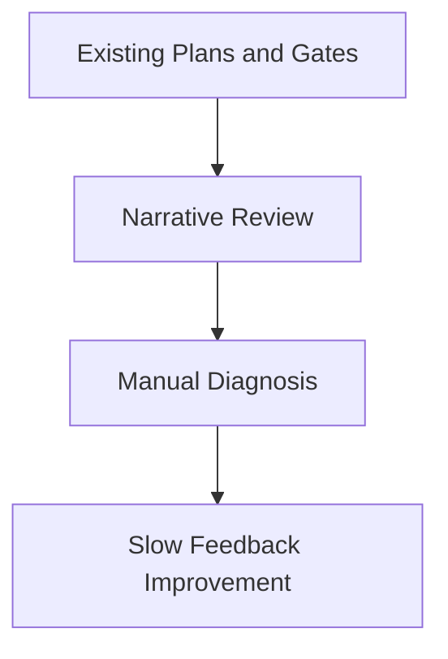
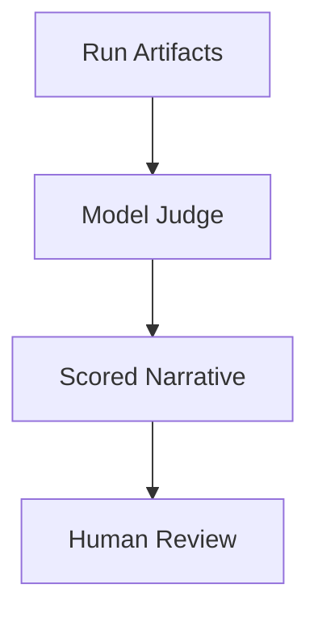
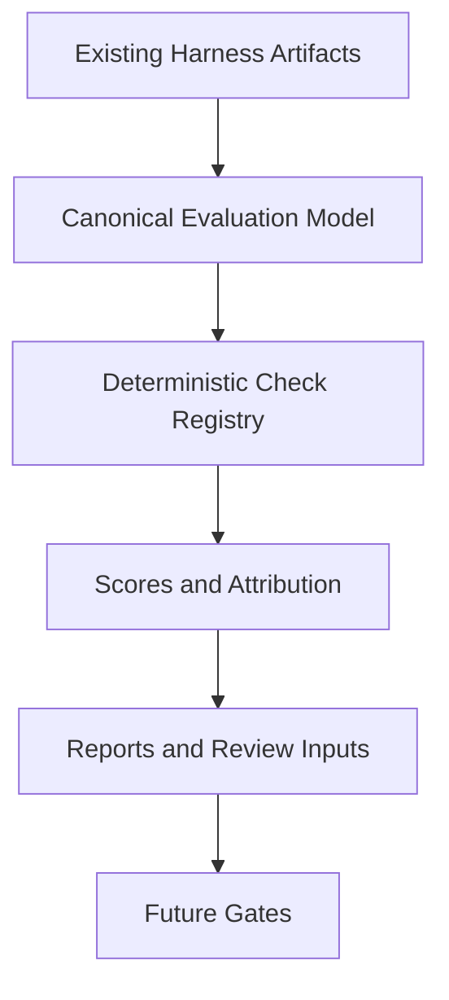
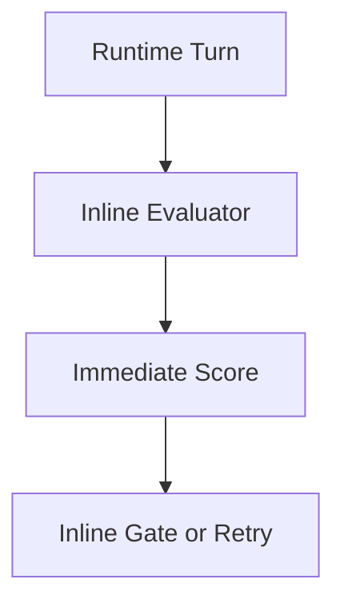

# ADR-Harness-Evaluation-Adoption: Adopt A Native Harness Evaluation Layer For AgentX

**Status**: Proposed
**Date**: 2026-03-12
**Author**: GitHub Copilot, Solution Architect Agent
**Epic**: N/A
**Issue**: N/A

---

## Table of Contents

1. [Context](#context)
2. [Decision](#decision)
3. [Options Considered](#options-considered)
4. [Evaluation](#evaluation)
5. [Rationale](#rationale)
6. [Consequences](#consequences)
7. [Implementation](#implementation)
8. [References](#references)

---

## Context

AgentX has already established the first major pieces of a harness-oriented workflow: repository-local plans and progress logs, complex-work plan gating, weekly plan-health reporting, and file-backed runtime state for thread, turn, item, and evidence concepts. These foundations are visible in [docs/WORKFLOW.md](../WORKFLOW.md), [docs/GOLDEN_PRINCIPLES.md](../GOLDEN_PRINCIPLES.md), [docs/QUALITY_SCORE.md](../QUALITY_SCORE.md), [docs/execution/plans/HARNESS-IMPLEMENTATION-PLAN.md](../execution/plans/HARNESS-IMPLEMENTATION-PLAN.md), and [vscode-extension/src/utils/harnessState.ts](../../vscode-extension/src/utils/harnessState.ts). [Confidence: HIGH]

What AgentX still lacks is a native evaluation layer that can score the quality of an agent run after the fact, explain why a run failed, and distinguish whether the primary cause was model behavior, harness design, policy gaps, or environment/tooling. Current validation emphasizes structural compliance and artifact existence. It is weaker at causal diagnosis, observed-versus-inferred coverage, and comparable scoring across sessions. [Confidence: HIGH]

This creates a gap between the current harness runtime and the review/quality system:

- the runtime can persist state, but the repo cannot yet score the quality of that state coherently
- the plan gate can detect missing plans or weak evidence signals, but it cannot explain failure attribution well
- weekly reporting can count plans and placeholders, but it cannot measure session discipline or evaluation confidence
- quality scoring identifies harness maturity gaps, but it does not yet consume a formal harness evaluation output [Confidence: HIGH]

### AI-First Assessment

Could this problem be solved better by GenAI or agentic AI alone? No. A purely model-judged approach would be too subjective and too expensive to trust as the primary control plane. The preferred architecture is hybrid: deterministic checks, typed artifacts, and reproducible scoring form the base layer, while optional AI-assisted summarization or secondary judgment remains advisory. [Confidence: HIGH]

### Requirements

- Preserve AgentX's existing issue-first, plan-first, and retrieval-led workflow. [Confidence: HIGH]
- Reuse existing repo-local artifacts before adding new runtime complexity. [Confidence: HIGH]
- Produce evaluation results that are deterministic enough for CI and review use. [Confidence: HIGH]
- Add failure attribution that distinguishes model, harness, policy, and environment causes. [Confidence: HIGH]
- Keep phase 1 advisory-first so false positives do not disrupt current workflows. [Confidence: HIGH]

### Constraints

- The repo must remain ASCII-only and cross-platform. [Confidence: HIGH]
- The existing harness runtime should not be replaced as part of this work. [Confidence: HIGH]
- Evaluation output must be legible to both agents and humans from repo-local artifacts. [Confidence: HIGH]
- The architecture must not introduce external repository references into AgentX docs, plans, code, or issues. [Confidence: HIGH]

### Research Evidence

| Source | Relevant Finding | Implication For AgentX |
|-------|------------------|------------------------|
| Internal harness design review | Durable repo-local context and stronger feedback loops improve agent throughput and reliability | AgentX should extend its harness with stronger evaluation and feedback, not only more runtime state |
| Internal runtime and UX analysis | Rich harnesses benefit from stable task primitives and explicit event surfaces | AgentX should evaluate thread and turn quality from its existing state model instead of treating runs as opaque transcripts |
| Internal workflow and plan review | Complex work should be judged by living plans, progress, and observable acceptance evidence | AgentX should evaluate whether plans and evidence remain aligned throughout a run |
| Internal docs: [ADR-Harness-Engineering.md](../artifacts/adr/ADR-Harness-Engineering.md), [QUALITY_SCORE.md](../QUALITY_SCORE.md), [tech-debt-tracker.md](../tech-debt-tracker.md) | The repo already recognizes gaps in evaluation evidence, runtime maturity, and documentation/runtime consistency | Harness evaluation should close these gaps with a measurable, native scoring layer |

### Known Failure Modes And Anti-Patterns

- Narrative-only reviews make repeated failure analysis expensive and inconsistent.
- Heuristic plan gates can detect missing evidence but cannot reliably explain why a run degraded.
- Advisory checks without attribution make it hard to know which subsystem to improve.
- Overly aggressive blocking gates create noise and reduce trust in the harness.
- Evaluation systems that cannot explain observation coverage invite overconfidence in inferred conclusions. [Confidence: HIGH]

### Security And Long-Term Viability

This direction improves long-term controllability because it converts scattered runtime and validation artifacts into a structured evaluation surface. The main risk is overbuilding a scoring framework before the signal quality is proven. That risk is managed by making phase 1 advisory-only, grounding checks in deterministic evidence, and promoting only mature checks into gates later. The 3-5 year viability outlook is positive because evaluation, attribution, and confidence reporting are durable concerns regardless of model provider or runtime surface. [Confidence: HIGH]

---

## Decision

We will adopt a native harness evaluation layer for AgentX.

**Key architectural choices:**

- Add a canonical evaluation model for AgentX runs, artifacts, checks, findings, scores, attribution, and observation coverage. [Confidence: HIGH]
- Start with deterministic checks over existing local artifacts rather than embedding evaluation directly into the live execution path. [Confidence: HIGH]
- Treat failure attribution as a first-class output with four buckets: model, harness, policy, and environment. [Confidence: HIGH]
- Keep the initial rollout advisory-only and defer merge-blocking use until signal quality is proven. [Confidence: HIGH]
- Integrate evaluation outputs into quality reporting and review artifacts before promoting them into stronger CI gates. [Confidence: MEDIUM]

---

## Options Considered

### Option 1: Keep Current Structural Validation Only

**Description:** Continue with plan gating, weekly plan-health checks, and narrative review artifacts without a formal run-evaluation layer.

**Pros:**
- Lowest implementation cost
- No change to current workflow behavior
- Keeps existing scripts and docs sufficient for basic compliance

**Cons:**
- Does not explain failure causes well
- Leaves quality scoring mostly narrative
- Cannot compare runs consistently over time

**Effort**: S
**Risk**: Low

---

### Option 2: AI-Only Judge Layer

**Description:** Use an LLM-driven reviewer to interpret run artifacts and score harness quality primarily through model judgment.

**Pros:**
- Flexible and quick to prototype
- Can summarize complex artifacts well
- Can produce natural-language feedback rapidly

**Cons:**
- Weak reproducibility
- Higher cost and variance
- Poor fit for CI-grade gates without a deterministic base

**Effort**: M
**Risk**: High

---

### Option 3: Deterministic Native Evaluation Layer

**Description:** Build a typed evaluation model, deterministic check registry, passive artifact readers, scoring, attribution, and confidence reporting over current AgentX artifacts.

**Pros:**
- Strong fit with AgentX's mechanical-rule philosophy
- Reuses current runtime and repo artifacts
- Produces stable, comparable outputs for quality reporting
- Creates a foundation for future CI and review integration

**Cons:**
- More design work than narrative-only review
- Requires discipline to avoid noisy heuristics
- Attribution quality will start partial and improve over time

**Effort**: M
**Risk**: Medium

---

### Option 4: Full Live Evaluation In The Runtime Loop

**Description:** Embed scoring, attribution, and confidence analysis directly inside the execution runtime so each turn is evaluated synchronously.

**Pros:**
- Richest immediate feedback
- Strongest future autonomy potential
- Can influence remediation during the run itself

**Cons:**
- Highest delivery and complexity risk
- Adds noise to the critical path before metrics mature
- Harder to separate evaluation bugs from runtime bugs

**Effort**: L
**Risk**: High

---

## Evaluation

| Criteria | Option 1 | Option 2 | Option 3 | Option 4 |
|----------|----------|----------|----------|----------|
| Reuses current AgentX artifacts | High | Medium | High | Medium |
| Deterministic and CI-friendly | Medium | Low | High | Medium |
| Causal diagnosis quality | Low | Medium | High | High |
| Delivery risk | Low | High | Medium | High |
| Fit with current harness maturity | High | Medium | High | Medium |
| Long-term extensibility | Low | Medium | High | High |

**Result:** Option 3 is preferred because it improves evaluation quality materially without overloading the live runtime. [Confidence: HIGH]

---

## Rationale

We chose **Option 3: Deterministic Native Evaluation Layer** because it best matches AgentX's current architecture and maturity.

1. **It extends the current harness instead of competing with it**: AgentX already has plan, runtime-state, and reporting artifacts. The missing layer is evaluation, not another runtime abstraction. [Confidence: HIGH]
2. **It preserves reproducibility**: Deterministic checks and typed outputs are easier to trust, compare, and automate than narrative-only judgments. [Confidence: HIGH]
3. **It improves diagnosis, not just compliance**: The main value is not another pass/fail gate; it is knowing whether the failure belongs to model behavior, harness design, policy design, or environment conditions. [Confidence: HIGH]
4. **It creates a safe rollout path**: Advisory-first scoring allows AgentX to tune confidence and false-positive rates before promoting any findings into stronger gates. [Confidence: HIGH]
5. **It supports future growth**: Once the evaluation model is stable, AgentX can add optional AI-assisted summarization, richer event capture, and stronger CI integration without rewriting the foundation. [Confidence: HIGH]

---

## Consequences

### Positive

- AgentX gains a formal way to measure harness quality rather than describing it narratively.
- Reviews and weekly status can become more evidence-backed and less interpretive.
- Failure attribution becomes actionable for the right subsystem owner.
- Future CI gating can be based on mature checks instead of ad hoc heuristics. [Confidence: HIGH]

### Negative

- The repo will need to maintain another typed artifact model and evaluation vocabulary.
- Some early checks will be incomplete until more event surfaces are available.
- There is a risk of over-trusting scores before observation coverage matures. [Confidence: MEDIUM]

### Neutral

- The live harness runtime remains the current source of execution state.
- The first phase does not require new user-facing workflow changes.
- Existing plan and review artifacts remain valid and become stronger inputs to evaluation. [Confidence: HIGH]

---

## Implementation

**Detailed technical specification**: [SPEC-Harness-Evaluation-Adoption.md](../artifacts/specs/SPEC-Harness-Evaluation-Adoption.md)

**High-level implementation plan:**

1. Define a canonical evaluation schema and check registry.
2. Add passive readers for existing AgentX artifacts and runtime outputs.
3. Implement scoring, attribution, and observation-coverage reporting.
4. Integrate evaluation output into weekly reporting and review artifacts.
5. Promote only mature, low-noise checks into stronger gates later. [Confidence: HIGH]

**Key milestones:**

- Phase 1: Evaluation schema and deterministic check registry
- Phase 2: Passive artifact ingestion and scoring
- Phase 3: Weekly reporting and review integration
- Phase 4: Selective CI gating and richer runtime coverage [Confidence: HIGH]

---

## References

### Internal

- [AGENTS.md](../../AGENTS.md)
- [WORKFLOW.md](../WORKFLOW.md)
- [GOLDEN_PRINCIPLES.md](../GOLDEN_PRINCIPLES.md)
- [QUALITY_SCORE.md](../QUALITY_SCORE.md)
- [tech-debt-tracker.md](../tech-debt-tracker.md)
- [ADR-Harness-Engineering.md](../artifacts/adr/ADR-Harness-Engineering.md)

---

**Generated by AgentX Architect Agent**
**Last Updated**: 2026-03-12
**Version**: 1.0