# Architecture: AgentX System Architecture

**Author**: Solution Architect Agent
**Last Updated**: 2026-02-27

---

## Table of Contents

1. [Clarification Protocol Architecture](#clarification-protocol-architecture)
2. [Memory Pipeline Architecture](#memory-pipeline-architecture)
3. [Agentic Loop Quality Framework Architecture](#agentic-loop-quality-framework-architecture)
4. [Related Documents](#related-documents)

---

## Clarification Protocol Architecture

> Originally ARCH-1.md | Date: 2026-02-26 | Epic: #1 | ADR: [ADR-AgentX.md](../adr/ADR-AgentX.md) | Spec: [SPEC-AgentX.md](../specs/SPEC-AgentX.md) | PRD: [PRD-AgentX.md](../prd/PRD-AgentX.md)

### 1. System Context

The Clarification Protocol extends AgentX's existing hub-and-spoke architecture with a bidirectional communication layer. Agent X remains the sole coordinator -- agents never communicate directly.

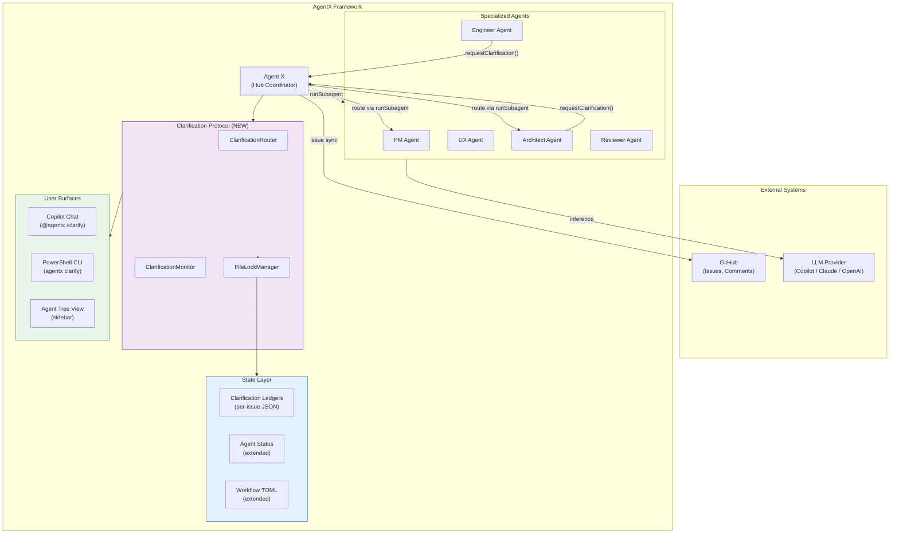

---

### 2. Component Architecture

#### 2.1 Layer Diagram

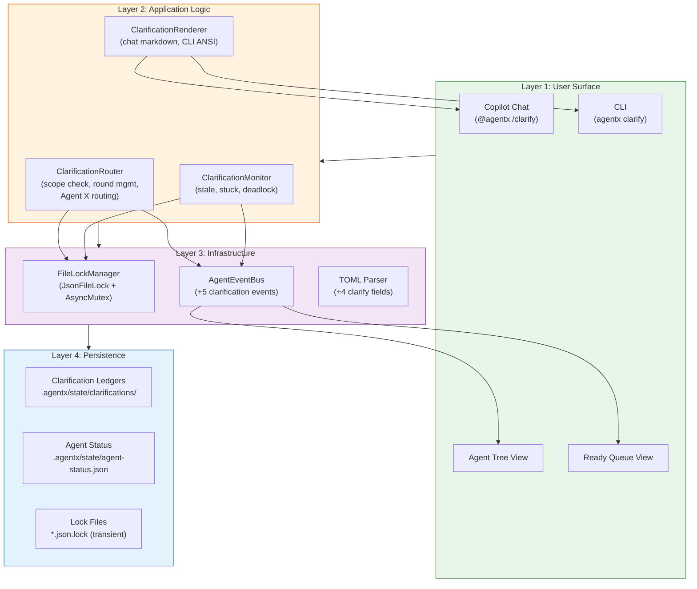

#### 2.2 Component Responsibility Matrix

| Component | Layer | Language | Responsibility |
|-----------|-------|----------|----------------|
| ClarificationRouter | Application | TS + PS | Scope validation, round management, Agent X routing |
| ClarificationMonitor | Application | TS + PS | Stale/stuck/deadlock detection, auto-retry, priority-break |
| ClarificationRenderer | Application | TS + PS | Format output for chat markdown and CLI ANSI |
| FileLockManager | Infrastructure | TS | JsonFileLock (file) + AsyncMutex (in-process) |
| Lock-JsonFile / Unlock-JsonFile | Infrastructure | PS | File locking for CLI operations |
| AgentEventBus (+5 events) | Infrastructure | TS | Lifecycle event dispatch for UI refresh |
| TOML Parser (+4 fields) | Infrastructure | PS | Read clarification config from workflow steps |
| Clarification Ledgers | Persistence | JSON | Per-issue clarification state |
| Agent Status (extended) | Persistence | JSON | Agent status with clarification fields |

---

### 3. Data Flow

#### 3.1 Clarification Request Flow

```mermaid
graph LR
    subgraph Request["1. Request"]
        A1["Agent detects<br/>ambiguity"]
        A2["Creates<br/>ClarificationRequest"]
    end

    subgraph Validate["2. Validate"]
        B1["Agent X checks<br/>TOML can_clarify"]
        B2["Checks round<br/>limit"]
    end

    subgraph Lock["3. Lock + Write"]
        C1["Acquire .lock"]
        C2["Write ledger"]
        C3["Release .lock"]
    end

    subgraph Route["4. Route"]
        D1["runSubagent<br/>(target agent)"]
        D2["Target reads<br/>artifact + question"]
        D3["Target composes<br/>answer"]
    end

    subgraph Answer["5. Answer"]
        E1["Acquire .lock"]
        E2["Write answer<br/>to ledger"]
        E3["Release .lock"]
    end

    subgraph Render["6. Render"]
        F1["Stream to chat<br/>or print to CLI"]
        F2["Fire EventBus<br/>event"]
    end

    Request --> Validate --> Lock --> Route --> Answer --> Render

    style Lock fill:#E8F5E9,stroke:#2E7D32
    style Answer fill:#E8F5E9,stroke:#2E7D32
```

#### 3.2 Monitoring Data Flow

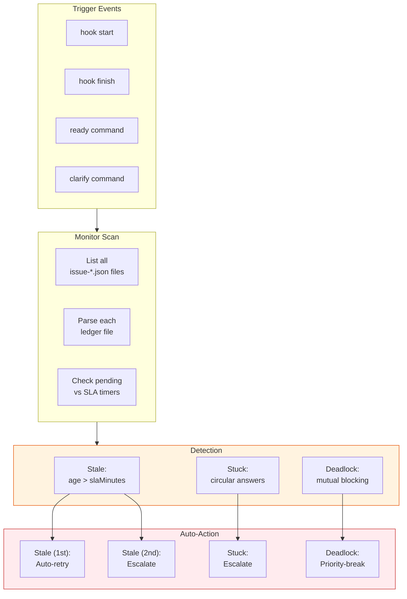

---

### 4. Integration Points

#### 4.1 Existing Components Modified

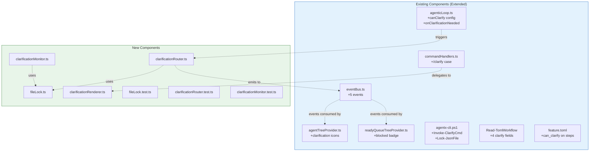

#### 4.2 Extension Point Summary

| Extension Point | What Changes | Impact |
|-----------------|-------------|--------|
| `AgentEventMap` (eventBus.ts) | 5 new event types + payload interfaces | Low - additive change, existing events untouched |
| `AgenticLoopConfig` (agenticLoop.ts) | 3 new optional fields | Low - existing configs work unchanged |
| `handleSlashCommand` (commandHandlers.ts) | New `case 'clarify'` | Low - extends switch, no modification to existing cases |
| `Read-TomlWorkflow` (agentx-cli.ps1) | 4 new field parsers | Low - defaults applied for missing fields |
| Agent status enum | 2 new values: `clarifying`, `blocked-clarification` | Medium - tree views need icon mapping |

---

### 5. Concurrency Model

#### 5.1 File Locking Architecture

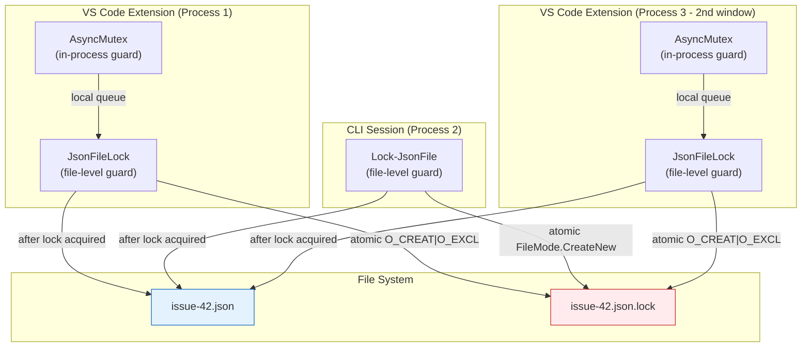

**Concurrency guarantees:**
- **Same process**: AsyncMutex serializes async operations (prevents race in Node.js event loop)
- **Cross-process**: .lock file with atomic create ensures only one process writes at a time
- **Cross-platform**: Node.js `fs.open('wx')` and PowerShell `FileMode.CreateNew` both use OS-level atomics
- **Stale recovery**: Locks older than 30s are automatically cleaned up (handles crashed processes)

#### 5.2 Lock Lifecycle

```
ACQUIRE:
  1. AsyncMutex.acquire(filePath)         [TS only, in-process]
  2. fs.open(filePath + '.lock', 'wx')    [atomic create]
  3. Write PID + timestamp + agent        [diagnostic data]
  4. Read + modify + write data file      [protected region]
  5. fs.unlink(filePath + '.lock')        [release]
  6. AsyncMutex.release(filePath)         [TS only]

CONTENTION:
  Attempt 1: 0ms    -> try acquire
  Attempt 2: 200ms  -> exponential backoff
  Attempt 3: 400ms  -> exponential backoff
  Attempt 4: 800ms  -> exponential backoff
  Attempt 5: 1600ms -> TIMEOUT (total ~3s)

STALE DETECTION:
  If lock file exists AND age > 30,000ms:
    Delete lock file (orphaned by crashed process)
    Retry acquisition
```

---

### 6. State Machine

#### 6.1 Clarification Status Transitions

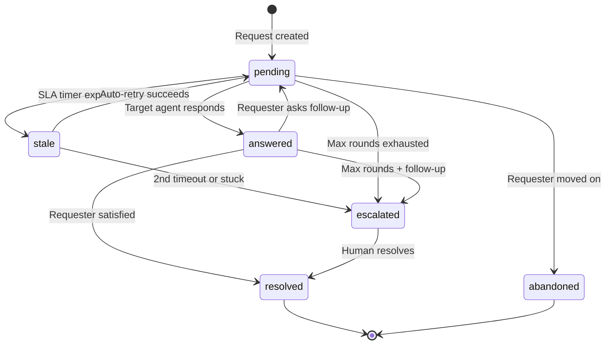

#### 6.2 Agent Status State Machine

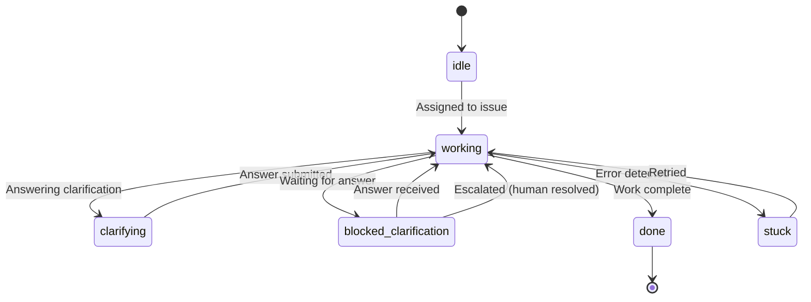

---

### 7. Security Architecture

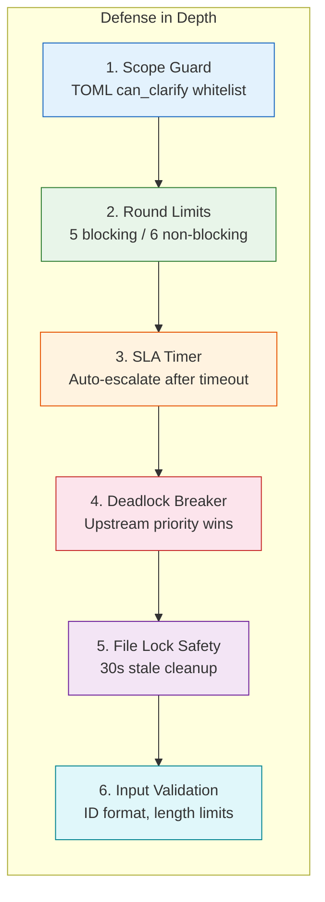

**Threat model summary:**

| Threat | Guard | Impact if bypassed |
|--------|-------|--------------------|
| Unauthorized agent-to-agent call | Scope Guard (TOML whitelist) | Agent invokes wrong target |
| Infinite clarification loop | Round Limits (hard cap) | Token waste, pipeline stall |
| Stale clarification blocks pipeline | SLA Timer (auto-escalate) | Indefinite blocking |
| Mutual deadlock | Priority-break (upstream wins) | Two agents stuck permanently |
| Concurrent file corruption | File lock + stale cleanup | Data loss in ledger |
| Malformed clarification ID | Regex validation | Parse errors downstream |

---

### 8. Deployment Topology

```
No new infrastructure required.

All components deploy within the existing AgentX framework:
- PowerShell CLI functions: Added to agentx-cli.ps1 (single file)
- TypeScript modules: Added to vscode-extension/src/utils/ (new files)
- State files: .agentx/state/clarifications/ (gitignored, auto-created)
- Lock files: .agentx/state/clarifications/*.lock (gitignored, transient)
- TOML config: Extended in .agentx/workflows/*.toml (committed)

Local Mode: Zero dependencies, file-based only
GitHub Mode: Adds issue comment posting for clarification sync
```

---

### 9. Feature-to-Issue Mapping

| Feature | Issues | Priority | Phase |
|---------|--------|----------|-------|
| F1: Clarification Ledger + File Locking | #2 (Feature), #9-#11 (Stories) | P0 | 1 |
| F2: Clarification Routing (Agent X) | #3 (Feature), #12-#14 (Stories) | P0 | 2 |
| F3: Agent Status Extensions | #4 (Feature), #15-#16 (Stories) | P0 | 1 |
| F4: Conversation-as-Interface | #5 (Feature), #17-#18 (Stories) | P0 | 2 |
| F5: Stale/Stuck Monitoring | #6 (Feature), #19-#22 (Stories) | P1 | 3 |
| F6: Workflow TOML + Agentic Loop | #7 (Feature), #23-#25 (Stories) | P1 | 2-3 |
| F7: Analytics + GitHub Sync | #8 (Feature), #26-#28 (Stories) | P2 | 4 |

---

### 10. Key Decisions Summary

| # | Decision | Rationale | See |
|---|----------|-----------|-----|
| 1 | Hub-routed (not direct) | Preserves hub-and-spoke architecture | [ADR-1 Decision](../adr/ADR-AgentX.md#decision) |
| 2 | File locks (.lock files) | Cross-platform, no external deps | [ADR-1 Decision 1](../adr/ADR-AgentX.md#decision-1-file-locking-strategy) |
| 3 | Per-issue ledger files | Avoids single-file bottleneck | [SPEC-1 Section 4](../specs/SPEC-AgentX.md#4-data-model-diagrams) |
| 4 | Event-driven monitoring | No daemon, works in Local Mode | [ADR-1 Decision 3](../adr/ADR-AgentX.md#decision-3-monitoring-architecture-event-driven-no-daemon) |
| 5 | Conversation-as-interface | No buttons/panels, stream-based UX | [ADR-1 Decision 5](../adr/ADR-AgentX.md#decision-5-conversation-as-interface) |
| 6 | TOML-declared scope | Configurable per workflow without code | [SPEC-1 Section 4.5](../specs/SPEC-AgentX.md#45-workflow-toml-extension) |
| 7 | AsyncMutex + file lock | Dual guard for same-process + cross-process | [ADR-1 Decision 6](../adr/ADR-AgentX.md#decision-6-extension-integration-points) |

---

## Memory Pipeline Architecture

> Originally ARCH-29.md | Date: 2026-02-27 | Epic: #29 | ADR: [ADR-AgentX.md](../adr/ADR-AgentX.md) | Spec: [SPEC-AgentX.md](../specs/SPEC-AgentX.md) | PRD: [PRD-AgentX.md](../prd/PRD-AgentX.md)

### 1. System Context

The Memory Pipeline extends AgentX's existing session infrastructure with a persistent observation layer that captures knowledge at session boundaries and recalls it at session start. All new components integrate into the existing extension architecture as passive subscribers and optional services.

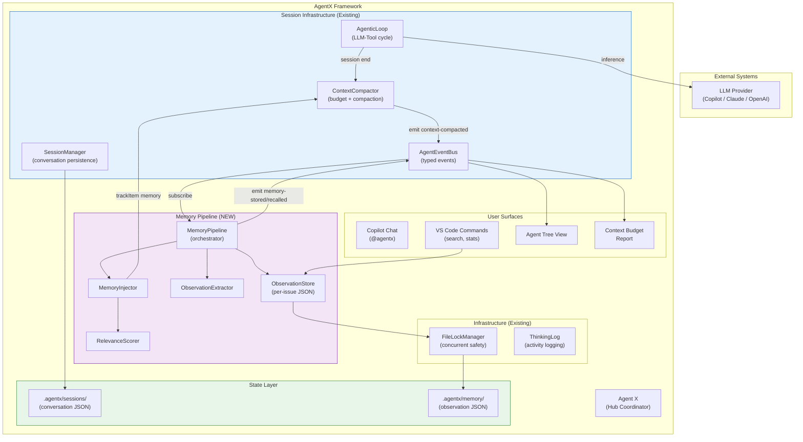

---

### 2. Component Architecture

#### 2.1 Layer Diagram

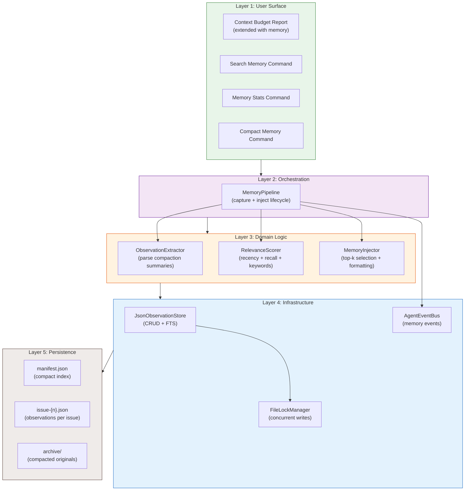

#### 2.2 Component Responsibility Matrix

| Component | Layer | Responsibility |
|-----------|-------|----------------|
| MemoryPipeline | Orchestration | Lifecycle management: EventBus subscription, capture flow, injection flow |
| ObservationExtractor | Domain | Parse compaction summary into structured observations by category |
| RelevanceScorer | Domain | Compute relevance score from recency, recall count, keyword overlap |
| MemoryInjector | Domain | Select top-k within budget, format "Memory Recall" section |
| JsonObservationStore | Infrastructure | Per-issue JSON file CRUD, manifest management, FTS |
| FileLockManager | Infrastructure | Dual-guard (AsyncMutex + JsonFileLock) for safe concurrent writes |
| AgentEventBus | Infrastructure | Dispatch memory-stored and memory-recalled events to consumers |

---

### 3. Data Flow

#### 3.1 Capture Flow (Session End)

```mermaid
graph LR
    subgraph End["1. Session End"]
        A1["AgenticLoop<br/>finishes"]
        A2["compactConversation()<br/>runs"]
    end

    subgraph Event["2. Event"]
        B1["context-compacted<br/>emitted via EventBus"]
    end

    subgraph Extract["3. Extract"]
        C1["Parse decisions"]
        C2["Parse code changes"]
        C3["Parse errors"]
        C4["Parse key facts"]
    end

    subgraph Sanitize["4. Sanitize"]
        D1["Strip secrets"]
        D2["Remove private tags"]
        D3["Truncate to 2000 chars"]
    end

    subgraph Store["5. Store"]
        E1["Lock issue file"]
        E2["Append observations"]
        E3["Update manifest"]
        E4["Emit memory-stored"]
    end

    End --> Event --> Extract --> Sanitize --> Store

    style Extract fill:#FFF3E0,stroke:#E65100
    style Store fill:#E3F2FD,stroke:#1565C0
```

#### 3.2 Injection Flow (Session Start)

```mermaid
graph LR
    subgraph Start["1. Session Start"]
        A1["Agent session<br/>begins"]
    end

    subgraph Query["2. Query"]
        B1["Load manifest<br/>(cached)"]
        B2["Filter by agent<br/>+ issue"]
    end

    subgraph Score["3. Score"]
        C1["Recency"]
        C2["Recall count"]
        C3["Keyword overlap"]
        C4["Weighted sum"]
    end

    subgraph Select["4. Select"]
        D1["Sort by score"]
        D2["Take top-k<br/>within budget"]
        D3["Load full<br/>observations"]
    end

    subgraph Inject["5. Inject"]
        E1["Format as<br/>Memory Recall"]
        E2["trackItem<br/>memory category"]
        E3["Emit<br/>memory-recalled"]
    end

    Start --> Query --> Score --> Select --> Inject

    style Score fill:#FFF3E0,stroke:#E65100
    style Select fill:#F3E5F5,stroke:#6A1B9A
    style Inject fill:#E8F5E9,stroke:#2E7D32
```

#### 3.3 Search Flow (User Command)

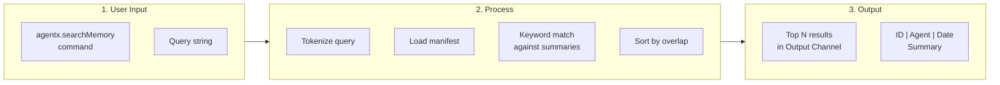

---

### 4. Integration Points

#### 4.1 Existing Components Modified

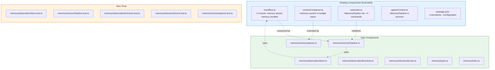

#### 4.2 Extension Point Summary

| Extension Point | What Changes | Impact |
|-----------------|-------------|--------|
| `AgentEventMap` (eventBus.ts) | 2 new event types + payload interfaces | Low - additive, existing events untouched |
| `formatBudgetReport()` (contextCompactor.ts) | New "Memory" section in report output | Low - extends string output, no API change |
| `activate()` (extension.ts) | Initialize MemoryPipeline, register 4 commands | Low - additive to activation sequence |
| `AgentXServices` (agentxContext.ts) | Optional `memoryPipeline` field | Low - optional, no breaking change |
| `package.json` contributes | 4 commands + 5 settings | Low - additive VS Code contributions |

---

### 5. Concurrency Model

#### 5.1 Write Ordering

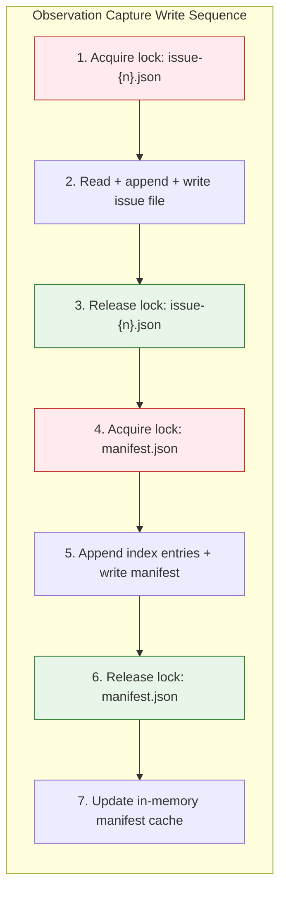

**Deadlock prevention**: Fixed lock ordering (issue file before manifest). Two concurrent captures for different issues hold different issue locks and only contend briefly on the manifest lock. Same-issue contention is serialized by the issue file lock.

#### 5.2 Read Concurrency

Reads (injection, search) use the in-memory manifest cache and do not acquire locks. Issue file reads for `getById`/`getByIssue` are safe without locks because writes are atomic (write-to-temp, rename). A read during a concurrent write will see either the old or new version, both of which are valid complete JSON.

---

### 6. Storage Layout

```
.agentx/
  memory/                          # NEW - Memory pipeline storage
    manifest.json                  # Compact index of all observations
    manifest.json.lock             # Lock file (transient)
    issue-29.json                  # Observations for issue #29
    issue-29.json.lock             # Lock file (transient)
    issue-30.json                  # Observations for issue #30
    issue-42.json                  # Observations for issue #42
    archive/                       # Compacted originals
      issue-29-archived.json       # Archived observations from compaction
  sessions/                        # EXISTING - Session conversation JSON
    engineer-1709035100000-x7y8.json
  state/                           # EXISTING - Agent state + clarification ledgers
    agent-status.json
    clarifications/
      issue-42.json
```

**Sizing estimates:**

| Scale | Observations | manifest.json | Issue files (total) | Total disk |
|-------|-------------|---------------|--------------------|----|
| Small project | 500 | ~25KB | ~250KB | ~275KB |
| Medium project | 5,000 | ~250KB | ~2.5MB | ~2.75MB |
| Large project | 50,000 | ~2.5MB | ~25MB | ~27.5MB |

All sizes well within the PRD's 50MB target.

---

### 7. Event Architecture

#### 7.1 Event Flow Diagram

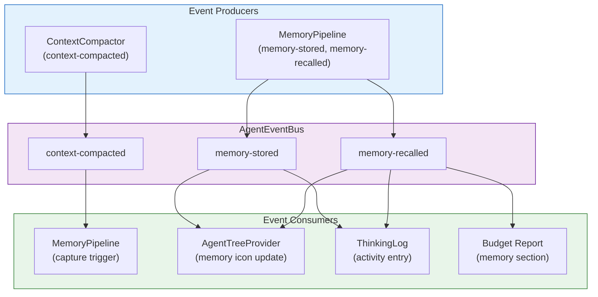

#### 7.2 Event Payload Types

| Event | Field | Type | Description |
|-------|-------|------|-------------|
| `memory-stored` | agent | string | Agent that produced the observations |
| | issueNumber | number | Issue the observations relate to |
| | count | number | Number of observations stored |
| | totalTokens | number | Total tokens across all stored observations |
| | observationIds | string[] | IDs of stored observations |
| | timestamp | number | Unix timestamp |
| `memory-recalled` | agent | string | Agent receiving the injection |
| | issueNumber | number | Issue context for the recall |
| | count | number | Number of observations recalled |
| | totalTokens | number | Tokens consumed by recalled content |
| | observationIds | string[] | IDs of recalled observations |
| | timestamp | number | Unix timestamp |

---

### 8. Configuration Architecture

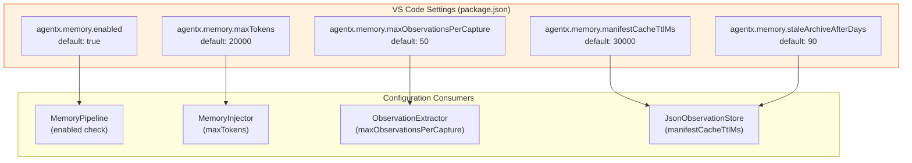

---

### 9. Error Recovery

#### 9.1 Failure Modes and Recovery

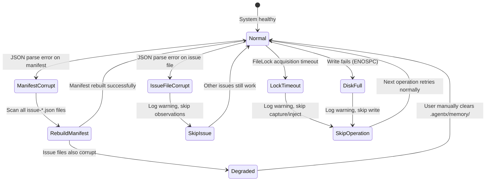

#### 9.2 Manifest Rebuild Algorithm

```
1. List all files matching issue-*.json in .agentx/memory/
2. For each file:
   a. Parse JSON (skip if corrupt, log warning)
   b. Extract ObservationIndex entries from observations array
3. Merge all index entries into new manifest
4. Write manifest.json via FileLockManager
5. Log "Manifest rebuilt: {N} observations from {M} issue files"
```

---

### 10. Feature-to-Issue Mapping

| Feature | Issues | Priority | Phase |
|---------|--------|----------|-------|
| F1: Observation Store | #30 (Feature), #36-#38 (Stories) | P0 | 1 |
| F2: Session Memory Injection | #31 (Feature), #39-#40 (Stories) | P0 | 2a |
| F3: Progressive Disclosure Search | #32 (Feature), #41-#42 (Stories) | P1 | 2b |
| F4: Lifecycle Hook Integration (CLI) | #33 (Feature), #43-#44 (Stories) | P2 | 3 |
| F5: Memory Decay and Compaction | #34 (Feature), #45-#46 (Stories) | P2 | 3 |

---

### 11. Key Decisions Summary

| # | Decision | Rationale | See |
|---|----------|-----------|-----|
| 1 | Per-issue JSON files (not single file, not SQLite) | Zero deps, pattern consistency with ADR-1, sufficient at 50K scale | [ADR-29 sec 1](../adr/ADR-AgentX.md#decision-1-storage-layout) |
| 2 | In-memory manifest for FTS (not disk-based index) | <200ms search at 10K, 30s cache TTL, lazy loading | [ADR-29 sec 3](../adr/ADR-AgentX.md#decision-3-injection-pipeline) |
| 3 | EventBus-driven capture (not hook script modification) | context-compacted event already exists; passive subscriber | [ADR-29 sec 2](../adr/ADR-AgentX.md#decision-2-capture-pipeline) |
| 4 | IObservationStore interface (backend-agnostic) | Enables SQLite/vector swap without consumer changes | [ADR-29 sec 6](../adr/ADR-AgentX.md#decision-6-observationstore-interface-backend-agnostic) |
| 5 | ContextCompactor memory category (existing) | `memory` already in ContextItem category union -- zero changes | [SPEC-29 sec 5](../specs/SPEC-AgentX.md#5-service-layer-diagrams) |
| 6 | FileLockManager reuse (not new locking) | Tested dual-guard from ADR-1; shared with clarification system | [ADR-29 sec 4](../adr/ADR-AgentX.md#decision-4-concurrency-model) |
| 7 | Fixed lock ordering (issue file then manifest) | Prevents deadlocks on concurrent multi-issue captures | [SPEC-29 sec 5](../specs/SPEC-AgentX.md#51-write-ordering) |

---

## Agentic Loop Quality Framework Architecture

> Date: 2026-03-05 | Epic: #30 | ADR: [ADR-AgentX.md](../adr/ADR-AgentX.md#adr-30-agentic-loop-quality-framework) | Spec: [SPEC-AgentX.md](../specs/SPEC-AgentX.md#agentic-loop-quality-framework-specification) | PRD: [PRD-AgentX.md](../prd/PRD-AgentX.md#feature-prd-agentic-loop-quality-framework)

### 1. System Context

The Agentic Loop Quality Framework adds automated quality assurance and inter-agent clarification capabilities to AgentX's agentic loop. It operates as an in-session, in-memory layer -- distinct from the planned cross-session Clarification Protocol (Architecture #1) and Memory Pipeline (Architecture #2).

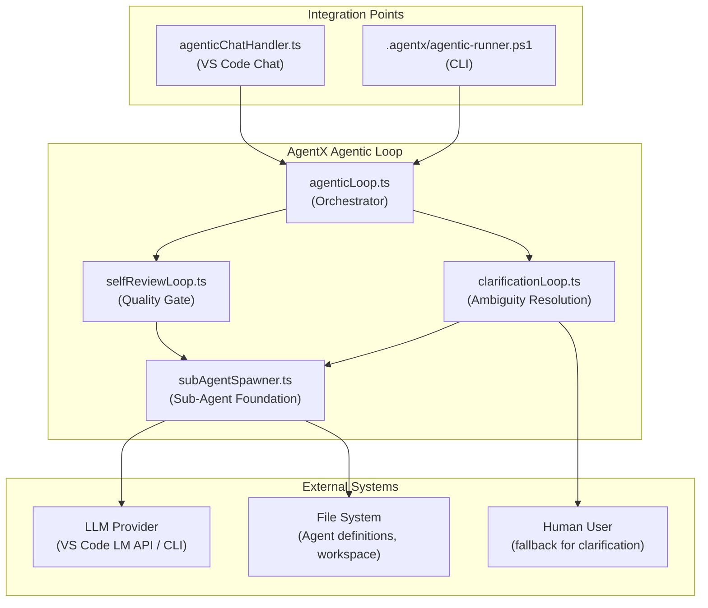

---

### 2. Component Architecture

#### 2.1 Layer Diagram

```mermaid
graph TD
    subgraph L1["Layer 1: Integration"]
        CCH["agenticChatHandler.ts"]
        CLI["agentic-runner.ps1"]
    end

    subgraph L2["Layer 2: Orchestration"]
        AL["agenticLoop.ts"]
    end

    subgraph L3["Layer 3: Quality Modules"]
        SRL["selfReviewLoop.ts"]
        CLL["clarificationLoop.ts"]
    end

    subgraph L4["Layer 4: Foundation"]
        SAS["subAgentSpawner.ts"]
    end

    L1 --> L2
    L2 --> L3
    L3 --> L4
```

**Layer 1 (Integration)**: Provides environment-specific wiring. VS Code Chat mode uses `buildChatLlmAdapterFactory()` and `buildChatAgentLoader()`. CLI mode uses `Invoke-SelfReviewLoop` and `Invoke-ClarificationLoop`.

**Layer 2 (Orchestration)**: The main agentic loop invokes quality modules at two integration points: the self-review gate (post-task) and the clarification handler (on ambiguity).

**Layer 3 (Quality Modules)**: Two independent modules -- `selfReviewLoop` for iterative review-fix cycles and `clarificationLoop` for iterative Q&A resolution. Both depend on Layer 4 but not on each other.

**Layer 4 (Foundation)**: `subAgentSpawner` provides the core capability of spawning constrained sub-agents. Used by both quality modules.

#### 2.2 Component Responsibilities

| Component | Responsibility | Key Types |
|-----------|---------------|------------|
| `subAgentSpawner.ts` | Spawn constrained sub-agents with role, tools, budget | `SubAgentConfig`, `SubAgentResult`, `LlmAdapterFactory`, `AgentLoader` |
| `selfReviewLoop.ts` | Orchestrate review-fix cycles until approval | `SelfReviewConfig`, `ReviewFinding`, `SelfReviewResult` |
| `clarificationLoop.ts` | Manage iterative Q&A with evaluation + fallback | `ClarificationLoopConfig`, `ClarificationLoopResult`, `ClarificationEvaluator` |
| `agenticLoop.ts` | Integrate quality gates into main loop | Self-review gate, clarification handler |
| `agenticChatHandler.ts` | Wire Chat-mode factories | `buildChatLlmAdapterFactory()`, `buildChatAgentLoader()` |
| `agentic-runner.ps1` | Wire CLI-mode functions | `Invoke-SelfReviewLoop`, `Invoke-ClarificationLoop` |

---

### 3. Data Flow: Self-Review

```mermaid
sequenceDiagram
    participant AL as agenticLoop
    participant SRL as selfReviewLoop
    participant SAS as subAgentSpawner
    participant LLM as LLM Provider

    Note over AL: Agent completes task
    AL->>SRL: runSelfReview(config)

    rect rgb(240, 248, 255)
    Note over SRL,LLM: Iteration 1
    SRL->>SAS: spawnSubAgent(reviewer)
    SAS->>LLM: System prompt + review request
    LLM-->>SAS: Response with ```review``` block
    SAS-->>SRL: SubAgentResult
    SRL->>SRL: parseReviewResponse()
    Note over SRL: 2 HIGH, 1 MEDIUM findings
    end

    rect rgb(255, 248, 240)
    Note over SRL,LLM: Iteration 2
    SRL->>SRL: Address HIGH + MEDIUM findings
    SRL->>SAS: spawnSubAgent(reviewer)
    SAS->>LLM: Review with prior findings context
    LLM-->>SAS: APPROVED: true
    SAS-->>SRL: SubAgentResult
    SRL->>SRL: parseReviewResponse()
    end

    SRL-->>AL: SelfReviewResult(approved=true, iterations=2)
```

**Key behaviors:**
- Only `high` and `medium` impact findings require addressing
- `low` findings are logged but do not block approval
- Reviewer sub-agent has read-only tools by default (`reviewerCanWrite: false`)
- Maximum 15 iterations prevents infinite review loops

---

### 4. Data Flow: Clarification

```mermaid
sequenceDiagram
    participant AL as agenticLoop
    participant CLL as clarificationLoop
    participant SAS as subAgentSpawner
    participant LLM as LLM Provider
    participant HF as Human Fallback

    Note over AL: Agent encounters ambiguity
    AL->>CLL: runClarificationLoop(config)

    rect rgb(240, 248, 255)
    Note over CLL,LLM: Iteration 1
    CLL->>SAS: spawnSubAgent(responder)
    SAS->>LLM: Question + context
    LLM-->>SAS: Answer
    SAS-->>CLL: SubAgentResult
    CLL->>CLL: evaluate(question, answer)
    Note over CLL: Not resolved
    end

    rect rgb(240, 255, 240)
    Note over CLL,LLM: Iteration 2
    CLL->>SAS: spawnSubAgent(responder)
    SAS->>LLM: Refined question + exchange history
    LLM-->>SAS: Detailed answer
    SAS-->>CLL: SubAgentResult
    CLL->>CLL: evaluate(question, answer)
    Note over CLL: Resolved!
    end

    CLL-->>AL: ClarificationLoopResult(resolved=true, iterations=2)

    Note over CLL,HF: If max iterations reached:
    CLL->>HF: onHumanFallback(question, history)
    HF-->>CLL: Human answer
    CLL-->>AL: ClarificationLoopResult(escalatedToHuman=true)
```

**Key behaviors:**
- Default `ClarificationEvaluator` uses heuristics; pluggable for LLM-based evaluation
- Exchange history is preserved across iterations for context accumulation
- Human fallback is invoked only when max iterations (default: 6) are exhausted
- `onHumanFallback` callback keeps the flow synchronous and testable

---

### 5. LLM Abstraction Pattern

The `LlmAdapterFactory` type enables the quality modules to work across both VS Code Chat and CLI modes:

```mermaid
graph LR
    subgraph Chat["VS Code Chat Mode"]
        VLM["vscode.lm.sendChatRequest()"] --> CLAF["buildChatLlmAdapterFactory()"]
    end

    subgraph CLI["CLI Mode"]
        PSH["Invoke-LlmCall"] --> PLAF["PowerShell LlmAdapterFactory"]
    end

    CLAF --> LAF["LlmAdapterFactory type"]
    PLAF --> LAF

    LAF --> SAS["subAgentSpawner"]
    SAS --> SRL["selfReviewLoop"]
    SAS --> CLL["clarificationLoop"]
```

The factory receives a `systemPrompt` and optional `toolRegistry`, and returns an object with a `send(userMessage) -> Promise<string>` method. This allows the quality modules to be completely agnostic about the LLM provider.

---

### 6. Agent Definition Loading

The `AgentLoader` interface abstracts how agent definitions (`.agent.md` files) are loaded:

```mermaid
graph TD
    AL["AgentLoader interface"] --> LD["loadDef(role)"]
    AL --> LI["loadInstructions(role)"]

    LD --> AD["AgentDefLike"]
    AD --> N["name"]
    AD --> D["description"]
    AD --> M["model"]
    AD --> MF["modelFallback[]"]

    LI --> RAW["Raw instruction text"]

    subgraph Sources
        AGT[".github/agents/*.agent.md"]
        MOCK["Test mock definitions"]
    end

    Sources --> AL
```

In VS Code Chat mode, `buildChatAgentLoader()` reads `.agent.md` files from the workspace. In tests, a mock loader returns canned definitions.

---

### 7. Tool Access Control

The sub-agent spawner implements tool access control via `createMinimalToolRegistry()`:

| Tool Category | Full Access | Read-Only (Reviewer) |
|--------------|------------|---------------------|
| `read_file` | Yes | Yes |
| `grep_search` | Yes | Yes |
| `semantic_search` | Yes | Yes |
| `file_search` | Yes | Yes |
| `list_dir` | Yes | Yes |
| `replace_string_in_file` | Yes | **No** |
| `create_file` | Yes | **No** |
| `run_in_terminal` | Yes | **No** |

When `reviewerCanWrite: false` (default for self-review), the reviewer sub-agent can inspect the codebase but cannot modify it. This enforces the separation between reviewing and fixing.

---

### 8. Configuration Defaults

| Parameter | Sub-Agent | Self-Review | Clarification |
|-----------|-----------|-------------|---------------|
| `maxIterations` | 5 | 15 | 6 |
| `tokenBudget` | 20,000 | 30,000 | 20,000 |
| `includeTools` | true | read-only | true |
| `canWrite` | configurable | false | configurable |

All defaults are overridable via the respective config interfaces. The CLI (`agentic-runner.ps1`) mirrors these defaults in PowerShell constants.

---

### 9. Relationship to Other Architecture Components

```mermaid
graph TD
    subgraph Existing["Existing Components"]
        TE["toolEngine.ts"]
        TLD["toolLoopDetection.ts"]
        SS["sessionState.ts"]
        MS["modelSelector.ts"]
        CC["contextCompactor.ts"]
    end

    subgraph New["Quality Framework (New)"]
        SAS["subAgentSpawner.ts"]
        SRL["selfReviewLoop.ts"]
        CLL["clarificationLoop.ts"]
    end

    subgraph Planned["Planned (Future)"]
        CR["clarificationRouter.ts"]
        CM["clarificationMonitor.ts"]
        FL["fileLock.ts"]
        OBS["observationStore.ts"]
    end

    SAS --> TE
    SAS --> MS
    SRL --> SAS
    CLL --> SAS

    CR -.-> CLL
    OBS -.-> SS

    style Planned fill:#f5f5f5,stroke:#ccc
```

**Integration with existing:**
- Uses `toolEngine.ts` for tool execution within sub-agents
- Uses `modelSelector.ts` for LLM model selection
- Uses `sessionState.ts` for session context
- Uses `contextCompactor.ts` when context needs trimming

**Relationship to planned:**
- The planned `clarificationRouter.ts` (from Architecture #1) could delegate in-session clarification to `clarificationLoop.ts`
- The planned `observationStore.ts` (from Architecture #2) could persist self-review findings as observations
- `fileLock.ts` is NOT needed by the quality framework (in-memory only)

---

### 10. File Map

| File | Layer | Status | Lines |
|------|-------|--------|-------|
| `vscode-extension/src/agentic/subAgentSpawner.ts` | Foundation | New | ~326 |
| `vscode-extension/src/agentic/selfReviewLoop.ts` | Quality | New | ~471 |
| `vscode-extension/src/agentic/clarificationLoop.ts` | Quality | New | ~451 |
| `vscode-extension/src/agentic/agenticLoop.ts` | Orchestration | Modified | ~811 |
| `vscode-extension/src/agentic/index.ts` | Exports | Modified | ~107 |
| `vscode-extension/src/chat/agenticChatHandler.ts` | Integration | Modified | ~694 |
| `.agentx/agentic-runner.ps1` | Integration (CLI) | Modified | ~1177 |
| `vscode-extension/src/test/agentic/subAgentSpawner.test.ts` | Test | New | - |
| `vscode-extension/src/test/agentic/selfReviewLoop.test.ts` | Test | New | - |
| `vscode-extension/src/test/agentic/clarificationLoop.test.ts` | Test | New | - |

---

### 11. Key Decisions Summary

| # | Decision | Rationale | See |
|---|----------|-----------|-----|
| 1 | In-memory only (no file-based ledgers) | No cross-process coordination needed | [ADR-30 sec 1](../adr/ADR-AgentX.md#decision-301-llm-abstraction-via-factory-type) |
| 2 | LlmAdapterFactory abstraction | Decouples from VS Code LM API; works for Chat + CLI | [ADR-30 sec 1](../adr/ADR-AgentX.md#decision-301-llm-abstraction-via-factory-type) |
| 3 | Read-only reviewer by default | Separates review from fix responsibility | [ADR-30 sec 2](../adr/ADR-AgentX.md#decision-302-read-only-reviewer-by-default) |
| 4 | Pluggable ClarificationEvaluator | Default heuristic + LLM-based option | [ADR-30 sec 3](../adr/ADR-AgentX.md#decision-303-pluggable-clarification-evaluator) |
| 5 | Human fallback as callback | Synchronous, testable, environment-agnostic | [ADR-30 sec 4](../adr/ADR-AgentX.md#decision-304-human-fallback-as-callback) |
| 6 | Structured findings with impact levels | Prevents infinite review loops | [ADR-30 sec 5](../adr/ADR-AgentX.md#decision-305-structured-review-findings) |

---

## Related Documents

- [PRD-AgentX.md](../prd/PRD-AgentX.md) - Product Requirements Document
- [ADR-AgentX.md](../adr/ADR-AgentX.md) - Architecture Decision Records
- [SPEC-AgentX.md](../specs/SPEC-AgentX.md) - Technical Specifications
- [AGENTS.md](../../AGENTS.md) - Workflow & orchestration rules

---

**Generated by AgentX Architect Agent**
**Last Updated**: 2026-03-05
**Version**: 1.1

