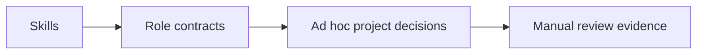
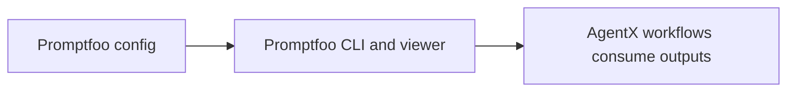
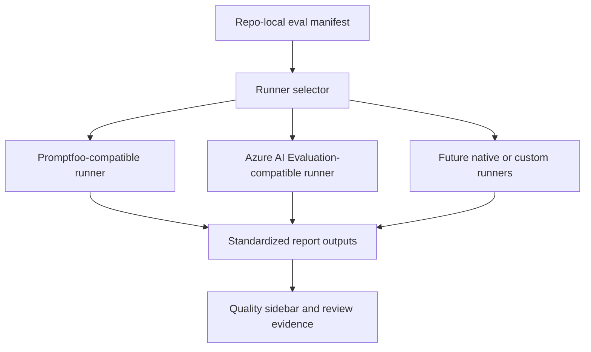
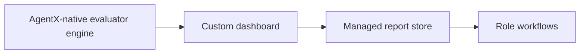
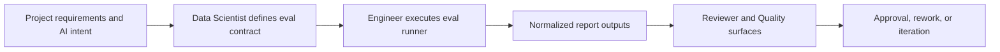

# ADR-235: Add A First-Class AI Evaluation Contract For Promptfoo-Inspired AgentX Workflows

**Status**: Accepted
**Date**: 2026-03-20
**Author**: AgentX Auto
**Epic**: N/A
**Issue**: #235
**PRD**: N/A - direct architecture initiative
**UX**: N/A - no dedicated UX artifact required for this architecture slice

---

## Table of Contents

1. [Context](#context)
2. [Decision](#decision)
3. [Options Considered](#options-considered)
4. [Rationale](#rationale)
5. [Consequences](#consequences)
6. [Implementation](#implementation)
7. [References](#references)
8. [Review History](#review-history)
9. [AI/ML Architecture](#aiml-architecture-if-applicable)

---

## Context

AgentX already treats AI quality as important, but the current shape is fragmented. Repo-local evidence shows the following:

**Requirements:**
- Add a durable AI evaluation architecture for `needs:ai` work that fits AgentX's role-driven workflow
- Preserve AgentX as an orchestration and evidence host rather than turning it into a separate standalone evaluation product
- Support evaluation dimensions already expected by AgentX roles: correctness, groundedness, relevance, safety, latency, cost, tool-use quality, and regression gating
- Make evaluation outputs consumable by Data Scientist, Engineer, Reviewer, and extension Quality surfaces
- Keep room for promptfoo-style local red-team and CI workflows plus Azure-native evaluation back ends where appropriate

**Constraints:**
- Current evaluation behavior is split across skills, role contracts, and limited extension surfaces rather than a single execution contract
- The extension's current harness evaluator scores workflow and evidence maturity, not AI response quality
- Existing Engineer and Data Scientist contracts already define ownership boundaries that should not be blurred
- The architecture must avoid overstating current runtime capabilities; most of this design is target-state work

**Background:**
- Internal repo evidence:
  - `.github/skills/ai-systems/ai-evaluation/SKILL.md` defines multi-dimensional evaluation, LLM-as-judge, RAG evaluation, red teaming, A/B comparison, and blocking quality gates. Confidence: HIGH.
  - `.github/agents/data-scientist.agent.md` requires evaluation plans, judge rubrics, benchmark datasets, thresholds, and baseline/model-card artifacts before AI handoff. Confidence: HIGH.
  - `.github/agents/engineer.agent.md` requires `ai-agent-development` during AI implementation and `ai-evaluation` during AI testing, including baseline and threshold handling. Confidence: HIGH.
  - `.github/agents/internal/eval-specialist.agent.md` already describes hidden evaluation artifacts and quality-gate responsibilities for Data Scientist and Reviewer. Confidence: HIGH.
  - `vscode-extension/src/eval/harnessEvaluator.ts` and internals confirm the existing Quality sidebar is deterministic and workflow-oriented, not an AI benchmark runner. Confidence: HIGH.
- External research:
  - Promptfoo presents a developer-first evaluation product with declarative configs, local execution, red teaming, model comparison, CI/CD integration, code scanning, and shareable result views. Source: `https://github.com/promptfoo/promptfoo`. Confidence: HIGH.
  - Azure AI Evaluation SDK provides built-in quality, RAG, safety, and agentic evaluators with JSONL datasets, target-based evaluation, judge-model support, and optional result logging to Foundry. Source: `https://learn.microsoft.com/en-us/azure/ai-foundry/how-to/develop/evaluate-sdk`. Confidence: HIGH.

**Failure modes researched:**
- Relying only on current AgentX docs and role text leaves evaluation execution fragmented and hard to enforce across projects. Confidence: HIGH.
- Adopting promptfoo wholesale as AgentX's identity would collapse the distinction between workflow orchestration and evaluation infrastructure, producing overlap and product drift. Confidence: HIGH.
- Building a full native evaluation platform immediately would create large UI/runtime scope before the contract between Data Scientist, Engineer, and Reviewer is stabilized. Confidence: MEDIUM.
- Treating Azure AI Evaluation as the only back end would limit non-Azure and local-first workflows that promptfoo handles well. Confidence: MEDIUM.

**Security and long-term viability assessment:**
- Confidence: HIGH - evaluation contracts need explicit dataset, rubric, and threshold definitions so review decisions do not rely on ad hoc narrative claims.
- Confidence: HIGH - promptfoo-like red-team and CI gates are strategically valuable, but they should be integrated as pluggable runners or adapters under AgentX ownership rather than replacing role contracts.
- Confidence: MEDIUM - cloud-backed evaluators and local runner tooling should coexist; forcing a single evaluator provider would reduce flexibility and future-proofing.

---

## Decision

We will add a first-class repo-local AI evaluation contract to AgentX for `needs:ai` work, with pluggable execution runners inspired by promptfoo's packaging and Azure AI Evaluation's evaluator model.

**Key architectural choices:**
- Introduce a repo-local evaluation contract centered on versioned manifests, datasets, rubrics, thresholds, baselines, and report outputs
- Keep role ownership explicit:
  - Data Scientist defines evaluation strategy, rubric design, model comparisons, and red-team plans
  - Engineer wires the evaluation contract into implementation, regression, CI, and quality loops
  - Reviewer consumes evaluation evidence as part of approval or change-request decisions
- Keep AgentX as the workflow and evidence host; it coordinates evaluation rather than becoming a standalone eval product
- Support multiple execution back ends through runner abstraction, with promptfoo-compatible and Azure AI Evaluation-compatible paths as the initial strategic targets
- Extend current Quality surfaces to display AI evaluation evidence beside existing harness maturity scoring instead of replacing current harness checks

---

## Options Considered

### Option 1: Keep The Current Fragmented Evaluation Guidance

**Description:**
Continue using current skills, role text, and hidden specialist guidance without adding a first-class repo-local evaluation contract.

**Pros:**
- Lowest implementation cost
- Preserves current documentation and extension behavior
- Avoids new manifest or report structures

**Cons:**
- Evaluation execution remains inconsistent across AI projects
- Review evidence stays difficult to compare or automate
- Promptfoo-like strengths such as declarative evals, red teaming, and CI visibility remain largely absent
- Current fragmentation makes ownership boundaries harder to enforce in practice

**Effort**: S
**Risk**: High
**Confidence**: LOW

---

### Option 2: Adopt Promptfoo Directly As AgentX's Primary Evaluation Runtime

**Description:**
Make promptfoo the primary evaluation runtime and contract for AgentX AI projects.

**Pros:**
- Fastest path to declarative evals, red teaming, model comparison, and CI integration
- Leverages a mature open-source tool with active ecosystem signals
- Keeps many evaluations local and developer-friendly

**Cons:**
- AgentX would inherit another product's contract rather than defining its own role-aware contract
- Promptfoo does not map cleanly onto all AgentX role boundaries, extension surfaces, or Azure-native workflows
- Risks reducing AgentX to an orchestration shell around promptfoo rather than a coherent workflow system
- Makes Azure-native evaluation and other future runners second-class unless extra adaptation is added later

**Effort**: M
**Risk**: Medium
**Confidence**: MEDIUM

---

### Option 3: Create An AgentX-Native Evaluation Contract With Pluggable Runners

**Description:**
Define AgentX-owned manifests, datasets, rubrics, thresholds, baselines, and report formats, while allowing execution through promptfoo-style, Azure-native, or future runners.

**Pros:**
- Preserves AgentX ownership of workflow, evidence, and role contracts
- Lets AgentX borrow promptfoo's best ideas without becoming promptfoo
- Supports local-first and Azure-native evaluation paths under one repo contract
- Makes evaluation evidence display and review consistent across projects
- Scales to more runners without rewriting role semantics

**Cons:**
- Requires new manifest, report, and runner-selection design work
- Needs deliberate rollout to avoid overpromising before implementation exists
- Slightly higher upfront design complexity than direct promptfoo adoption

**Effort**: M
**Risk**: Low
**Confidence**: HIGH

---

### Option 4: Build A Full AgentX Evaluation Platform Before Stabilizing The Contract

**Description:**
Create a comprehensive AgentX-native evaluation engine, dashboard, and report system immediately, without first centering the design on a lightweight repo-local contract.

**Pros:**
- Maximum control over UX and runtime behavior
- Could eventually provide a highly integrated AgentX evaluation experience
- Avoids dependency on external evaluator tooling for the long term

**Cons:**
- Highest delivery scope and architectural risk
- Duplicates features promptfoo and Azure AI Evaluation already prove out
- Delays value while runtime/UI/platform work expands
- Risks building the wrong product before role ownership and evidence flow are stabilized

**Effort**: XL
**Risk**: High
**Confidence**: LOW

---

## Rationale

We chose **Option 3** because it best fits AgentX's product identity and the user's role-aware objective.

### Evaluation Matrix

| Criteria | Option 1: Fragmented Guidance | Option 2: Promptfoo Primary | Option 3: AgentX Contract + Runners | Option 4: Full Native Platform |
|---------|-------------------------------|-----------------------------|-------------------------------------|--------------------------------|
| Preserves AgentX orchestration identity | Good | Poor | Excellent | Excellent |
| Reuses proven eval product ideas | Poor | Excellent | Excellent | Medium |
| Fits Data Scientist and Engineer role boundaries | Medium | Medium | Excellent | Good |
| Supports Azure-native and local-first workflows | Poor | Medium | Excellent | Good |
| Time to first useful implementation | Excellent | Good | Good | Poor |
| Long-term extensibility | Poor | Medium | Excellent | Good |
| Risk of product drift | Medium | High | Low | Medium |

1. **AgentX needs a stable contract more than it needs a single tool**: The user asked for the best ideas to be incorporated into Data Scientist and Engineer workflows. That requires AgentX-owned role and evidence semantics, not blind adoption of another product's configuration format. Confidence: HIGH.
2. **Promptfoo is strongest as a pattern source, not as a replacement identity**: Its declarative evals, red-team support, CI integration, and shareable results are worth emulating, but AgentX still needs to decide who designs, executes, reviews, and approves AI quality. Confidence: HIGH.
3. **Azure AI Evaluation proves the value of evaluator families and dataset contracts**: Built-in quality, safety, RAG, and agentic evaluator categories support the case for an AgentX runner model instead of a single hard-coded provider. Confidence: HIGH.
4. **Current AgentX surfaces are already split between workflow quality and AI quality**: The existing harness evaluator should remain focused on workflow maturity while the new AI evaluation contract provides response-quality evidence. Joining them at the evidence layer is cleaner than replacing one with the other. Confidence: HIGH.

**Key decision factors:**
- Preserve AgentX's workflow-first architecture
- Make Data Scientist and Engineer ownership actionable rather than implied
- Support local-first, CI-driven, and Azure-native evaluation paths
- Avoid major platform buildout until the contract and evidence flow are proven

---

## Consequences

### Positive
- AI projects get one explicit contract for datasets, rubrics, thresholds, baselines, and reports
- Data Scientist and Engineer responsibilities become easier to enforce and review
- Promptfoo-like red-team and CI patterns can be adopted without collapsing AgentX into another product
- Reviewer and Quality surfaces can consume structured evidence instead of ad hoc prose
- Future evaluator back ends remain possible without reworking role contracts

### Negative
- AgentX needs new manifest, report, and runner coordination design before implementation can begin
- Extension and CLI surfaces must be expanded to understand AI evaluation artifacts
- There is short-term documentation/runtime asymmetry until implementation catches up

### Neutral
- Existing AI guidance remains valid but will become part of a more explicit contract
- Some projects may choose promptfoo-oriented execution while others choose Azure-native evaluators, but their outputs should normalize into one AgentX report format

---

## Implementation

**Detailed technical specification**: [SPEC-235.md](../specs/SPEC-235.md)

**High-level implementation plan:**
1. Define repo-local evaluation manifests, datasets, baseline, and report artifacts
2. Define runner abstraction and initial promptfoo-compatible and Azure-compatible integration paths
3. Extend Engineer, Reviewer, and Quality surfaces to consume standardized AI evaluation evidence

**Key milestones:**
- Phase 1: Artifact contract and role handoff rules
- Phase 2: Runner execution and report normalization
- Phase 3: Quality sidebar, reviewer evidence, and CI gating integration

---

## References

- Internal: `.github/skills/ai-systems/ai-evaluation/SKILL.md`
- Internal: `.github/agents/data-scientist.agent.md`
- Internal: `.github/agents/engineer.agent.md`
- Internal: `.github/agents/internal/eval-specialist.agent.md`
- Internal: `vscode-extension/src/eval/harnessEvaluator.ts`
- External: `https://github.com/promptfoo/promptfoo`
- External: `https://learn.microsoft.com/en-us/azure/ai-foundry/how-to/develop/evaluate-sdk`

---

## Review History

| Date | Reviewer | Outcome | Notes |
|------|----------|---------|-------|
| 2026-03-20 | AgentX Auto | Accepted | Initial architecture decision for issue #235 |

---

## AI/ML Architecture (if applicable)

### Model Selection Decision

| Model / Evaluator Family | Provider | Context | Role In Architecture | Selected? |
|--------------------------|----------|---------|----------------------|-----------|
| Promptfoo-compatible evaluators | promptfoo ecosystem | Local/CI prompt, agent, and RAG evals plus red teaming | Runner option for local-first and CI-heavy projects | [PASS] |
| Azure AI Evaluation SDK evaluators | Azure AI / Foundry | Managed quality, safety, RAG, and agentic evaluators | Runner option for Azure-native projects | [PASS] |
| AgentX deterministic harness evaluator | AgentX extension | Workflow maturity and artifact evidence | Complementary evidence layer, not response-quality evaluator | [PASS] |
| Single hard-coded evaluator provider only | Any one provider | Narrow scope | Rejected because it reduces portability and future extensibility | [FAIL] |

### Agent Architecture Pattern

- [ ] Single Agent
- [ ] Multi-Agent Orchestration
- [ ] Human-in-the-Loop
- [ ] Reflection / Self-Correction
- [ ] RAG Pipeline
- [ ] MCP Server
- [ ] MCP App
- [x] Hybrid

The selected pattern is hybrid: deterministic AgentX workflow orchestration combined with pluggable AI evaluation runners and normalized evidence outputs.

### Inference Pipeline

The pipeline separates design ownership from execution ownership while keeping review evidence explicit.

### Evaluation Strategy

| Metric | Evaluator | Threshold | How Measured |
|--------|-----------|-----------|--------------|
| Correctness / task success | Judge rubric plus known-answer checks | Blocking threshold defined per project | Standardized report summary and row-level evidence |
| Groundedness / retrieval quality | RAG evaluators or promptfoo-style checks | Blocking for grounded AI workflows | Dataset-backed aggregate and failure examples |
| Safety / red team | Safety evaluators and adversarial suites | Blocking for critical harms | Scenario library plus pass/fail counts |
| Tool-use quality | Agentic evaluators or tool-call accuracy checks | Blocking for agentic workflows | Task-level report sections |
| Latency and cost | Runner execution metadata | Warning or blocking per project | Run summary metadata and baseline deltas |

### AI-Specific Risks

| Risk | Impact | Mitigation |
|------|--------|------------|
| Overfitting the contract to one tool | High | Keep runner abstraction and AgentX-owned manifest/report schema |
| Weak or biased judge rubrics | High | Data Scientist owns rubric design, calibration, and baseline updates |
| Reviewers lacking structured evidence | High | Standardize report outputs and Quality surface summaries |
| Product drift into full eval platform scope | Medium | Phase rollout through contract-first design, not dashboard-first build |
