# ADR: AgentX Architecture Decision Records

> **SUPERSEDED (v8.0.0)**: These ADRs document decisions made for the v7.x TypeScript runtime.
> All three decisions (Clarification Protocol, Memory Pipeline, Agentic Loop) were
> **superseded by the declarative migration** (v8.0.0), which replaced TypeScript
> implementations with agent body text instructions, `memory.instructions.md`, and
> Copilot's native agentic loop. See [AGENTS.md](../../../AGENTS.md) for current architecture.
> Treat the remainder of this file as archival decision history, not the current runtime contract.

**Status**: Accepted -> Superseded
**Author**: Solution Architect Agent
**Last Updated**: 2026-03-06

---

## Table of Contents

1. [ADR-1: Agent-to-Agent Clarification Protocol](#adr-1-agent-to-agent-clarification-protocol)
2. [ADR-29: Persistent Agent Memory Pipeline](#adr-29-persistent-agent-memory-pipeline)
3. [ADR-30: Agentic Loop Quality Framework](#adr-30-agentic-loop-quality-framework)

---

## ADR-1: Agent-to-Agent Clarification Protocol

> Status: Accepted | Date: 2026-02-26 | Epic: #1 | PRD: [PRD-AgentX.md](../prd/PRD-AgentX.md)

### Context

AgentX uses a strictly unidirectional handoff pipeline (PM -> UX/Architect -> Engineer -> Reviewer). When a downstream agent encounters ambiguity in an upstream artifact -- an unclear requirement, a questionable design decision, or a missing constraint -- it has no mechanism to seek clarification. The agent either guesses (producing incorrect output) or builds on assumptions that compound into incorrect implementations discovered late in review.

**Requirements (from PRD-9):**
- Agents must be able to request clarification from specific upstream agents
- All communication must route through Agent X (hub-and-spoke preserved)
- Maximum 5 blocking rounds, 6 non-blocking rounds before auto-escalation
- Clarification conversations must be visible inline in Copilot Chat and CLI
- Must work identically in Local Mode (JSON files) and GitHub Mode
- Multiple agents or CLI sessions writing simultaneously must not corrupt state
- Stale, stuck, and deadlocked clarifications must be detected automatically
- No background daemons -- monitoring must be event-driven

**Constraints:**
- File-based only (JSON) -- no database, no external services
- PowerShell 7+ for CLI, TypeScript for VS Code extension
- ASCII-only source files per repository rules
- No UI buttons or panels -- conversation stream is the only interface
- Must integrate with existing TOML workflow definitions, EventBus, and AgenticLoop

**Background:**
The existing codebase has no file locking on JSON state writes (`Read-JsonFile`/`Write-JsonFile` are raw read/write). The TOML parser is a simple line-by-line regex parser that needs extension for new fields. The EventBus supports 11 typed events that tree views and chat subscribe to. The AgenticLoop orchestrates LLM-tool cycles and can be extended via `AgenticLoopConfig`.

### Decision

We will implement a **Hub-Routed Clarification Protocol** with file-level locking, per-issue clarification ledgers, and conversation-as-interface rendering.

**Key architectural choices:**

1. **Hub-routed, not direct**: All clarification requests go through Agent X, which validates scope, routes via `runSubagent`, and manages state. Agents never communicate directly.
2. **File-level locking with `.lock` files**: Atomic lock acquisition using `O_CREAT | O_EXCL` semantics, stale lock cleanup at 30 seconds, exponential backoff retry.
3. **Per-issue clarification ledger**: One JSON file per issue at `.agentx/state/clarifications/issue-{n}.json` -- avoids single-file bottleneck.
4. **Event-driven monitoring**: No daemon or cron. Monitor logic runs as side-effect of `hook start`, `hook finish`, `ready`, and `clarify` commands.
5. **Conversation-as-interface**: Clarification rounds stream inline in Copilot Chat (`response.markdown()`) and print as terminal output in CLI. No buttons, panels, or separate views.
6. **TOML-declared scope**: `can_clarify`, `clarify_max_rounds`, `clarify_sla_minutes`, `clarify_blocking_allowed` fields on workflow steps control what each agent can do.
7. **In-process AsyncMutex**: TypeScript extension uses an in-process mutex in addition to file locks, since multiple async operations can run in the same Node.js process.

### Options Considered

#### Option 1: Hub-Routed Clarification Protocol (Selected)

**Description:**
Agent X mediates all clarification requests. Requesting agent creates a ClarificationRequest; Agent X validates scope against TOML `can_clarify` list, invokes target agent via `runSubagent`, writes answer to per-issue ledger file, and returns the answer to the requesting agent. File-level `.lock` files prevent concurrent corruption.

**Pros:**
- Preserves hub-and-spoke architecture -- no agent-to-agent coupling
- Per-issue files eliminate single-file bottleneck under concurrent load
- File locking is simple, proven, and works across processes (VS Code + CLI)
- TOML-declared scope makes behavior configurable per workflow without code changes
- Audit trail naturally captured in ledger JSON

**Cons:**
- File locking adds complexity (stale detection, retry logic) in two languages
- Extra round-trip latency per clarification (routing through Agent X)
- Each clarification round costs one additional LLM call

**Effort**: L
**Risk**: Low

#### Option 2: Shared Scratchpad (Agent Writes, Agent Reads)

**Description:**
Agents write questions to a shared Markdown file (`docs/clarifications/CLR-{issue}.md`). Upstream agents check the file at session start and append answers. No real-time routing.

**Pros:**
- Extremely simple -- no routing logic, no locking needed for append
- Human-readable Markdown audit trail
- No changes to AgenticLoop or EventBus

**Cons:**
- No real-time response -- agents must be re-invoked to check for answers
- No guarantee the upstream agent will ever run again to see the question
- No escalation path -- questions can sit unanswered indefinitely
- Breaks the automated pipeline (requires manual re-triggering)

**Effort**: S
**Risk**: High

#### Option 3: Discussion Thread with Direct Agent Communication

**Description:**
Agents communicate directly via a shared message queue (in-memory or file-based). Either agent can initiate a conversation at any time, with a mediator thread tracking state.

**Pros:**
- Most flexible -- any agent can talk to any other agent
- Enables multi-party discussions

**Cons:**
- Breaks hub-and-spoke architecture fundamentally
- Complex state management (who's talking to whom, ordering, conflicts)
- Scope creep risk -- agents debating endlessly without resolution
- Harder to enforce round limits and escalation

**Effort**: XL
**Risk**: High

### Rationale

We chose **Option 1 (Hub-Routed Clarification Protocol)** because:

1. **Architecture preservation**: The hub-and-spoke pattern is foundational to AgentX. Agent X already handles routing, status tracking, and validation. Adding clarification as another routing capability is natural and low-risk, whereas direct communication (Option 3) would require fundamental redesign.

2. **Deterministic behavior**: Hub routing with TOML-declared scope (`can_clarify`) makes clarification behavior predictable and auditable. Every clarification request is validated, logged, and bounded by round limits. Option 2's passive polling has no guarantees.

3. **File locking is proven**: OS-level atomic file creation (`O_CREAT | O_EXCL`) is a well-understood concurrency primitive. The 30-second stale threshold handles crashed processes. Per-issue files keep the lock contention window narrow (two agents rarely work on the same issue simultaneously).

4. **No infrastructure**: File-based locking and JSON ledgers work in Local Mode with zero dependencies. No database, no message queue, no external service. This matches the AgentX philosophy of local-first operation.

**Key decision factors:**
- Hub-and-spoke must not be broken (eliminates Option 3)
- Must work in automated pipeline (eliminates Option 2)
- Must work in Local Mode without external services (favors file-based approach)
- Must support concurrent access from multiple VS Code windows + CLI (requires locking)

### Consequences

#### Positive
- Agents can resolve ambiguity before producing incorrect output, reducing rework
- All clarification conversations are automatically logged as audit trails
- Escalation is automatic -- humans only intervene for genuine deadlocks
- Works identically in Local Mode and GitHub Mode
- Extension points (EventBus events, LoopConfig callbacks) enable future UI enhancements

#### Negative
- File locking adds implementation complexity in both PowerShell and TypeScript
- Each clarification round adds latency (LLM call + file I/O + routing)
- TOML parser needs extension to handle new array and boolean fields
- More LLM token consumption per issue (bounded by round limits: max 5-6 additional calls)

#### Neutral
- New dependency on `.lock` files (listed in `.gitignore`, auto-cleaned)
- New agent statuses (`clarifying`, `blocked-clarification`) require sidebar view updates
- Clarification ledger files grow linearly per issue (bounded by round limits, self-cleaning)

### Implementation

**Detailed technical specification**: [SPEC-AgentX.md](../specs/SPEC-AgentX.md)

**High-level implementation plan:**

1. **Phase 1 (Foundation)**: File locking (PowerShell `Lock-JsonFile`/`Unlock-JsonFile` + TypeScript `JsonFileLock`), clarification ledger schema, agent status extensions
2. **Phase 2 (Core Protocol)**: Agent X routing logic, `runSubagent` invocation for target agent, chat/CLI streaming, round limits + escalation, TOML field parsing
3. **Phase 3 (Monitoring + Extension)**: Stale/stuck/deadlock detection, EventBus events, AgenticLoop integration, sidebar view updates
4. **Phase 4 (Polish)**: Weekly digest stats, GitHub issue sync, `/clarify` slash command

**Key milestones:**
- Phase 1 (Week 1-2): File locking tested with concurrent access; ledger schema validated
- Phase 2 (Week 3-4): End-to-end clarification working in both Local and GitHub modes
- Phase 3 (Week 5-6): Monitoring catches stale/stuck; extension integration complete
- Phase 4 (Week 7): Analytics and GitHub sync; all P0/P1 stories complete

### Critical Architecture Decisions

#### Decision 1: File Locking Strategy

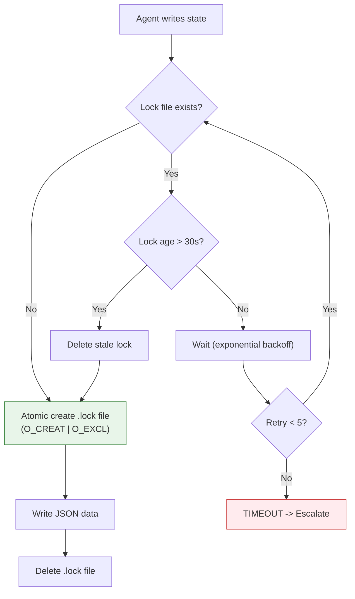

**Why file-level locking over alternatives:**

| Alternative | Why Not |
|---|---|
| Database locking | Requires external dependency; violates local-first |
| Named mutexes (OS) | Not cross-platform PowerShell + Node.js |
| Advisory file locking (`flock`) | Not available on Windows PowerShell |
| Single global lock file | Contention bottleneck; per-issue is better |

**Lock file format:**
```
.agentx/state/clarifications/issue-42.json      <-- data
.agentx/state/clarifications/issue-42.json.lock  <-- lock
```

Lock file content includes PID, timestamp, and agent name for diagnostics:
```json
{ "pid": 12345, "timestamp": "2026-02-26T10:00:00.123Z", "agent": "engineer" }
```

#### Decision 2: Clarification Routing Flow

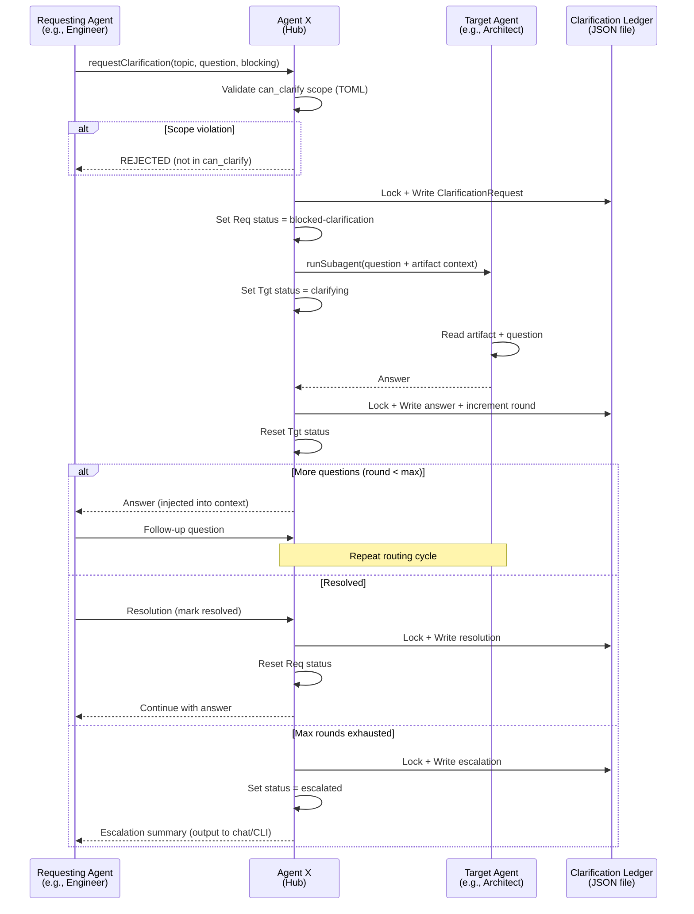

#### Decision 3: Monitoring Architecture (Event-Driven, No Daemon)

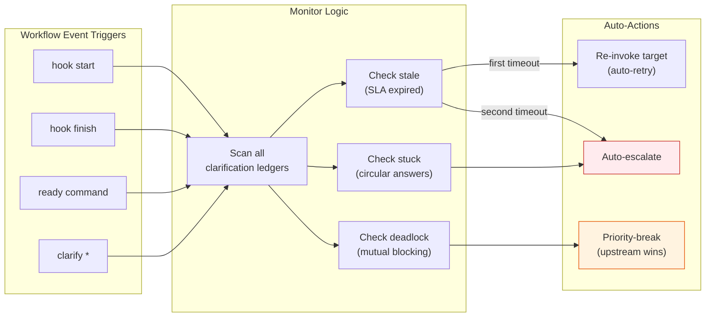

**Why no daemon:**
- Local Mode must work without background services
- CLI hooks (`hook start`/`hook finish`) already run at every workflow boundary
- Extension `TaskScheduler` can optionally add periodic checks for enhanced monitoring
- Avoids process management complexity (orphans, startup, shutdown)

#### Decision 4: Agent Status State Machine

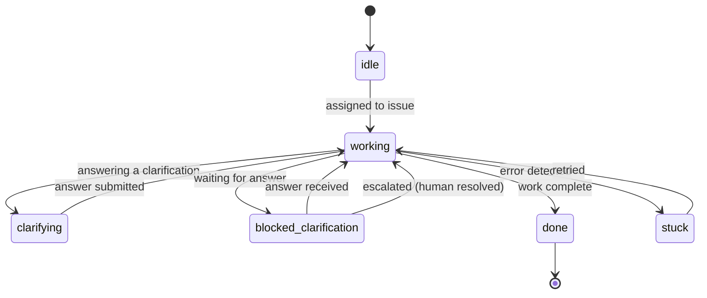

**Two new statuses:**
- `clarifying`: Agent is composing an answer to a clarification request
- `blocked-clarification`: Agent is waiting for an answer (cannot proceed)

These are distinct from `working` and `stuck` because they indicate a specific, recoverable state related to the clarification protocol. The sidebar tree and CLI output display different icons/labels for these states.

#### Decision 5: Conversation-as-Interface

```mermaid
graph TD
    subgraph Chat["Copilot Chat (response.markdown)"]
        direction TB
        C1["[Engineer] Implementing..."]
        C2["[Engineer -> Architect] Clarification needed:<br/>question text"]
        C3["[Routing to Architect automatically...]"]
        C4["[Architect] answer text"]
        C5["[Engineer] Clarification resolved. Continuing..."]
    end

    subgraph CLI["Terminal (agentx clarify --issue N)"]
        direction TB
        T1["[Round 1] engineer -> architect (timestamp)"]
        T2["  Q: question text"]
        T3["[Round 1] architect -> engineer (timestamp)"]
        T4["  A: answer text"]
        T5["[RESOLVED] engineer (timestamp)"]
    end

    style Chat fill:#E3F2FD,stroke:#1565C0
    style CLI fill:#E8F5E9,stroke:#2E7D32
```

**Why no buttons/panels:**
- Clarification is a transient conversation, not persistent UI state
- Buttons create click fatigue and break the flow of watching agents work
- Escalation is automatic (max rounds) -- no human button needed
- The same rendering works across all channels (chat, CLI, GitHub comments)

#### Decision 6: Extension Integration Points

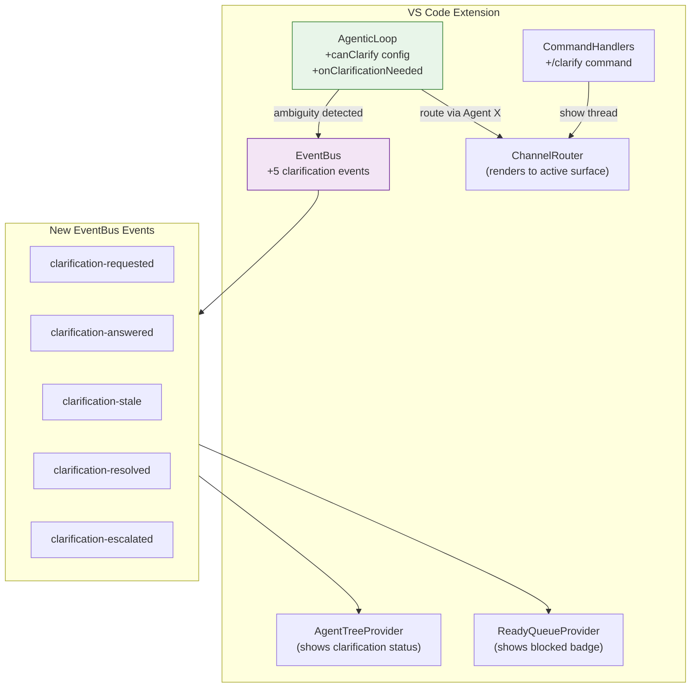

**LoopConfig extension:**
```
AgenticLoopConfig (existing)
  + canClarify: string[]        // agents this loop can clarify with
  + clarifyMaxRounds: number    // max rounds (default 5)
  + onClarificationNeeded:      // callback when ambiguity detected
      (topic, question) => Promise<ClarificationResult>
```

When the LLM signals ambiguity (e.g., via a `requestClarification` tool call), the loop pauses, invokes the callback, streams the round to `response.markdown()`, and resumes with the answer injected into context.

### References

#### Internal
- [PRD-AgentX: Agent-to-Agent Clarification Protocol](../prd/PRD-AgentX.md)
- [Agent Delegation Protocol](../../../.github/agent-delegation.md)
- Feature Workflow TOML in `.agentx/workflows/` (archival runtime reference)
- Event bus, agentic loop, and channel routing internals from the removed v7.x TypeScript runtime
- Command handler integration from the removed v7.x TypeScript runtime
- [AgentX CLI](../../../.agentx/agentx-cli.ps1)

#### External
- File locking with `O_CREAT | O_EXCL`: POSIX standard atomic file creation
- Node.js `fs.open` with `wx` flag: equivalent to `O_CREAT | O_EXCL`
- PowerShell `[System.IO.File]::Open` with `FileMode.CreateNew`: equivalent semantics

### Review History

| Date | Reviewer | Status | Notes |
|------|----------|--------|-------|
| 2026-02-26 | Solution Architect Agent | Accepted | Initial architecture |

---

## ADR-29: Persistent Agent Memory Pipeline

> Status: Accepted | Date: 2026-02-27 | Epic: #29 | PRD: [PRD-AgentX.md](../prd/PRD-AgentX.md)

### Context

AgentX's `ContextCompactor` provides in-session token budget tracking and regex-based conversation summarization. However, all agent knowledge is lost at session boundaries. When a new session starts, agents re-read files, re-parse history, and re-discover patterns they already identified -- wasting 30-60% of the context window on redundant priming. There is no persistent observation store, no layered retrieval, no automatic session-start injection, and no searchable history across sessions.

**Requirements (from PRD-29):**
- Automatically capture agent observations (decisions, code changes, errors, key facts) at session end
- Persist observations in a local, file-based store at `.agentx/memory/`
- Inject relevant past observations at session start within a configurable token budget
- Provide full-text search over all observations (<200ms for 10K records)
- Support progressive disclosure: compact index first, full detail on demand
- Wire capture/injection into existing lifecycle hooks (no manual steps)
- Extend context budget report to include recalled memory
- Support relevance scoring and periodic compaction (Phase 3)

**Constraints:**
- Local file storage only -- no external database server, no cloud
- No additional runtime dependencies beyond Node.js (prefer built-in `fs` + JSON)
- Must integrate with existing `ContextCompactor`, `AgentEventBus`, `SessionManager`, and `FileLockManager`
- Must work in both `github` and `local` modes
- Store format must be human-readable (no opaque binary blobs)
- ASCII-only in all source files per repository rules

**Background:**
The existing codebase provides several building blocks:
- `ContextCompactor` (contextCompactor.ts): Budget tracking, `compactConversation()` regex extraction, `trackItem()` with `memory` category already defined
- `AgentEventBus` (eventBus.ts): Typed event system with 16 events, `context-compacted` event already emits compaction summaries
- `SessionManager` + `FileSessionStorage` (sessionState.ts): Persists full session conversations to `.agentx/sessions/` as JSON; `AgenticLoop` calls `save()` at exit
- `FileLockManager` (fileLock.ts): Combined AsyncMutex + JsonFileLock for concurrent-safe JSON file writes
- Lifecycle hooks: `.agentx/agentx.ps1 hook -Phase start|finish` runs at every workflow boundary

The gap is a storage + retrieval layer that bridges session boundaries.

### Decision

We will implement a **Per-Issue JSON Observation Store with In-Memory Inverted Index** that integrates into the existing session lifecycle via EventBus subscriptions and lifecycle hook extensions.

**Key architectural choices:**

1. **Per-issue JSON files**: Observations stored in `.agentx/memory/issue-{n}.json` -- one file per issue. Matches the per-issue pattern from clarification ledgers (ADR-1), keeps files small, and allows partial loading.
2. **Global manifest for fast search**: A manifest file `.agentx/memory/manifest.json` contains a compact index (ID, agent, issue, category, timestamp, summary) for all observations. Enables <200ms search without loading all issue files.
3. **EventBus-driven capture**: Subscribe to `context-compacted` events to capture observations automatically when `compactConversation()` runs at session end. No hook script modifications needed for v1.
4. **ContextCompactor integration for injection**: Recalled observations are tracked as `memory` category items in `ContextCompactor`, enforcing a configurable memory token budget (default 10% of context limit = 20,000 tokens).
5. **FileLockManager for concurrent safety**: All writes to observation files and the manifest go through the existing `FileLockManager` -- dual-guard (AsyncMutex + JsonFileLock) ensures safety across VS Code windows and CLI sessions.
6. **Regex extraction reuse**: Leverage `ContextCompactor.compactConversation()` existing regex extractors (decisions, file changes, errors, key facts) as the observation producer. No new extraction logic needed for v1.

### Options Considered

#### Option 1: Per-Issue JSON + In-Memory Manifest (Selected)

**Description:**
One JSON file per issue at `.agentx/memory/issue-{n}.json` containing an array of observations. A global manifest file at `.agentx/memory/manifest.json` holds a compact index entry (~50 tokens) per observation for fast search. The manifest is loaded into memory on first access and kept in sync on writes.

**Pros:**
- Matches the per-issue file pattern established in ADR-1 (clarification ledgers)
- Small files: typically 10-50 observations per issue, ~2-10KB each
- Partial loading: only load relevant issue(s) for injection
- Manifest enables fast FTS without loading all files
- Human-readable JSON, inspectable with any text editor
- Zero external dependencies (Node.js `fs` + JSON.parse)
- FileLockManager already tested for this exact pattern

**Cons:**
- Manifest must stay in sync with issue files (dual-write)
- Full-text search is in-memory (loads manifest ~500KB for 10K records)
- No built-in FTS ranking (must implement simple TF/keyword scoring)

**Effort**: M
**Risk**: Low

#### Option 2: Single Append-Only JSON File

**Description:**
All observations in one file `.agentx/memory/observations.json` -- an ever-growing JSON array. Search is performed by loading and scanning the entire file.

**Pros:**
- Simplest possible implementation (single file, single lock)
- No manifest synchronization needed
- Trivial backup (one file)

**Cons:**
- File grows unbounded: 50K observations at 200 words each = ~40MB JSON file
- Every search loads entire file into memory (40MB parse at 50K records)
- Lock contention: every write locks the same file
- JSON.parse on 40MB blocks the event loop for ~200-500ms
- No partial loading possible

**Effort**: S
**Risk**: High (performance degrades rapidly beyond 5K observations)

#### Option 3: SQLite via better-sqlite3

**Description:**
Use `better-sqlite3` (synchronous, bundled native addon) for a proper database with FTS5 full-text search. Store at `.agentx/memory/memory.db`.

**Pros:**
- FTS5 provides fast, ranked full-text search out of the box
- Handles 50K+ records with consistent performance
- ACID transactions -- no manual locking needed
- Mature, well-tested technology

**Cons:**
- Adds a native Node.js dependency (`better-sqlite3` requires node-gyp or prebuild)
- Binary DB file is not human-readable (requires `sqlite3` CLI to inspect)
- Cross-platform build issues on Windows ARM, Alpine Linux
- Increases extension size (~5MB for prebuild binaries)
- Cannot reuse existing FileLockManager (different concurrency model)
- Breaks the "no additional runtime dependencies" constraint

**Effort**: M
**Risk**: Medium (native dependency management, platform compatibility)

#### Option 4: LevelDB / IndexedDB-like Key-Value Store

**Description:**
Use `level` (LevelDB wrapper) or a similar embedded key-value store with secondary indexes for search.

**Pros:**
- Fast reads/writes with LSM-tree architecture
- No SQL needed -- simple get/put/range queries
- Available as pure JS implementation (`classic-level`)

**Cons:**
- Not human-readable (binary LSM files)
- No built-in FTS (must build inverted index manually anyway)
- Adds a dependency (~2MB)
- Less familiar to team than JSON
- Overkill for the data volume (JSON handles 50K records fine)

**Effort**: M
**Risk**: Medium (additional complexity for marginal benefit at our scale)

### Rationale

We chose **Option 1 (Per-Issue JSON + In-Memory Manifest)** because:

1. **Zero dependencies**: The PRD explicitly constrains the implementation to "prefer built-in `fs` + JSON." Options 3 and 4 add native/binary dependencies that complicate cross-platform distribution and increase extension size.

2. **Pattern consistency**: Per-issue JSON files with FileLockManager are the established pattern in AgentX (clarification ledgers in ADR-1). Reusing the same architecture reduces cognitive load and leverages tested infrastructure.

3. **Sufficient at scale**: The manifest file for 10K observations is ~500KB (~50 tokens x 4 chars x 10K = 200KB of content + JSON overhead). Loading and searching this in memory easily meets the <200ms target. Even at 50K observations (~2.5MB manifest), in-memory search is sub-200ms on modern hardware.

4. **Human-readable**: JSON files can be inspected, debugged, and manually edited. This aligns with AgentX's local-first philosophy and is critical for developer trust in the memory system.

5. **Migration path**: If performance degrades beyond 50K observations, the `ObservationStore` interface can be swapped to a SQLite backend without changing any consumer code. The architecture is backend-agnostic by design.

**Key decision factors:**
- No native dependencies allowed (eliminates Options 3, 4)
- Pattern consistency with existing codebase (favors per-issue files)
- Performance sufficient for target scale (10K-50K records)
- Human-readability required

### Consequences

#### Positive
- Agents retain knowledge across sessions -- decisions, errors, code changes persist
- Token savings of 40%+ on multi-session features via memory-informed priming
- Searchable agent history enables audit and debugging of agent behavior
- Zero new dependencies -- uses only existing `fs`, `JSON`, and `FileLockManager`
- Pattern-consistent with ADR-1's per-issue file + lock architecture

#### Negative
- Manifest dual-write adds complexity (must stay in sync with issue files)
- In-memory search does not scale beyond ~50K observations without architecture change
- Regex-based extraction (inherited from `compactConversation()`) may miss important observations
- Additional disk I/O at session start (manifest load) and session end (observation write)

#### Neutral
- New `.agentx/memory/` directory (gitignored, auto-created)
- Two new EventBus events (`memory-stored`, `memory-recalled`) added to `AgentEventMap`
- `ContextCompactor.trackItem('memory', ...)` already supported (category exists in type)
- ObservationStore interface enables future backend swap (SQLite, vector DB)

### Implementation

**Detailed technical specification**: [SPEC-AgentX.md](../specs/SPEC-AgentX.md)

**High-level implementation plan:**

1. **Phase 1 (Foundation -- Weeks 1-2)**: `ObservationStore` class with per-issue JSON storage, manifest management, CRUD + FTS, FileLockManager integration, unit tests
2. **Phase 2 (Integration -- Weeks 3-4)**: EventBus-driven capture (`context-compacted` subscription), session-start injection via `MemoryPipeline`, VS Code commands, extended budget report
3. **Phase 3 (Optimization -- Weeks 5-6)**: Relevance scoring (recency + recall count), observation compaction/summarization, CLI subcommand, performance benchmarks

**Key milestones:**
- Phase 1: ObservationStore passes all CRUD + FTS tests; 10K observation benchmark under 200ms
- Phase 2: End-to-end capture + inject working in extension; memory section visible in budget report
- Phase 3: Relevance scoring improves recall quality; compaction reduces store size by 50%+

### Critical Architecture Decisions

#### Decision 1: Storage Layout

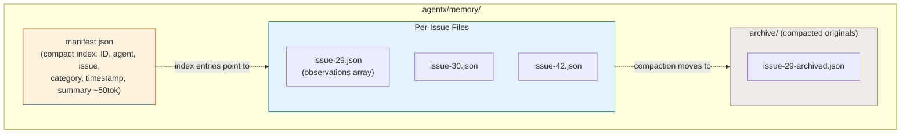

**Why per-issue files over a single file:**

| Approach | Read (injection) | Write (capture) | Search | Scale |
|----------|-----------------|-----------------|--------|-------|
| Single file | Load all (slow) | Lock all (contention) | Linear scan | Poor >5K |
| Per-issue files | Load 1-2 files (fast) | Lock 1 file (minimal) | Via manifest | Good to 50K |
| SQLite | Fast query | Auto-managed | FTS5 built-in | Excellent |

Per-issue files win on the "no dependency + consistent pattern" axes.

#### Decision 2: Capture Pipeline

```mermaid
sequenceDiagram
    participant AL as AgenticLoop
    participant SM as SessionManager
    participant CC as ContextCompactor
    participant EB as AgentEventBus
    participant MP as MemoryPipeline
    participant OS as ObservationStore
    participant FS as File System

    Note over AL: Session ends (text_response / max_iterations)
    AL->>SM: save(sessionId)
    AL->>CC: compactConversation(messages, agentName)
    CC->>CC: Extract decisions, code changes, errors, key facts
    CC->>EB: emit('context-compacted', {summary, agent, tokens})

    EB->>MP: on('context-compacted', callback)
    MP->>MP: Parse summary into individual observations
    MP->>OS: store(observations[])
    OS->>OS: FileLockManager.withSafeLock()
    OS->>FS: Write issue-{n}.json
    OS->>FS: Update manifest.json
    OS->>EB: emit('memory-stored', {count, tokens, issue})

    style MP fill:#F3E5F5,stroke:#6A1B9A
    style OS fill:#E3F2FD,stroke:#1565C0
```

**Why EventBus subscription over lifecycle hook modification:**
- `context-compacted` event already fires when `compactConversation()` runs
- No modification to `agentx.ps1 hook` scripts needed for v1
- Memory pipeline is a passive subscriber -- does not block the session lifecycle
- Future hook integration (Phase 2) can add explicit capture at `hook finish` for CLI sessions where the extension EventBus is not available

#### Decision 3: Injection Pipeline

```mermaid
sequenceDiagram
    participant AG as Agent (Session Start)
    participant MP as MemoryPipeline
    participant OS as ObservationStore
    participant RS as RelevanceScorer
    participant CC as ContextCompactor
    participant EB as AgentEventBus

    Note over AG: New session starts
    AG->>MP: injectMemory(agentName, issueNumber)
    MP->>OS: query(agent, issue)
    OS->>OS: Read manifest.json (in-memory)
    OS-->>MP: ObservationIndex[] (matching entries)

    MP->>RS: score(observations, context)
    RS->>RS: Compute recency + recall count + keyword overlap
    RS-->>MP: Scored + sorted observations

    MP->>MP: Select top-k within memory token budget
    MP->>OS: getFullObservations(selectedIds)
    OS->>OS: Read issue-{n}.json files
    OS-->>MP: Full observation content

    MP->>MP: Format as "Memory Recall" section
    MP->>CC: trackItem('memory', 'recalled-observations', formattedContent)
    MP->>EB: emit('memory-recalled', {count, tokens, agent, issue})

    MP-->>AG: Formatted recall section (inject into system prompt)

    style MP fill:#F3E5F5,stroke:#6A1B9A
    style RS fill:#FFF3E0,stroke:#E65100
```

**Two-phase retrieval (progressive disclosure):**
1. **Index phase**: Read manifest only (~50 tokens per entry). Filter by agent + issue. Score and rank.
2. **Detail phase**: Load full observations only for top-k selected entries. This saves loading all issue files when only a few observations are relevant.

This matches the PRD's progressive disclosure requirement and keeps token cost predictable.

#### Decision 4: Concurrency Model

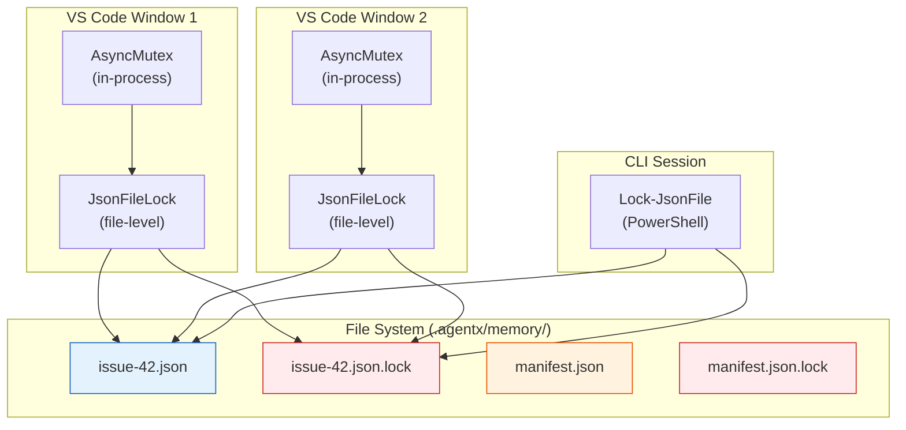

**Write ordering:** When storing observations, both the issue file and manifest must be updated. The pipeline acquires locks in a fixed order (issue file first, then manifest) to prevent deadlocks. In practice, contention is extremely rare -- two agents rarely capture observations for the same issue simultaneously.

#### Decision 5: EventBus Extensions

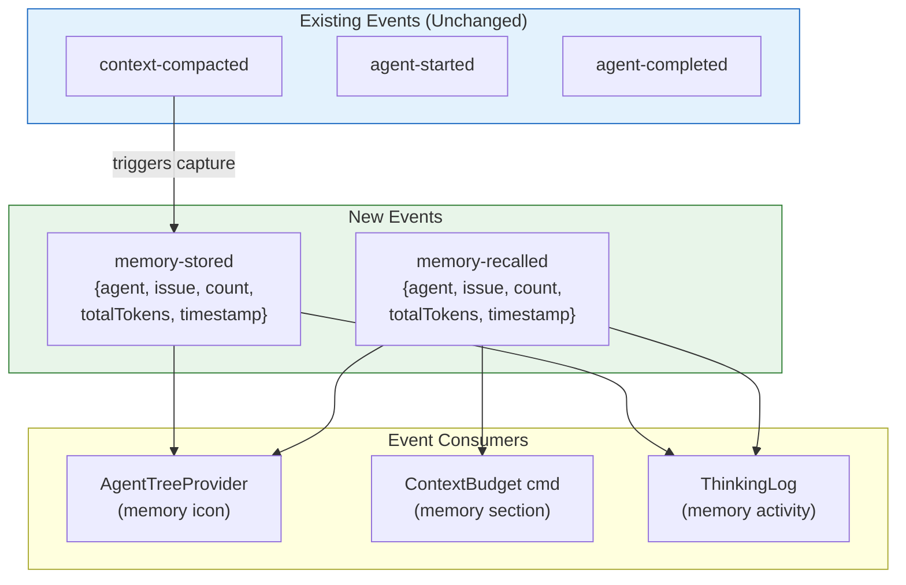

Two new events are additive-only changes to `AgentEventMap`. No existing events or consumers are modified.

#### Decision 6: ObservationStore Interface (Backend-Agnostic)

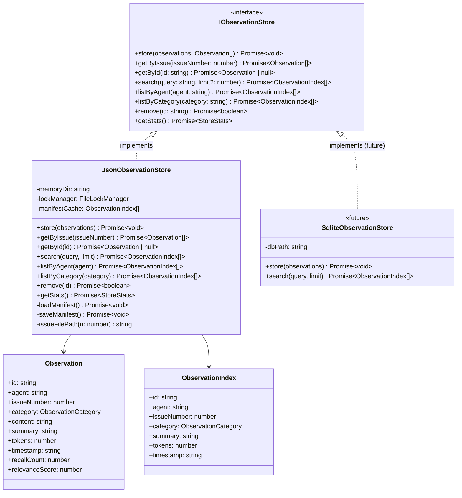

The `IObservationStore` interface enables swapping `JsonObservationStore` for `SqliteObservationStore` in the future without changing any consumer code. All memory pipeline logic depends solely on the interface.

### References

#### Internal
- [PRD-AgentX: Persistent Agent Memory Pipeline](../prd/PRD-AgentX.md)
- [ADR-1: Agent-to-Agent Clarification Protocol](#adr-1-agent-to-agent-clarification-protocol) (established per-issue JSON + FileLock pattern)
- [SPEC-AgentX: Technical Specification](../specs/SPEC-AgentX.md)
- [AGENTS.md](../../../AGENTS.md) - current declarative runtime reference
- Context compaction, agent event bus, session state, and agentic loop internals from the removed v7.x TypeScript runtime
- Legacy file lock management from the removed v7.x TypeScript runtime

#### External
- Node.js `fs.open` with `wx` flag: atomic file creation (O_CREAT | O_EXCL semantics)
- JSON.parse performance: ~100MB/s on V8, ~200ms for 20MB file

### Review History

| Date | Reviewer | Status | Notes |
|------|----------|--------|-------|
| 2026-02-27 | Solution Architect Agent | Accepted | Initial architecture |

---

## ADR-30: Agentic Loop Quality Framework

> Status: Accepted | Date: 2026-03-05 | Epic: #30 | PRD: [PRD-AgentX.md](../prd/PRD-AgentX.md#feature-prd-agentic-loop-quality-framework)

### Context

AgentX's agentic loop (`agenticLoop.ts`) executed agent work without built-in quality assurance. When an agent completed its task, the output was handed off to the next phase (e.g., Engineer -> Reviewer) without automated self-checking. Similarly, when an agent encountered ambiguity in an upstream artifact (e.g., vague PRD requirement), there was no mechanism to resolve it without human intervention.

ADR-1 established a comprehensive Clarification Protocol with hub-routed file-based ledgers, file locking, TOML extensions, and EventBus events. While this design is sound for cross-session, cross-process scenarios, the most common use case -- in-session clarification between two agents in a single agentic loop -- did not need this complexity.

A simpler approach was needed: lightweight, LLM-based iterative loops that operate entirely in-memory.

### Decision

Implement three new modules in the agentic loop:

1. **Sub-Agent Spawner** (`subAgentSpawner.ts`) - Foundation for spawning constrained sub-agents with configurable roles, token budgets, and tool access. Abstracts LLM provider via `LlmAdapterFactory` type.

2. **Self-Review Loop** (`selfReviewLoop.ts`) - Iterative review-fix cycle where a same-role reviewer sub-agent evaluates output, produces structured findings, and the primary agent addresses them. Reviewer is read-only by default.

3. **Clarification Loop** (`clarificationLoop.ts`) - Iterative Q&A between a requesting agent and a responding agent. Uses a pluggable `ClarificationEvaluator` to determine when the question is resolved. Falls back to human input when iterations are exhausted.

### Options Considered

#### Option A: Implement the Full Clarification Protocol (ADR-1 Design)

- **Pros**: Comprehensive; handles cross-session, cross-process scenarios; full audit trail via JSON ledgers; stale/stuck/deadlock detection
- **Cons**: Over-engineered for in-session use; requires file locking infrastructure; needs TOML extensions, EventBus events, CLI commands, monitoring daemon; significant implementation effort for the common case

#### Option B: Lightweight LLM-Based Iterative Loops (CHOSEN)

- **Pros**: Simple; works immediately; no file I/O or locking; operates in-memory; easy to test; covers the most common clarification scenario; sub-agent spawner is reusable for self-review and clarification
- **Cons**: Does not handle cross-session clarification; no persistent audit trail; limited to agents within the same session

#### Option C: Hybrid -- Lightweight Loops Now, File-Based Later

- **Pros**: Gets value immediately; leaves the door open for the full protocol later
- **Cons**: Slightly more design effort to ensure the lightweight approach does not conflict with the future file-based approach

### Rationale

**Option B was chosen**, with acknowledgment that Option C is the long-term path.

1. **Pragmatism over completeness**: The in-session use case is by far the most common (Engineer needs clarification from Architect within the same agentic loop run). The full file-based protocol addresses a rarer scenario.

2. **No file locking needed**: Since everything operates within a single Node.js process (or a single PowerShell session for CLI), there is no concurrent access requiring file locks.

3. **Reusable foundation**: The `SubAgentSpawner` abstraction enables both self-review and clarification with the same underlying mechanism. This was not anticipated in ADR-1.

4. **Test simplicity**: In-memory operations with mock `LlmAdapterFactory` are trivially testable. File-based ledgers require filesystem mocking.

5. **Non-conflicting with ADR-1**: The lightweight loops operate at a different layer (in-session) than the planned protocol (cross-session). Both can coexist -- the lightweight loop handles quick Q&A, while the file-based protocol would handle long-running cross-session negotiations.

### Consequences

**Positive:**
- Agents self-review their work before handoff, reducing Reviewer rejection rates
- Agents resolve ambiguity autonomously, reducing human intervention to <20%
- Sub-Agent Spawner provides a reusable foundation for any future agent-to-agent interaction pattern
- Both VS Code Chat and CLI modes are supported via `LlmAdapterFactory` abstraction
- Zero new compile errors; all 3 test files pass

**Negative:**
- Cross-session clarification still requires the full protocol from ADR-1
- No persistent audit trail for clarification exchanges (in-memory only)
- Self-review adds 2-4 LLM calls per iteration, increasing token usage and latency

**Neutral:**
- The existing Clarification Protocol spec and ADR-1 remain valid for cross-session use cases
- The Memory Pipeline (ADR-29) is unaffected -- it operates on a different axis (observation persistence vs. quality assurance)

### Architecture Decisions

#### Decision 30.1: LLM Abstraction via Factory Type

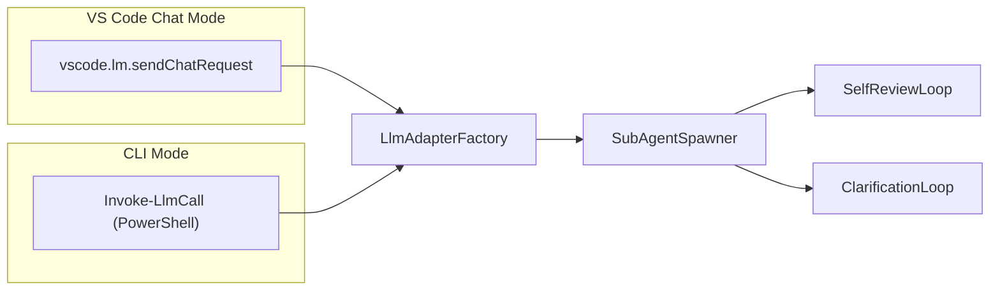

The `LlmAdapterFactory` type decouples the quality modules from the specific LLM provider. In VS Code Chat mode, `agenticChatHandler.ts` provides `buildChatLlmAdapterFactory()` that wraps `vscode.lm`. In CLI mode, `agentic-runner.ps1` provides an equivalent PowerShell wrapper. This allows the same `runSelfReview()` and `runClarificationLoop()` functions to work in both environments.

#### Decision 30.2: Read-Only Reviewer by Default

The self-review loop spawns a reviewer sub-agent with `reviewerCanWrite: false`. This means `createMinimalToolRegistry()` strips all write, edit, and execute tools from the reviewer's tool registry. The reviewer can read files and search the codebase, but cannot modify anything.

**Rationale**: A reviewer that can modify code conflates two responsibilities (reviewing vs. fixing). The review findings are returned to the primary agent, which decides how to address them.

#### Decision 30.3: Pluggable Clarification Evaluator

The `ClarificationEvaluator` type allows teams to swap the default heuristic-based evaluator for an LLM-based one:

```typescript
type ClarificationEvaluator = (
  question: string,
  answer: string,
  history: ClarificationExchange[]
) => Promise<boolean> | boolean;
```

The default evaluator uses heuristics (response length, keyword matching, confidence signals). Teams can inject an evaluator that uses a secondary LLM call to judge whether the answer resolves the question.

#### Decision 30.4: Human Fallback as Callback

When the clarification loop exhausts its max iterations without resolution, it invokes `onHumanFallback(question, exchangeHistory)`. This is a callback, not an event or file operation, keeping the flow synchronous and testable.

In VS Code Chat mode, this surfaces a prompt in the chat panel. In CLI mode, it prints to stdout and waits for stdin input.

#### Decision 30.5: Structured Review Findings

Review findings use a structured format with impact levels (`high`, `medium`, `low`) and categories. Only `high` and `medium` findings require addressing -- `low` findings are logged as informational.

This prevents infinite review loops where the reviewer keeps finding minor issues. The self-review loop converges because low-impact findings are accepted without action.

### References

#### Internal
- [PRD-AgentX: Agentic Loop Quality Framework](../prd/PRD-AgentX.md#feature-prd-agentic-loop-quality-framework)
- [ADR-1: Agent-to-Agent Clarification Protocol](#adr-1-agent-to-agent-clarification-protocol) (established the hub-routed clarification pattern)
- [ADR-29: Persistent Agent Memory Pipeline](#adr-29-persistent-agent-memory-pipeline) (parallel but independent initiative)
- [SPEC-AgentX: Technical Specification](../specs/SPEC-AgentX.md#agentic-loop-quality-framework-specification)
- [AGENTS.md](../../../AGENTS.md) - current declarative runtime reference
- Sub-agent spawning, self-review, clarification, and agentic chat handler internals from the removed v7.x TypeScript runtime

### Review History

| Date | Reviewer | Status | Notes |
|------|----------|--------|-------|
| 2026-03-05 | Solution Architect Agent | Accepted | Initial architecture decision |

---

## ADR-47: Security Hardening and Agentic Loop Enhancements

> Status: Accepted | Date: 2026-03-03 | Epic: #47 | PRD: [PRD-AgentX.md](../prd/PRD-AgentX.md)

### Context

AgentX's agentic loop grants LLM-driven agents the ability to execute shell commands, read/write files, and interact with external services. The current security model relies on a 4-entry denylist of dangerous commands in toolEngine.ts (line ~299) with no defense-in-depth measures. Additionally, the agentic loop executes tool calls sequentially, provides no progress tracking or stall detection, and has limited resilience to transient LLM failures.

**Requirements (from PRD-47):**

- Replace trivial denylist with allowlist-based command validation (defense-in-depth)
- Add secret redaction to prevent credential leaks in logs
- Add action reversibility classification for informed user decisions
- Add path sandboxing to prevent agent file exfiltration
- Add dual-ledger progress tracking with stall detection
- Add parallel tool execution for independent tool calls
- Add LLM retry with exponential backoff for transient failures
- Add structured JSON logging with file rotation for enterprise audit trails
- Add persistent cross-session memory for agent knowledge retention

**Constraints:**

- Must maintain backward compatibility with existing tool definitions and agent configurations
- Must use VS Code Extension API (no new extension host processes)
- Must follow existing TypeScript patterns (readonly interfaces, pure functions)
- Configuration via standard VS Code settings API
- All code ASCII-only
- No new external npm dependencies

**Background:**

The existing denylist approach (4 patterns: "rm -rf /", "format c:", "drop database", "git reset --hard") is trivially bypassed via encoding, aliasing, or compound commands. OWASP Command Injection Prevention guidelines recommend allowlist-over-denylist as a fundamental security principle. The agentic loop's sequential tool execution, lack of retry logic, and absence of structured logging prevent AgentX from meeting enterprise-grade reliability and auditability standards.

---

### Decisions

#### ADR-47.1: Allowlist-over-Denylist for Command Security

##### Decision

We will replace the primary command validation strategy from denylist-only to **allowlist-primary with denylist-fallback**. The existing 4-entry denylist is retained as Layer 1 (hard block), and a configurable allowlist becomes Layer 2 (auto-approve or prompt). Unknown commands always require user confirmation.

##### Options Considered

**Option A: Enhanced Denylist (extend current approach)**

Expand the denylist from 4 to 50+ patterns covering more dangerous commands.

Pros:
- Minimal code change
- No disruption to existing workflows
- Easy to understand

Cons:
- Fundamentally flawed: cannot enumerate all dangerous commands
- Bypassed by encoding, aliasing, or novel commands
- Does not follow security best practices (OWASP recommends allowlist)
- False sense of security

Effort: S | Risk: High

**Option B: Allowlist-only (strict)**

Only allowlisted commands execute. All others are blocked with no override.

Pros:
- Maximum security
- Simple implementation
- Follows principle of least privilege

Cons:
- Too restrictive for developer tools (agents need flexibility)
- Users would need to manually allowlist every new command
- High friction leading to user frustration and low adoption

Effort: M | Risk: Medium

**Option C: Allowlist-primary with denylist-fallback + user confirmation (SELECTED)**

Denylist hard-blocks known-dangerous commands. Allowlist auto-approves known-safe commands. Unknown commands prompt user with reversibility classification.

Pros:
- Defense-in-depth: two independent validation layers
- Balanced security and usability
- Unknown commands are not blocked, just gated behind confirmation
- OWASP-compliant allowlist approach
- Extensible via VS Code settings
- Compound command splitting prevents bypass via chaining

Cons:
- More complex implementation than either option alone
- Requires careful default allowlist curation
- Confirmation dialogs may be disruptive for frequent unknown commands

Effort: M | Risk: Low

##### Rationale

We chose **Option C** because:

1. **OWASP Compliance**: The allowlist-over-denylist principle is an industry standard for command injection prevention. A denylist alone is trivially bypassed.
2. **Balanced UX**: Auto-approving known-safe commands (git, npm, dotnet) maintains developer velocity while gating unknown commands behind an informed confirmation dialog.
3. **Defense in Depth**: Two independent layers -- denylist catches known-dangerous even if allowlist is misconfigured; allowlist catches unknown commands that denylist misses.
4. **Extensibility**: Users can extend the allowlist via VS Code settings without modifying source code, adapting to project-specific toolchains.
5. **Compound Analysis**: Splitting compound commands on ; && || | and validating each sub-command independently closes a major bypass vector.

---

#### ADR-47.2: Dual-Ledger Pattern for Progress Tracking

##### Decision

We will implement a **dual-ledger progress tracking system** with a TaskLedger (strategic context) and a ProgressLedger (tactical execution state). Stall detection triggers automatic replanning using TaskLedger context.

##### Options Considered

**Option A: Simple step counter**

Track iteration count and time elapsed. No structural awareness of the plan.

Pros:
- Trivial implementation
- Low overhead

Cons:
- Cannot distinguish productive work from spinning
- No replanning capability
- No context for why the agent is stuck

Effort: S | Risk: Medium

**Option B: Dual-ledger (TaskLedger + ProgressLedger) (SELECTED)**

TaskLedger holds strategic context (objective, facts, assumptions, plan). ProgressLedger holds tactical state (current step, history, stall count, timestamps). Stall detection at threshold N triggers replanning using TaskLedger context.

Pros:
- Separation of strategic and tactical state enables intelligent replanning
- Stall detection based on consecutive failures (not just iteration count)
- Time-based stale detection catches hanging operations
- TaskLedger provides LLM with full context for plan revision
- Visible in ThinkingLog for user monitoring

Cons:
- More complex than simple counter
- LLM replanning consumes additional tokens
- ProgressLedger must be updated on every step (minor overhead)

Effort: M | Risk: Low

**Option C: Full planning framework (DAG-based)**

Model the plan as a directed acyclic graph with dependencies between steps.

Pros:
- Most accurate dependency tracking
- Enables parallel step execution

Cons:
- Over-engineered for current needs
- LLM plans are sequential narratives, not DAGs
- High implementation complexity

Effort: XL | Risk: High

##### Rationale

We chose **Option B** because:

1. **Right Abstraction Level**: The dual-ledger separates "what are we trying to do" (TaskLedger) from "how far have we gotten" (ProgressLedger). This matches how autonomous agent systems track progress in the research literature.
2. **Intelligent Replanning**: When stalled, the LLM receives the full objective, known facts, and last N errors -- enough context to generate a revised plan without starting from scratch.
3. **Configurable Sensitivity**: The stall threshold (default 3) and stale timeout (default 60s) are configurable, allowing users to tune sensitivity per workflow.
4. **Incremental Complexity**: Adds meaningful capability without the over-engineering of a DAG-based planner. Can be extended to DAG later if needed.

---

#### ADR-47.3: Promise.allSettled for Parallel Tool Execution

##### Decision

We will use **Promise.allSettled()** to execute independent tool calls concurrently when the LLM returns multiple tool calls in a single response. A lightweight dependency detection heuristic determines whether tools can run in parallel.

##### Options Considered

**Option A: Always sequential (current behavior)**

Execute tool calls one at a time in the order returned by the LLM.

Pros:
- Simple, predictable
- No race condition risk
- Current behavior preserved

Cons:
- Wastes time when tools are independent
- LLMs increasingly return multiple independent calls
- Performance bottleneck for multi-tool responses

Effort: None | Risk: None

**Option B: Promise.all (fail-fast)**

Execute all tools concurrently with Promise.all. If any fails, all fail.

Pros:
- Maximum parallelism
- Simple API

Cons:
- One failure cancels all concurrent tools
- Partial results lost on any error
- Inappropriate for tool execution where individual failures should be reported

Effort: S | Risk: Medium

**Option C: Promise.allSettled (independent completion) (SELECTED)**

Execute independent tools concurrently with Promise.allSettled. Each tool completes or fails independently. Results collected in original order.

Pros:
- One failure does not cancel others
- All results (success + failure) preserved
- Results returned in original order regardless of completion order
- Standard JavaScript API -- no custom concurrency primitives
- Transparent to agents: same results, faster completion

Cons:
- Need dependency detection heuristic (lightweight but imperfect)
- Sequential fallback needed when dependencies detected
- Slightly more complex result handling than sequential

Effort: M | Risk: Low

##### Rationale

We chose **Option C** because:

1. **Fault Isolation**: Promise.allSettled ensures that a failing file_read does not cancel a concurrent grep_search. Each tool call's result (or error) is delivered to the LLM independently.
2. **Transparent Speedup**: From the LLM's perspective, results appear in the same order. The only difference is wall-clock time.
3. **Standard API**: No custom concurrency primitives or worker threads needed. Promise.allSettled is built into JavaScript.
4. **Safe Fallback**: When the dependency heuristic detects potential data flow between calls, the system falls back to sequential execution. Wrong dependency detection errs on the side of caution (sequential), never on the side of race conditions.

---

#### ADR-47.4: JSONL for Persistent Memory Format

##### Decision

We will use **JSON Lines (JSONL) format** for the persistent cross-session memory store at `.agentx/memory/observations.jsonl`. One JSON object per line, append-only writes.

##### Options Considered

**Option A: Single JSON file**

Store all memory entries in a single JSON array.

Pros:
- Simple to read/parse
- Standard format

Cons:
- Must read and rewrite entire file on every append
- Poor performance at scale (>1000 entries)
- Corruption risk: partial write corrupts entire store
- Not suitable for concurrent access

Effort: S | Risk: Medium

**Option B: SQLite database**

Use SQLite for structured storage with indexes and queries.

Pros:
- Full query capability
- ACID transactions
- Excellent performance for complex queries

Cons:
- Binary format (not human-readable, not diffable)
- Adds implicit dependency on SQLite bindings
- Over-engineered for simple key-value observations
- Potential platform compatibility issues in VS Code extension host

Effort: L | Risk: Medium

**Option C: JSON Lines (JSONL) (SELECTED)**

One JSON object per line. Append-only writes. File locking for concurrent access.

Pros:
- Append-only writes are fast and crash-safe (partial write loses one entry, not all)
- Human-readable and greppable
- No external dependencies
- Streaming reads for large files
- Compatible with existing AgentX file-based state patterns

Cons:
- No built-in indexing (must scan for queries)
- TTL-based pruning requires rewrite of entire file
- Not suitable for complex relational queries

Effort: S | Risk: Low

##### Rationale

We chose **Option C** because:

1. **Consistency**: AgentX already uses JSON files for state (agent-status.json, clarification ledgers, loop-state.json). JSONL is a natural extension.
2. **Crash Safety**: Append-only writes mean a crash mid-write loses at most one entry. A single JSON file or SQLite could corrupt the entire store.
3. **No Dependencies**: No native bindings or external packages. Standard Node.js fs module handles all operations.
4. **Sufficient Performance**: For the expected scale (hundreds to low thousands of observations), sequential scan with tag filtering is fast enough. If vector search is needed later, that is a separate future enhancement.

---

#### ADR-47.5: Structured JSON Logging with File Rotation

##### Decision

We will implement **structured JSON logging** with newline-delimited JSON (JSONL) format, correlation IDs per loop iteration, and size-based file rotation (10 MB per file, 5 files retained, 50 MB total cap).

##### Options Considered

**Option A: Enhanced text logging (extend ThinkingLog)**

Add more structure to the existing text-based ThinkingLog output.

Pros:
- Minimal change
- ThinkingLog already works well for VS Code output channel

Cons:
- Text format not parseable by SIEM tools
- No correlation IDs for tracing
- No file rotation
- Not suitable for enterprise log aggregation

Effort: S | Risk: Medium

**Option B: Third-party logging library (winston, pino)**

Integrate a production logging library with built-in rotation and formatting.

Pros:
- Battle-tested
- Rich feature set
- Community support

Cons:
- Adds external dependency (contrary to constraints)
- May conflict with VS Code extension host sandbox
- Heavyweight for our needs

Effort: M | Risk: Medium

**Option C: Custom JSONL logger with rotation (SELECTED)**

Purpose-built structured logger writing JSONL files with size-based rotation, correlation IDs, and secret redaction integration.

Pros:
- No external dependencies
- Tailored to AgentX needs (correlation IDs per loop iteration, secret redaction)
- JSONL format compatible with standard log analysis tools
- Size-based rotation prevents unbounded disk usage
- Simple implementation (~200 lines)

Cons:
- Must implement rotation logic (straightforward but custom)
- Less feature-rich than winston/pino
- Must handle edge cases (concurrent writes, disk full)

Effort: M | Risk: Low

##### Rationale

We chose **Option C** because:

1. **Zero Dependencies**: The requirement explicitly prohibits new external npm dependencies. A custom logger avoids this constraint entirely.
2. **Secret Redaction Integration**: The logger integrates directly with SecretRedactor at the write boundary, ensuring no credential ever reaches disk. Third-party loggers would need wrapper layers.
3. **Correlation IDs**: Per-iteration correlation IDs are first-class -- generated at loop start, propagated through all tool calls, and included in every log entry. This is not a standard feature of generic loggers.
4. **Enterprise Compatibility**: JSONL output is parseable by ELK, Splunk, Datadog, Azure Monitor, and other SIEM tools without custom parsers.
5. **Bounded Disk Usage**: 10 MB * 5 files = 50 MB maximum. Rotation logic is simple (check file size before write, rename if over limit).

---

### Consequences (Cross-Cutting)

#### Positive

- Defense-in-depth security model replaces the trivially-bypassed 4-entry denylist
- Credential leaks in logs are eliminated via SecretRedactor
- Users make informed decisions about risky commands with reversibility classification
- Agentic loop recovers from stalls via intelligent replanning
- Independent tool calls complete faster via parallel execution
- Transient LLM failures are silently recovered via retry with backoff
- Enterprise teams can integrate structured logs into their monitoring pipelines
- All new features are backward-compatible with existing configurations

#### Negative

- More complex command validation increases maintenance surface
- Allowlist requires initial curation and ongoing updates for new tool commands
- Parallel tool execution adds concurrency complexity (mitigated by Promise.allSettled isolation)
- Structured logging adds disk I/O (mitigated by async writes and rotation)
- LLM replanning consumes additional tokens during stall recovery

#### Neutral

- New VS Code settings namespace (agentx.security.*, agentx.reliability.*, agentx.logging.*)
- 8 new TypeScript modules added to the extension
- Testing surface increases proportionally with new modules
- ThinkingLog now filters all output through SecretRedactor (transparent change)

---

### Implementation

**Detailed technical specification**: [SPEC-AgentX.md](../specs/SPEC-AgentX.md)

**High-level implementation plan:**

1. **Phase 1 (Weeks 1-2)**: CommandValidator, SecretRedactor, ReversibilityClassifier -- integrate into toolEngine.ts and thinkingLog.ts. Add VS Code settings schema.
2. **Phase 2 (Weeks 3-4)**: ProgressTracker, ParallelToolExecutor, RetryWithBackoff, PathSandbox, StructuredLogger -- integrate into agenticLoop.ts and vscodeLmAdapter.ts.
3. **Phase 3 (Weeks 5-6)**: OnError hook, SSRF validator, codebase tools, parallel agents, persistent memory, prompting modes, timing utilities, hook priority, bounded messages.

**Key milestones:**

- Phase 1: P0 security gate -- allowlist + redaction + reversibility deployed and tested (Week 2)
- Phase 2: P1 reliability gate -- parallel execution + retry + progress tracking + logging deployed (Week 4)
- Phase 3: P2/P3 advanced capabilities -- all 17 stories complete (Week 6)

---

### References

#### Internal

- [PRD-AgentX.md](../prd/PRD-AgentX.md) -- Product Requirements Document
- [SPEC-AgentX.md](../specs/SPEC-AgentX.md) -- Technical Specification
- [AGENTS.md](../../../AGENTS.md) -- Current runtime reference
- Legacy tool engine, agentic loop, and thinking log internals from the removed v7.x TypeScript runtime

#### External

- OWASP Command Injection Prevention Cheat Sheet -- allowlist-over-denylist principle
- OWASP SSRF Prevention Cheat Sheet -- IP validation and DNS rebinding protection
- AWS Architecture Blog -- Exponential backoff with jitter pattern
- JSON Lines Specification (jsonlines.org) -- JSONL format standard

---

### Review History

| Date | Reviewer | Status | Notes |
|------|----------|--------|-------|
| 2026-03-03 | Solution Architect Agent | Accepted | Initial ADR covering 5 key architectural decisions for Epic #47 |

---

**Generated by AgentX Architect Agent**
**Author**: Solution Architect Agent
**Last Updated**: 2026-03-03
**Version**: 1.0

---

## Related Documents

- [PRD-AgentX.md](../prd/PRD-AgentX.md) - Product Requirements Document
- [SPEC-AgentX.md](../specs/SPEC-AgentX.md) - Technical Specifications
- [AGENTS.md](../../../AGENTS.md) - Current runtime reference

