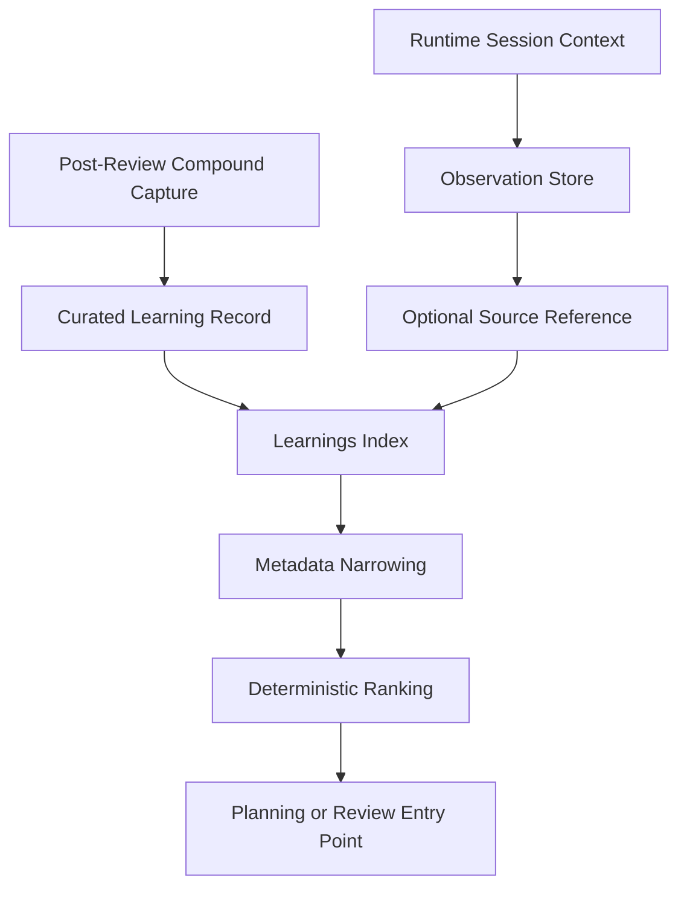
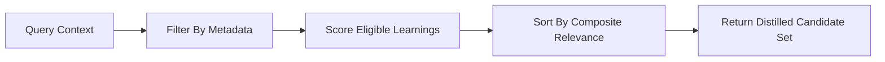
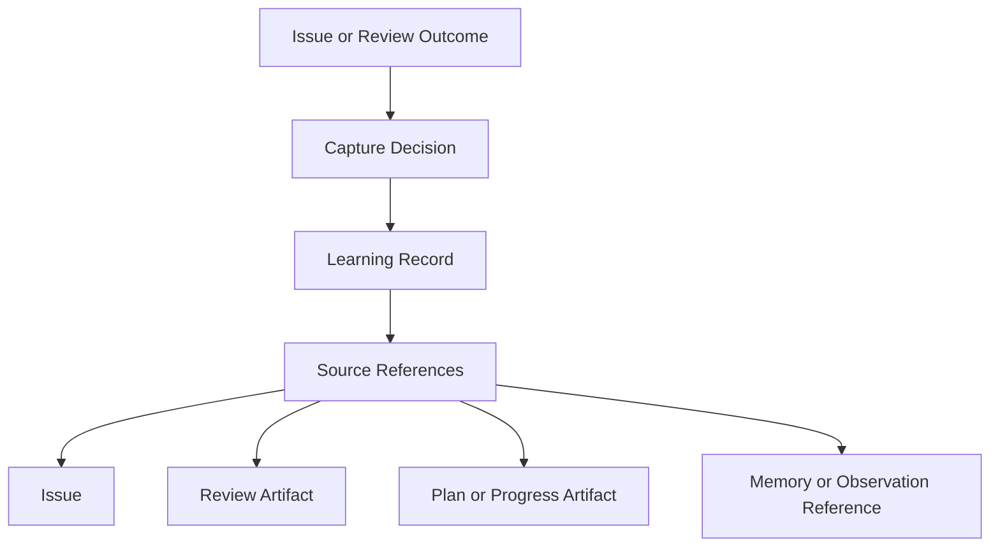
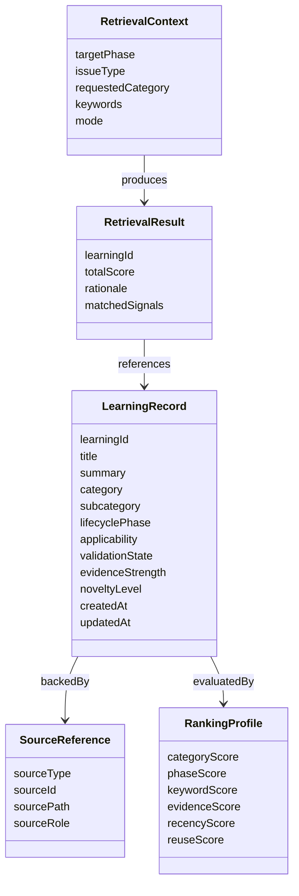

# Technical Specification: Learnings Metadata Schema And Ranking Contract

**Issue**: #162
**Epic**: #157
**Feature**: #159
**Status**: Draft
**Author**: GitHub Copilot, Solution Architect Agent
**Date**: 2026-03-12
**Related ADR**: [ADR-162.md](../adr/ADR-162.md)
**Related Workflow Contract**: [SPEC-163.md](../specs/SPEC-163.md)
**Related PRD**: [PRD-157.md](../prd/PRD-157.md)

---

## Table of Contents

1. [Overview](#1-overview)
2. [Goals And Non-Goals](#2-goals-and-non-goals)
3. [Architecture](#3-architecture)
4. [Component Design](#4-component-design)
5. [Data Model](#5-data-model)
6. [API Design](#6-api-design)
7. [Security](#7-security)
8. [Performance](#8-performance)
9. [Error Handling](#9-error-handling)
10. [Monitoring](#10-monitoring)
11. [Testing Strategy](#11-testing-strategy)
12. [Migration Plan](#12-migration-plan)
13. [Open Questions](#13-open-questions)

---

## 1. Overview

This specification defines the durable learnings schema and the deterministic ranking contract used to retrieve prior solutions for planning and review. It separates curated `LearningRecord` artifacts from runtime-only session observations and establishes a metadata-first narrowing flow before any optional synthesis occurs. [Confidence: HIGH]

### AI-First Assessment

AI can synthesize or summarize retrieved learnings later, but the retrieval core should begin with deterministic metadata and explainable scoring. The primary purpose of this contract is to reduce noise and make reuse decisions auditable across AgentX surfaces. [Confidence: HIGH]

### Scope

- In scope: learnings record metadata, source and evidence linking, ranking signals, narrowing rules, and separation from runtime observations. [Confidence: HIGH]
- Out of scope: vector search, embedding selection, UI implementation, and write-path automation for producing learnings records. [Confidence: HIGH]

### Success Criteria

- A reusable learning can be filtered by category, phase, artifact family, and issue context. [Confidence: HIGH]
- Ranking explains why one learning outranks another. [Confidence: HIGH]
- Runtime-only notes remain separate from curated learnings. [Confidence: HIGH]
- The contract supports later retrieval integration in planning and review flows. [Confidence: HIGH]

---

## 2. Goals And Non-Goals

### Goals

- Define the metadata required to narrow and rank reusable learnings. [Confidence: HIGH]
- Keep retrieval explainable and deterministic in the first phase. [Confidence: HIGH]
- Align curated learnings with issue, review, and memory source artifacts. [Confidence: HIGH]
- Preserve an upgrade path to richer retrieval later without changing the logical record shape. [Confidence: HIGH]

### Non-Goals

- Do not replace the current observation store. [Confidence: HIGH]
- Do not treat all session context as durable knowledge. [Confidence: HIGH]
- Do not depend on semantic search infrastructure in this story. [Confidence: HIGH]
- Do not define review-finding promotion or agent-native review scoring here. [Confidence: HIGH]

---

## 3. Architecture

### 3.1 Knowledge Separation Model

**Architectural decision:** Runtime observations may inform a curated learning, but they are not themselves the durable retrieval unit. [Confidence: HIGH]

### 3.2 Ranking Flow

**Architectural decision:** Metadata filtering must happen before scoring so ranking operates on a narrowed, relevant candidate set. [Confidence: HIGH]

### 3.3 Source Traceability

**Architectural decision:** Every curated learning must be traceable back to the artifacts that justify its existence. [Confidence: HIGH]

---

## 4. Component Design

### 4.1 Logical Components

| Component | Responsibility |
|----------|----------------|
| Learning Record Store | Persist durable learnings and their metadata |
| Learnings Index | Maintain compact searchable summaries for narrowing and ranking |
| Filter Resolver | Narrow candidates by category, phase, artifact family, mode, and scope |
| Ranking Engine | Apply deterministic composite scoring to eligible learnings |
| Retrieval Presenter | Return ranked candidates with rationale for planning or review use |

### 4.2 Retrieval Contract Layers

| Layer | Purpose | Output |
|------|---------|--------|
| Eligibility | Remove obviously irrelevant records | candidate set |
| Ranking | Score remaining records | ordered list |
| Presentation | Expose top candidates with rationale | ranked guidance set |

### 4.3 Durable Learnings Versus Runtime Context

| Type | Characteristics | Retrieval Role |
|------|-----------------|----------------|
| Runtime observation | session-scoped, low-friction, may be noisy, may be provisional | optional evidence or source only |
| Curated learning | post-review, reusable, source-backed, metadata-rich | primary retrieval unit |

---

## 5. Data Model

### 5.1 Conceptual Entity Model

### 5.2 Required LearningRecord Fields

| Field | Purpose | Required |
|------|---------|----------|
| learningId | Stable identifier | Yes |
| title | Compact human-readable label | Yes |
| summary | Distilled reusable guidance | Yes |
| category | Primary retrieval grouping | Yes |
| subcategory | Finer-grained narrowing | Yes |
| lifecyclePhase | Plan, design, execute, review, or compound capture relevance | Yes |
| applicability | Issue types, domains, or workflow conditions where the learning applies | Yes |
| validationState | Draft, reviewed, approved, superseded, archived | Yes |
| evidenceStrength | Low, medium, or high support based on source artifacts | Yes |
| noveltyLevel | Indicates whether the learning is new, refined, or duplicated | Yes |
| sourceReferences | Traceability to issue and repo artifacts | Yes |
| keywords | Explicit lexical anchors for overlap scoring | Yes |
| modeScope | local, github, shared, or mode-agnostic | Yes |
| reuseCount | Historical retrieval or reuse signal | No initially, but recommended |
| lastValidatedAt | Most recent review of continued correctness | No initially, but recommended |

### 5.3 Suggested Category Vocabulary

| Category | Intended Use |
|---------|---------------|
| workflow-contract | lifecycle and handoff guidance |
| memory | knowledge capture and recall behavior |
| review | review discipline, findings, approval patterns |
| architecture | durable design decisions and trade-offs |
| tooling | CLI, extension, or automation behavior |
| validation | tests, gates, quality checks, evidence |

### 5.4 Ranking Signal Definitions

| Signal | Meaning | Weight Direction |
|-------|---------|------------------|
| Category Match | Exact or close match with requested category | High positive |
| Lifecycle Match | Relevance to current planning or review phase | High positive |
| Keyword Overlap | Lexical match between request and learning keywords or title | Medium positive |
| Evidence Strength | Strength of supporting artifacts and review backing | Medium positive |
| Validation State | Approved learnings outrank draft or superseded ones | High positive |
| Recency | Newer, still-valid learnings rank higher than stale ones | Medium positive |
| Reuse Signal | Previously reused learnings can receive a modest bonus | Low to medium positive |
| Duplication Or Archive State | Duplicate or archived items are suppressed or demoted | Strong negative |

---

## 6. API Design

This story defines the retrieval contract and schema behavior, not concrete code-level APIs.

### 6.1 Retrieval Operations

| Operation | Input | Output | Purpose |
|----------|-------|--------|---------|
| List eligible learnings | retrieval context plus filters | filtered candidate set | Apply deterministic narrowing |
| Rank learnings | candidate set plus scoring profile | ordered candidate set | Produce explainable relevance order |
| Explain ranking | ranked result | matched signals and rationale | Support human validation |
| Resolve source detail | learning identifier | linked source references | Preserve traceability |

### 6.2 Minimum Retrieval Filters

| Filter | Description |
|-------|-------------|
| category | Primary narrowing by learning type |
| lifecyclePhase | Plan versus review versus other use point |
| validationState | Exclude draft, superseded, or archived learnings when needed |
| modeScope | Align result to local, GitHub, or shared context |
| issueType | Match bug, story, feature, or docs context |

### 6.3 Ranking Output Contract

Each ranked result should include:

- the durable learning identifier
- total relevance score
- matched signals summary
- compact rationale sentence
- source reference list
- confidence indicator derived from evidence and validation state

---

## 7. Security

- Learnings records must not expose source content that exceeds the visibility intended for the underlying artifacts. [Confidence: HIGH]
- Retrieval filtering should honor mode scope so local-only learnings are not presented as universally valid by default. [Confidence: HIGH]
- Archived or superseded learnings must remain demoted to reduce accidental reuse of stale guidance. [Confidence: HIGH]
- Source traceability is required so operators can inspect the supporting evidence before trusting a retrieved learning. [Confidence: HIGH]

---

## 8. Performance

- Retrieval should operate primarily on compact index metadata rather than loading every source artifact. [Confidence: HIGH]
- Metadata narrowing should reduce candidate volume before ranking. [Confidence: HIGH]
- Ranking should be lightweight enough for planning and review entry points. [Confidence: HIGH]

| Concern | Target |
|--------|--------|
| Candidate filtering | Fast enough for interactive planning and review use |
| Ranking explanation generation | Derived directly from scoring signals, no extra expensive pass |
| Source lookup | Only load detailed sources for top-ranked items |

---

## 9. Error Handling

| Failure Mode | Expected Behavior | Recovery |
|-------------|-------------------|----------|
| No eligible learnings found | Return explicit empty result with fallback guidance | Allow normal planning or review flow to continue |
| Missing source references | Demote confidence or reject record from curated set | Repair or regenerate capture artifact |
| Conflicting metadata | Prefer conservative ranking and flag the record for review | Revalidate the learning record |
| Archived or superseded learning encountered | Suppress or heavily demote result | Use active alternatives only |
| Overly broad query | Require category or phase narrowing before ranking | Prompt for more context in a later implementation |

---

## 10. Monitoring

### 10.1 Schema Health Metrics

| Metric | Meaning |
|-------|---------|
| Learnings with complete required metadata | Measures schema discipline |
| Learnings with valid source references | Measures traceability quality |
| Retrievals returning at least one approved candidate | Measures practical coverage |
| Top-ranked results later judged irrelevant | Measures ranking noise |

### 10.2 Ranking Quality Signals

- fraction of results surfaced by exact category match
- proportion of top results with high evidence strength
- reuse frequency of approved learnings
- number of archived or superseded learnings still appearing in candidate sets

---

## 11. Testing Strategy

### 11.1 Validation Areas

| Test Area | Goal |
|----------|------|
| Schema completeness | Ensure required learning fields are present |
| Observation separation | Ensure runtime-only observations are not treated as curated learnings by default |
| Filter behavior | Ensure category, phase, and mode filters narrow correctly |
| Ranking order | Ensure deterministic signals produce stable ordering |
| Traceability | Ensure each result links to valid sources |

### 11.2 Scenario Matrix

| Scenario | Expected Result |
|---------|-----------------|
| Planning for workflow-contract work | workflow-contract category and plan-phase learnings rank highest |
| Review-phase query with approved evidence-backed learnings | approved review-relevant learnings outrank drafts |
| Duplicate learning marked archived | archived result is suppressed or heavily demoted |
| Broad keyword-only query | lexical overlap helps, but category and phase still dominate |
| Local-only learning in GitHub context | mode mismatch demotes or excludes the result |

---

## 12. Migration Plan

### Phase 1: Contract Adoption

- Approve the `LearningRecord` schema and ranking rules in story #162.
- Treat runtime observations as source material, not final durable learnings. [Confidence: HIGH]

### Phase 2: Capture Alignment

- Align story #166 so explicit compound capture produces artifacts that satisfy this schema. [Confidence: HIGH]

### Phase 3: Retrieval Integration

- Align story #169 so planning and review entry points consume this ranking contract. [Confidence: HIGH]

### Phase 4: Future Retrieval Enhancements

- Add optional semantic ranking or richer feedback signals only after metadata-first quality is proven. [Confidence: MEDIUM]

---

## 13. Open Questions

1. Should evidence strength be manually assigned at capture time, or derived from source artifact classes and review status? [Confidence: MEDIUM]
2. Which category vocabulary should be fixed and which should remain extensible? [Confidence: MEDIUM]
3. How aggressively should recency decay reduce the score of older but still valid learnings? [Confidence: MEDIUM]
4. Should mode scope default to shared when not specified, or require explicit declaration? [Confidence: MEDIUM]
5. When later semantic retrieval is added, should it rerank within the deterministic candidate set or broaden candidate generation? [Confidence: MEDIUM]
