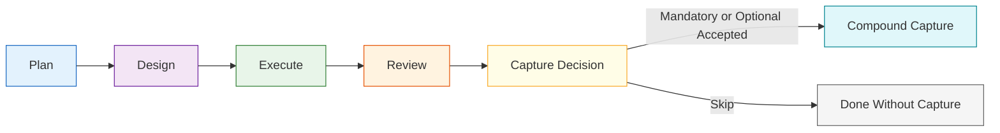
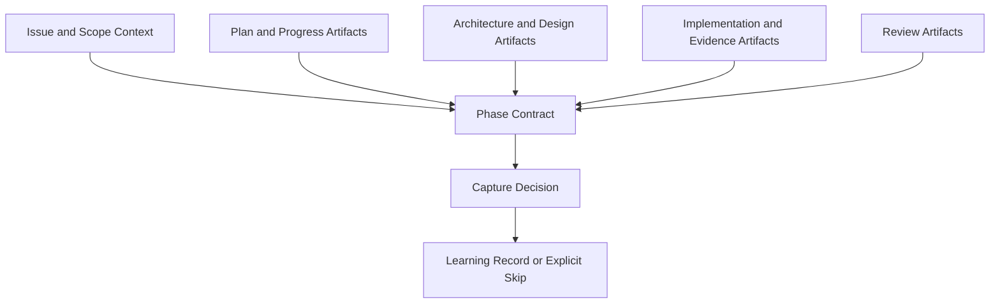
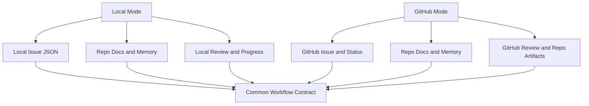
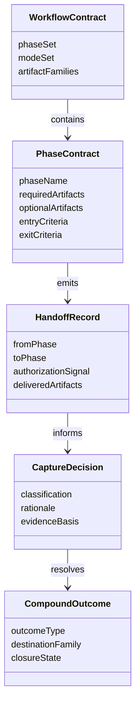

# Technical Specification: Knowledge-Compounding Workflow Contract

**Issue**: #163
**Epic**: #157
**Feature**: #158
**Status**: Draft
**Author**: GitHub Copilot, Solution Architect Agent
**Date**: 2026-03-12
**Related ADR**: [ADR-163.md](../adr/ADR-163.md)
**Related PRD**: [PRD-157.md](../prd/PRD-157.md)

---

## Table of Contents

1. [Overview](#1-overview)
2. [Goals And Non-Goals](#2-goals-and-non-goals)
3. [Architecture](#3-architecture)
4. [Component Design](#4-component-design)
5. [Data Model](#5-data-model)
6. [API Design](#6-api-design)
7. [Security](#7-security)
8. [Performance](#8-performance)
9. [Error Handling](#9-error-handling)
10. [Monitoring](#10-monitoring)
11. [Testing Strategy](#11-testing-strategy)
12. [Migration Plan](#12-migration-plan)
13. [Open Questions](#13-open-questions)

---

## 1. Overview

This specification defines the phase contract that turns AgentX delivery work into reusable institutional knowledge. It introduces a five-phase lifecycle, a shared artifact taxonomy, explicit handoff gates, and a capture-decision model that determines when compound capture is mandatory, optional, or skipped. [Confidence: HIGH]

### AI-First Assessment

The workflow contract itself should remain deterministic and tool-neutral. AI participates later in retrieval, summarization, ranking, and advisory review, but this specification defines the non-AI control plane that those capabilities will plug into. [Confidence: HIGH]

### Scope

- In scope: lifecycle phases, artifact classes, entry and exit gates, capture-decision rules, local and GitHub mode mapping, and backlog alignment for later stories. [Confidence: HIGH]
- Out of scope: learnings field schema, ranking algorithm, retrieval implementation, review-finding backlog promotion logic, and source-code changes in runtime surfaces. [Confidence: HIGH]

### Success Criteria

- Every workflow phase has named required artifacts and clear completion conditions. [Confidence: HIGH]
- Compound capture is triggered by rules, not operator guesswork. [Confidence: HIGH]
- The contract can be expressed the same way in local mode and GitHub mode. [Confidence: HIGH]
- Later stories can implement schema, retrieval, and review integration without redefining lifecycle rules. [Confidence: HIGH]

---

## 2. Goals And Non-Goals

### Goals

- Make the plan -> work -> review -> compound capture loop explicit. [Confidence: HIGH]
- Define artifact expectations independently from any one client surface. [Confidence: HIGH]
- Reuse current AgentX workflow and issue patterns. [Confidence: HIGH]
- Establish a stable contract for stories #162, #166, and #169. [Confidence: HIGH]

### Non-Goals

- Do not create a new sidecar backlog for learnings. [Confidence: HIGH]
- Do not require compound capture for every task unconditionally. [Confidence: HIGH]
- Do not define the learnings payload schema in this story. [Confidence: HIGH]
- Do not add code-level automation before the contract is accepted. [Confidence: HIGH]

---

## 3. Architecture

### 3.1 Lifecycle Architecture

**Architectural decision:** Compound capture is a formal post-review phase, not an informal side effect of implementation or review. [Confidence: HIGH]

### 3.2 Artifact-Centric Contract

**Architectural decision:** The contract is anchored on artifact classes rather than specific commands or user interface steps. [Confidence: HIGH]

### 3.3 Mode Mapping

**Architectural decision:** Mode-specific storage differs, but the lifecycle rules do not. [Confidence: HIGH]

---

## 4. Component Design

### 4.1 Phase Model

The workflow contract recognizes five phases:

| Phase | Purpose | Required Output |
|-------|---------|-----------------|
| Plan | Establish problem, scope, and acceptance intent | Issue plus PRD or story context; execution plan if the work is complex |
| Design | Resolve architecture, UX, and domain decisions when needed | ADR and spec where architecture is required |
| Execute | Produce the actual change and validation evidence | Code or document change plus tests or validation evidence |
| Review | Assess correctness, risk, and completeness | Review artifact or structured approval finding |
| Compound Capture | Preserve reusable learning or explicitly record why capture was skipped | Learning record, memory update, or explicit skip rationale |

**Design choice:** Design remains conditional for simple work, but review and capture-decision steps are always part of the contract. [Confidence: HIGH]

### 4.2 Artifact Families

| Artifact Family | Examples | Role In Contract |
|----------------|----------|------------------|
| Scope artifacts | issue, PRD, story body | Define what problem is being solved |
| Design artifacts | ADR, spec, UX doc | Freeze non-trivial design decisions |
| Execution artifacts | changed files, tests, validation summaries, execution plan, progress log | Show the work and evidence |
| Review artifacts | review document, approval or change-request findings | Determine whether the result is reusable |
| Compound artifacts | memory note, solution summary, future learnings record | Preserve reusable conclusions |

### 4.3 Capture Decision Layer

The capture decision layer runs after review and classifies the outcome into one of three states:

| State | Meaning | Required Action |
|-------|---------|-----------------|
| Mandatory | The work produced durable guidance likely to help future planning or review | Capture must be produced before final closure |
| Optional | The work may be useful later but is narrowly scoped or low leverage | Capture may be created, but a skip rationale is acceptable |
| Skip | The outcome is too trivial, too transient, or too duplicated to justify capture | Record explicit skip rationale only |

### 4.4 Handoff Rules

Each phase handoff must answer four questions:

1. What artifact proves the phase is complete?
2. What artifact is handed to the next phase?
3. What status change or review outcome authorizes the handoff?
4. Is compound capture already known to be mandatory, optional, or undecided?

**Design choice:** The capture classification may begin as undecided during planning and design, but it must be resolved after review. [Confidence: HIGH]

---

## 5. Data Model

### 5.1 Conceptual Model

### 5.2 Required Logical Fields

| Entity | Required Fields | Purpose |
|-------|------------------|---------|
| PhaseContract | phase name, required artifacts, entry criteria, exit criteria | Defines one stage of the lifecycle |
| HandoffRecord | source phase, target phase, authorization signal, artifact list | Makes transitions inspectable |
| CaptureDecision | classification, rationale, evidence basis, duplicate check result | Determines whether capture is required |
| CompoundOutcome | outcome type, destination family, closure state | Records the actual result of the capture step |

### 5.3 Artifact Classification Rules

| Class | Rule | Notes |
|------|------|-------|
| Required | Missing artifact blocks the handoff | Examples: issue context, review outcome |
| Conditional | Required only when complexity or route demands it | Examples: ADR, spec, execution plan |
| Optional | Helpful but non-blocking | Examples: supplemental summaries |
| Compound | Created only after capture decision resolution | Detailed schema deferred to story #162 |

---

## 6. API Design

This story defines contract operations, not code-level APIs. Later engineering work may realize these operations in CLI, extension, or workflow automation.

### 6.1 Contract Operations

| Operation | Input | Output | Purpose |
|----------|-------|--------|---------|
| Resolve phase requirements | issue type, complexity, route | required and conditional artifact list | Determine what the current phase owes |
| Validate handoff | current phase artifacts, authorization signal | pass or fail plus missing artifact list | Prevent ambiguous transitions |
| Classify capture decision | review outcome, novelty, reuse potential, evidence quality | mandatory, optional, or skip | Decide whether capture is required |
| Finalize compound outcome | capture decision plus destination family | learning record or skip rationale | Close the lifecycle coherently |

### 6.2 Phase-To-Status Mapping

| Phase | Local Mode Signal | GitHub Mode Signal |
|------|--------------------|--------------------|
| Plan | issue created, optional local status | issue created, backlog or ready state |
| Design | local status reflects architecture work | ready or in-progress design state |
| Execute | in progress | in progress |
| Review | in review | in review |
| Compound Capture | done pending capture resolution, then closed | done pending capture resolution, then closed |

### 6.3 Capture Decision Inputs

| Input | Description | Effect On Decision |
|------|-------------|--------------------|
| Novelty | Was a new pattern, pitfall, or reusable decision created? | Raises capture priority |
| Reuse Potential | Is the outcome likely to help future planning or review? | Raises capture priority |
| Evidence Quality | Is the solution validated and review-backed? | Gates whether capture is safe |
| Duplication Risk | Does an equivalent learning already exist? | Can downgrade to skip |
| Scope Significance | Did the work affect workflow, architecture, or repeated operator behavior? | Raises capture priority |

---

## 7. Security

- Compound capture must not introduce new secret-handling paths; it reuses current repo security constraints. [Confidence: HIGH]
- Capture outputs must preserve the same sensitivity boundaries as the source artifacts they summarize. [Confidence: HIGH]
- The contract must prevent user-only or approval-only capabilities from being represented as agent-safe defaults without explicit review. [Confidence: HIGH]
- Skip rationales should avoid leaking hidden internal context when a work item cannot be broadly reused. [Confidence: MEDIUM]

---

## 8. Performance

- The phase contract should be computable from existing issue, artifact, and review metadata without full-repo scanning. [Confidence: HIGH]
- Capture classification should happen after review using already-available signals, not by triggering a second heavy analysis pass. [Confidence: HIGH]
- The contract should minimize operator overhead by reusing artifacts that already exist in the workflow. [Confidence: HIGH]

| Concern | Target |
|--------|--------|
| Phase requirement resolution | Near-instant from issue route and artifact presence |
| Capture decision time | Short advisory step after review completion |
| Additional artifact burden | Limited to one explicit compound outcome or skip rationale |

---

## 9. Error Handling

| Failure Mode | Expected Behavior | Recovery |
|-------------|-------------------|----------|
| Missing required artifact | Block handoff and report the missing family | Produce artifact or explicitly downgrade route if valid |
| Design required but absent | Prevent execute phase from being treated as ready | Complete ADR or spec first |
| Capture decision unresolved at closure | Prevent silent completion | Require mandatory, optional, or skip classification |
| Duplicate learning identified | Downgrade to skip or update existing destination in a later story | Record duplicate rationale |
| Review not complete | Do not allow mandatory capture to be marked done | Finish review or record deferral |

**Design choice:** The workflow must fail closed on unresolved required artifacts, but fail open on optional capture where a skip rationale is acceptable. [Confidence: HIGH]

---

## 10. Monitoring

### 10.1 Contract Health Metrics

| Metric | Meaning |
|-------|---------|
| Handoffs with complete required artifacts | Measures contract compliance |
| Work items with explicit capture resolution | Measures whether the new phase is actually used |
| Mandatory capture cases completed before closure | Measures lifecycle integrity |
| Skip decisions due to duplication | Signals future consolidation opportunities |

### 10.2 Observability Surfaces

- Issue status and comments for mode-specific workflow trace
- Execution plans and progress logs for complex work trace
- Review artifacts for capture-decision evidence
- Memory or learnings destination artifacts once story #162 is implemented

---

## 11. Testing Strategy

### 11.1 Validation Approach

| Test Area | Goal |
|----------|------|
| Phase mapping | Confirm each issue route resolves the correct required artifact families |
| Handoff validation | Confirm missing required artifacts block transition |
| Capture decision policy | Confirm mandatory, optional, and skip cases are distinguishable |
| Mode parity | Confirm local and GitHub modes map to the same lifecycle semantics |
| Duplicate handling | Confirm duplicate cases do not force redundant capture |

### 11.2 Scenario Matrix

| Scenario | Expected Result |
|---------|-----------------|
| Simple bug with no architectural novelty | Review completes, capture likely optional or skip |
| Complex workflow change with new durable guidance | Capture classified as mandatory |
| Repeated pattern already present in memory | Capture classified as skip with duplicate rationale |
| Feature requiring ADR and spec | Execute phase blocked until design artifacts exist |
| Deferred review findings with no approved solution | Capture blocked or deferred until review stabilizes |

---

## 12. Migration Plan

### Phase 1: Contract Adoption

- Approve the lifecycle and artifact taxonomy in story #163.
- Treat this specification as the reference contract for follow-on stories. [Confidence: HIGH]

### Phase 2: Schema Alignment

- Implement story #162 to define the learnings record schema and ranking metadata against the compound artifact family. [Confidence: HIGH]

### Phase 3: Workflow Wiring

- Implement story #166 to add explicit capture triggers and operator guidance.
- Implement story #169 to inject retrieval at planning and review entry points. [Confidence: HIGH]

### Phase 4: Review And Backlog Integration

- Align agent-native review and durable finding promotion stories to the same capture decision model. [Confidence: MEDIUM]

---

## 13. Open Questions

1. Should compound capture resolve before an issue can move to `Done`, or can some optional capture cases resolve asynchronously? [Confidence: MEDIUM]
2. What minimum evidence threshold should be required before a reusable learning can be recorded? [Confidence: MEDIUM]
3. Should duplicate detection compare only against approved learnings, or also against draft and deferred artifacts? [Confidence: MEDIUM]
4. Which existing review outcomes should automatically raise capture priority without human override? [Confidence: MEDIUM]
5. How should future automation surface unresolved capture decisions in the CLI and extension without adding noise? [Confidence: MEDIUM]
