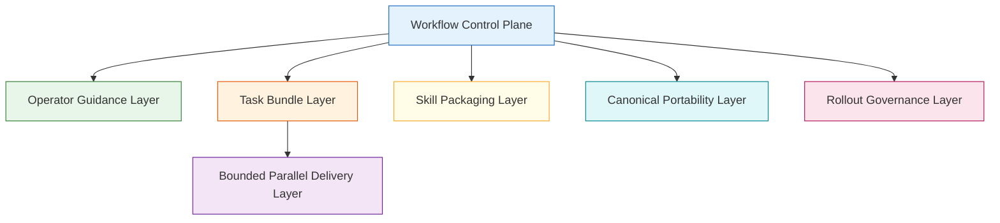
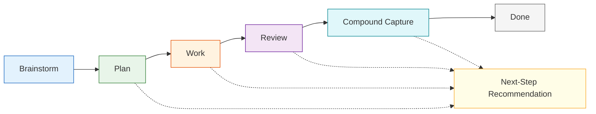
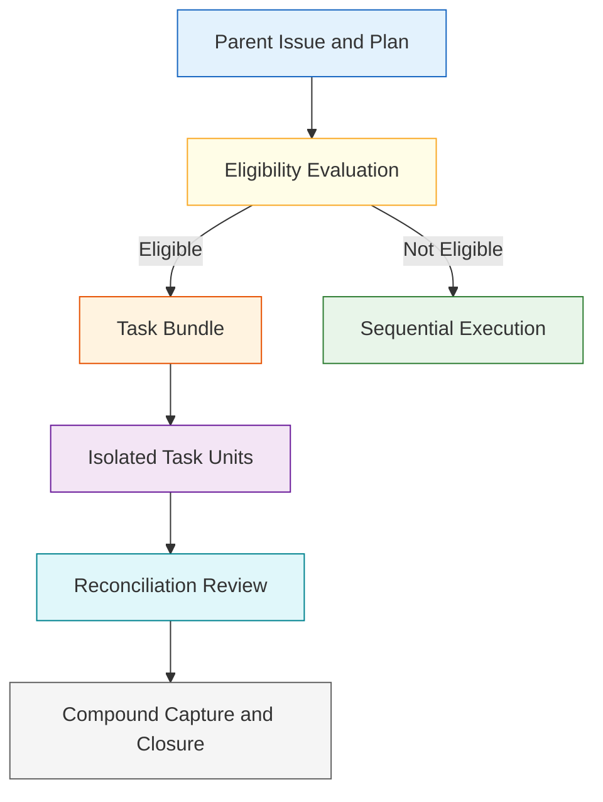
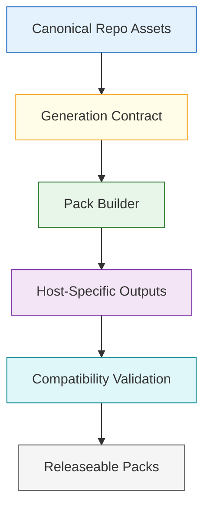
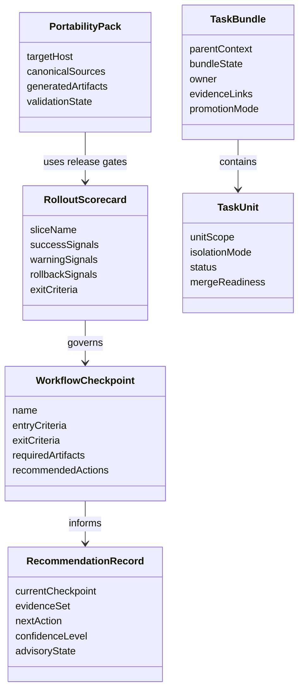

# Technical Specification: Compound Workflow And Portability Expansion

**Issue**: #215
**Status**: Draft
**Author**: GitHub Copilot, Solution Architect Agent
**Date**: 2026-03-13
**Related ADR**: [ADR-215.md](../adr/ADR-215.md)
**Related PRD**: [PRD-215.md](../prd/PRD-215.md)

---

## Table of Contents

1. [Overview](#1-overview)
2. [Goals And Non-Goals](#2-goals-and-non-goals)
3. [Architecture](#3-architecture)
4. [Component Design](#4-component-design)
5. [Data Model](#5-data-model)
6. [API Design](#6-api-design)
7. [Security](#7-security)
8. [Performance](#8-performance)
9. [Error Handling](#9-error-handling)
10. [Monitoring](#10-monitoring)
11. [Testing Strategy](#11-testing-strategy)
12. [Migration Plan](#12-migration-plan)
13. [Open Questions](#13-open-questions)

---

## 1. Overview

This specification defines the architecture for expanding AgentX from a set of strong but loosely connected workflow capabilities into a unified control plane for brainstorm, plan, work, review, and compound capture, with explicit extension seams for task bundles, bounded parallel delivery, skill packaging, and canonical portability. The design keeps the control plane deterministic and artifact-centric while allowing AI-assisted operator guidance and later orchestration capabilities to layer on top. [Confidence: HIGH]

### AI-First Assessment

The initiative should use a hybrid architecture. Deterministic artifact inspection, workflow-state resolution, eligibility checks, and rollout scorecards form the non-AI control plane. AI-assisted behavior should sit above that layer to provide checkpoint guidance, summarization, narrowing, and future orchestration support without becoming the authority on workflow state. [Confidence: HIGH]

### Scope

- In scope: workflow checkpoints, operator guidance surfaces, next-step recommendation model, rollout scorecards, task-bundle architecture, bounded parallel-delivery seams, skill-packaging seams, and canonical portability-generation boundaries. [Confidence: HIGH]
- Out of scope: implementation of every later-phase feature, exact task-bundle persistence schema, exact portability-build pipeline mechanics, and direct source-code changes for all surfaces. [Confidence: HIGH]

### Success Criteria

- Phase-1 workflow checkpoints are explicit, consistent, and reusable across major product surfaces. [Confidence: HIGH]
- Later task-bundle and bounded parallel-delivery features can extend the same control plane without redefining workflow state. [Confidence: HIGH]
- Canonical portability can generate host outputs from repo-native assets without changing product identity. [Confidence: HIGH]

---

## 2. Goals And Non-Goals

### Goals

- Define a stable workflow control plane for brainstorm, plan, work, review, and compound capture. [Confidence: HIGH]
- Create explicit extension seams for task bundles and bounded parallel delivery. [Confidence: HIGH]
- Define how canonical repo assets generate portable host surfaces. [Confidence: HIGH]
- Establish rollout governance before advanced workflow automation expands. [Confidence: HIGH]

### Non-Goals

- Do not replace the current AgentX issue hierarchy or workflow-state model. [Confidence: HIGH]
- Do not make parallel execution the default behavior for work delivery. [Confidence: HIGH]
- Do not create host-specific workflow contracts that diverge from the repo contract. [Confidence: HIGH]
- Do not require immediate implementation of every later-phase workstream in this epic. [Confidence: HIGH]

---

## 3. Architecture

### 3.1 Layered Initiative Architecture

**Architectural decision:** The workflow control plane is the primary layer. All later capabilities extend it rather than bypassing it. [Confidence: HIGH]

### 3.2 Workflow Checkpoint Architecture

**Architectural decision:** Checkpoints are explicit lifecycle stages with artifact evidence and entry criteria. The recommendation engine is advisory and evidence-backed, not a hidden state machine. [Confidence: HIGH]

### 3.3 Task Decomposition And Bounded Orchestration Architecture

**Architectural decision:** Bounded parallel delivery is a later opt-in extension mediated by eligibility rules and reconciliation review. It is not a separate workflow. [Confidence: HIGH]

### 3.4 Canonical Portability Architecture

**Architectural decision:** Portability outputs must be generated from canonical repo assets and validated for drift. [Confidence: HIGH]

---

## 4. Component Design

### 4.1 Workflow Control Plane

| Component | Responsibility | Phase |
|-----------|----------------|-------|
| Checkpoint resolver | Determine current checkpoint from issue, artifact, and review evidence | Phase 1 |
| Entry-point contract | Define what each operator surface can trigger at each checkpoint | Phase 1 |
| Recommendation engine | Recommend the next action from deterministic evidence plus optional AI synthesis | Phase 1 |
| Rollout scorecard controller | Define success, warning, and rollback thresholds for slices | Phase 1 |

### 4.2 Task Bundle Layer

| Component | Responsibility | Phase |
|-----------|----------------|-------|
| Bundle contract | Represent decomposed work items, ownership, state, evidence, and promotion paths | Later phase |
| Promotion rules | Convert bundle items into normal AgentX issues or review findings when needed | Later phase |
| Bundle surfaces | Expose creation, review, and closure through CLI, chat, and sidebar surfaces | Later phase |

### 4.3 Bounded Parallel Delivery Layer

| Component | Responsibility | Phase |
|-----------|----------------|-------|
| Eligibility evaluator | Decide whether work can safely decompose into isolated units | Later phase |
| Task-unit controller | Manage isolation boundary, scope, and recovery guidance | Later phase |
| Reconciliation controller | Merge outcomes through review-first conflict and acceptance checks | Later phase |

### 4.4 Skill Packaging Layer

| Component | Responsibility | Phase |
|-----------|----------------|-------|
| Workflow-phase metadata contract | Extend skill routing with checkpoint and compatibility hints | Later phase |
| Skill scaffold flow | Create consistent skill-pack and reference structure | Later phase |
| Skill review scorecard | Assess routing value, maintenance cost, and evidence quality | Later phase |

### 4.5 Canonical Portability Layer

| Component | Responsibility | Phase |
|-----------|----------------|-------|
| Portability manifest | Declare canonical generation boundaries and source-of-truth files | Later phase |
| Pack generator | Emit host-facing outputs from canonical assets | Later phase |
| Compatibility validator | Detect drift between generated outputs and canonical repo assets | Later phase |

---

## 5. Data Model

### 5.1 Conceptual Model

### 5.2 Required Logical Fields

| Entity | Required Fields | Purpose |
|-------|------------------|---------|
| WorkflowCheckpoint | name, entry criteria, exit criteria, artifact list | Resolve lifecycle stage and obligations |
| RecommendationRecord | current checkpoint, evidence basis, next action, advisory state | Explain what the operator should do next |
| RolloutScorecard | slice name, success signals, warning signals, rollback signals, exit criteria | Govern bounded rollout |
| TaskBundle | parent issue, owner, state, evidence links, promotion path | Represent decomposed work coherently |
| TaskUnit | scope, isolation mode, status, reconciliation state | Represent one bounded execution unit |
| PortabilityPack | target host, canonical sources, generated outputs, validation state | Keep generated host outputs inspectable |

### 5.3 Artifact Classification Rules

| Artifact Family | Role | Notes |
|-----------------|------|-------|
| Scope artifacts | Define initiative, feature, and story intent | PRD, issue bodies, plan context |
| Control-plane artifacts | Resolve checkpoints and rollout state | execution plan, progress log, workflow guide |
| Review and compound artifacts | Support closure and reusable capture | review docs, learnings, durable findings |
| Decomposition artifacts | Represent later task bundles and task units | introduced in later phases |
| Portability artifacts | Represent canonical generation and validation outputs | introduced in later phases |

---

## 6. API Design

This specification defines contract operations, not code-level APIs.

### 6.1 Workflow Operations

| Operation | Input | Output | Purpose |
|----------|-------|--------|---------|
| Resolve checkpoint | issue context, artifact presence, review state | current checkpoint plus missing evidence | Determine current lifecycle stage |
| Recommend next action | current checkpoint, available surfaces, evidence set | advisory next step | Guide operators coherently |
| Validate slice readiness | rollout scorecard plus slice evidence | proceed, warn, or block | Govern phase rollout |
| Resolve bundle eligibility | issue context, dependency profile, overlap profile | eligible or sequential-only | Gate bounded parallel delivery |
| Validate pack generation | portability manifest plus generated outputs | pass, drift, or fail | Protect canonical host outputs |

### 6.2 Surface Contract

| Surface | Required Role In Phase 1 | Later Role |
|---------|--------------------------|-----------|
| Docs | Source of truth for checkpoint and rollout contract | Continues as canonical contract |
| Chat | Advisory checkpoint entry and guidance | Adds task-bundle and orchestration workflows |
| Command palette | Explicit checkpoint entry points and rollout inspection | Adds bundle and portability operations |
| Sidebar | Current checkpoint visibility and next-step recommendations | Adds bundle health and portability summaries |
| CLI | Local and automation-compatible contract access | Adds portability and decomposition operations |

### 6.3 Rollout-Gate Inputs

| Input | Description | Effect |
|------|-------------|--------|
| Adoption signal | Evidence that operators can use the surface as intended | Supports slice promotion |
| Friction signal | Evidence of confusion, detours, or manual stitching | Triggers warning or rollback review |
| Quality signal | Review quality, closure quality, or drift reduction evidence | Supports broader rollout |
| Recovery readiness | Presence of a rollback or containment path | Gates irreversible rollout decisions |

---

## 7. Security

- Workflow recommendations must not grant hidden capabilities or bypass the repo's normal permission boundaries. [Confidence: HIGH]
- Task bundles and task units must preserve the same security expectations as their parent work item, including evidence traceability. [Confidence: HIGH]
- Portability generation must not leak host-specific secrets or embed environment-sensitive configuration into generated documentation or packs. [Confidence: HIGH]
- AI-assisted guidance must remain bounded by deterministic artifact evidence to avoid unsafe or misleading workflow transitions. [Confidence: HIGH]

---

## 8. Performance

- Checkpoint resolution should rely on existing repo artifacts and status evidence, not broad scans across unrelated content. [Confidence: HIGH]
- Next-step recommendations should remain lightweight enough for normal operator use in extension, chat, and CLI surfaces. [Confidence: HIGH]
- Bundle-eligibility and portability-validation operations should be bounded and incremental rather than requiring full regeneration or full-repo recomputation for every action. [Confidence: HIGH]

| Concern | Target |
|--------|--------|
| Checkpoint resolution | Near-instant from artifact presence and state evidence |
| Recommendation latency | Short enough to feel interactive in operator surfaces |
| Rollout scorecard resolution | Fast enough for routine release and pilot reviews |
| Portability drift detection | Incremental and repeatable |

---

## 9. Error Handling

| Failure Mode | Expected Behavior | Recovery |
|-------------|-------------------|----------|
| Checkpoint cannot be resolved confidently | Report ambiguity and show missing evidence instead of guessing | Request missing artifact or fall back to manual selection |
| Entry point is triggered without prerequisite artifacts | Block transition and list required artifacts | Complete prerequisites first |
| Bundle decomposition requested for ineligible work | Deny decomposition and retain sequential workflow | Revisit after dependencies shrink or scope changes |
| Task-unit reconciliation incomplete | Prevent parent closure | Complete reconciliation review first |
| Generated portability output drifts from canonical assets | Mark pack validation failed and block release use | Repair canonical source or generation rule |

**Design choice:** The control plane should fail closed when required artifact evidence is missing, but remain advisory-first in how it surfaces the problem to operators. [Confidence: HIGH]

---

## 10. Monitoring

### 10.1 Observability Model

### 10.2 Monitoring Requirements

| Signal | Why It Matters |
|-------|----------------|
| Checkpoint-resolution success rate | Shows whether the control plane can read current artifact state reliably |
| Recommendation acceptance and bypass rate | Shows whether guidance is useful or ignored |
| Rollout warning frequency | Shows whether a slice is causing friction or regression |
| Bundle decomposition rejection rate | Shows whether eligibility rules are too broad or too strict |
| Portability drift failures | Shows whether generated outputs are staying aligned with canonical assets |

### 10.3 Rollout Review Cadence

- Review scorecards at each pilot exit gate. [Confidence: HIGH]
- Review recommendation usefulness before expanding surface coverage. [Confidence: HIGH]
- Review portability drift metrics before widening host-output scope. [Confidence: HIGH]

---

## 11. Testing Strategy

| Test Layer | Focus | Phase |
|-----------|-------|-------|
| Contract tests | Checkpoint resolution, prerequisite validation, rollout-gate logic | Phase 1 |
| Surface integration tests | Shared wording and recommended-action behavior across chat, commands, sidebar, and CLI | Phase 1 |
| Artifact tests | Presence and consistency of plans, reviews, learnings, and durable findings in checkpoint resolution | Phase 1 |
| Decomposition tests | Eligibility, bundle state, and reconciliation rules | Later phase |
| Portability tests | Manifest correctness, pack generation, and drift validation | Later phase |

### Test Principles

- Test deterministic control-plane logic before AI-assisted synthesis layers. [Confidence: HIGH]
- Use the existing AgentX artifact families as the basis for realistic scenario tests. [Confidence: HIGH]
- Keep later-phase decomposition and portability tests isolated until the control plane is stable. [Confidence: HIGH]

---

## 12. Migration Plan

### Phase 1: Control Plane And Rollout Discipline

1. Define checkpoint contracts and rollout scorecards in durable docs.
2. Add operator entry points and recommendation surfaces without removing current workflow access paths.
3. Validate recommendation behavior and rollout scoring on pilot slices.

### Phase 2: Task Bundles And Bounded Parallel Delivery

1. Introduce task-bundle artifact contract and promotion rules.
2. Add eligibility evaluation and isolated task-unit model.
3. Add reconciliation review before parent closure.

### Phase 3: Skill Packaging And Canonical Portability

1. Extend skill metadata and scaffolding flows.
2. Define portability manifest and generation boundaries.
3. Add generation and compatibility validation for target hosts.

### Migration Principles

- Keep current workflow states and issue hierarchy stable throughout migration. [Confidence: HIGH]
- Add new surfaces alongside old ones until checkpoint guidance is proven. [Confidence: HIGH]
- Treat generated portability outputs as releaseable only after compatibility validation is in place. [Confidence: HIGH]

---

## 13. Open Questions

1. Which surfaces should be mandatory in phase 1 for checkpoint entry and next-step recommendations?
2. Should rollout scorecards live only in durable docs, or also in execution artifacts for each active slice?
3. What is the minimum task-bundle artifact shape needed before bounded parallel delivery begins?
4. Which host outputs should be prioritized first once portability generation starts?
5. How much recommendation evidence should be shown to operators by default before the surface becomes noisy?
