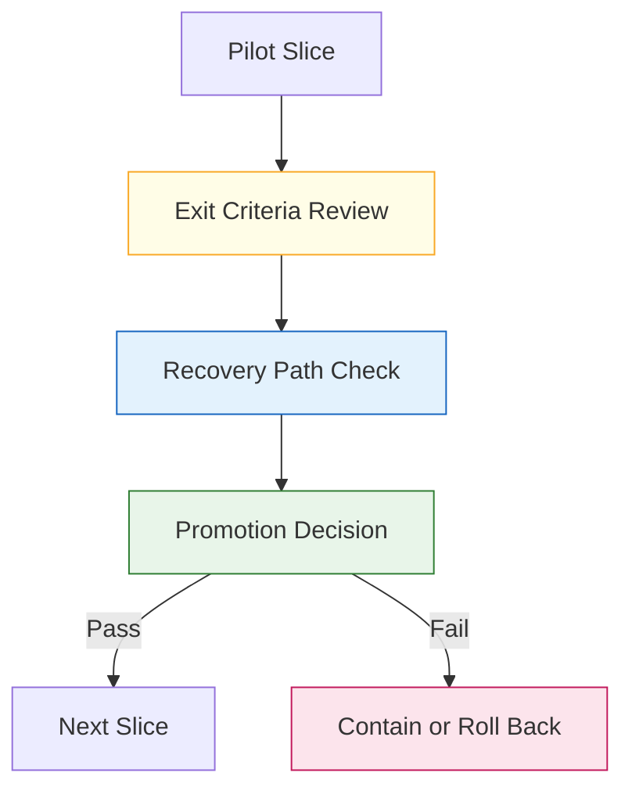
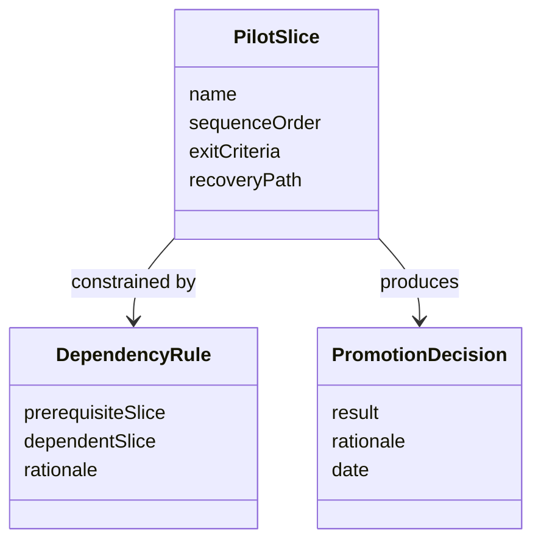

# Technical Specification: Pilot Order And Exit Criteria

**Issue**: #217
**Epic**: #215
**Feature**: #216
**Status**: Draft
**Author**: GitHub Copilot, Solution Architect Agent
**Date**: 2026-03-13
**Related ADR**: [ADR-215.md](../adr/ADR-215.md)
**Related PRD**: [PRD-215.md](../prd/PRD-215.md)

---

## Table of Contents

1. [Overview](#1-overview)
2. [Goals And Non-Goals](#2-goals-and-non-goals)
3. [Architecture](#3-architecture)
4. [Component Design](#4-component-design)
5. [Data Model](#5-data-model)
6. [API Design](#6-api-design)
7. [Security](#7-security)
8. [Performance](#8-performance)
9. [Error Handling](#9-error-handling)
10. [Monitoring](#10-monitoring)
11. [Testing Strategy](#11-testing-strategy)
12. [Migration Plan](#12-migration-plan)
13. [Open Questions](#13-open-questions)

---

## 1. Overview

This specification defines the bounded pilot sequence and exit criteria for the rollout of epic #215. It establishes the order in which workflow cohesion, later decomposition work, bounded parallel delivery, skill packaging, and portability work should advance, along with the explicit recovery path required before moving to the next slice. [Confidence: HIGH]

### AI-First Assessment

Pilot ordering and exit criteria should remain deterministic and governance-led. AI may later summarize pilot findings, but pilot progression itself must be based on explicit scorecard outcomes and dependency checks. [Confidence: HIGH]

### Scope

- In scope: rollout slice ordering, exit criteria, dependency articulation, and recovery-path requirements. [Confidence: HIGH]
- Out of scope: the scorecard row model, operator enablement content, and implementation details of the slices themselves. [Confidence: HIGH]

### Success Criteria

- Workflow cohesion advances before bounded parallel delivery and portability automation. [Confidence: HIGH]
- Each pilot slice has explicit exit criteria and a recovery path. [Confidence: HIGH]
- Dependencies are documented clearly enough to support incremental rollout. [Confidence: HIGH]

---

## 2. Goals And Non-Goals

### Goals

- Sequence initiative delivery in the safest order. [Confidence: HIGH]
- Prevent later, riskier slices from outrunning rollout evidence. [Confidence: HIGH]
- Make rollback and containment expectations explicit before promotion. [Confidence: HIGH]

### Non-Goals

- Do not replace the rollout scorecard. [Confidence: HIGH]
- Do not define feature-level implementation details. [Confidence: HIGH]
- Do not force later slices into phase one if the prerequisites are not met. [Confidence: HIGH]

---

## 3. Architecture

### 3.1 Pilot Sequence Architecture

**Architectural decision:** Workflow cohesion must prove value first because all later slices assume a stable control plane and shared operator language. [Confidence: HIGH]

### 3.2 Exit-Control Model

**Architectural decision:** A slice cannot promote solely on positive value signals; it also needs an explicit recovery path. [Confidence: HIGH]

---

## 4. Component Design

### 4.1 Pilot Governance Components

| Component | Responsibility | Output |
|-----------|----------------|--------|
| Sequence registry | Define rollout order | Ordered slice list |
| Exit criteria set | Define what success means for each slice | Promotion rule set |
| Recovery requirement | Define rollback or containment path | Safety gate |
| Dependency map | Explain prerequisite relationships between slices | Rollout constraint map |

### 4.2 Pilot Slice Set

| Slice | Role In Initiative | Promotion Requirement |
|-------|--------------------|-----------------------|
| Workflow cohesion | Stabilize the control plane and surface language | Scorecard approved and operator flow coherent |
| Task bundles | Introduce decomposition contract | Cohesion stable and promotion rules clear |
| Bounded parallel delivery | Introduce controlled concurrency | Bundle model stable and reconciliation rules accepted |
| Skill packaging | Improve authoring and routing consistency | Control plane and decomposition stable |
| Portability generation | Generate host outputs from canonical assets | Core contracts proven and drift validation ready |

---

## 5. Data Model

### 5.1 Conceptual Model

### 5.2 Required Logical Fields

| Entity | Required Fields | Purpose |
|-------|------------------|---------|
| PilotSlice | name, sequence order, exit criteria, recovery path | Define one rollout step |
| DependencyRule | prerequisite slice, dependent slice, rationale | Preserve incremental order |
| PromotionDecision | result, rationale, reviewer | Record a bounded outcome |

---

## 6. API Design

This story defines governance operations, not code-level APIs.

### 6.1 Contract Operations

| Operation | Input | Output | Purpose |
|----------|-------|--------|---------|
| Resolve next slice | current approved slice set | next eligible slice | Bound rollout order |
| Validate exit criteria | pilot slice plus evidence | pass or fail | Support promotion |
| Validate recovery path | pilot slice | available or missing | Prevent unsafe promotion |

---

## 7. Security

- Pilot progression must not depend on undocumented tribal knowledge or hidden operational assumptions. [Confidence: HIGH]
- Recovery paths must be explicit before later slices are exposed more broadly. [Confidence: HIGH]

---

## 8. Performance

- Pilot review should remain lightweight and compatible with normal release cadence. [Confidence: MEDIUM]
- Sequence resolution should be immediate once scorecard and dependency artifacts are current. [Confidence: MEDIUM]

---

## 9. Error Handling

| Failure Mode | Expected Behavior | Recovery |
|-------------|-------------------|----------|
| Exit criteria unclear | Block promotion | Clarify the slice gate first |
| Recovery path absent | Block promotion | Add rollback or containment guidance |
| Dependency conflict | Pause the next slice | Reconcile sequence assumptions |

---

## 10. Monitoring

- Monitor slices that remain blocked across multiple review cycles. [Confidence: MEDIUM]
- Monitor whether later slices repeatedly fail due to gaps in earlier exit criteria. [Confidence: MEDIUM]

---

## 11. Testing Strategy

- Review the proposed sequence against the initiative plan and scorecard before implementation starts. [Confidence: HIGH]
- Validate that each slice has an explicit recovery path and dependency rationale. [Confidence: HIGH]
- Run a dry promotion exercise for the workflow-cohesion slice before approving later work. [Confidence: MEDIUM]

---

## 12. Migration Plan

1. Finalize the rollout scorecard in story #219. [Confidence: HIGH]
2. Publish the bounded pilot sequence and exit criteria contract. [Confidence: HIGH]
3. Use the contract to approve only the next eligible slice at each review point. [Confidence: HIGH]

---

## 13. Open Questions

1. Should skill-packaging work advance before bounded parallel delivery if the control-plane work proves stable sooner?
2. What minimum review evidence should be required before declaring workflow cohesion proven?
3. Should portability generation require its own pre-pilot readiness checklist in addition to slice exit criteria?
