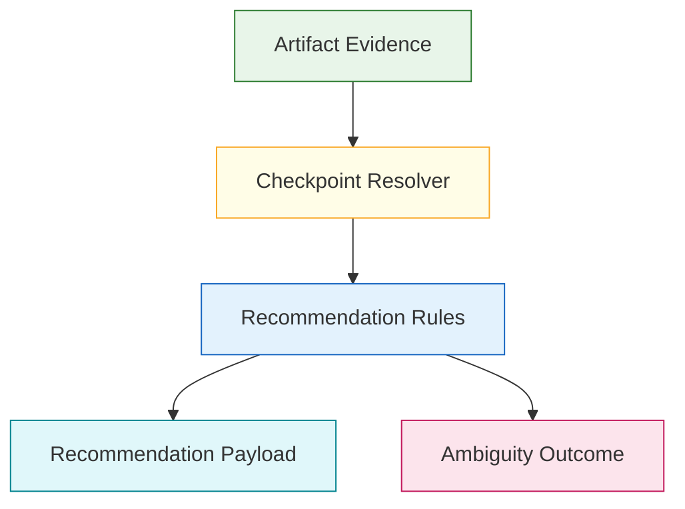
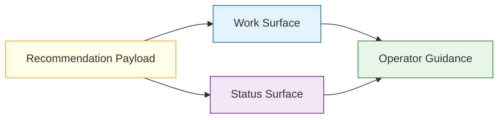
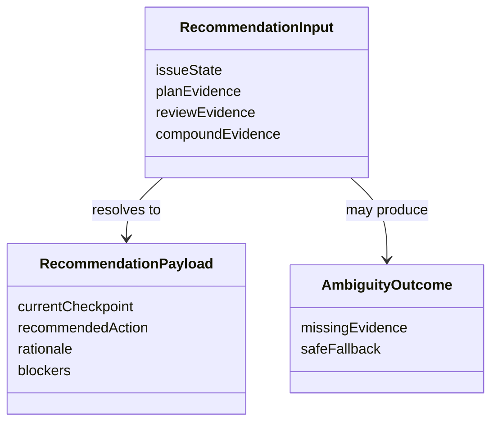

# Technical Specification: Context-Sensitive Next-Step Recommendations

**Issue**: #218
**Epic**: #215
**Feature**: #214
**Status**: Draft
**Author**: GitHub Copilot, Solution Architect Agent
**Date**: 2026-03-13
**Related ADR**: [ADR-215.md](../adr/ADR-215.md)
**Related PRD**: [PRD-215.md](../prd/PRD-215.md)

---

## Table of Contents

1. [Overview](#1-overview)
2. [Goals And Non-Goals](#2-goals-and-non-goals)
3. [Architecture](#3-architecture)
4. [Component Design](#4-component-design)
5. [Data Model](#5-data-model)
6. [API Design](#6-api-design)
7. [Security](#7-security)
8. [Performance](#8-performance)
9. [Error Handling](#9-error-handling)
10. [Monitoring](#10-monitoring)
11. [Testing Strategy](#11-testing-strategy)
12. [Migration Plan](#12-migration-plan)
13. [Open Questions](#13-open-questions)

---

## 1. Overview

This specification defines the advisory next-step recommendation model for the guided workflow loop. It determines how current artifact state maps to the current checkpoint, the next recommended action, and the safe explanation shown to operators when evidence is incomplete or ambiguous. [Confidence: HIGH]

### AI-First Assessment

The recommendation model should resolve from deterministic artifact evidence first. AI may later contribute optional phrasing or synthesis, but it must not replace the explicit evidence-to-recommendation contract in phase one. [Confidence: HIGH]

### Scope

- In scope: evidence inputs, recommendation rules, ambiguity behavior, normalized output payload, and shared Work and Status surface expectations. [Confidence: HIGH]
- Out of scope: checkpoint definitions, entry-point launch logic, direct runtime implementation details, and hidden state transitions. [Confidence: HIGH]

### Success Criteria

- Work and Status surfaces can present the same recommendation contract from current artifact state. [Confidence: HIGH]
- Recommendation rules react to plan, review, and compound evidence already present in the repo. [Confidence: HIGH]
- Ambiguous cases fail closed and remain side-effect free. [Confidence: HIGH]

---

## 2. Goals And Non-Goals

### Goals

- Reduce operator guesswork about the next workflow action. [Confidence: HIGH]
- Keep guidance deterministic, testable, and explainable. [Confidence: HIGH]
- Reuse the checkpoint vocabulary from story #220. [Confidence: HIGH]

### Non-Goals

- Do not silently trigger workflow transitions or hidden side effects. [Confidence: HIGH]
- Do not depend on conversational memory alone for recommendation quality. [Confidence: HIGH]
- Do not introduce an AI-only reasoning layer as the source of truth. [Confidence: HIGH]

---

## 3. Architecture

### 3.1 Recommendation Resolution Architecture

**Architectural decision:** Recommendation resolution is downstream of checkpoint resolution and must reuse the same lifecycle vocabulary. [Confidence: HIGH]

### 3.2 Shared Surface Output Model

**Architectural decision:** The same normalized recommendation payload should feed multiple surfaces so guidance does not drift by channel. [Confidence: HIGH]

---

## 4. Component Design

### 4.1 Recommendation Components

| Component | Responsibility | Output |
|-----------|----------------|--------|
| Evidence reader | Read issue and artifact state relevant to the guided loop | Evidence set |
| Checkpoint resolver | Determine current checkpoint or ambiguity | Checkpoint state |
| Recommendation rules | Map checkpoint plus evidence to next action | Next-step decision |
| Payload normalizer | Produce one shared recommendation payload | Surface-ready guidance |
| Ambiguity handler | Explain why no confident recommendation exists | Safe fallback guidance |

### 4.2 Evidence Inputs

| Evidence Type | Example | Purpose |
|---------------|---------|---------|
| Scope evidence | story state, parent linkage | Determine active work context |
| Planning evidence | execution plan, progress log | Determine planning maturity |
| Review evidence | review findings, approval state | Determine review readiness |
| Compound evidence | capture artifact or explicit skip rationale | Determine closure state |

---

## 5. Data Model

### 5.1 Conceptual Model

### 5.2 Required Logical Fields

| Entity | Required Fields | Purpose |
|-------|------------------|---------|
| RecommendationInput | issue state, relevant evidence references | Drive resolution |
| RecommendationPayload | current checkpoint, next action, rationale, blockers | Provide shared guidance |
| AmbiguityOutcome | missing evidence list, safe fallback | Handle uncertainty |

---

## 6. API Design

This story defines contract operations, not code-level APIs.

### 6.1 Contract Operations

| Operation | Input | Output | Purpose |
|----------|-------|--------|---------|
| Resolve recommendation | evidence input set | recommendation payload or ambiguity outcome | Produce operator guidance |
| Normalize payload | recommendation result | shared display contract | Keep surfaces aligned |
| Explain ambiguity | ambiguity state | missing evidence and safe fallback | Avoid false certainty |

### 6.2 Surface Contract

| Surface | Requirement |
|---------|-------------|
| Work | Show the normalized recommendation contract |
| Status | Show the same normalized recommendation contract |
| Chat and CLI | Later consumers of the same contract |

---

## 7. Security

- Recommendations must not expose hidden workflow state or private workspace details beyond what operators already have access to. [Confidence: HIGH]
- The recommendation engine must remain side-effect free to avoid privilege or execution surprises. [Confidence: HIGH]

---

## 8. Performance

- Recommendation resolution should be lightweight enough for interactive use in multiple surfaces. [Confidence: HIGH]
- The model should resolve from existing artifacts rather than expensive repository-wide recomputation. [Confidence: HIGH]

---

## 9. Error Handling

| Failure Mode | Expected Behavior | Recovery |
|-------------|-------------------|----------|
| Evidence incomplete | Return ambiguity outcome | Produce the missing artifact or use manual guidance |
| Recommendation conflict | Return blockers and warning rationale | Resolve contradictory artifacts first |
| Payload mismatch across surfaces | Treat as implementation defect | Reuse the shared payload contract |

---

## 10. Monitoring

- Monitor repeated ambiguity outcomes to identify weak artifact coverage. [Confidence: MEDIUM]
- Monitor whether recommendation outputs align with later review and closure outcomes. [Confidence: MEDIUM]

---

## 11. Testing Strategy

- Validate recommendation resolution across representative plan, work, review, and compound states. [Confidence: HIGH]
- Verify that Work and Status surfaces can render the same payload without semantic drift. [Confidence: HIGH]
- Test ambiguous and contradictory evidence cases explicitly. [Confidence: HIGH]

---

## 12. Migration Plan

1. Finalize the checkpoint contract in story #220. [Confidence: HIGH]
2. Author the recommendation matrix and normalized payload contract. [Confidence: HIGH]
3. Introduce surface implementations only after the shared contract is accepted. [Confidence: HIGH]
4. Layer optional AI phrasing later if deterministic outputs prove stable. [Confidence: MEDIUM]

---

## 13. Open Questions

1. Which recommendation fields are mandatory for phase-one Work and Status surfaces?
2. How should the contract distinguish between ambiguous state and blocked progression?
3. When should optional AI phrasing be allowed on top of the deterministic payload?
