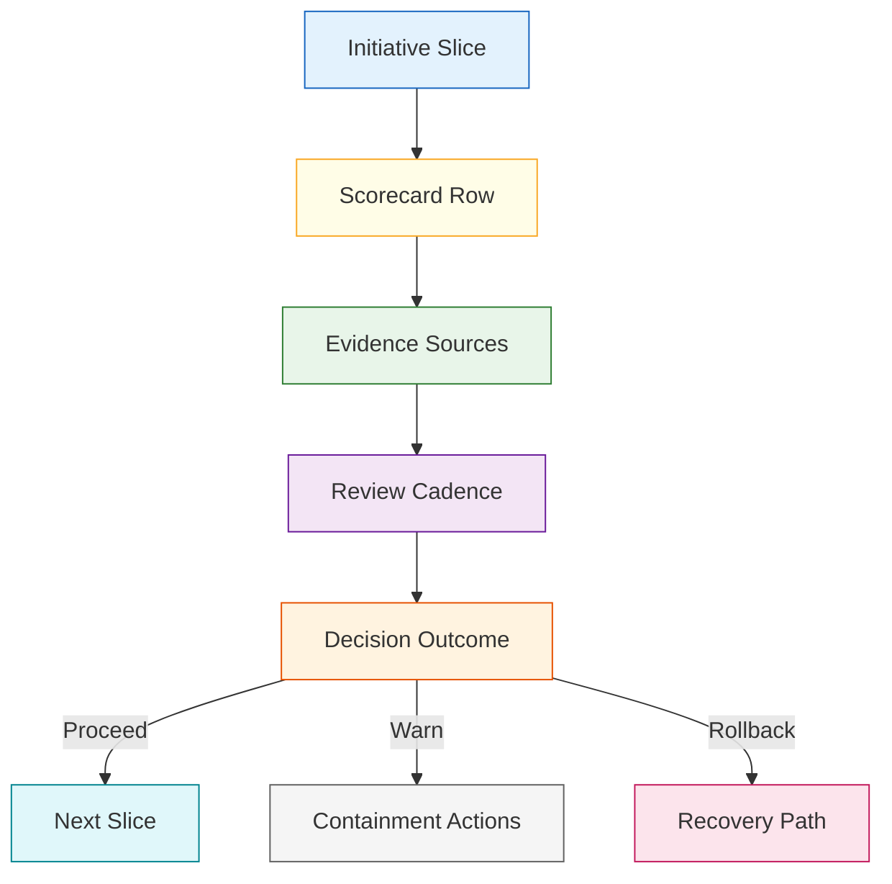
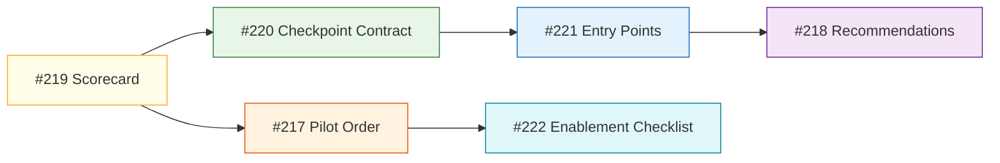
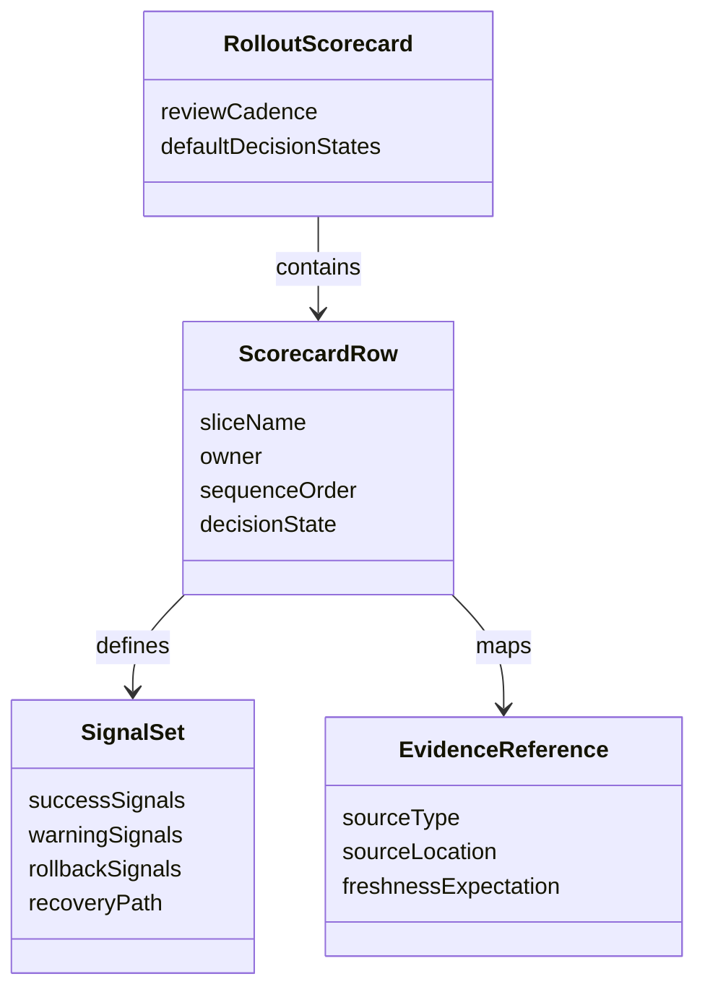

# Technical Specification: Rollout Scorecard

**Issue**: #219
**Epic**: #215
**Feature**: #216
**Status**: Draft
**Author**: GitHub Copilot, Solution Architect Agent
**Date**: 2026-03-13
**Related ADR**: [ADR-215.md](../adr/ADR-215.md)
**Related PRD**: [PRD-215.md](../prd/PRD-215.md)

---

## Table of Contents

1. [Overview](#1-overview)
2. [Goals And Non-Goals](#2-goals-and-non-goals)
3. [Architecture](#3-architecture)
4. [Component Design](#4-component-design)
5. [Data Model](#5-data-model)
6. [API Design](#6-api-design)
7. [Security](#7-security)
8. [Performance](#8-performance)
9. [Error Handling](#9-error-handling)
10. [Monitoring](#10-monitoring)
11. [Testing Strategy](#11-testing-strategy)
12. [Migration Plan](#12-migration-plan)
13. [Open Questions](#13-open-questions)

---

## 1. Overview

This specification defines the rollout scorecard that governs phase-one delivery for epic #215. It establishes a concise, artifact-backed control surface for success, warning, rollback, and recovery decisions across workflow cohesion, later task-bundle work, bounded parallel delivery, skill packaging, and portability slices. [Confidence: HIGH]

### AI-First Assessment

The scorecard should not depend on AI inference for its primary judgments. AI may later summarize operator feedback or produce advisory narratives, but the scorecard itself must resolve from deterministic artifact evidence and explicit review decisions. [Confidence: HIGH]

### Scope

- In scope: scorecard dimensions, workstream rows, evidence mapping, review cadence, decision outcomes, and linkage into rollout reviews. [Confidence: HIGH]
- Out of scope: runtime telemetry implementation, automated hard gates, detailed UI design, and direct code changes in extension or CLI surfaces. [Confidence: HIGH]

### Success Criteria

- Every phase-one slice has explicit success, warning, rollback, and recovery signals. [Confidence: HIGH]
- Every scorecard row maps to current or planned artifacts the repo can realistically produce. [Confidence: HIGH]
- Operators can use the scorecard in release and pilot reviews without reading a long supporting document. [Confidence: HIGH]

---

## 2. Goals And Non-Goals

### Goals

- Create one bounded rollout-control artifact for the initiative. [Confidence: HIGH]
- Make pilot promotion and rollback decisions inspectable and repeatable. [Confidence: HIGH]
- Keep rollout review grounded in repo artifacts rather than opinion alone. [Confidence: HIGH]
- Sequence phase-one work so broader workflow-surface changes do not land without controls. [Confidence: HIGH]

### Non-Goals

- Do not introduce mandatory runtime instrumentation before the control model exists. [Confidence: HIGH]
- Do not create per-surface ad-hoc release checklists that bypass the shared scorecard. [Confidence: HIGH]
- Do not treat the scorecard as a replacement for story acceptance criteria. [Confidence: HIGH]

---

## 3. Architecture

### 3.1 Rollout Control Architecture

**Architectural decision:** The scorecard is the initiative-level rollout controller and is evaluated slice by slice, not only at final release time. [Confidence: HIGH]

### 3.2 Phase-One Interaction Model

**Architectural decision:** The scorecard gates both the guided-workflow feature and the rollout-governance feature, so it must precede downstream implementation work. [Confidence: HIGH]

---

## 4. Component Design

### 4.1 Scorecard Components

| Component | Responsibility | Output |
|-----------|----------------|--------|
| Slice registry | List the rollout slices under review | Ordered scorecard rows |
| Signal model | Define success, warning, rollback, and recovery signals | Threshold set per row |
| Evidence mapper | Tie each signal to artifacts or review evidence | Evidence reference set |
| Review cadence | Define when and by whom the row is assessed | Pilot and closeout checkpoints |
| Decision resolver | Resolve proceed, warn, contain, or rollback | Rollout decision |

### 4.2 Scorecard Dimensions

| Dimension | Description | Use |
|-----------|-------------|-----|
| Adoption | Evidence that operators can use the slice as intended | Promotion signal |
| Friction | Evidence of confusion, detours, or manual stitching | Warning signal |
| Quality | Evidence of cleaner review, closure, or workflow coherence | Promotion or warning signal |
| Recovery readiness | Presence of a rollback or containment path | Safety gate |
| Dependency health | Evidence that upstream prerequisites are satisfied | Sequencing gate |

---

## 5. Data Model

### 5.1 Conceptual Model

### 5.2 Required Logical Fields

| Entity | Required Fields | Purpose |
|-------|------------------|---------|
| ScorecardRow | slice name, owner, sequence order, review cadence | Defines one rollout unit |
| SignalSet | success, warning, rollback, recovery path | Supports bounded decisions |
| EvidenceReference | source type, location, freshness expectation | Keeps review evidence explicit |
| RolloutDecision | state, rationale, date, reviewer | Records a concrete outcome |

---

## 6. API Design

This story defines operational contract surfaces rather than runtime APIs.

### 6.1 Contract Operations

| Operation | Input | Output | Purpose |
|----------|-------|--------|---------|
| Resolve row status | scorecard row plus evidence set | proceed, warn, contain, or rollback | Support review decisions |
| Validate evidence coverage | scorecard row plus evidence map | pass or missing coverage list | Prevent narrative-only review |
| Record review outcome | row plus reviewer decision | durable rollout decision | Preserve history |
| Sequence downstream work | approved row set | allowed next slice list | Bound implementation order |

### 6.2 Surface Contract

| Surface | Required Role |
|---------|---------------|
| Docs | Canonical scorecard definition and review history |
| Chat | Advisory summary of current rollout posture |
| Sidebar and Quality views | Later display of slice status and warnings |
| CLI | Later automation-compatible review access |

---

## 7. Security

- The scorecard must not expose secrets or environment-sensitive operational details in rollout evidence links. [Confidence: HIGH]
- Rollout decisions must remain explainable and traceable to explicit repo artifacts. [Confidence: HIGH]
- AI-generated narrative summaries, if added later, must not override the deterministic row state. [Confidence: HIGH]

---

## 8. Performance

- Scorecard review should stay lightweight enough for routine release and pilot checkpoints. [Confidence: HIGH]
- Evidence collection should favor already-produced artifacts over expensive regeneration or full-repo scans. [Confidence: HIGH]
- Decision resolution should be near-instant once evidence references are assembled. [Confidence: MEDIUM]

---

## 9. Error Handling

| Failure Mode | Expected Behavior | Recovery |
|-------------|-------------------|----------|
| Evidence missing | Mark row incomplete and block promotion | Produce or link the missing artifact |
| Conflicting signals | Resolve row to warning or contain, not proceed | Review recovery path and gather more evidence |
| Row too broad | Split row or narrow the scope | Reissue a smaller rollout slice |
| Recovery path absent | Treat as rollout blocker | Add rollback or containment guidance first |

---

## 10. Monitoring

- Monitor scorecard freshness by ensuring each active slice has a recent review outcome. [Confidence: HIGH]
- Monitor repeated warning states to detect rollout stagnation or unstable slice design. [Confidence: MEDIUM]
- Monitor evidence-source gaps so later automation can target the weakest rows first. [Confidence: MEDIUM]

---

## 11. Testing Strategy

- Validate that each scorecard row maps to observable artifacts rather than narrative claims. [Confidence: HIGH]
- Review the scorecard against all six phase-one stories to confirm coverage and sequencing. [Confidence: HIGH]
- Run a dry review of at least one workflow-cohesion slice and one governance slice before implementation begins. [Confidence: MEDIUM]

---

## 12. Migration Plan

1. Author the durable scorecard artifact for issue #219. [Confidence: HIGH]
2. Reference it from the initiative plan, PRD, and rollout-related stories. [Confidence: HIGH]
3. Use it as the gating review artifact before broader workflow-surface implementation starts. [Confidence: HIGH]
4. Consider later automation only after pilot use proves the row model stable. [Confidence: MEDIUM]

---

## 13. Open Questions

1. Should the scorecard live as a standalone durable artifact, a rollout appendix, or both?
2. Which evidence sources should be mandatory versus advisory for phase one?
3. When should advisory row states become enforcement gates in automation?
