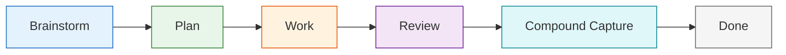
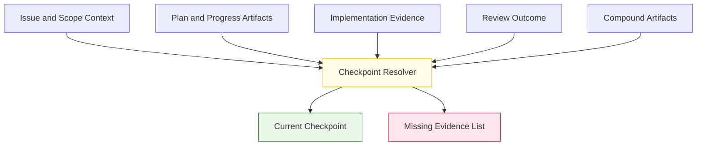
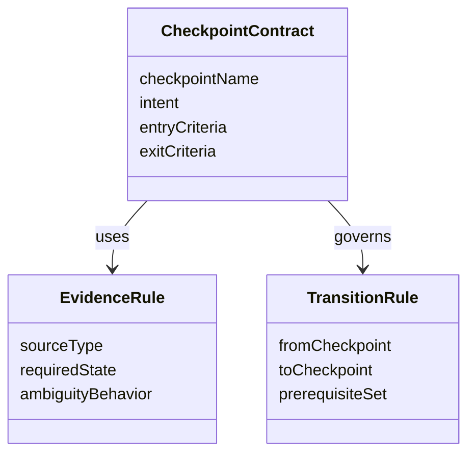

# Technical Specification: Workflow Checkpoint Contract

**Issue**: #220
**Epic**: #215
**Feature**: #214
**Status**: Draft
**Author**: GitHub Copilot, Solution Architect Agent
**Date**: 2026-03-13
**Related ADR**: [ADR-215.md](../adr/ADR-215.md)
**Related PRD**: [PRD-215.md](../prd/PRD-215.md)

---

## Table of Contents

1. [Overview](#1-overview)
2. [Goals And Non-Goals](#2-goals-and-non-goals)
3. [Architecture](#3-architecture)
4. [Component Design](#4-component-design)
5. [Data Model](#5-data-model)
6. [API Design](#6-api-design)
7. [Security](#7-security)
8. [Performance](#8-performance)
9. [Error Handling](#9-error-handling)
10. [Monitoring](#10-monitoring)
11. [Testing Strategy](#11-testing-strategy)
12. [Migration Plan](#12-migration-plan)
13. [Open Questions](#13-open-questions)

---

## 1. Overview

This specification defines the canonical workflow checkpoint contract for brainstorm, plan, work, review, compound capture, and done. It turns the guided loop into an explicit, reusable vocabulary with documented prerequisites, evidence, exit signals, and closeout expectations that later operator-surface work can consume directly. [Confidence: HIGH]

### AI-First Assessment

The checkpoint model should remain deterministic and artifact-based. AI may later help summarize current state or recommend next actions, but the checkpoint contract itself must not depend on opaque model judgment. [Confidence: HIGH]

### Scope

- In scope: checkpoint names, definitions, evidence expectations, dependency rules, and cross-surface language contract. [Confidence: HIGH]
- Out of scope: entry-point implementation, next-step recommendation logic, rollout metrics, and task-bundle or portability behavior. [Confidence: HIGH]

### Success Criteria

- Every checkpoint has a clear purpose, entry criteria, exit criteria, and artifact expectations. [Confidence: HIGH]
- The same checkpoint names can be reused across docs, commands, chat, sidebars, and CLI surfaces. [Confidence: HIGH]
- The contract layers on current AgentX workflow states rather than creating a new state machine. [Confidence: HIGH]

---

## 2. Goals And Non-Goals

### Goals

- Make the operating loop legible across all major product surfaces. [Confidence: HIGH]
- Standardize checkpoint language before entry-point and recommendation work proceeds. [Confidence: HIGH]
- Keep checkpoint resolution tied to explicit artifact evidence. [Confidence: HIGH]

### Non-Goals

- Do not replace the existing workflow state model. [Confidence: HIGH]
- Do not make checkpoint resolution dependent on transient chat history. [Confidence: HIGH]
- Do not define surface-specific behavior that belongs in downstream stories. [Confidence: HIGH]

---

## 3. Architecture

### 3.1 Checkpoint Lifecycle Architecture

**Architectural decision:** The lifecycle is linear at the contract level even though implementation may revisit earlier phases. Re-entry should still reference the same checkpoint names and evidence expectations. [Confidence: HIGH]

### 3.2 Evidence-Backed Resolution Model

**Architectural decision:** Checkpoint resolution must prefer explicit missing-evidence output over inferred certainty when the artifact set is incomplete. [Confidence: HIGH]

---

## 4. Component Design

### 4.1 Checkpoint Contract Components

| Component | Responsibility | Output |
|-----------|----------------|--------|
| Checkpoint registry | Define canonical checkpoint names and sequence | Shared vocabulary |
| Evidence model | Define what artifacts or states support each checkpoint | Resolution rules |
| Dependency model | Describe prerequisites and closeout expectations | Transition constraints |
| Surface-language contract | Require verbatim reuse of names and meanings | Cohesive user language |

### 4.2 Phase Definitions

| Checkpoint | Intent | Entry Signal | Exit Signal |
|------------|--------|--------------|-------------|
| Brainstorm | Explore approach options and shape the work | Need identified but solution not framed | Scope is concrete enough to plan |
| Plan | Define deliverables, sequence, and acceptance intent | Scope is concrete | Execution path and constraints are clear |
| Work | Produce the change or artifact | Plan or story path is approved | Validation-ready output exists |
| Review | Assess correctness, risk, and readiness | Work output exists | Approval or explicit changes requested |
| Compound Capture | Preserve reusable learning or rationale | Review outcome available | Capture recorded or explicit skip rationale accepted |
| Done | Close the lifecycle cleanly | Capture phase resolved | No further required lifecycle work remains |

---

## 5. Data Model

### 5.1 Conceptual Model

### 5.2 Required Logical Fields

| Entity | Required Fields | Purpose |
|-------|------------------|---------|
| CheckpointContract | name, intent, entry criteria, exit criteria | Define one stage |
| EvidenceRule | source type, required state, ambiguity behavior | Support deterministic resolution |
| TransitionRule | from checkpoint, to checkpoint, prerequisites | Bound valid movement |

---

## 6. API Design

This story defines contract operations, not code-level APIs.

### 6.1 Contract Operations

| Operation | Input | Output | Purpose |
|----------|-------|--------|---------|
| Resolve checkpoint | artifact evidence set | current checkpoint plus missing evidence | Support operator guidance |
| Validate transition | current checkpoint plus intended next step | pass or fail plus blockers | Prevent unsupported movement |
| Render checkpoint language | checkpoint plus surface context | shared label and description | Keep surfaces aligned |

### 6.2 Surface Contract

| Surface | Requirement |
|---------|-------------|
| Docs | Canonical definitions and transition expectations |
| Chat | Reuse checkpoint names exactly |
| Command palette | Reuse checkpoint names exactly |
| Sidebar | Display current checkpoint using canonical language |
| CLI | Reuse checkpoint names and ambiguity behavior |

---

## 7. Security

- Checkpoint resolution must not leak hidden system state or privileged context through surface labels. [Confidence: HIGH]
- Surfaces must not imply that a checkpoint transition occurred if prerequisites are missing. [Confidence: HIGH]

---

## 8. Performance

- Checkpoint resolution should rely on current issue and artifact evidence, not broad content searches. [Confidence: HIGH]
- The contract should remain simple enough that downstream surfaces can adopt it without heavy translation layers. [Confidence: HIGH]

---

## 9. Error Handling

| Failure Mode | Expected Behavior | Recovery |
|-------------|-------------------|----------|
| Evidence incomplete | Return checkpoint ambiguity and missing evidence | Produce the missing artifact or choose a manual fallback |
| Surface drift | Flag vocabulary mismatch during review | Align the surface to canonical language |
| Transition unsupported | Block the transition | Satisfy the prerequisite set first |

---

## 10. Monitoring

- Monitor checkpoint-language reuse across shipped surfaces during review. [Confidence: MEDIUM]
- Monitor repeated ambiguity cases to identify weak artifact coverage or unclear contract rules. [Confidence: MEDIUM]

---

## 11. Testing Strategy

- Validate each checkpoint against representative artifact sets from simple and complex work. [Confidence: HIGH]
- Review all planned phase-one surfaces for vocabulary consistency before implementation starts. [Confidence: HIGH]
- Confirm that missing-evidence cases fail closed and explain the gap clearly. [Confidence: HIGH]

---

## 12. Migration Plan

1. Publish the checkpoint contract as the durable workflow-language source of truth. [Confidence: HIGH]
2. Update downstream story artifacts to reference the canonical checkpoint names. [Confidence: HIGH]
3. Implement surface adoption in the order already defined by phase-one sequencing. [Confidence: HIGH]

---

## 13. Open Questions

1. Should brainstorm and done appear in all operator surfaces or only where they add value?
2. Which artifact combinations are sufficient to classify a task as in compound capture versus done?
3. How much detail should each surface expose when checkpoint resolution is ambiguous?
