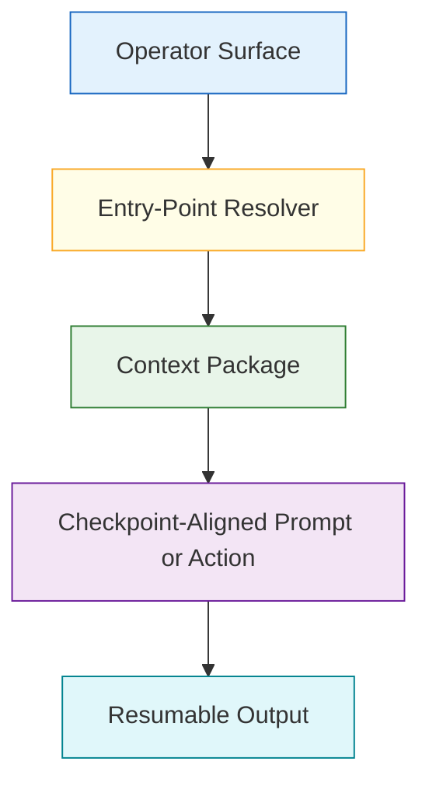
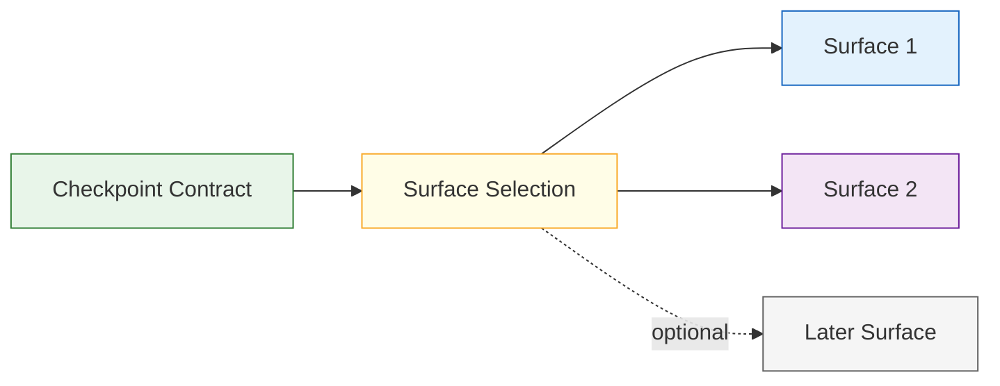
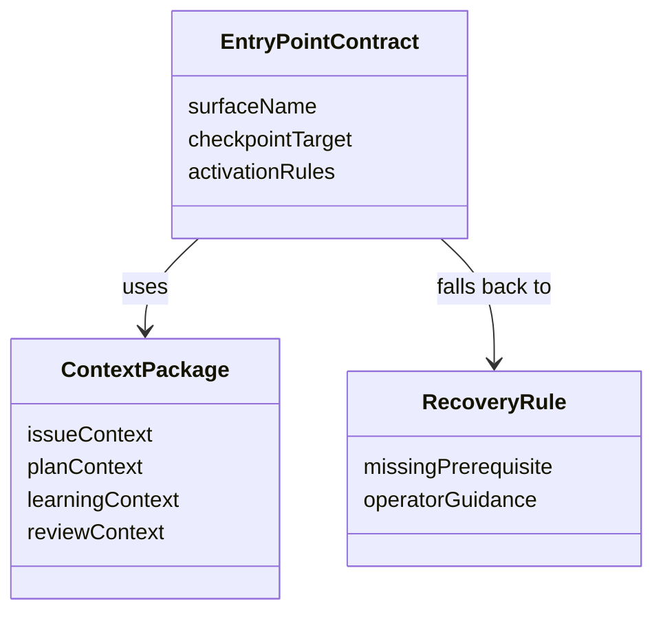

# Technical Specification: Plan-Deepening And Review-Kickoff Entry Points

**Issue**: #221
**Epic**: #215
**Feature**: #214
**Status**: Draft
**Author**: GitHub Copilot, Solution Architect Agent
**Date**: 2026-03-13
**Related ADR**: [ADR-215.md](../adr/ADR-215.md)
**Related PRD**: [PRD-215.md](../prd/PRD-215.md)

---

## Table of Contents

1. [Overview](#1-overview)
2. [Goals And Non-Goals](#2-goals-and-non-goals)
3. [Architecture](#3-architecture)
4. [Component Design](#4-component-design)
5. [Data Model](#5-data-model)
6. [API Design](#6-api-design)
7. [Security](#7-security)
8. [Performance](#8-performance)
9. [Error Handling](#9-error-handling)
10. [Monitoring](#10-monitoring)
11. [Testing Strategy](#11-testing-strategy)
12. [Migration Plan](#12-migration-plan)
13. [Open Questions](#13-open-questions)

---

## 1. Overview

This specification defines the phase-one operator entry points for plan deepening and review kickoff. It creates a reusable contract for launching the next checkpoint with preserved issue, plan, learning, and review context so operators can move intentionally between planning, execution, and review. [Confidence: HIGH]

### AI-First Assessment

AI may help draft the resulting output, but entry-point activation itself should remain deterministic and context-preserving. The contract should specify what context is reused and what happens when that context is missing. [Confidence: HIGH]

### Scope

- In scope: mandatory phase-one entry-point surfaces, launch conditions, reused context, resumability, and fallback behavior. [Confidence: HIGH]
- Out of scope: checkpoint naming, recommendation resolution logic, final UI copy, and automatic transition side effects. [Confidence: HIGH]

### Success Criteria

- At least two operator surfaces can expose documented plan-deepening and review-kickoff entry points. [Confidence: HIGH]
- Each entry point reuses durable context rather than relying on one transient interaction. [Confidence: HIGH]
- The contract stays advisory-first and additive to current workflow behavior. [Confidence: HIGH]

---

## 2. Goals And Non-Goals

### Goals

- Reduce manual stitching between plan, work, and review checkpoints. [Confidence: HIGH]
- Standardize which context package each entry point should reuse. [Confidence: HIGH]
- Bound phase-one rollout to a small number of high-value surfaces. [Confidence: HIGH]

### Non-Goals

- Do not trigger hidden side effects or silent transitions. [Confidence: HIGH]
- Do not require every possible surface to ship in phase one. [Confidence: HIGH]
- Do not redefine checkpoint vocabulary already owned by story #220. [Confidence: HIGH]

---

## 3. Architecture

### 3.1 Entry-Point Launch Architecture

**Architectural decision:** Entry points should launch from a resolved checkpoint context and hand back resumable output rather than acting as opaque shortcuts. [Confidence: HIGH]

### 3.2 Bounded Phase-One Surface Model

**Architectural decision:** Phase one should commit to two mandatory surfaces and leave broader surface rollout for later validation. [Confidence: HIGH]

---

## 4. Component Design

### 4.1 Entry-Point Components

| Component | Responsibility | Output |
|-----------|----------------|--------|
| Surface selector | Identify the first two mandatory surfaces | Bounded rollout target |
| Entry-point resolver | Determine whether plan deepening or review kickoff is valid | Launch decision |
| Context packager | Assemble reusable issue and artifact context | Resumable context package |
| Recovery handler | Explain what is missing when activation cannot proceed | Blocker guidance |

### 4.2 Reused Context Set

| Context Type | Example | Purpose |
|--------------|---------|---------|
| Issue context | issue title, parent, current status | Preserve scope |
| Plan context | execution plan, progress log | Preserve current approach |
| Learning context | related learnings or guidance | Avoid repeated discovery |
| Review context | findings, parity notes, outstanding concerns | Support kickoff and closeout |

---

## 5. Data Model

### 5.1 Conceptual Model

### 5.2 Required Logical Fields

| Entity | Required Fields | Purpose |
|-------|------------------|---------|
| EntryPointContract | surface, target checkpoint, activation rules | Define one entry point |
| ContextPackage | issue context, artifact references, resumability markers | Preserve continuity |
| RecoveryRule | missing prerequisite, operator guidance | Bound failure behavior |

---

## 6. API Design

This story defines contract operations, not code-level APIs.

### 6.1 Contract Operations

| Operation | Input | Output | Purpose |
|----------|-------|--------|---------|
| Resolve entry point | surface plus checkpoint context | allowed or blocked | Decide whether launch is valid |
| Assemble context package | issue and artifact references | normalized context package | Reuse durable context |
| Resume entry point | stored context package | resumed operator flow | Preserve continuity |

### 6.2 Surface Contract

| Surface | Role |
|---------|------|
| Chat | Candidate mandatory surface for checkpoint-aware launches |
| Command palette | Candidate mandatory surface for explicit launches |
| Sidebar | Candidate mandatory or later follow-on surface |
| CLI | Later automation-compatible surface if phase one stays bounded |

---

## 7. Security

- Context packages must not expose secrets or irrelevant private workspace data. [Confidence: HIGH]
- Entry points must not imply that prerequisites are satisfied when required context is missing. [Confidence: HIGH]

---

## 8. Performance

- Context assembly should rely on known issue and artifact references, not broad repository discovery. [Confidence: HIGH]
- Entry-point activation should feel immediate in the chosen phase-one surfaces. [Confidence: MEDIUM]

---

## 9. Error Handling

| Failure Mode | Expected Behavior | Recovery |
|-------------|-------------------|----------|
| Required context missing | Block launch and list missing context | Produce or attach the missing artifact |
| Unsupported checkpoint | Do not launch the entry point | Return to the prior checkpoint |
| Resume data stale | Mark the context package outdated | Refresh from current artifacts |

---

## 10. Monitoring

- Monitor whether operators repeatedly abandon or bypass the documented entry points. [Confidence: MEDIUM]
- Monitor which context fields are most often missing to refine later rollout. [Confidence: MEDIUM]

---

## 11. Testing Strategy

- Validate the chosen surfaces against representative plan-deepening and review-kickoff scenarios. [Confidence: HIGH]
- Test resumability with interrupted and resumed operator flows. [Confidence: HIGH]
- Review fallback behavior for missing plan, review, and learning context. [Confidence: HIGH]

---

## 12. Migration Plan

1. Finalize the checkpoint contract in story #220. [Confidence: HIGH]
2. Select the first two mandatory surfaces for phase one. [Confidence: HIGH]
3. Publish the durable entry-point contract and link it from the feature backlog. [Confidence: HIGH]
4. Implement surface-specific behavior only after the shared contract is stable. [Confidence: HIGH]

---

## 13. Open Questions

1. Which two surfaces provide the best phase-one value with the lowest operator confusion risk?
2. Should plan deepening and review kickoff share one context package shape or two related ones?
3. How much recovery guidance should surfaces show inline versus through linked workflow docs?
