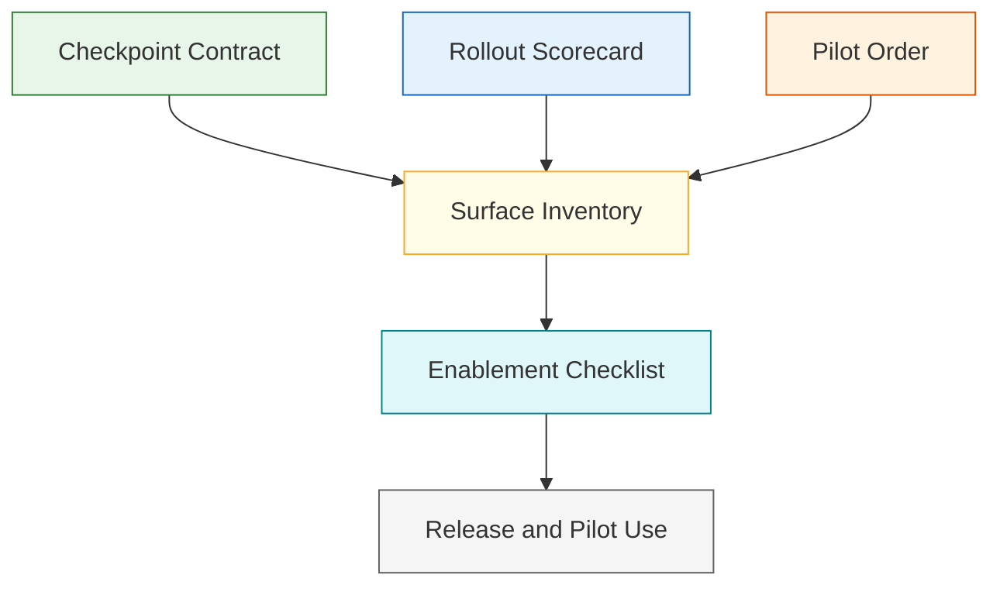
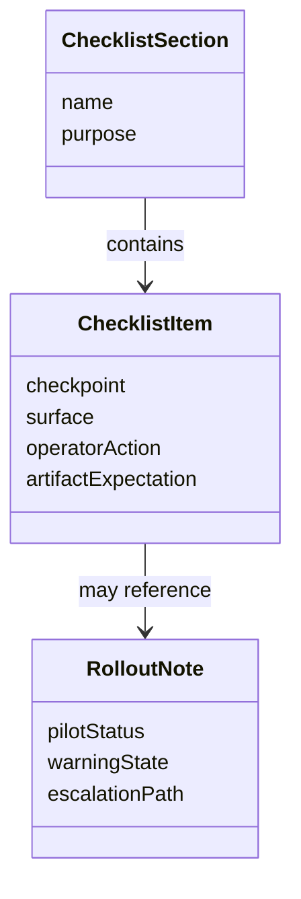

# Technical Specification: Operator Enablement Checklist

**Issue**: #222
**Epic**: #215
**Feature**: #216
**Status**: Draft
**Author**: GitHub Copilot, Solution Architect Agent
**Date**: 2026-03-13
**Related ADR**: [ADR-215.md](../adr/ADR-215.md)
**Related PRD**: [PRD-215.md](../prd/PRD-215.md)

---

## Table of Contents

1. [Overview](#1-overview)
2. [Goals And Non-Goals](#2-goals-and-non-goals)
3. [Architecture](#3-architecture)
4. [Component Design](#4-component-design)
5. [Data Model](#5-data-model)
6. [API Design](#6-api-design)
7. [Security](#7-security)
8. [Performance](#8-performance)
9. [Error Handling](#9-error-handling)
10. [Monitoring](#10-monitoring)
11. [Testing Strategy](#11-testing-strategy)
12. [Migration Plan](#12-migration-plan)
13. [Open Questions](#13-open-questions)

---

## 1. Overview

This specification defines the concise operator enablement checklist for new workflow surfaces introduced by epic #215. It aligns commands, chat prompts, sidebar surfaces, and artifact expectations into one release-usable checklist that helps operators adopt the guided workflow loop without relying on tribal knowledge. [Confidence: HIGH]

### AI-First Assessment

The checklist should remain a deterministic release artifact. AI may later help summarize it or tailor phrasing for different audiences, but the authoritative enablement content must remain explicit, short, and stable. [Confidence: HIGH]

### Scope

- In scope: checklist structure, content categories, checkpoint references, rollout alignment, and release usability constraints. [Confidence: HIGH]
- Out of scope: detailed training curriculum, rich tutorials, and runtime implementation changes. [Confidence: HIGH]

### Success Criteria

- The checklist covers commands, chat prompts, sidebar surfaces, and artifact expectations together. [Confidence: HIGH]
- The checklist is short enough for routine release use. [Confidence: HIGH]
- The content stays aligned with the rollout scorecard and pilot plan. [Confidence: HIGH]

---

## 2. Goals And Non-Goals

### Goals

- Give operators one compact orientation artifact for phase-one changes. [Confidence: HIGH]
- Tie every new workflow surface back to the checkpoint contract and rollout model. [Confidence: HIGH]
- Reduce operator confusion during pilot rollout. [Confidence: HIGH]

### Non-Goals

- Do not create a long-form tutorial that duplicates workflow guidance. [Confidence: HIGH]
- Do not define feature behavior already owned by the story specs for #219 through #221 and #218. [Confidence: HIGH]
- Do not rely on unwritten team habits to explain new surfaces. [Confidence: HIGH]

---

## 3. Architecture

### 3.1 Enablement Artifact Architecture

**Architectural decision:** Enablement should be synthesized from the accepted phase-one contracts rather than written as an independent narrative. [Confidence: HIGH]

### 3.2 Checklist Content Model

**Architectural decision:** Every checklist item should tell the operator what surface exists, what action it supports, and what artifact expectation it implies. [Confidence: HIGH]

---

## 4. Component Design

### 4.1 Checklist Components

| Component | Responsibility | Output |
|-----------|----------------|--------|
| Surface inventory | List phase-one commands, prompts, and panels | Surface set |
| Checkpoint mapping | Tie surfaces to checkpoint vocabulary | Cohesive framing |
| Artifact expectation notes | Explain what artifacts operators should expect or produce | Actionable guidance |
| Release filter | Keep the content concise and release-usable | Short checklist |

### 4.2 Checklist Sections

| Section | Purpose |
|---------|---------|
| Workflow language | Remind operators of the checkpoint vocabulary |
| Surface map | Show where each new capability appears |
| Artifact expectations | Show what evidence or docs are expected at each stage |
| Rollout notes | Explain pilot status, warnings, and containment expectations |

---

## 5. Data Model

### 5.1 Conceptual Model

### 5.2 Required Logical Fields

| Entity | Required Fields | Purpose |
|-------|------------------|---------|
| ChecklistItem | checkpoint, surface, operator action, artifact expectation | Provide one actionable note |
| RolloutNote | pilot status, warning state, escalation path | Keep enablement aligned with rollout |

---

## 6. API Design

This story defines content contract surfaces, not code-level APIs.

### 6.1 Contract Operations

| Operation | Input | Output | Purpose |
|----------|-------|--------|---------|
| Build checklist | accepted phase-one contracts | enablement checklist draft | Produce the release artifact |
| Validate checklist coverage | surface inventory plus checklist | pass or missing coverage list | Ensure complete operator orientation |
| Validate brevity | checklist draft | concise or overlong signal | Keep release usability |

---

## 7. Security

- The checklist must not reveal privileged operational details or secrets. [Confidence: HIGH]
- Surface descriptions must not imply capabilities that are not actually available in the rollout slice. [Confidence: HIGH]

---

## 8. Performance

- The checklist must be short enough to consume during routine release readiness without becoming another large guide. [Confidence: HIGH]
- Content assembly should reuse accepted contracts and rollout notes rather than reauthoring them manually each time. [Confidence: MEDIUM]

---

## 9. Error Handling

| Failure Mode | Expected Behavior | Recovery |
|-------------|-------------------|----------|
| Checklist too long | Mark as release-unfit | Reduce to the minimum phase-one items |
| Surface missing from checklist | Treat as coverage failure | Add the missing checklist item |
| Contract drift | Block finalization | Reconcile against the latest accepted story specs |

---

## 10. Monitoring

- Monitor whether operators still rely on informal explanations after the checklist ships. [Confidence: MEDIUM]
- Monitor repeated pilot confusion points to refine later checklist versions. [Confidence: MEDIUM]

---

## 11. Testing Strategy

- Review the checklist against the phase-one surfaces and checkpoint contract to confirm complete coverage. [Confidence: HIGH]
- Validate the checklist against rollout scorecard and pilot-order artifacts before release use. [Confidence: HIGH]
- Dry-run the checklist with a new operator perspective to confirm it is concise and actionable. [Confidence: MEDIUM]

---

## 12. Migration Plan

1. Finalize the rollout scorecard and pilot-order contracts. [Confidence: HIGH]
2. Build the enablement checklist from the accepted phase-one story specs. [Confidence: HIGH]
3. Use the checklist as part of release and pilot preparation for guided workflow rollout. [Confidence: HIGH]

---

## 13. Open Questions

1. Should the checklist live as a standalone durable artifact or inside release guidance?
2. Which phase-one surfaces are mandatory to mention even if implementation lands incrementally?
3. How much rollout-warning detail belongs in the checklist versus the scorecard?
