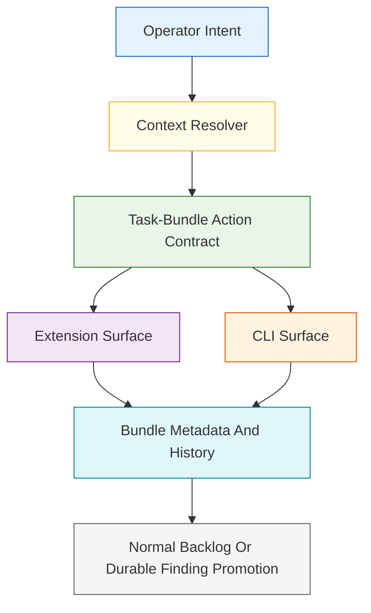
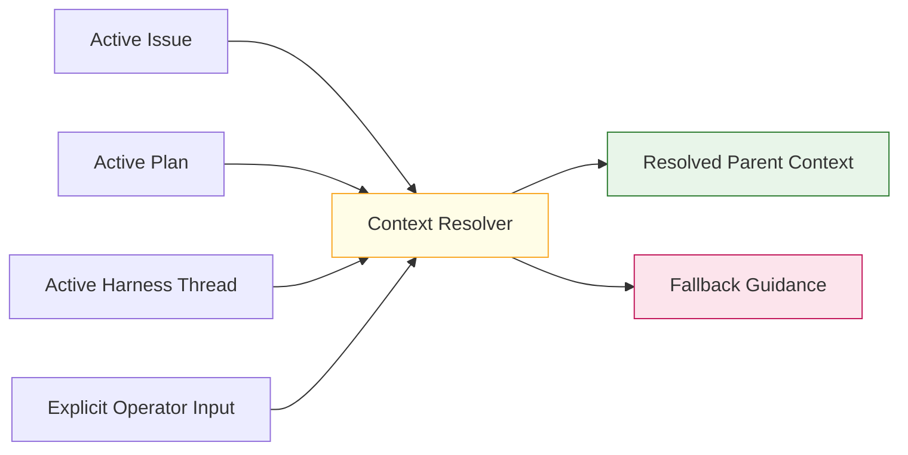
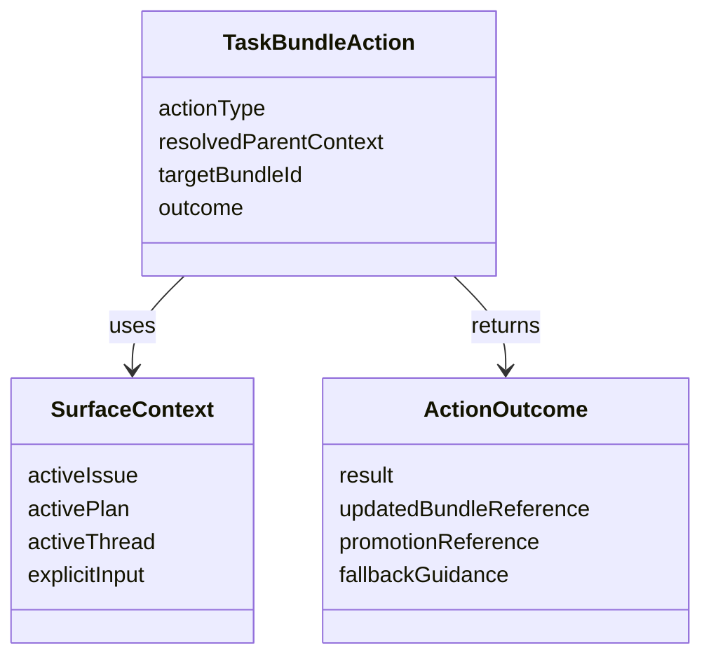

# Technical Specification: Operator Commands For Task Bundles

**Issue**: #223
**Epic**: #215
**Feature**: #227
**Status**: Draft
**Author**: GitHub Copilot, Solution Architect Agent
**Date**: 2026-03-13
**Related ADR**: [ADR-215.md](../adr/ADR-215.md)
**Related PRD**: [PRD-215.md](../prd/PRD-215.md)

---

## Table of Contents

1. [Overview](#1-overview)
2. [Goals And Non-Goals](#2-goals-and-non-goals)
3. [Architecture](#3-architecture)
4. [Component Design](#4-component-design)
5. [Data Model](#5-data-model)
6. [API Design](#6-api-design)
7. [Security](#7-security)
8. [Performance](#8-performance)
9. [Error Handling](#9-error-handling)
10. [Monitoring](#10-monitoring)
11. [Testing Strategy](#11-testing-strategy)
12. [Migration Plan](#12-migration-plan)
13. [Open Questions](#13-open-questions)

---

## 1. Overview

This specification defines the operator-surface contract for task bundles. Operators must be able to create, list, resolve, and promote task bundles through supported surfaces without manual file editing, while the behavior stays subordinate to the standard AgentX issue hierarchy and works consistently in both extension and CLI contexts. [Confidence: HIGH]

### AI-First Assessment

AI may help infer likely parent context, suggest promotion targets, or summarize bundle health, but operator actions themselves must remain deterministic and reviewable. Surface behavior should use the published task-bundle metadata and promotion-path contracts rather than free-form model interpretation. [Confidence: HIGH]

### Scope

- In scope: supported operator actions, surface coverage, context-sensitive resolution rules, extension and CLI parity boundaries, and hierarchy-preserving safeguards. [Confidence: HIGH]
- Out of scope: low-level command syntax, full UX copy, or runtime implementation details inside the extension or CLI. [Confidence: HIGH]

### Success Criteria

- Operators can create, list, resolve, and promote task bundles through supported surfaces. [Confidence: HIGH]
- Context-sensitive actions can resolve the active issue or plan when available. [Confidence: HIGH]
- The design works in both extension and CLI contexts. [Confidence: HIGH]
- Task-bundle affordances remain subordinate to the standard AgentX issue hierarchy. [Confidence: HIGH]

---

## 2. Goals And Non-Goals

### Goals

- Remove the need for manual file editing to manage task bundles. [Confidence: HIGH]
- Keep task-bundle surfaces consistent across extension and CLI contexts. [Confidence: HIGH]
- Reuse the metadata contract from story #230 and the promotion-path contract from story #225. [Confidence: HIGH]
- Preserve operator orientation by resolving active issue or plan context when possible. [Confidence: HIGH]

### Non-Goals

- Do not make task bundles a peer backlog system to stories and features. [Confidence: HIGH]
- Do not bypass promotion rules or issue creation discipline. [Confidence: HIGH]
- Do not require every surface to have identical presentation if the underlying action contract stays aligned. [Confidence: HIGH]

---

## 3. Architecture

### 3.1 Multi-Surface Task-Bundle Operations

**Architectural decision:** Extension and CLI surfaces should share the same action contract and context-resolution rules, even if their user interactions differ. [Confidence: HIGH]

### 3.2 Context-Sensitive Resolution Model

**Architectural decision:** Operator surfaces should prefer active issue and plan context when it exists, but must fail closed with clear fallback guidance when the active scope is ambiguous. [Confidence: HIGH]

---

## 4. Component Design

### 4.1 Supported Operator Actions

| Action | Responsibility | Dependency |
|--------|----------------|------------|
| Create | Create a new repo-local task bundle from a resolved parent context | Story #230 metadata contract |
| List | Show task bundles by parent context, state, or priority | Story #230 metadata contract |
| Resolve | Mark a bundle as completed, archived, or otherwise dispositioned | Story #230 state contract |
| Promote | Elevate a bundle item using the approved promotion rules | Story #225 promotion contract |

### 4.2 Supported Surface Types

| Surface | Role | Requirement |
|---------|------|-------------|
| Extension command palette | Direct operator action entry point | Must support context-sensitive action resolution |
| Extension chat or comparable interactive surface | Guided operator workflow | Must explain fallback when context is missing |
| Extension sidebar or comparable work surface | Passive visibility plus action launch | Must stay subordinate to issue-centric workflow |
| CLI | Scriptable and terminal-first operation | Must support explicit and inferred context modes |

### 4.3 Hierarchy-Preservation Rules

| Rule | Effect |
|------|--------|
| Bundle creation requires resolved parent context | Prevents free-floating bundle trackers |
| Promotion follows story #225 rules | Keeps durable work in the normal hierarchy |
| Resolution cannot silently discard searchable history | Preserves auditability |
| Active issue and plan remain the primary operator anchors | Keeps surfaces issue-centric rather than bundle-centric |

---

## 5. Data Model

### 5.1 Conceptual Model

### 5.2 Required Logical Inputs

| Field | Required | Purpose |
|-------|----------|---------|
| `action_type` | Yes | Create, list, resolve, or promote |
| `resolved_parent_context` | Conditional | Required for create and often for list |
| `target_bundle_id` | Conditional | Required for resolve or promote |
| `surface_type` | Yes | Preserve parity expectations across extension and CLI |
| `fallback_guidance` | Yes | Explain what to do when context resolution fails |

---

## 6. API Design

This story defines contract operations, not code-level APIs.

### 6.1 Contract Operations

| Operation | Input | Output | Purpose |
|----------|-------|--------|---------|
| Resolve active context | current surface state | parent issue or plan reference | Support context-sensitive actions |
| Create bundle action | resolved context plus requested metadata | created bundle reference | Avoid manual file editing |
| List bundle action | optional context plus filters | bundle collection | Make local decomposition visible |
| Resolve bundle action | target bundle plus resolution intent | updated searchable bundle state | Close or archive bundle work |
| Promote bundle action | target bundle plus promotion intent | durable target reference or fallback | Bridge local work into standard tracking |

---

## 7. Security

- Surface shortcuts must not create or promote bundles against the wrong parent context when active scope is ambiguous. [Confidence: HIGH]
- CLI and extension parity must preserve the same hierarchy guardrails and de-duplication expectations. [Confidence: HIGH]

---

## 8. Performance

- Common bundle actions should resolve from active issue or plan context without broad repository scans. [Confidence: HIGH]
- Listing surfaces should rely on bundle metadata summaries rather than loading all linked evidence by default. [Confidence: HIGH]

---

## 9. Error Handling

| Failure Mode | Expected Behavior | Recovery |
|-------------|-------------------|----------|
| Active context missing | Fail closed with fallback guidance | Ask for explicit issue or plan input |
| Bundle target not found | Block the action | Refresh bundle list or provide explicit identifier |
| Promotion target ambiguous | Defer to bundle-local state | Resolve with story #225 rules first |
| Resolve action would hide history | Block destructive closeout | Archive with searchable history instead |

---

## 10. Monitoring

- Track how often surfaces fail to resolve active issue or plan context so the parity model can improve. [Confidence: MEDIUM]
- Track action distribution across create, list, resolve, and promote to verify the command set is sufficient. [Confidence: MEDIUM]

---

## 11. Testing Strategy

- Validate all four operator actions against extension and CLI contexts. [Confidence: HIGH]
- Validate context-sensitive resolution with active issue, active plan, and explicit-input fallback scenarios. [Confidence: HIGH]
- Validate that all surface actions remain subordinate to the standard issue hierarchy. [Confidence: HIGH]

---

## 12. Migration Plan

1. Publish the metadata and promotion contracts from stories #230 and #225 first. [Confidence: HIGH]
2. Implement operator surfaces against those shared contracts rather than inventing surface-specific behavior. [Confidence: HIGH]
3. Keep future UX improvements additive as long as the action contract remains stable. [Confidence: HIGH]

---

## 13. Open Questions

1. Which two extension surfaces should be mandatory for first release: command palette and chat, or command palette and sidebar?
2. Should list operations default to the active parent context, or show a broader repo-local view first?
3. How much active-context inference is acceptable before the CLI must require explicit operator confirmation?