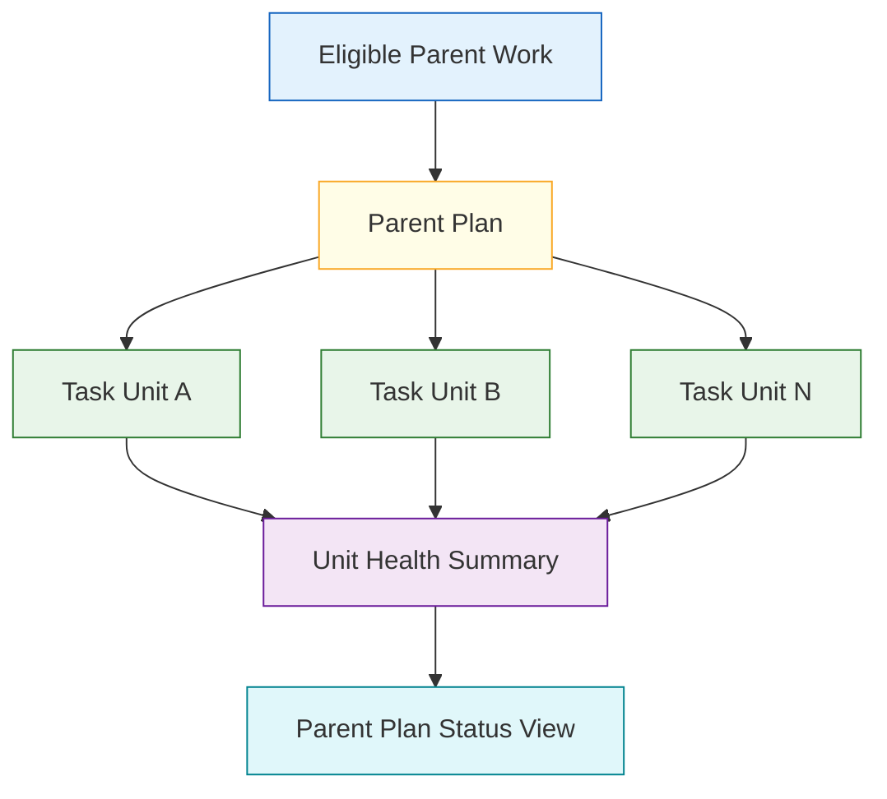
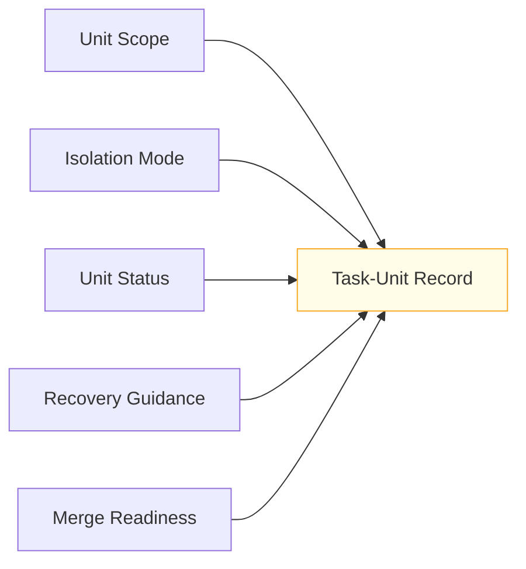
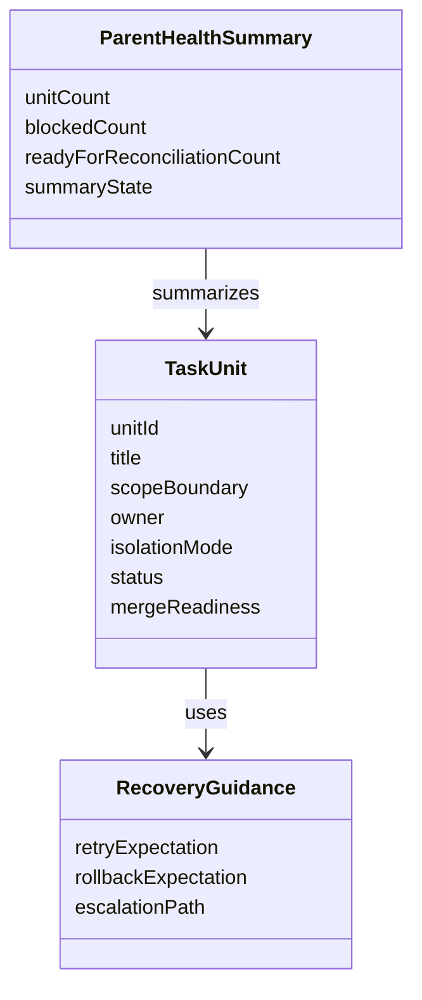

# Technical Specification: Isolated Task-Unit Contract

**Issue**: #224
**Epic**: #215
**Feature**: #226
**Status**: Draft
**Author**: GitHub Copilot, Solution Architect Agent
**Date**: 2026-03-13
**Related ADR**: [ADR-215.md](../adr/ADR-215.md)
**Related PRD**: [PRD-215.md](../prd/PRD-215.md)

---

## Table of Contents

1. [Overview](#1-overview)
2. [Goals And Non-Goals](#2-goals-and-non-goals)
3. [Architecture](#3-architecture)
4. [Component Design](#4-component-design)
5. [Data Model](#5-data-model)
6. [API Design](#6-api-design)
7. [Security](#7-security)
8. [Performance](#8-performance)
9. [Error Handling](#9-error-handling)
10. [Monitoring](#10-monitoring)
11. [Testing Strategy](#11-testing-strategy)
12. [Migration Plan](#12-migration-plan)
13. [Open Questions](#13-open-questions)

---

## 1. Overview

This specification defines the isolated task-unit contract for bounded parallel delivery. Each unit must capture scope, owner, isolation mode, status, merge readiness, and recovery guidance so the parent plan can track unit health without opening every unit in full. [Confidence: HIGH]

### AI-First Assessment

AI may later help summarize unit health or suggest recovery steps, but the task-unit contract itself must remain deterministic, explicit, and compatible with existing AgentX artifacts. Isolation mode, status, and merge readiness must be represented as durable contract fields rather than conversational context. [Confidence: HIGH]

### Scope

- In scope: unit identity, scope boundary, ownership, isolation mode, status, merge readiness, parent-plan summary expectations, and recovery guidance. [Confidence: HIGH]
- Out of scope: eligibility gating, reconciliation review policy, and implementation mechanics for worktrees, branches, or other execution environments. [Confidence: HIGH]

### Success Criteria

- Each unit records scope, owner, isolation mode, status, and merge readiness. [Confidence: HIGH]
- Recovery and retry expectations are documented. [Confidence: HIGH]
- Parent plans can summarize unit health without opening each unit in full. [Confidence: HIGH]
- The contract stays compatible with standard AgentX workflow and artifact families. [Confidence: HIGH]

---

## 2. Goals And Non-Goals

### Goals

- Make each bounded parallel work item legible as an isolated, reviewable unit. [Confidence: HIGH]
- Keep the parent plan aware of unit health, blockers, and readiness through compact metadata. [Confidence: HIGH]
- Bound failure handling so one unit does not silently stall the overall effort. [Confidence: HIGH]

### Non-Goals

- Do not define which work is eligible for units; story #229 owns that rubric. [Confidence: HIGH]
- Do not define final reconciliation or closeout acceptance; story #228 owns that stage. [Confidence: HIGH]
- Do not require every isolation mode to use the same runtime mechanics. [Confidence: HIGH]

---

## 3. Architecture

### 3.1 Parent-To-Unit Relationship

**Architectural decision:** Task units are subordinate execution artifacts under an eligible parent plan. The parent must be able to view health, readiness, and recovery posture from compact unit metadata rather than deep inspection of every unit. [Confidence: HIGH]

### 3.2 Isolation And Merge-Readiness Model

**Architectural decision:** Merge readiness must remain distinct from unit status. A unit can be active yet not merge-ready, or complete yet blocked on reconciliation requirements. [Confidence: HIGH]

---

## 4. Component Design

### 4.1 Task-Unit Components

| Component | Responsibility | Output |
|-----------|----------------|--------|
| Unit identity | Give each unit a durable local reference | Searchable unit handle |
| Scope boundary | Describe what the unit may and may not change | Isolation clarity |
| Ownership record | Record who is responsible | Accountability |
| Isolation-mode descriptor | Describe how separation is maintained | Execution boundary |
| Status tracker | Record current unit lifecycle state | Parent health signal |
| Merge-readiness descriptor | Record whether the unit is ready for reconciliation | Review/reconcile signal |
| Recovery guidance | Define retry, fallback, or abandonment expectations | Failure containment |

### 4.2 Isolation Mode Contract

| Isolation Mode | Meaning | Use Case |
|----------------|---------|----------|
| `logical` | Separation is by explicit scope only | Low-risk, artifact-distinct work |
| `file_scoped` | Separation is expected at the file or directory level | Minimal shared-file overlap |
| `branch_scoped` | Separation assumes branch-level change isolation | Moderate implementation work |
| `worktree_scoped` | Separation assumes explicit workspace isolation | High-isolation implementation scenarios |

### 4.3 Unit Status And Merge Readiness

| Field | Recommended Values | Meaning |
|-------|--------------------|---------|
| Unit status | `Ready`, `In Progress`, `In Review`, `Done`, `Blocked`, `Abandoned` | Unit lifecycle position |
| Merge readiness | `Not Ready`, `Ready For Review`, `Ready For Reconciliation`, `Do Not Merge` | Integration posture |

---

## 5. Data Model

### 5.1 Conceptual Model

### 5.2 Required Logical Fields

| Field | Required | Purpose |
|-------|----------|---------|
| `unit_id` | Yes | Durable unit reference |
| `scope_boundary` | Yes | Explain the isolated scope |
| `owner` | Yes | Record responsibility |
| `isolation_mode` | Yes | Describe separation strategy |
| `status` | Yes | Record lifecycle position |
| `merge_readiness` | Yes | Record integration posture |
| `recovery_guidance` | Yes | Define retry and rollback expectations |
| `summary_signal` | Yes | Provide a compact status usable by the parent plan |

---

## 6. API Design

This story defines contract operations, not code-level APIs.

### 6.1 Contract Operations

| Operation | Input | Output | Purpose |
|----------|-------|--------|---------|
| Create task unit | parent context plus unit contract | durable unit record | Start isolated execution |
| Update unit health | unit identity plus status changes | updated summary signal | Keep parent plan current |
| Evaluate merge readiness | unit status plus evidence | readiness outcome | Prepare for review or reconciliation |
| Resolve failure handling | unit plus recovery guidance | retry, rollback, or escalate path | Bound failure impact |

---

## 7. Security

- Isolation-mode selection must not imply stronger runtime isolation than actually exists. [Confidence: HIGH]
- Recovery guidance should prevent hidden partial merges or ambiguous abandoned states. [Confidence: HIGH]

---

## 8. Performance

- Parent-plan summaries must be derivable from unit metadata without opening full unit detail. [Confidence: HIGH]
- Unit contracts should remain compact enough that multiple units can be reviewed together efficiently. [Confidence: MEDIUM]

---

## 9. Error Handling

| Failure Mode | Expected Behavior | Recovery |
|-------------|-------------------|----------|
| Unit scope ambiguous | Block activation | Clarify scope boundary first |
| Isolation mode unsuitable | Mark the unit unsafe | Choose a stronger or clearer isolation mode |
| Status stale or missing | Mark parent health uncertain | Refresh or reconcile the unit record |
| Merge readiness overstated | Fail closed to `Do Not Merge` | Re-evaluate evidence and readiness |

---

## 10. Monitoring

- Track how often units enter `Blocked` or `Abandoned` to refine the eligibility rubric. [Confidence: MEDIUM]
- Track how often merge-readiness changes late in the lifecycle to identify weak isolation boundaries. [Confidence: MEDIUM]

---

## 11. Testing Strategy

- Validate unit records across all supported isolation modes. [Confidence: HIGH]
- Validate that parent-plan health summaries can be produced from unit metadata alone. [Confidence: HIGH]
- Validate failure handling for blocked, abandoned, and retry scenarios. [Confidence: HIGH]

---

## 12. Migration Plan

1. Approve the bounded parallel eligibility rubric from story #229. [Confidence: HIGH]
2. Use this contract as the prerequisite unit model before reconciliation work in story #228. [Confidence: HIGH]
3. Keep compatibility with normal AgentX artifacts so units never become a parallel tracking universe. [Confidence: HIGH]

---

## 13. Open Questions

1. Should `Blocked` and `Abandoned` be treated as explicit unit states or as recovery overlays on top of standard workflow states?
2. Should `logical` isolation remain available for low-risk documentation or metadata tasks, or should bounded parallel delivery always require stronger isolation?
3. What minimum evidence set should be attached before a unit can move to `Ready For Reconciliation`?