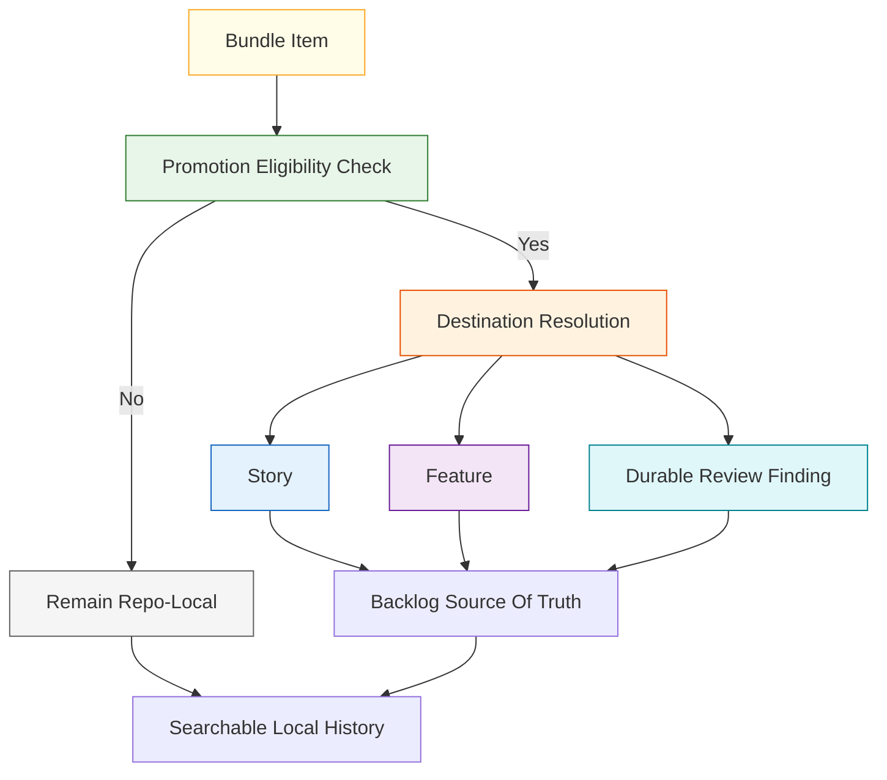
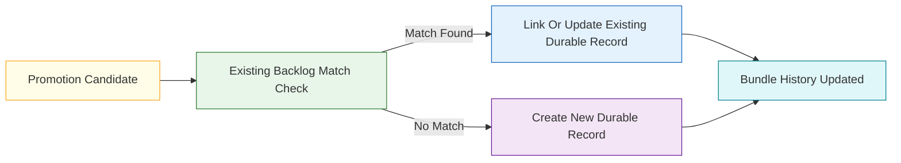
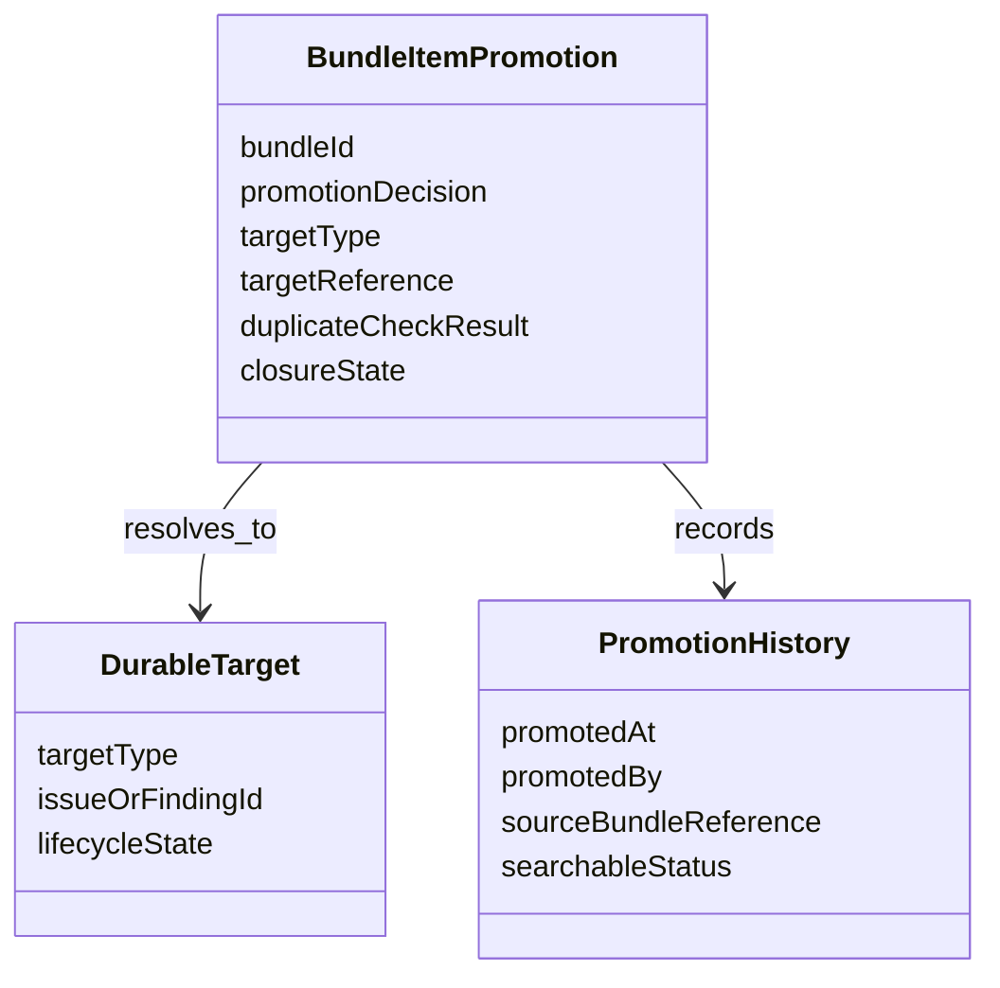

# Technical Specification: Promotion Paths From Bundle Items

**Issue**: #225
**Epic**: #215
**Feature**: #227
**Status**: Draft
**Author**: GitHub Copilot, Solution Architect Agent
**Date**: 2026-03-13
**Related ADR**: [ADR-215.md](../adr/ADR-215.md)
**Related PRD**: [PRD-215.md](../prd/PRD-215.md)

---

## Table of Contents

1. [Overview](#1-overview)
2. [Goals And Non-Goals](#2-goals-and-non-goals)
3. [Architecture](#3-architecture)
4. [Component Design](#4-component-design)
5. [Data Model](#5-data-model)
6. [API Design](#6-api-design)
7. [Security](#7-security)
8. [Performance](#8-performance)
9. [Error Handling](#9-error-handling)
10. [Monitoring](#10-monitoring)
11. [Testing Strategy](#11-testing-strategy)
12. [Migration Plan](#12-migration-plan)
13. [Open Questions](#13-open-questions)

---

## 1. Overview

This specification defines how task-bundle items promote into normal AgentX issues or durable review findings without creating duplicate backlog records. It uses the minimum bundle metadata contract from story #230 and preserves the standard issue hierarchy as the authoritative tracker for durable work. [Confidence: HIGH]

### AI-First Assessment

AI may later recommend likely promotion targets or summarize why a bundle item should promote, but promotion decisions must remain deterministic and artifact-backed. The promotion model should prefer explicit parent context, evidence, and de-duplication checks over inferred similarity alone. [Confidence: HIGH]

### Scope

- In scope: promotion destinations, promotion preconditions, de-duplication rules, searchable post-promotion history, and source-of-truth boundaries. [Confidence: HIGH]
- Out of scope: operator commands, UI flows, automatic issue creation mechanics, and reconciliation logic for bounded parallel delivery. [Confidence: HIGH]

### Success Criteria

- A bundle item can deterministically remain local, promote to a story, promote to a feature, or become a durable review finding. [Confidence: HIGH]
- Duplicate backlog entries are avoided by default. [Confidence: HIGH]
- Closed or promoted work remains searchable after promotion. [Confidence: HIGH]
- The normal AgentX issue hierarchy remains the source of truth for durable tracked work. [Confidence: HIGH]

---

## 2. Goals And Non-Goals

### Goals

- Convert temporary bundle work into standard durable tracking only when the work justifies elevation. [Confidence: HIGH]
- Keep a searchable local history after promotion so the decomposition trail is not lost. [Confidence: HIGH]
- Prevent parallel or repeated promotion of the same bundle item into multiple active backlog records by default. [Confidence: HIGH]

### Non-Goals

- Do not define the full bundle record itself; story #230 already owns that contract. [Confidence: HIGH]
- Do not implement commands, bots, or automation for issue creation. [Confidence: HIGH]
- Do not let bundle promotion bypass normal review, issue, or artifact discipline. [Confidence: HIGH]

---

## 3. Architecture

### 3.1 Promotion Decision Flow

**Architectural decision:** Promotion is not the default outcome. Bundle items should remain local unless they cross a durable tracking threshold such as new scoped implementation work, broadened capability impact, or persistent review follow-up. [Confidence: HIGH]

### 3.2 De-Duplication Guardrail

**Architectural decision:** The system should prefer linking to an existing durable issue or finding instead of creating a new one when the scope already exists. [Confidence: HIGH]

---

## 4. Component Design

### 4.1 Promotion Components

| Component | Responsibility | Output |
|-----------|----------------|--------|
| Promotion classifier | Decide whether the item stays local or needs durable elevation | Promotion decision |
| Destination resolver | Choose story, feature, or durable review finding | Promotion target type |
| Duplicate detector | Check for already-tracked durable work | Link-or-create decision |
| History updater | Preserve local traceability after promotion | Searchable local record |

### 4.2 Destination Rules

| Destination | Use When | Not Appropriate When |
|-------------|----------|----------------------|
| Remain local | Work is minor, informational, temporary, or already captured elsewhere | The item introduces new scoped durable work |
| Story | The item is a bounded implementable change or follow-up | The item expands beyond one bounded slice |
| Feature | The item represents a broader capability or multi-story need | The work is still narrow and immediately bounded |
| Durable review finding | The item is best tracked as a review outcome rather than a product-scope change | The item already needs full story or feature framing |

### 4.3 De-Duplication Rules

| Rule | Effect |
|------|--------|
| Parent context must be compared before creating a new durable item | Avoids duplicate records under the same scope |
| Title similarity alone is insufficient | Requires scope and evidence comparison |
| Existing open durable record wins over new record creation by default | Prevents backlog inflation |
| Bundle history must store the final durable destination | Preserves searchability and audit trail |

---

## 5. Data Model

### 5.1 Conceptual Model

### 5.2 Required Promotion Record Fields

| Field | Required | Purpose |
|-------|----------|---------|
| `bundle_id` | Yes | Trace back to the source bundle |
| `promotion_decision` | Yes | Record remain-local or promote outcome |
| `target_type` | Yes | Story, feature, durable review finding, or none |
| `target_reference` | Conditional | Identify the durable destination when promotion occurs |
| `duplicate_check_result` | Yes | Explain whether a matching durable record existed |
| `searchable_status` | Yes | Preserve searchable post-promotion state |

---

## 6. API Design

This story defines contract operations, not code-level APIs.

### 6.1 Contract Operations

| Operation | Input | Output | Purpose |
|----------|-------|--------|---------|
| Evaluate promotion | bundle item plus evidence | stay local or promote | Determine durable handling |
| Detect duplicate destination | candidate plus parent context | existing match or no match | Avoid duplicate backlog entries |
| Record promotion history | source plus target reference | searchable local closure record | Preserve traceability |

---

## 7. Security

- Promotion should only use durable references and approved artifact families, not transient chat-only rationales. [Confidence: HIGH]
- De-duplication checks must avoid silently merging unrelated work just because labels or titles are similar. [Confidence: HIGH]

---

## 8. Performance

- Promotion evaluation should rely on local metadata and targeted durable-record checks rather than broad repository scans. [Confidence: HIGH]
- The searchable history record should remain lightweight so local bundle archives do not become expensive to inspect. [Confidence: MEDIUM]

---

## 9. Error Handling

| Failure Mode | Expected Behavior | Recovery |
|-------------|-------------------|----------|
| Promotion target unclear | Keep the item local | Clarify scope before promotion |
| Duplicate check ambiguous | Prefer linking to review or manual confirmation over new record creation | Resolve the overlap explicitly |
| Target created without history link | Treat the promotion as incomplete | Add the local search/history record |

---

## 10. Monitoring

- Track how often promotion results in linking to existing durable records versus creating new ones. [Confidence: MEDIUM]
- Track how often bundle items remain local after evaluation to test whether the promotion threshold is too strict or too loose. [Confidence: MEDIUM]

---

## 11. Testing Strategy

- Validate promotion outcomes for all four accepted paths: remain local, story, feature, and durable review finding. [Confidence: HIGH]
- Validate that duplicate backlog entries are avoided under same-scope scenarios. [Confidence: HIGH]
- Validate that promoted or closed items remain searchable from the local bundle trail. [Confidence: HIGH]

---

## 12. Migration Plan

1. Establish bundle metadata through story #230. [Confidence: HIGH]
2. Apply this promotion-path contract to all later bundle-management surfaces. [Confidence: HIGH]
3. Keep the source-of-truth boundary explicit: bundle local first, issue hierarchy durable second. [Confidence: HIGH]

---

## 13. Open Questions

1. Should durable review findings be the preferred destination for ambiguous technical follow-up, or only for review-scoped items?
2. Should feature promotion require an explicit architect checkpoint before creation, even when a bundle item looks obviously broad?
3. What minimum evidence set should be mandatory before a bundle item may promote beyond story scope?