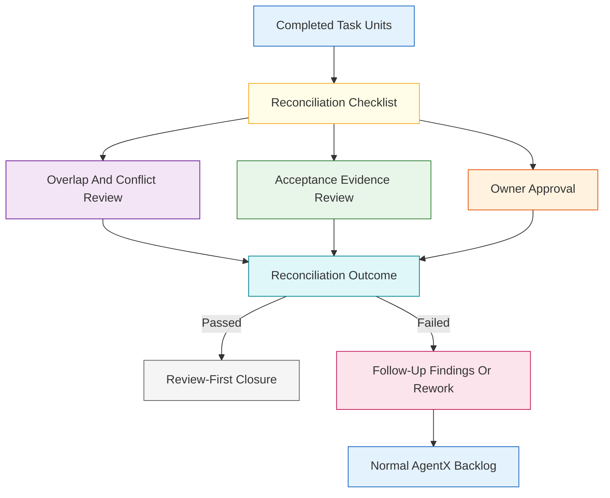
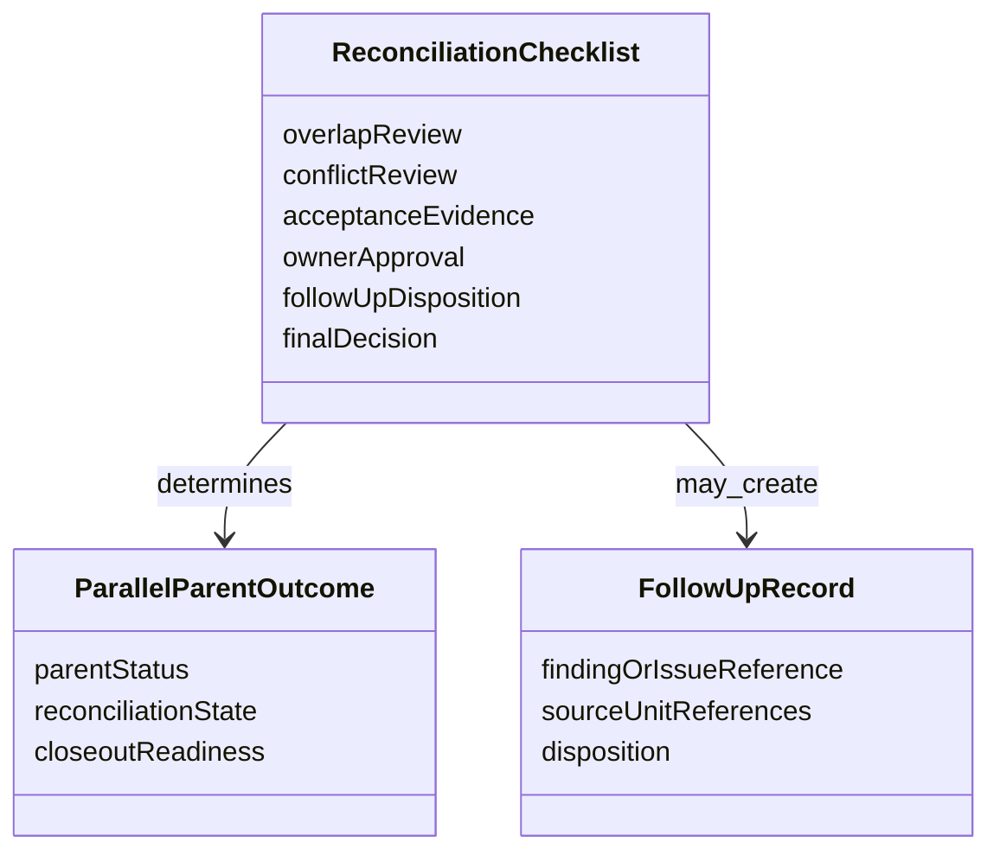

# Technical Specification: Reconciliation Checklist For Parallel Outputs

**Issue**: #228
**Epic**: #215
**Feature**: #226
**Status**: Draft
**Author**: GitHub Copilot, Solution Architect Agent
**Date**: 2026-03-13
**Related ADR**: [ADR-215.md](../adr/ADR-215.md)
**Related PRD**: [PRD-215.md](../prd/PRD-215.md)

---

## Table of Contents

1. [Overview](#1-overview)
2. [Goals And Non-Goals](#2-goals-and-non-goals)
3. [Architecture](#3-architecture)
4. [Component Design](#4-component-design)
5. [Data Model](#5-data-model)
6. [API Design](#6-api-design)
7. [Security](#7-security)
8. [Performance](#8-performance)
9. [Error Handling](#9-error-handling)
10. [Monitoring](#10-monitoring)
11. [Testing Strategy](#11-testing-strategy)
12. [Migration Plan](#12-migration-plan)
13. [Open Questions](#13-open-questions)

---

## 1. Overview

This specification defines the reconciliation checklist that must gate closure of bounded parallel work. Parallel outputs cannot be treated as complete until overlap, conflicts, acceptance evidence, and ownership approval are reviewed together, with any follow-up findings able to promote into the normal AgentX backlog. [Confidence: HIGH]

### AI-First Assessment

AI may later summarize reconciliation risks or cluster likely overlap areas, but the reconciliation checklist itself must remain deterministic and review-first. Closure should depend on explicit checklist evidence and approval, not a model's confidence that outputs look compatible. [Confidence: HIGH]

### Scope

- In scope: reconciliation checklist categories, parent-completion gate, ownership approval, follow-up finding promotion boundary, and compatibility with review-first closure and compound capture. [Confidence: HIGH]
- Out of scope: bounded parallel eligibility rules, task-unit creation details, and implementation-specific merge mechanics. [Confidence: HIGH]

### Success Criteria

- The checklist covers shared-file overlap, conflicts, acceptance evidence, and ownership approval. [Confidence: HIGH]
- Parent work cannot be treated as complete until reconciliation review is resolved. [Confidence: HIGH]
- Follow-up findings can promote into the normal AgentX backlog. [Confidence: HIGH]
- The checklist is compatible with review-first closure and compound capture expectations. [Confidence: HIGH]

---

## 2. Goals And Non-Goals

### Goals

- Turn parallel completion into an explicit review checkpoint instead of an implicit merge assumption. [Confidence: HIGH]
- Ensure the parent work remains open until combined outputs are assessed together. [Confidence: HIGH]
- Route unresolved follow-up work back into standard AgentX artifacts rather than ad hoc notes. [Confidence: HIGH]

### Non-Goals

- Do not decide whether work is eligible for bounded parallel delivery; story #229 owns that gate. [Confidence: HIGH]
- Do not redefine the isolated task-unit contract; story #224 already owns that model. [Confidence: HIGH]
- Do not replace the normal review or compound-capture lifecycle with a parallel-only closeout path. [Confidence: HIGH]

---

## 3. Architecture

### 3.1 Parallel Closeout Through Reconciliation Review

**Architectural decision:** Reconciliation is a required bounded checkpoint between unit completion and parent closure. Parent work remains incomplete until the reconciliation checklist passes. [Confidence: HIGH]

### 3.2 Compatibility With Review And Compound Capture

**Architectural decision:** Reconciliation feeds the normal review and compound-capture lifecycle rather than bypassing it. [Confidence: HIGH]

---

## 4. Component Design

### 4.1 Checklist Components

| Component | Responsibility | Output |
|-----------|----------------|--------|
| Shared-overlap check | Review shared-file and shared-artifact overlap | Overlap verdict |
| Conflict check | Review semantic or operational conflicts across units | Conflict verdict |
| Acceptance-evidence check | Confirm combined outputs satisfy the parent acceptance intent | Evidence verdict |
| Ownership approval check | Require accountable approval for the reconciled result | Approval verdict |
| Follow-up routing check | Capture unresolved issues as durable findings or backlog work | Promotion-ready follow-up |

### 4.2 Required Checklist Categories

| Category | Required Review Question |
|----------|--------------------------|
| Shared-file overlap | Did independently produced outputs touch the same files or artifacts, and is the overlap acceptable? |
| Conflicts | Are there behavioral, structural, or process conflicts that make the combined output unsafe? |
| Acceptance evidence | Does the combined result satisfy the bounded parent intent and validation evidence? |
| Ownership approval | Has a single responsible reviewer or maintainer approved the reconciled result? |
| Follow-up capture | Were unresolved issues converted into durable findings or standard backlog items? |

### 4.3 Parent Completion Gate

| Condition | Parent May Close? |
|-----------|-------------------|
| Checklist incomplete | No |
| Conflict unresolved | No |
| Acceptance evidence incomplete | No |
| Approval missing | No |
| Checklist passed and follow-up captured | Yes |

---

## 5. Data Model

### 5.1 Conceptual Model

### 5.2 Required Logical Fields

| Field | Required | Purpose |
|-------|----------|---------|
| `overlap_review` | Yes | Record overlap findings and disposition |
| `conflict_review` | Yes | Record conflict status |
| `acceptance_evidence` | Yes | Record combined evidence sufficiency |
| `owner_approval` | Yes | Record accountable sign-off |
| `follow_up_disposition` | Yes | Record whether findings or backlog items were promoted |
| `final_decision` | Yes | Gate parent closure |

---

## 6. API Design

This story defines contract operations, not code-level APIs.

### 6.1 Contract Operations

| Operation | Input | Output | Purpose |
|----------|-------|--------|---------|
| Build reconciliation checklist | completed units plus parent context | checklist record | Start bounded closeout review |
| Evaluate closure readiness | checklist state | close or block result | Prevent premature parent completion |
| Promote follow-up finding | unresolved reconciliation issue | durable issue or finding reference | Return unresolved work to standard tracking |

---

## 7. Security

- Reconciliation must fail closed when conflict or evidence status is unclear. [Confidence: HIGH]
- Parent completion must not be implied just because all units are individually done. [Confidence: HIGH]

---

## 8. Performance

- The checklist should use compact unit summaries and targeted evidence references rather than re-reading every artifact in full by default. [Confidence: MEDIUM]
- Reconciliation should remain practical even when several units participate, as long as the original eligibility rubric was respected. [Confidence: MEDIUM]

---

## 9. Error Handling

| Failure Mode | Expected Behavior | Recovery |
|-------------|-------------------|----------|
| Checklist partially completed | Block parent closeout | Finish all required categories |
| Conflict unresolved | Keep parent work open | Route rework or finding capture |
| Owner approval missing | Keep the result in review | Assign and obtain accountable approval |
| Follow-up issue discovered late | Promote it into standard tracking before closeout | Create durable finding or issue |

---

## 10. Monitoring

- Track how often reconciliation blocks parent closure despite units being individually done. [Confidence: MEDIUM]
- Track the most common categories of follow-up findings created during reconciliation. [Confidence: MEDIUM]

---

## 11. Testing Strategy

- Validate the checklist against overlap-free, overlap-present, and conflict-heavy scenarios. [Confidence: HIGH]
- Validate that parent work stays open until checklist completion and approval. [Confidence: HIGH]
- Validate that unresolved reconciliation issues promote into normal AgentX tracking instead of remaining local-only notes. [Confidence: HIGH]

---

## 12. Migration Plan

1. Publish stories #229 and #224 before implementing reconciliation behavior. [Confidence: HIGH]
2. Treat reconciliation review as the required bridge from bounded parallel output to the normal review lifecycle. [Confidence: HIGH]
3. Preserve compatibility with compound capture by making reconciliation outcomes feed normal closeout artifacts. [Confidence: HIGH]

---

## 13. Open Questions

1. Should reconciliation approval always be a single-owner decision, or can it allow paired approval for higher-risk work?
2. What minimum acceptance-evidence bundle should be required before the checklist may pass for documentation-heavy versus code-heavy work?
3. Should parent closeout automatically require a compound-capture artifact when reconciliation produces any follow-up findings?