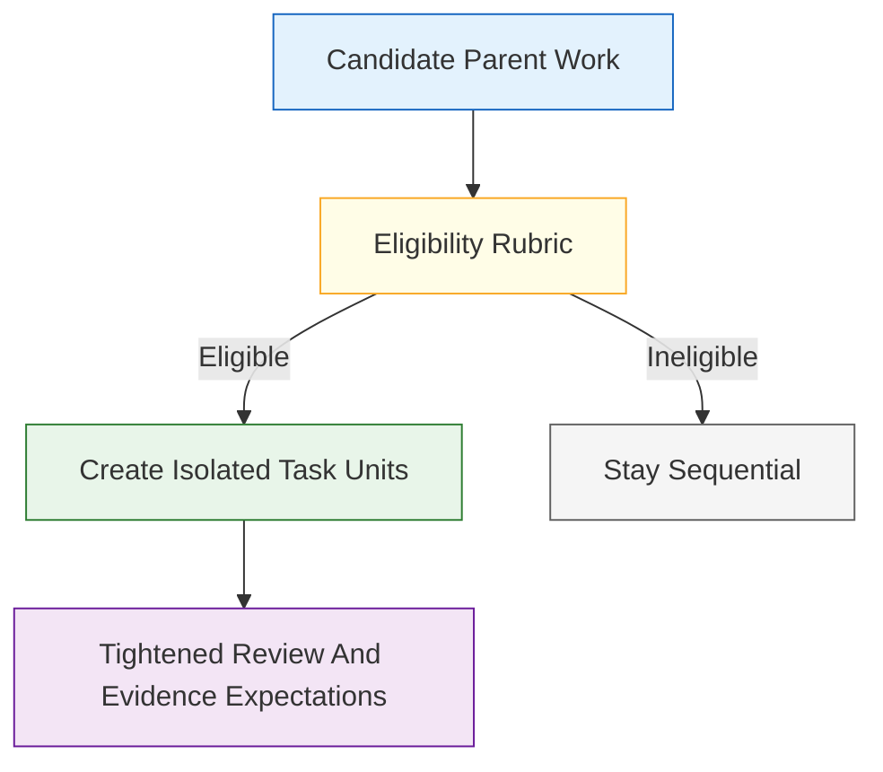
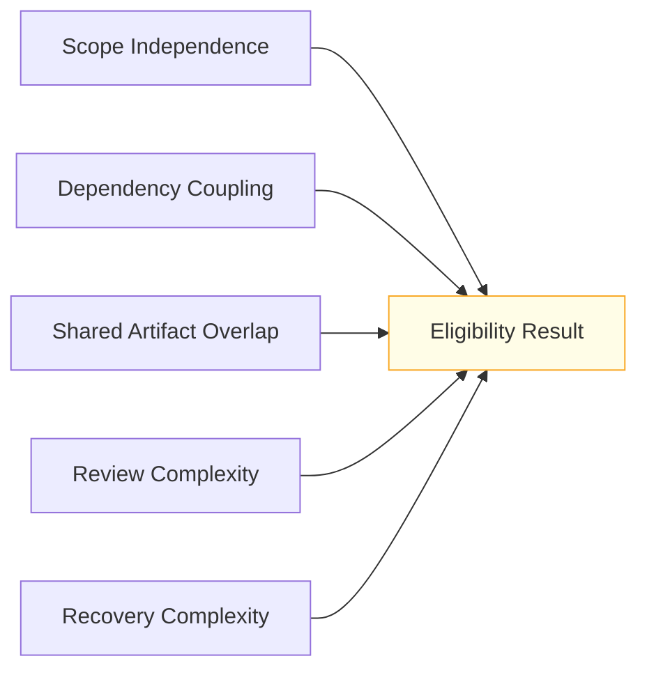
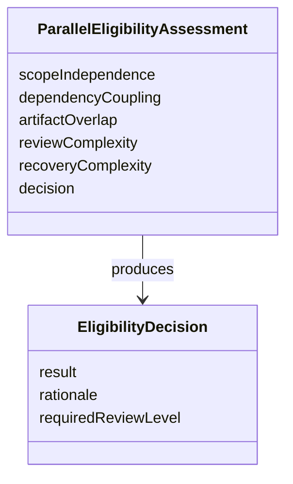

# Technical Specification: Bounded Parallel Eligibility Rubric

**Issue**: #229
**Epic**: #215
**Feature**: #226
**Status**: Draft
**Author**: GitHub Copilot, Solution Architect Agent
**Date**: 2026-03-13
**Related ADR**: [ADR-215.md](../adr/ADR-215.md)
**Related PRD**: [PRD-215.md](../prd/PRD-215.md)

---

## Table of Contents

1. [Overview](#1-overview)
2. [Goals And Non-Goals](#2-goals-and-non-goals)
3. [Architecture](#3-architecture)
4. [Component Design](#4-component-design)
5. [Data Model](#5-data-model)
6. [API Design](#6-api-design)
7. [Security](#7-security)
8. [Performance](#8-performance)
9. [Error Handling](#9-error-handling)
10. [Monitoring](#10-monitoring)
11. [Testing Strategy](#11-testing-strategy)
12. [Migration Plan](#12-migration-plan)
13. [Open Questions](#13-open-questions)

---

## 1. Overview

This specification defines the eligibility rubric for bounded parallel delivery. The rubric determines when work is safe to decompose into isolated parallel units and when work must remain sequential because coupling, shared change risk, or review complexity is too high. [Confidence: HIGH]

### AI-First Assessment

AI may help summarize decomposition candidates or identify likely overlap risks later, but the eligibility decision must stay rule-driven and reviewable. Bounded parallel work should begin only when explicit scope, dependency, and evidence criteria are met. [Confidence: HIGH]

### Scope

- In scope: eligibility criteria, ineligible work categories, tightened review expectations, and pre-task-unit decision timing. [Confidence: HIGH]
- Out of scope: the isolated task-unit contract, reconciliation checklist behavior, or any automation that launches parallel work. [Confidence: HIGH]

### Success Criteria

- The rubric limits bounded parallel delivery to independent or loosely coupled work. [Confidence: HIGH]
- Ineligible work categories are explicit and reviewable. [Confidence: HIGH]
- Review and evidence expectations are stricter when parallel delivery is used. [Confidence: HIGH]
- The rubric is usable before task-unit creation begins. [Confidence: HIGH]

---

## 2. Goals And Non-Goals

### Goals

- Prevent unsafe decomposition before it starts. [Confidence: HIGH]
- Keep parallel delivery opt-in, bounded, and evidence-backed. [Confidence: HIGH]
- Tighten review expectations as concurrency risk increases. [Confidence: HIGH]

### Non-Goals

- Do not make bounded parallel delivery the default path for AgentX work. [Confidence: HIGH]
- Do not define the internal structure of each task unit; story #224 owns that contract. [Confidence: HIGH]
- Do not define final merge or reconciliation criteria; story #228 owns that contract. [Confidence: HIGH]

---

## 3. Architecture

### 3.1 Eligibility Gate Before Decomposition

**Architectural decision:** The eligibility rubric is an up-front gate, not a post-hoc justification. If the rubric is not satisfied before task-unit creation, the work must remain sequential. [Confidence: HIGH]

### 3.2 Rubric Axes

**Architectural decision:** Eligibility must consider more than nominal task separation. Parallel work is only safe when the units are independently scoped, low-overlap, reviewable as separate outputs, and recoverable without destabilizing the parent plan. [Confidence: HIGH]

---

## 4. Component Design

### 4.1 Rubric Components

| Component | Responsibility | Output |
|-----------|----------------|--------|
| Scope independence check | Determine whether units can proceed with minimal coordination | Eligible or ineligible signal |
| Dependency coupling check | Detect tightly ordered or mutually blocking units | Coupling risk |
| Shared-artifact overlap check | Estimate change collision likelihood | Overlap risk |
| Review-hardening check | Define stricter evidence and review requirements | Review obligations |
| Recovery-complexity check | Evaluate retry and rollback blast radius | Recovery feasibility |

### 4.2 Explicit Ineligible Categories

| Category | Why It Is Ineligible |
|----------|----------------------|
| Highly coupled refactors across the same core files | Shared-file conflicts and sequencing risk are too high |
| Schema or contract changes that require strict serial ordering | Breakage risk spreads across units |
| Work with unresolved architecture or requirement ambiguity | Parallelism amplifies uncertainty |
| Work where validation only makes sense at the fully integrated output | Unit-level review would be misleading |
| Work without clear rollback or retry boundaries | Failure in one unit can destabilize all units |

### 4.3 Tightened Review Expectations

| Requirement | Reason |
|-------------|--------|
| Stronger evidence per unit | Prevents hidden assumptions across units |
| Parent-level reconciliation review | Ensures combined correctness |
| Explicit overlap and dependency notes | Makes conflict risk visible before merge |
| Clear unit ownership | Prevents orphaned parallel work |

---

## 5. Data Model

### 5.1 Conceptual Model

### 5.2 Required Assessment Fields

| Field | Required | Purpose |
|-------|----------|---------|
| `scope_independence` | Yes | Record whether units are independently bounded |
| `dependency_coupling` | Yes | Record serial or mutual dependencies |
| `artifact_overlap` | Yes | Record anticipated shared-file or shared-artifact collision risk |
| `review_complexity` | Yes | Record how much review intensifies under parallelism |
| `recovery_complexity` | Yes | Record whether partial failure is recoverable |
| `decision` | Yes | Final eligible or ineligible determination |

---

## 6. API Design

This story defines contract operations, not code-level APIs.

### 6.1 Contract Operations

| Operation | Input | Output | Purpose |
|----------|-------|--------|---------|
| Assess eligibility | parent work plus decomposition proposal | eligible or ineligible result | Gate parallel delivery |
| Explain rejection | ineligible assessment | explicit blocker set | Preserve sequential fallback |
| Define review obligations | eligible assessment | tightened evidence and review expectations | Bound risk before execution |

---

## 7. Security

- Parallel eligibility must fail closed when dependency or review certainty is weak. [Confidence: HIGH]
- The rubric must not encourage concurrency that weakens review traceability or durable audit trails. [Confidence: HIGH]

---

## 8. Performance

- The rubric should be lightweight enough to apply before unit creation without becoming a planning bottleneck. [Confidence: MEDIUM]
- The decision should rely on known scope and artifact boundaries, not deep runtime simulation. [Confidence: HIGH]

---

## 9. Error Handling

| Failure Mode | Expected Behavior | Recovery |
|-------------|-------------------|----------|
| Rubric input incomplete | Mark the work ineligible | Clarify scope and dependencies first |
| Overlap risk uncertain | Fail closed to sequential execution | Reduce overlap or split work differently |
| Review obligations undefined | Block eligibility approval | Define review hardening before decomposition |

---

## 10. Monitoring

- Track how often candidate work fails eligibility to identify common decomposition anti-patterns. [Confidence: MEDIUM]
- Track how often eligible work later hits reconciliation or merge problems to refine the rubric. [Confidence: MEDIUM]

---

## 11. Testing Strategy

- Validate the rubric against clearly independent, loosely coupled, and clearly ineligible scenarios. [Confidence: HIGH]
- Validate that each explicit ineligible category leads to sequential fallback. [Confidence: HIGH]
- Validate that review expectations become stricter, not looser, when parallel eligibility is approved. [Confidence: HIGH]

---

## 12. Migration Plan

1. Publish the eligibility rubric before task-unit or reconciliation stories are implemented. [Confidence: HIGH]
2. Use the rubric as a hard prerequisite for story #224 task-unit creation. [Confidence: HIGH]
3. Use the rubric outcome to shape review obligations in story #228. [Confidence: HIGH]

---

## 13. Open Questions

1. Should eligibility require explicit reviewer assignment before any unit is created?
2. Should parent-plan health thresholds be part of the rubric, or only the later task-unit contract?
3. What degree of shared-file overlap is acceptable before work becomes automatically ineligible?