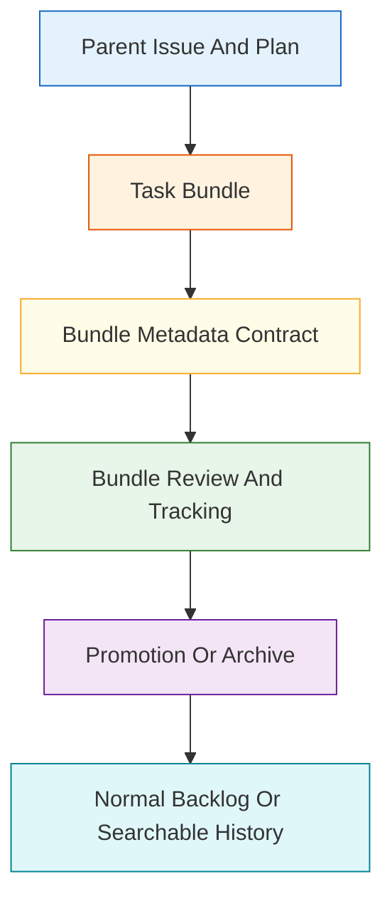
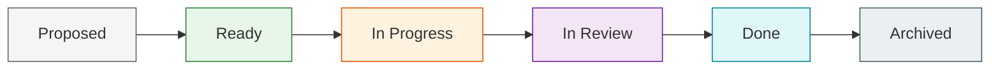
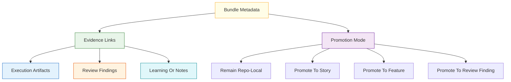
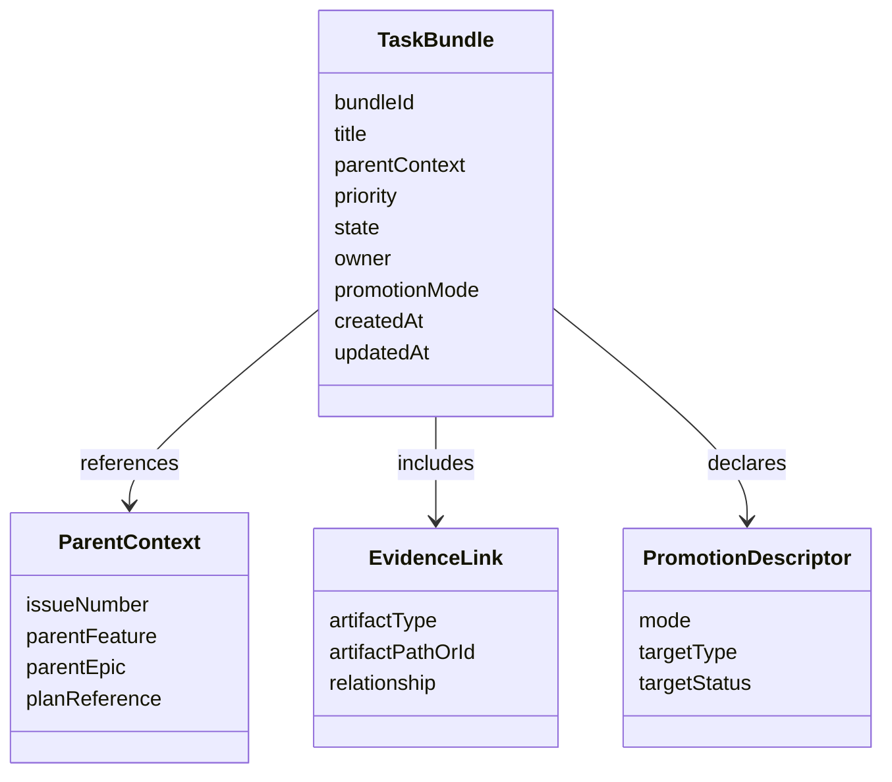

# Technical Specification: Task Bundle Minimum Metadata

**Issue**: #230
**Epic**: #215
**Feature**: #227
**Status**: Draft
**Author**: GitHub Copilot, Solution Architect Agent
**Date**: 2026-03-13
**Related ADR**: [ADR-215.md](../adr/ADR-215.md)
**Related PRD**: [PRD-215.md](../prd/PRD-215.md)

---

## Table of Contents

1. [Overview](#1-overview)
2. [Goals And Non-Goals](#2-goals-and-non-goals)
3. [Architecture](#3-architecture)
4. [Component Design](#4-component-design)
5. [Data Model](#5-data-model)
6. [API Design](#6-api-design)
7. [Security](#7-security)
8. [Performance](#8-performance)
9. [Error Handling](#9-error-handling)
10. [Monitoring](#10-monitoring)
11. [Testing Strategy](#11-testing-strategy)
12. [Migration Plan](#12-migration-plan)
13. [Open Questions](#13-open-questions)

---

## 1. Overview

This specification defines the minimum metadata contract for repo-local task bundles under epic #215. The contract makes decomposed work legible, traceable, and promotable while keeping the standard AgentX issue hierarchy as the source of truth and preventing task bundles from becoming a second backlog. [Confidence: HIGH]

### AI-First Assessment

AI can help suggest decomposition candidates, summarize evidence, or recommend promotion targets later, but the bundle contract itself must remain deterministic, file-backed, and inspectable. Bundle identity, state, ownership, and evidence links should be derived from durable repo artifacts rather than model judgment. [Confidence: HIGH]

### Scope

- In scope: minimum metadata fields, bundle identity rules, workflow-state mapping, evidence-link requirements, promotion-mode markers, and archive/search expectations. [Confidence: HIGH]
- Out of scope: operator commands, bundle-item promotion mechanics, reconciliation rules for parallel delivery, and any runtime implementation details. [Confidence: HIGH]

### Success Criteria

- Every task bundle has enough metadata to answer who owns it, what parent context it belongs to, what state it is in, what evidence supports it, and how it may later promote into the normal backlog. [Confidence: HIGH]
- Bundle states align to AgentX workflow states or clearly documented substates. [Confidence: HIGH]
- The contract is repo-local, ASCII-safe, and future-proof for later command, sidebar, chat, and CLI surfaces. [Confidence: HIGH]

---

## 2. Goals And Non-Goals

### Goals

- Make decomposed work durable before any task-bundle surface is implemented. [Confidence: HIGH]
- Preserve traceability from a bundle back to its parent issue, plan, and evidence. [Confidence: HIGH]
- Define only the minimum required metadata so the contract stays simple enough for broad reuse. [Confidence: HIGH]
- Prepare for later promotion paths without deciding their full mechanics in this story. [Confidence: HIGH]

### Non-Goals

- Do not create a new authoritative tracker separate from issues and artifact-backed workflow state. [Confidence: HIGH]
- Do not define command syntax, UI behavior, or editing workflows. [Confidence: HIGH]
- Do not overfit the contract to bounded parallel delivery before the eligibility rubric and task-unit contract are defined. [Confidence: HIGH]

---

## 3. Architecture

### 3.1 Task Bundle Placement In The Workflow Control Plane

**Architectural decision:** A task bundle is a subordinate planning and tracking artifact attached to a parent issue and plan context. It never replaces the issue hierarchy and must always be reducible to normal AgentX artifacts, promotion, or archival history. [Confidence: HIGH]

### 3.2 Workflow-State Mapping Model

**Architectural decision:** Task bundles reuse the recognizable AgentX lifecycle where possible. `Ready`, `In Progress`, `In Review`, and `Done` map directly to normal workflow states. `Proposed` and `Archived` are explicit bundle substates used only to stage pre-activation work and preserve post-promotion or post-closure searchability. [Confidence: HIGH]

### 3.3 Evidence And Promotion Boundary

**Architectural decision:** This story defines only the metadata slot for promotion intent, not the promotion workflow itself. That keeps the minimum contract stable while allowing story #225 to define promotion paths later. [Confidence: HIGH]

---

## 4. Component Design

### 4.1 Minimum Bundle Components

| Component | Responsibility | Why It Is Required |
|-----------|----------------|--------------------|
| Bundle identity | Gives each bundle a durable, searchable local identity | Prevents ambiguous references |
| Parent context | Links the bundle to epic, feature, story, issue, or execution-plan scope | Prevents second-backlog drift |
| Priority | Records relative urgency inside the parent context | Supports later surfacing and triage |
| State | Tracks bundle lifecycle position | Enables consistent operator guidance |
| Owner | Records current human or agent responsibility | Preserves accountability |
| Evidence links | Connects the bundle to plans, reviews, findings, learnings, or notes | Makes the bundle inspectable |
| Promotion mode | Declares the intended downstream handling pattern | Enables later promotion without schema churn |

### 4.2 Required Logical Metadata Fields

| Field | Required | Description | Notes |
|-------|----------|-------------|-------|
| `bundle_id` | Yes | Stable local identifier for the bundle | ASCII-safe and unique within the repo |
| `title` | Yes | Short human-readable description | Must be legible in sidebars or list views |
| `parent_context` | Yes | Link to the parent issue or bounded parent artifact | Must identify the authoritative source item |
| `priority` | Yes | Relative urgency such as `p0` to `p3` | Reuses AgentX priority vocabulary |
| `state` | Yes | Bundle state from the approved state set | Must map to workflow states or documented substates |
| `owner` | Yes | Current owner or responsible role | May be human, agent role, or unassigned marker |
| `evidence_links` | Yes | References to related durable artifacts | Must support zero or more links but the field itself is mandatory |
| `promotion_mode` | Yes | Intended downstream handling pattern | Placeholder for story #225 detail |
| `created_at` | Yes | Creation timestamp | Supports auditability |
| `updated_at` | Yes | Last metadata-change timestamp | Supports freshness checks |

### 4.3 Optional But Reserved Fields

| Field | Purpose | Reason To Reserve Now |
|-------|---------|-----------------------|
| `summary` | Slightly richer operator context | Avoids future churn if later surfaces need more than a title |
| `workflow_checkpoint` | Checkpoint overlay from `docs/WORKFLOW.md` | Supports future guidance alignment |
| `archive_reason` | Post-closure explanation | Supports searchable history without re-opening the bundle |
| `tags` | Lightweight grouping | Supports future filtering without inventing a new taxonomy |

---

## 5. Data Model

### 5.1 Conceptual Model

### 5.2 State Contract

| State | Type | Meaning | Workflow Relation |
|-------|------|---------|-------------------|
| `Proposed` | Bundle substate | Identified but not yet activated for work | Pre-`Ready` planning substate |
| `Ready` | Shared state | Ready to be worked or reviewed as a tracked bundle | Maps to `Ready` |
| `In Progress` | Shared state | Active work or active decomposition effort is underway | Maps to `In Progress` |
| `In Review` | Shared state | Bundle content or output is under review | Maps to `In Review` |
| `Done` | Shared state | Delivery is complete and awaiting promotion or archive handling | Maps to `Done` |
| `Archived` | Bundle substate | Closed and preserved only for search/history | Post-`Done` searchable substate |

### 5.3 Promotion Mode Contract

| Promotion Mode | Meaning | Owned By |
|----------------|---------|----------|
| `none` | Remains repo-local and closes without backlog promotion | Bundle owner |
| `story_candidate` | Likely to promote into a story | Future story #225 |
| `feature_candidate` | Likely to promote into a feature | Future story #225 |
| `review_finding_candidate` | Likely to promote into a durable review finding | Future story #225 |

---

## 6. API Design

This story defines contract operations, not code-level APIs.

### 6.1 Contract Operations

| Operation | Input | Output | Purpose |
|----------|-------|--------|---------|
| Create bundle record | parent context plus minimum metadata | durable task bundle | Establish a traceable local bundle |
| Update bundle state | bundle identity plus allowed state change | updated bundle metadata | Keep workflow alignment intact |
| Resolve bundle evidence | bundle identity | linked artifact set | Explain why the bundle exists and what supports it |
| Determine promotion readiness | bundle metadata plus evidence | promotion recommendation or archive path | Prepare for story #225 behavior |

### 6.2 File-System Contract

| Concern | Contract Requirement |
|---------|----------------------|
| Location | Task bundles must live in a canonical repo-local location chosen by later implementation work |
| Format | The representation must be ASCII-safe and diff-friendly |
| Searchability | Bundle identity, title, parent context, state, and promotion mode must be easy to scan |
| Drift control | Metadata changes must remain attributable through timestamps and reviewable file diffs |

---

## 7. Security

- Bundle metadata must not become an informal place to store secrets, raw credentials, or private runtime-only data. [Confidence: HIGH]
- Parent-context references should point to durable artifacts and issue identifiers, not ephemeral chat excerpts. [Confidence: HIGH]
- Ownership and evidence metadata should remain descriptive enough for auditability without leaking privileged content. [Confidence: HIGH]

---

## 8. Performance

- The minimum metadata set should be small enough for sidebar, chat, and CLI listing surfaces to render quickly without full artifact expansion. [Confidence: HIGH]
- Parent-context lookup and bundle search should be possible from metadata alone for common operator questions. [Confidence: HIGH]
- Evidence links should support lazy expansion so later surfaces do not need to parse every referenced artifact up front. [Confidence: MEDIUM]

---

## 9. Error Handling

| Failure Mode | Expected Behavior | Recovery |
|-------------|-------------------|----------|
| Missing parent context | Reject the bundle as invalid | Attach the authoritative issue or plan reference |
| Unknown state | Fail closed and require a supported state value | Normalize to a documented state |
| Evidence links omitted | Mark the bundle incomplete even if it can be created | Add at least the relevant durable references |
| Promotion mode ambiguous | Keep the bundle repo-local until a clear mode is chosen | Resolve through story #225 rules later |
| Archive without history signal | Block archive finalization | Add archive reason or durable closure evidence |

---

## 10. Monitoring

- Track how often bundles remain in `Proposed` without moving to `Ready` or `Archived`; that will indicate metadata churn or weak decomposition rules. [Confidence: MEDIUM]
- Track how often bundles lack evidence links or owner values; that will indicate contract misuse or insufficient operator guidance. [Confidence: MEDIUM]
- Track promotion-mode distribution once later stories ship to verify the metadata contract was broad enough. [Confidence: MEDIUM]

---

## 11. Testing Strategy

- Validate the minimum contract against all four acceptance criteria from issue #230. [Confidence: HIGH]
- Review sample bundles for all allowed states to ensure direct mapping to AgentX workflow language or documented substates. [Confidence: HIGH]
- Validate that archived bundles remain searchable and attributable without appearing to be live backlog items. [Confidence: HIGH]
- Review the contract against future stories #225 and #223 to confirm no required metadata is missing for promotion or operator surfaces. [Confidence: HIGH]

---

## 12. Migration Plan

1. Publish the minimum metadata contract before any bundle-management surface is implemented. [Confidence: HIGH]
2. Reuse the contract as the prerequisite for story #225 promotion-path design. [Confidence: HIGH]
3. Use the same contract as the input boundary for story #223 operator commands. [Confidence: HIGH]
4. Extend the contract only through additive reserved fields unless a later ADR changes the task-bundle model. [Confidence: HIGH]

---

## 13. Open Questions

1. Should bundle ownership allow multiple concurrent responsible roles, or stay single-owner plus contributors?
2. Should `Archived` require a mandatory `archive_reason`, or is closure evidence alone sufficient?
3. Should `promotion_mode` remain a single-value field, or will later bounded parallel work need multiple candidate outputs?
4. What canonical repo path should later implementation choose so bundles are both visible and clearly subordinate to the normal issue hierarchy?