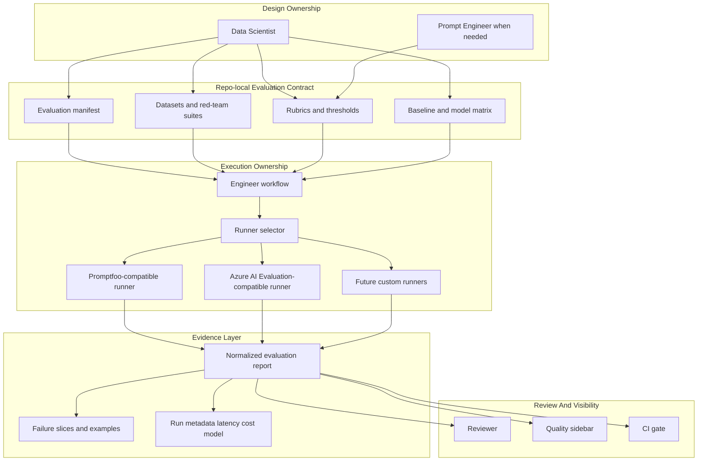
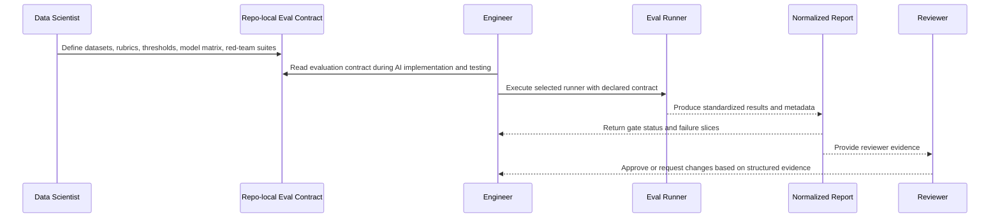
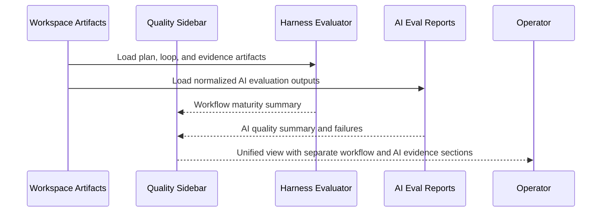
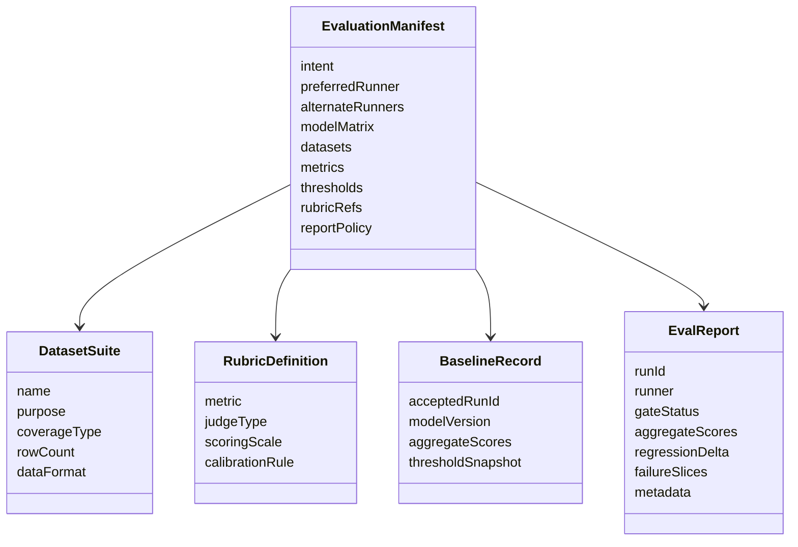
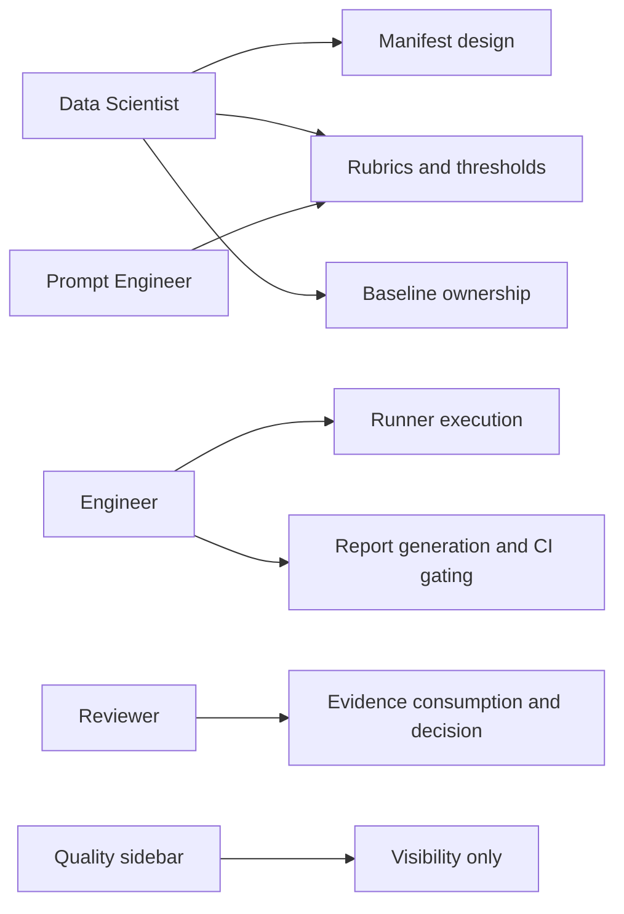
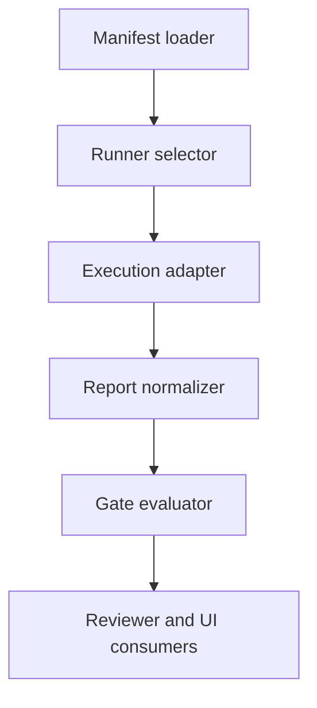
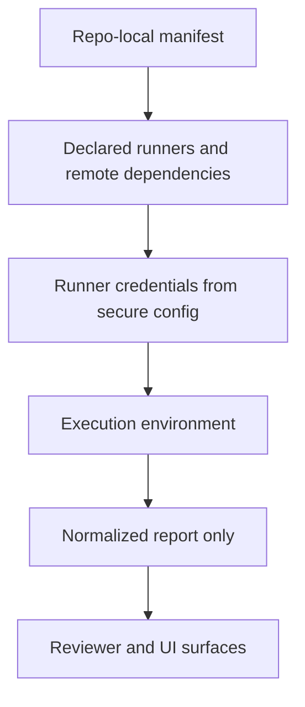

# Technical Specification: AgentX AI Evaluation Contract For Promptfoo-Inspired Workflows

**Issue**: #235
**Epic**: N/A
**Status**: Draft
**Author**: AgentX Auto
**Date**: 2026-03-20
**Related ADR**: [ADR-235.md](../adr/ADR-235.md)
**Related UX**: N/A

> **Acceptance Criteria**: Defined by issue #235. This specification covers the artifact contract, role ownership, runner model, evidence flow, and rollout needed to integrate promptfoo-inspired AI evaluation into AgentX.

---

## Table of Contents

1. [Overview](#1-overview)
2. [Architecture Diagrams](#2-architecture-diagrams)
3. [API Design](#3-api-design)
4. [Data Model Diagrams](#4-data-model-diagrams)
5. [Service Layer Diagrams](#5-service-layer-diagrams)
6. [Security Diagrams](#6-security-diagrams)
7. [Performance](#7-performance)
8. [Testing Strategy](#8-testing-strategy)
9. [Implementation Notes](#9-implementation-notes)
10. [Rollout Plan](#10-rollout-plan)
11. [Risks & Mitigations](#11-risks--mitigations)
12. [Monitoring & Observability](#12-monitoring--observability)
13. [AI/ML Specification](#13-aiml-specification-if-applicable)
14. [MCP Server Specification](#14-mcp-server-specification-if-applicable)
15. [MCP App Specification](#15-mcp-app-specification-if-applicable)

---

## 1. Overview

This specification defines a first-class repo-local AI evaluation contract for AgentX. The contract normalizes how `needs:ai` projects declare evaluation strategy, datasets, thresholds, baselines, runners, and report outputs. AgentX remains the workflow host and evidence coordinator, while evaluation runners execute the measurements.

**Scope:**
- In scope: evaluation artifacts, role responsibilities, runner abstraction, Quality sidebar evidence, reviewer evidence flow, CI gating touchpoints, and phased implementation boundaries
- Out of scope: implementing the runtime, building a standalone dashboard product, or replacing existing deterministic harness evaluation

**Success Criteria:**
- AI projects can declare one repo-local evaluation contract that Data Scientist, Engineer, and Reviewer all recognize
- Evaluation results normalize into consistent reports independent of whether the runner is promptfoo-oriented or Azure-native
- Quality and review surfaces can show both workflow maturity and AI quality evidence without conflating them

### 1.1 Selected Tech Stack (REQUIRED before implementation)

> Engineers SHOULD NOT start implementation until this table is completed and the chosen stack is explicit.

| Layer / Concern | Selected Technology | Version / SKU | Why This Was Chosen | Rejected Alternatives |
|-----------------|---------------------|---------------|---------------------|-----------------------|
| Frontend / UI | Existing VS Code Quality sidebar plus review document surfaces | Current AgentX extension line | Reuses current operator surfaces and avoids premature dashboard scope | Standalone eval web app first |
| Backend / Runtime | Existing AgentX extension and CLI orchestration layers | Current repo runtime set | Keeps evaluation coordination inside AgentX's workflow host | Separate evaluation host product |
| API Style | Repo-local manifest plus standardized report artifacts | Manifest/report schema v1 | Matches AgentX's artifact-first workflow model | Ad hoc per-project configs only |
| Data Store | Repository files under `evaluation/` and `.copilot-tracking/eval-reports/` | Repo-local | Reviewable, versionable, compatible with local and CI workflows | External managed store first |
| Hosting / Compute | Local runner execution with optional cloud-backed evaluator services | Promptfoo-compatible and Azure AI Evaluation-compatible phase-1 targets | Supports local-first and Azure-native modes | One mandatory evaluator provider |
| Authentication / Security | Existing repo/provider auth plus explicit evaluator and remote-host declarations | Current host auth plus runner-specific credentials | Keeps secrets in current secure channels while making evaluation dependencies explicit | Hidden evaluator credentials and implicit network access |
| Observability | Existing harness evaluation summaries plus normalized AI eval run summaries | Current extension surfaces with future report ingestion | Adds AI evidence without replacing current harness maturity checks | Replace harness evaluator outright |
| CI/CD | Existing GitHub Actions and Azure Pipelines touchpoints | Current repo automation model | Lets evaluation gates integrate where AgentX already automates validation | New dedicated release/orchestration platform |

**Implementation Preconditions:**
- The selected stack above is consistent with ADR-235.
- Artifact locations, runner boundaries, and report normalization rules are explicit.
- Any unresolved runner-specific details are captured as rollout-phase work, not hidden in the architecture.

---

## 2. Architecture Diagrams

### 2.1 High-Level System Architecture

**Component Responsibilities:**
| Layer | Responsibility | Notes |
|-------|---------------|-------|
| Design Ownership | Define what good looks like | Primarily Data Scientist, with Prompt Engineer when prompt-specific rubric design is needed |
| Repo-local Evaluation Contract | Declare datasets, rubrics, thresholds, baselines, and runner intent | Source of truth for AI evaluation behavior |
| Execution Ownership | Run evaluations during implementation and validation | Primarily Engineer, with role-aware reuse in CI or Reviewer workflows |
| Evidence Layer | Normalize outputs into one AgentX-readable report shape | Decouples runners from reviewer and UI consumers |
| Review And Visibility | Show and act on evidence | Reviewer, Quality sidebar, CI, and future report consumers |

### 2.2 Sequence Diagram: AI Evaluation Contract Lifecycle

### 2.3 Sequence Diagram: Quality Sidebar Evidence Flow

---

## 3. API Design

This design is artifact-first rather than service-first. Phase 1 requires standardized repo files, not a remote evaluation API.

### 3.1 Required Artifact Families

| Artifact | Proposed Location | Purpose | Primary Owner |
|----------|-------------------|---------|---------------|
| Evaluation manifest | `evaluation/agentx.eval.yaml` | Declares runners, datasets, rubrics, thresholds, and model matrix | Data Scientist |
| Baseline summary | `evaluation/baseline.json` | Declares accepted baseline scores and comparison target | Data Scientist |
| Dataset references | `evaluation/datasets/` | Canonical evaluation and red-team inputs | Data Scientist |
| Rubric definitions | `evaluation/rubrics/` | Judge criteria and scoring guidance | Data Scientist / Prompt Engineer |
| Normalized run reports | `.copilot-tracking/eval-reports/` | Human and machine-readable output summaries | Engineer |
| Review references | `docs/artifacts/reviews/` | Durable review decisions that cite evaluation evidence | Reviewer |

### 3.2 Evaluation Manifest Responsibilities

| Section | Purpose |
|---------|---------|
| Intent | Declares AI workflow type: prompt, RAG, agentic, multimodal, or hybrid |
| Runner strategy | Declares preferred runner and supported alternates |
| Model matrix | Declares primary, fallback, and comparison models |
| Datasets | Declares benchmark, regression, and red-team suites |
| Metrics | Declares dimensions such as correctness, groundedness, safety, latency, cost, and tool-use quality |
| Thresholds | Declares blocking vs warning gates |
| Rubrics | Declares judge criteria and calibration expectations |
| Reporting | Declares required normalized outputs and evidence retention |

### 3.3 Normalized Report Responsibilities

| Output Section | Required Content |
|----------------|------------------|
| Run summary | Runner used, timestamp, models, dataset counts, pass/fail result |
| Aggregate metrics | Scores against each declared threshold |
| Regression comparison | Delta from baseline and prior accepted run |
| Failure slices | Top failing rows, scenarios, or prompts |
| Safety summary | Red-team or safety findings with severity |
| Cost and latency | Aggregate runtime and cost metadata |
| Reviewer note block | Short machine-readable summary for review tools and UI surfaces |

---

## 4. Data Model Diagrams

### 4.1 Evaluation Contract Model

### 4.2 Role Ownership Model

---

## 5. Service Layer Diagrams

### 5.1 Logical Services

**Logical responsibilities:**
| Logical Service | Responsibility |
|-----------------|---------------|
| Manifest loader | Reads repo-local evaluation contract and validates required sections |
| Runner selector | Resolves promptfoo-compatible, Azure-compatible, or future runner path |
| Execution adapter | Invokes runner-specific behavior and captures raw outputs |
| Report normalizer | Converts raw runner output into standard AgentX report shape |
| Gate evaluator | Computes blocking and warning decisions from thresholds |
| Reviewer and UI consumers | Render evidence without caring which runner produced it |

---

## 6. Security Diagrams

### 6.1 Trust Boundary Diagram

**Security rules:**
| Concern | Requirement |
|---------|-------------|
| Remote execution | Manifest must declare runner mode and any external service dependency |
| Secrets | Credentials remain in existing secure channels, never inside evaluation artifacts |
| Dataset safety | Red-team and evaluation datasets must avoid accidental leakage of secrets or protected production data |
| Reviewer evidence | Reports should summarize findings without exposing sensitive raw payloads unless explicitly allowed |
| Network use | Runner choice and remote host dependency should be explicit for governance and troubleshooting |

---

## 7. Performance

| Concern | Target Direction | Notes |
|---------|------------------|-------|
| Local developer feedback | Fast enough for targeted regression subsets during iteration | Full suites can remain slower CI tasks |
| CI stability | Deterministic aggregate output with clear gate result | Avoid flaky approvals caused by unclear output formats |
| Report loading | Lightweight summary for extension surfaces | Row-level detail can remain in report files |
| Runner portability | Manifest should support reduced local subsets and fuller CI suites | Prevent overlarge default local workloads |

---

## 8. Testing Strategy

| Layer | What To Validate | Owner |
|-------|------------------|-------|
| Manifest validation | Required sections, thresholds, datasets, and runner declarations | Engineer |
| Runner adapter validation | Raw output can be normalized into standard report shape | Engineer |
| Rubric quality | Judge rubric clarity, calibration, and bias review | Data Scientist |
| Regression gating | Baseline comparison and threshold behavior | Engineer |
| Review consumption | Reviewer can interpret gate status and failure slices clearly | Reviewer |
| UI visibility | Quality sidebar renders workflow and AI evidence separately | Engineer |

---

## 9. Implementation Notes

### 9.1 Proposed Phase-1 Deliverables

| Deliverable | Purpose |
|-------------|---------|
| Manifest schema and validation rules | Stabilize the contract |
| Baseline/report normalization format | Stabilize evidence consumption |
| Runner-selection design | Keep promptfoo-compatible and Azure-compatible execution paths available |
| Review integration design | Ensure evaluation evidence affects approval flow |
| Quality sidebar ingestion design | Show AI evidence without replacing harness maturity checks |

### 9.2 Role Contract Effects

| Role | New or clarified responsibility |
|------|-------------------------------|
| Data Scientist | Owns eval contract design, model matrix, rubrics, thresholds, baselines, and red-team suites |
| Prompt Engineer | Contributes prompt-specific rubric design and calibration support when needed |
| Engineer | Executes evaluation contract, produces normalized reports, wires gates into implementation and CI |
| Reviewer | Uses normalized report evidence as part of AI-specific review decisions |
| DevOps | Integrates gates into automation after the contract stabilizes |

---

## 10. Rollout Plan

| Phase | Scope | Outcome |
|-------|-------|---------|
| Phase 1 | Contract-first | Manifest, baseline, report, and ownership rules are documented and validated |
| Phase 2 | Runner integration | Promptfoo-compatible and Azure-compatible execution paths produce normalized reports |
| Phase 3 | Workflow integration | Engineer, Reviewer, and Quality surfaces consume AI evidence consistently |
| Phase 4 | Governance and expansion | Broader runner support, red-team catalogs, richer analytics, and stronger CI policy |

---

## 11. Risks & Mitigations

| Risk | Impact | Mitigation |
|------|--------|------------|
| Contract grows too complex before implementation | Medium | Start with minimal required sections and phased rollout |
| Promptfoo-specific assumptions leak into core contract | High | Keep AgentX-owned manifest/report schema with runner abstraction |
| Reviewers get flooded with raw evaluation detail | Medium | Normalize into concise summaries plus linked failure slices |
| Teams skip baseline discipline | High | Make baseline artifact and threshold snapshot part of required contract |
| Runtime and docs drift | High | Gate implementation against this spec and keep current-state notes explicit |

---

## 12. Monitoring & Observability

| Signal | Purpose | Consumer |
|--------|---------|----------|
| Gate result | Quick pass/fail for review and CI | Engineer, Reviewer |
| Aggregate score history | Detect regressions over time | Data Scientist, Engineer |
| Failure slice frequency | Identify repeated weak spots | Data Scientist, Prompt Engineer |
| Latency and cost deltas | Watch operational drift | Engineer, DevOps |
| Runner usage mix | Understand portability and adoption | Maintainers |

---

## 13. AI/ML Specification (if applicable)

### 13.1 AI Evaluation Modes

| Mode | Description | Required Evidence |
|------|-------------|-------------------|
| Prompt quality | Structured prompt and response evals | Rubric scores, regression deltas |
| RAG quality | Retrieval and groundedness evaluation | Context metrics, groundedness findings, failure slices |
| Agentic quality | Tool use, task adherence, intent resolution | Agentic metric summary and scenario outcomes |
| Safety and red team | Harm and adversarial scenario evaluation | Severity summary, pass/fail counts, critical examples |
| Cost and latency | Operational quality | Aggregate metadata and baseline deltas |

### 13.2 Model Change Management

| Requirement | Purpose |
|-------------|---------|
| Primary and fallback model declared | Avoid untracked model drift |
| Baseline retained for accepted model | Support regression comparison |
| Comparison run before model switch | Prevent silent quality regressions |
| Threshold snapshot stored with report | Keep historical gate context interpretable |

### 13.3 Confidence Markers

| Recommendation | Confidence | Reason |
|----------------|------------|--------|
| Use repo-local manifest as source of truth | HIGH | Best fit for AgentX artifact-first workflow |
| Support both promptfoo-compatible and Azure-compatible runners | HIGH | Strong portability and evidence from both research tracks |
| Keep Quality sidebar as a dual-signal view | HIGH | Preserves current harness evaluator value while adding AI evidence |
| Delay full dashboard/platform buildout | HIGH | Avoids scope drift before contract maturity |

---

## 14. MCP Server Specification (if applicable)

Not applicable in phase 1. This architecture does not require an MCP server to exist before the evaluation contract is useful.

---

## 15. MCP App Specification (if applicable)

Not applicable in phase 1. A richer interactive report viewer may become useful later, but it is intentionally out of scope for the first contract-first rollout.