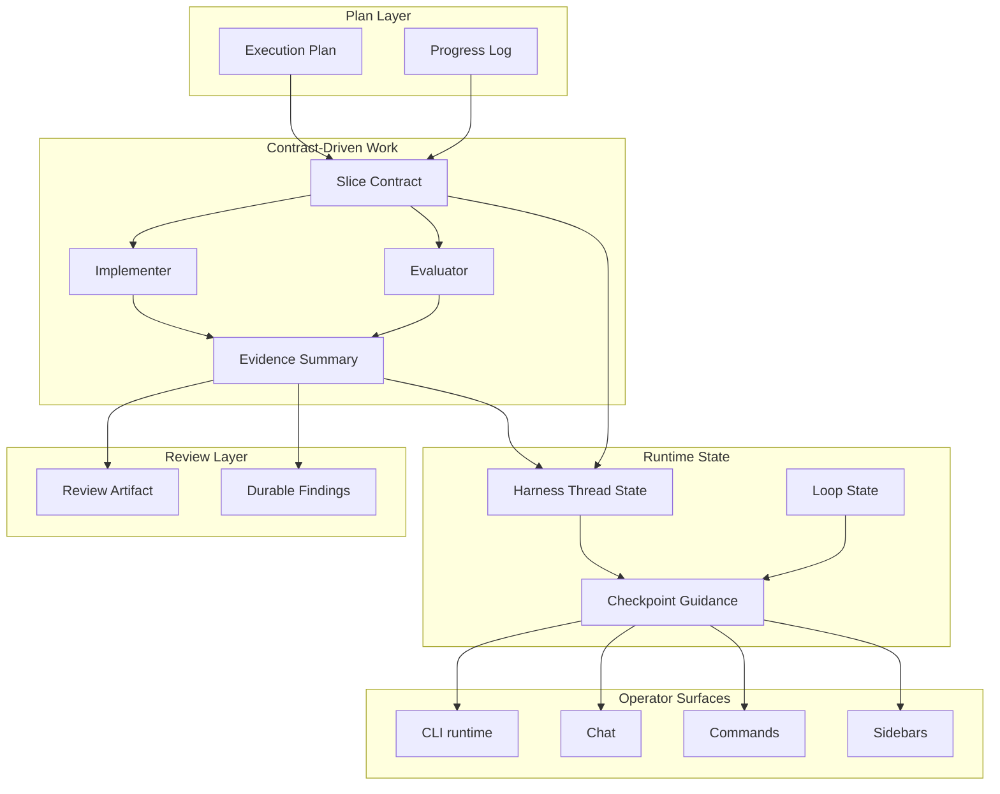
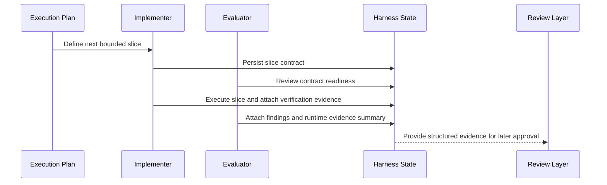
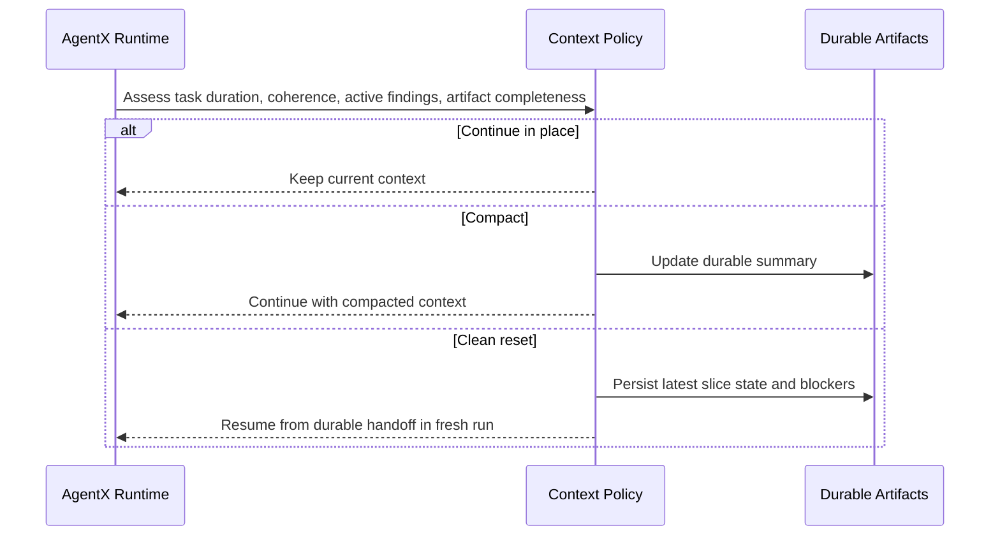
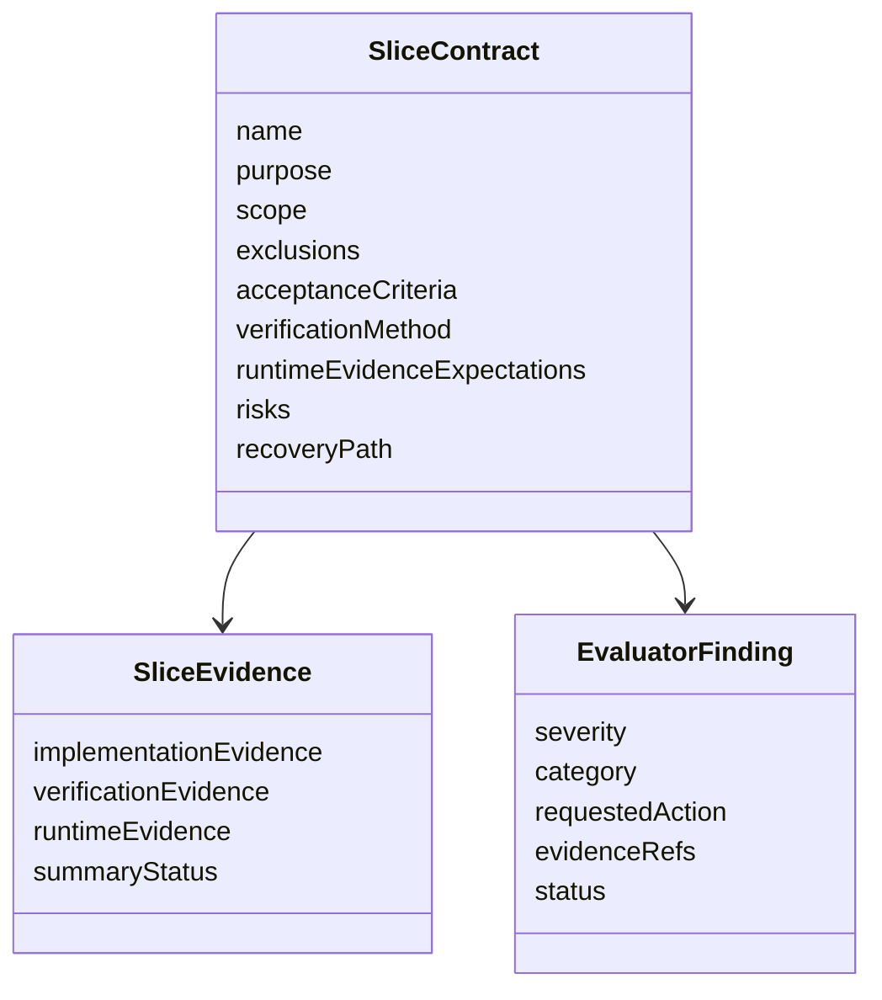
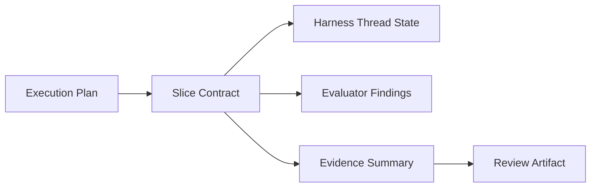
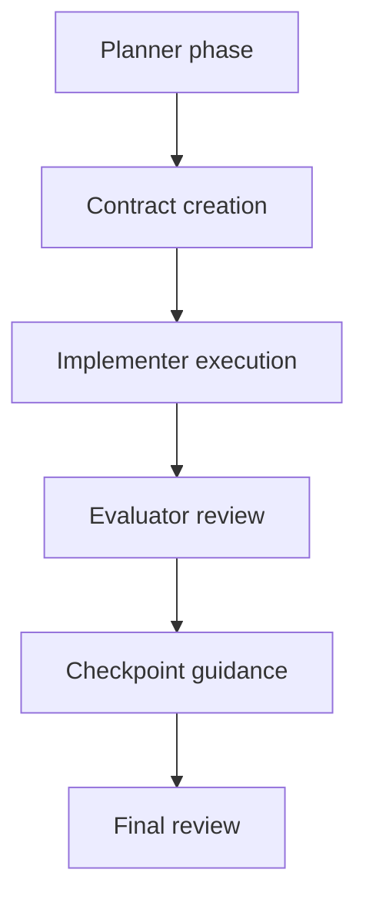
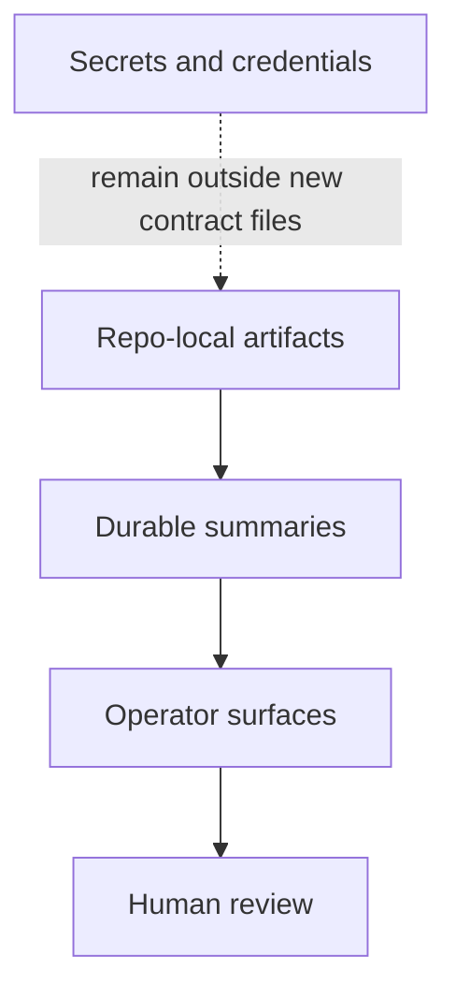

# Technical Specification: Contract-Driven Harness Design Adoption For AgentX

**Issue**: #244
**Epic**: #244
**Status**: Draft
**Author**: AgentX Auto
**Date**: 2026-03-27
**Related ADR**: [ADR-244.md](../adr/ADR-244.md)
**Related UX**: N/A

> **Acceptance Criteria**: Defined in the PRD user stories - see [PRD-244.md](../prd/PRD-244.md#6-user-stories--features). This specification covers the contract model, runtime/state model, operator surfaces, rollout, and risk posture required before implementation begins.

---

## Table of Contents

1. [Overview](#1-overview)
2. [Architecture Diagrams](#2-architecture-diagrams)
3. [API Design](#3-api-design)
4. [Data Model Diagrams](#4-data-model-diagrams)
5. [Service Layer Diagrams](#5-service-layer-diagrams)
6. [Security Diagrams](#6-security-diagrams)
7. [Performance](#7-performance)
8. [Testing Strategy](#8-testing-strategy)
9. [Implementation Notes](#9-implementation-notes)
10. [Rollout Plan](#10-rollout-plan)
11. [Risks & Mitigations](#11-risks--mitigations)
12. [Monitoring & Observability](#12-monitoring--observability)
13. [AI/ML Specification](#13-aiml-specification-if-applicable)

---

## 1. Overview

This specification defines how AgentX should adopt contract-driven bounded work slices within the existing checkpoint model. The design covers contract artifacts, evaluator participation, evidence classification, reset/compaction policy, extension/operator surfaces, and rollout guidance.

**Scope:**
- In scope: durable contract model, evaluator-finding model, evidence model, runtime integration targets, extension guidance targets, and pilot/pruning framework
- Out of scope: full implementation of every target surface in one wave, a second workflow lifecycle, or mandatory evaluator loops for all tasks

**Success Criteria:**
- Complex work has a durable bounded slice contract
- Evaluator findings can influence `Work` before final review
- Workflow guidance can explain current slice state and next action
- Pilot adoption produces evidence about which harness controls are worth keeping

### 1.1 Selected Tech Stack (REQUIRED before implementation)

| Layer / Concern | Selected Technology | Version / SKU | Why This Was Chosen | Rejected Alternatives |
|-----------------|---------------------|---------------|---------------------|-----------------------|
| Frontend / UI | Existing VS Code extension commands, chat, and sidebars | Current AgentX extension line | Reuses current operator surfaces and avoids premature new UI product scope | Standalone harness dashboard first |
| Backend / Runtime | Existing AgentX PowerShell runtime and extension orchestration | Current repo runtime set | Keeps harness logic in the current execution engine | Separate harness service |
| API Style | Artifact-first file contracts and normalized summaries | Contract v1 | Matches AgentX repo-native workflow patterns | Remote-only API contract |
| Data Store | Repo-local artifacts under `docs/execution/`, `docs/artifacts/`, and runtime state | Repo-local | Durable, reviewable, resumable | External state store first |
| Hosting / Compute | Existing local and extension-hosted execution paths | Current execution surfaces | Avoids new infrastructure for the first rollout | Dedicated remote harness backend |
| Authentication / Security | Existing workspace/runtime credentials only where already required | Current runtime model | No new secret model required for planning phase | New dedicated auth service |
| Observability | Existing review, loop, and Quality surfaces plus new slice summaries | Current repo surfaces | Adds evidence visibility without replacing current maturity checks | Separate telemetry product |
| CI/CD | Existing GitHub Actions and Azure Pipelines integration points | Current repo automation model | Keeps future gating aligned with current release paths | New pipeline platform |

**Implementation Preconditions:**
- The stack above remains aligned with ADR-244.
- Contract and evidence locations are explicit before implementation starts.
- Unresolved surface choices are captured as rollout items rather than left implicit.

---

## 2. Architecture Diagrams

### 2.1 High-Level System Architecture

### 2.2 Sequence Diagram: Complex Slice Lifecycle

### 2.3 Sequence Diagram: Reset vs Compaction Policy

---

## 3. API Design

This design is artifact-first rather than service-first.

### 3.1 Required Artifact Families

| Artifact | Proposed Location | Purpose |
|----------|-------------------|---------|
| Execution plan | `docs/execution/plans/` | Long-running plan and decision anchor |
| Progress log | `docs/execution/progress/` | Current milestone and checkpoint evidence |
| Slice contract | `docs/execution/contracts/` | Bounded work definition |
| Slice evidence summary | `docs/execution/contracts/` or linked summary file | Verification and runtime evidence summary |
| Evaluator findings | `docs/artifacts/reviews/findings/` or linked contract finding record | Actionable issues and follow-up evidence |

### 3.2 Slice Contract Responsibilities

| Section | Purpose |
|---------|---------|
| Purpose | State why the slice exists |
| Scope | Declare surfaces likely to change |
| Not In Scope | Prevent scope creep |
| Acceptance Criteria | Define pass conditions |
| Verification Method | State how proof will be collected |
| Runtime Evidence Expectations | Distinguish what must be observed on the real surface |
| Risks | Surface likely failure modes |
| Recovery Path | Explain how to retry, revert, or reset |

### 3.3 Evaluator Finding Responsibilities

| Output Section | Required Content |
|----------------|------------------|
| Contract readiness | Whether the slice is bounded enough to start |
| Verification gaps | Missing tests or checks |
| Runtime gaps | Missing real-surface proof |
| Severity | HIGH / MEDIUM / LOW |
| Next action | Concrete requested adjustment |

---

## 4. Data Model Diagrams

### 4.1 Contract and Evidence Model

### 4.2 State Relationship Model

---

## 5. Service Layer Diagrams

### 5.1 Responsibility Layering

### 5.2 Surface Ownership

| Surface | Primary Role |
|---------|--------------|
| Contract semantics | Workflow docs and architecture artifacts |
| Contract lifecycle runtime | `.agentx/agentic-runner.ps1` and related runtime state |
| Guidance resolution | `workflowGuidance` surfaces |
| Operator actions | Commands, chat, sidebars |
| Final approval | Review layer |

---

## 6. Security Diagrams

**Security Requirements:**
- New harness artifacts must not introduce new secret-storage patterns.
- Evidence summaries must avoid copying sensitive values into durable docs.
- Reset/compaction summaries must preserve operational meaning without leaking unnecessary sensitive detail.

---

## 7. Performance

- Contract-aware guidance should remain suitable for interactive UI use.
- Contract artifacts should remain small and diff-friendly.
- Evaluator loops should be adaptive so routine work is not slowed by unnecessary review passes.

---

## 8. Testing Strategy

| Test Type | Goal |
|-----------|------|
| Documentation validation | Ensure new artifact families and references are valid |
| Runtime unit/integration tests | Verify contract lifecycle, finding persistence, and policy decisions |
| Extension tests | Verify contract-aware guidance and command flows |
| Pilot validation | Confirm the design improves a real complex task |

**Minimum pilot evidence:**
- At least one complex task executed with a durable slice contract
- Evaluator findings captured before final review
- Runtime evidence summary present and cited

---

## 9. Implementation Notes

- Prefer introducing one new durable contract family rather than overloading existing plan files with too many responsibilities.
- Guidance surfaces should consume normalized contract state rather than each surface inferring state independently.
- Reset vs compaction should be policy-driven and later tunable by provider/model characteristics.

---

## 10. Rollout Plan

### Wave 1
- Add workflow-doc semantics and contract template.

### Wave 2
- Add runtime support for contract lifecycle, evaluator findings, and evidence summaries.

### Wave 3
- Add extension/operator surfaces for visibility and action.

### Wave 4
- Pilot and prune based on observed lift.

---

## 11. Risks & Mitigations

| Risk | Impact | Mitigation |
|------|--------|------------|
| Contract artifacts become ceremony with little value | High | Use pilot feedback and pruning rubric |
| Extension/runtime/docs drift again | High | Stage implementation and validate each wave |
| Evaluator role duplicates final review | Medium | Keep evaluator findings targeted to active slice quality |
| Reset policy becomes model-specific too early | Medium | Keep policy abstract and data-driven |

---

## 12. Monitoring & Observability

- Track whether complex work uses durable slice contracts.
- Track whether evaluator findings are produced before final review.
- Track whether runtime evidence summaries exist for pilot tasks.
- Track which harness controls are retained, simplified, or removed after pilot adoption.

---

## 13. AI/ML Specification (if applicable)

### Agent Architecture Pattern

- [ ] Single Agent
- [x] Multi-Agent Orchestration
- [x] Human-in-the-Loop
- [x] Reflection / Self-Correction
- [x] Hybrid

### Evaluation Strategy

| Metric | Evaluator | Threshold | How Measured |
|--------|-----------|-----------|--------------|
| Contract completeness | Deterministic contract validator | Required for complex work | Required fields and scope boundaries present |
| Evidence completeness | Evaluator and review surface | Required for pilots | Evidence classes linked and summarized |
| Guidance usefulness | Operator-facing validation | Must improve from current partial state | Target surfaces report current slice and next step |

### AI-Specific Risks

| Risk | Impact | Mitigation |
|------|--------|------------|
| Model hallucination during long work | Medium | Prefer durable artifacts over transcript memory |
| Overconfidence in continuation context | Medium | Add explicit reset-vs-compaction policy |
| Prompt-only workflow control | High | Move critical state into repo-local artifacts |