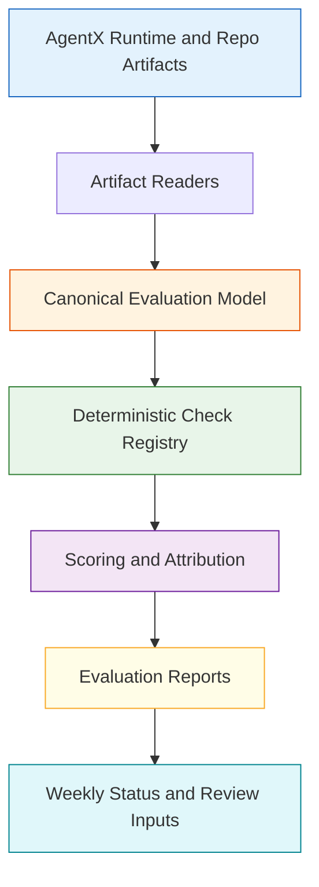
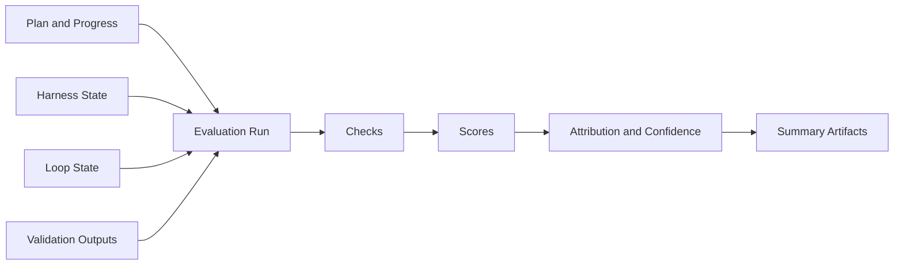
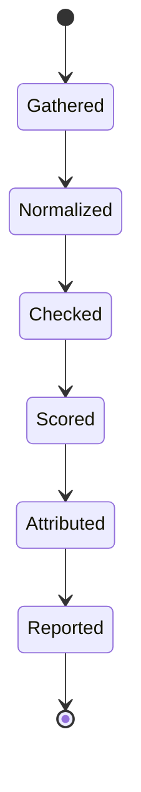
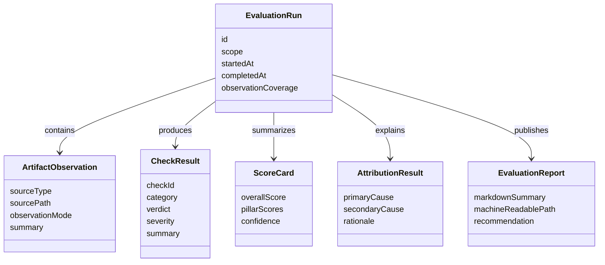
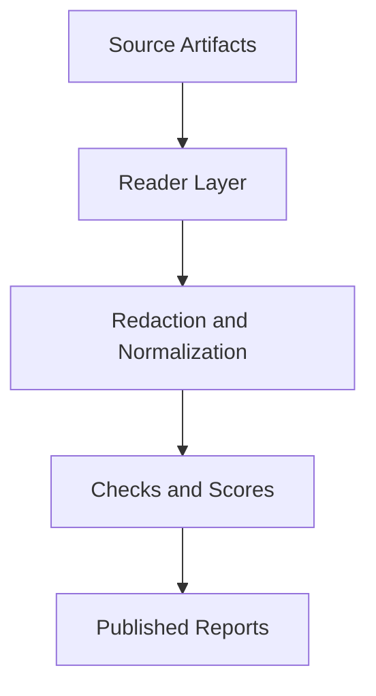

# Technical Specification: Harness Evaluation Adoption For AgentX

**Issue**: N/A
**Epic**: N/A
**Status**: Draft
**Author**: GitHub Copilot, Solution Architect Agent
**Date**: 2026-03-12
**Related ADR**: [ADR-Harness-Evaluation-Adoption.md](../adr/ADR-Harness-Evaluation-Adoption.md)

---

## Table of Contents

1. [Overview](#1-overview)
2. [Goals And Non-Goals](#2-goals-and-non-goals)
3. [Architecture](#3-architecture)
4. [Component Design](#4-component-design)
5. [Data Model](#5-data-model)
6. [API Design](#6-api-design)
7. [Security](#7-security)
8. [Performance](#8-performance)
9. [Error Handling](#9-error-handling)
10. [Monitoring](#10-monitoring)
11. [Testing Strategy](#11-testing-strategy)
12. [Migration Plan](#12-migration-plan)
13. [Open Questions](#13-open-questions)

---

## 1. Overview

This specification defines a native evaluation layer for AgentX that scores harness quality using existing repo-local artifacts and runtime state. The layer adds deterministic checks, attribution, confidence reporting, and observation coverage without replacing the current execution runtime. [Confidence: HIGH]

### Scope

- In scope: canonical evaluation schema, deterministic check registry, passive artifact readers, scoring, attribution, confidence reporting, and reporting integration. [Confidence: HIGH]
- Out of scope: replacing the AgentX runtime, embedding evaluation into every live turn in phase 1, model-only judgment as the primary control plane, or introducing a new external protocol layer. [Confidence: HIGH]

### Success Criteria

- AgentX can score runs consistently from existing local artifacts. [Confidence: HIGH]
- Evaluation results identify likely failure causes across model, harness, policy, and environment categories. [Confidence: HIGH]
- Weekly status and review workflows can consume evaluation outputs in advisory mode. [Confidence: HIGH]
- The first phase introduces no fragile blocking gate into the current execution path. [Confidence: HIGH]

---

## 2. Goals And Non-Goals

### Goals

- Turn current harness artifacts into a comparable evaluation surface. [Confidence: HIGH]
- Improve diagnosis quality for failed or degraded runs. [Confidence: HIGH]
- Measure observation coverage so confidence can be calibrated. [Confidence: HIGH]
- Support later gating decisions with deterministic evidence. [Confidence: HIGH]
- Reconcile harness quality reporting with actual runtime behavior. [Confidence: HIGH]

### Non-Goals

- Do not re-architect AgentX around evaluation-first execution. [Confidence: HIGH]
- Do not rely on narrative or model-only judgment as the primary scoring engine. [Confidence: HIGH]
- Do not promote checks into blocking CI gates in the first phase. [Confidence: HIGH]
- Do not expand into browser-state or full observability ingestion before the basic schema and checks are stable. [Confidence: HIGH]

---

## 3. Architecture

### 3.1 High-Level Evaluation Architecture

**Architectural decision:** Evaluation should sit beside the runtime, not inside it, for the first phase. [Confidence: HIGH]

### 3.2 Evaluation Flow

**Architectural decision:** A single evaluation run should normalize multiple artifact sources before any scoring occurs. [Confidence: HIGH]

### 3.3 Attribution Lifecycle

**Architectural decision:** Attribution should be produced after checks and scores, not before, so it remains evidence-driven rather than speculative. [Confidence: HIGH]

---

## 4. Component Design

### 4.1 Artifact Reader Layer

The reader layer ingests existing AgentX artifacts and converts them into normalized inputs. Initial supported sources should include plan files, progress logs, harness state, loop state, and validation outputs. [Confidence: HIGH]

**Responsibilities:**

- locate relevant repo-local evaluation inputs
- normalize heterogeneous formats into a single evaluation model
- record whether each fact is directly observed or inferred
- capture source references for traceability [Confidence: HIGH]

### 4.2 Canonical Evaluation Model

The evaluation model is the stable contract between readers, checks, scoring, and reporting. It must be serializable, deterministic, and usable from both local scripts and extension-side workflows. [Confidence: HIGH]

**Responsibilities:**

- represent run identity and source artifacts
- carry normalized findings and check results
- carry scores, attribution, and confidence
- support later expansion without breaking phase-1 reports [Confidence: HIGH]

### 4.3 Deterministic Check Registry

The check registry defines the evaluation rules that operate over the canonical model. Phase-1 checks should focus on loop discipline, policy adherence, plan/evidence integrity, and observation coverage. [Confidence: HIGH]

**Responsibilities:**

- register checks by category and maturity
- run checks independently and reproducibly
- emit structured findings with remediation text
- distinguish mature checks from experimental checks [Confidence: HIGH]

### 4.4 Scoring And Attribution Engine

The scoring engine aggregates check outcomes into per-category scores and an overall verdict. The attribution engine maps failures to likely primary causes using deterministic rules first, with optional future AI-assisted summarization layered above it. [Confidence: HIGH]

**Responsibilities:**

- compute category scores
- generate weighted or threshold-based overall verdicts
- classify likely root-cause buckets
- attach confidence based on evidence completeness and observation coverage [Confidence: HIGH]

### 4.5 Reporting Layer

The reporting layer emits outputs suitable for weekly status, review artifacts, and later CI or dashboard use. Phase 1 should produce both machine-readable and concise markdown outputs. [Confidence: HIGH]

**Responsibilities:**

- publish compact markdown summaries
- publish machine-readable evaluation results
- provide advisory text for reviewers and maintainers
- remain separate from the live runtime critical path [Confidence: HIGH]

---

## 5. Data Model

### 5.1 Conceptual Entity Model

### 5.2 Required Logical Fields

| Entity | Required Fields | Purpose |
|-------|------------------|---------|
| EvaluationRun | identifier, scope, source list, observation coverage | Stable container for one evaluation pass |
| ArtifactObservation | source type, source location, observation mode, summary | Traceable evidence intake |
| CheckResult | check identifier, category, verdict, severity, rationale | Deterministic evaluation output |
| ScoreCard | per-category scores, overall score, confidence | Comparable quality measurement |
| AttributionResult | primary cause, confidence, rationale | Actionable diagnosis |
| EvaluationReport | human summary, machine-readable output reference, recommendation | Review and reporting integration |

### 5.3 Observation Modes

| Mode | Meaning | Confidence Impact |
|------|---------|-------------------|
| observed | Derived directly from a repo-local artifact or runtime state | Positive |
| reconstructed | Derived from multiple observed inputs with deterministic transformation | Neutral |
| inferred | Best-effort conclusion with incomplete direct evidence | Negative |

**Data decision:** Observation mode must be explicit so score confidence does not overstate evidence quality. [Confidence: HIGH]

---

## 6. API Design

This specification does not require a public network API. It requires a stable internal contract that can be used by local scripts, extension features, and reporting workflows. [Confidence: HIGH]

### 6.1 Required Internal Operations

| Operation | Purpose | Output |
|----------|---------|--------|
| collect artifacts | Discover and read relevant run artifacts | normalized source set |
| build evaluation run | Construct canonical evaluation object | evaluation run |
| execute checks | Run registered deterministic checks | check results |
| compute scores | Produce category and overall scores | score card |
| attribute findings | Classify likely failure causes | attribution result |
| publish report | Emit machine-readable and markdown summaries | report output |

### 6.2 Report Surfaces

| Surface | Use | Phase |
|--------|-----|-------|
| local machine-readable result | automation and future CI | 1 |
| markdown summary | reviewer and maintainer consumption | 1 |
| weekly-status integration | trend reporting | 2 |
| quality-score inputs | maturity updates | 2 |

**API decision:** Keep the interface file-based and internal first, because the current repo already operates effectively on local artifacts and markdown/system-of-record patterns. [Confidence: HIGH]

---

## 7. Security

Harness evaluation must improve trust without introducing new leak paths. [Confidence: HIGH]

### Security Requirements

- Evaluation readers must not expose secrets from logs, outputs, or state files. [Confidence: HIGH]
- Attribution summaries must remain evidence-based and avoid unsupported blame narratives. [Confidence: HIGH]
- Machine-readable outputs must be safe to commit or archive if stored in repo artifacts. [Confidence: MEDIUM]
- Evaluation must not create a hidden bypass around existing approval and command-safety controls. [Confidence: HIGH]

### Security Model

**Security decision:** Evaluation should only consume already-governed artifacts and apply normalization before report generation. [Confidence: HIGH]

---

## 8. Performance

Phase-1 evaluation should optimize for low operational friction rather than extreme throughput. [Confidence: HIGH]

### Performance Targets

| Concern | Target | Rationale |
|--------|--------|-----------|
| artifact collection | lightweight over common local files | Avoid slowing normal workflows |
| check execution | deterministic and fast enough for advisory runs | Weekly and local reporting should remain cheap |
| report generation | compact outputs | Reviewers need concise summaries |
| scoring overhead | off critical execution path | Runtime should stay unaffected in phase 1 |

### Performance Decision

- Keep evaluation off the live execution critical path in phase 1. [Confidence: HIGH]
- Limit the initial source set to high-signal local artifacts. [Confidence: HIGH]
- Expand only after report usefulness is proven. [Confidence: MEDIUM]

---

## 9. Error Handling

Evaluation failures must fail clearly and preserve diagnostic value. [Confidence: HIGH]

### Error-Handling Rules

- If an artifact source is missing, record reduced coverage rather than silently passing. [Confidence: HIGH]
- If a check cannot run due to missing inputs, emit a structured skipped result instead of a hidden omission. [Confidence: HIGH]
- If attribution confidence is weak, report uncertainty explicitly rather than forcing a confident cause. [Confidence: HIGH]
- If machine-readable output generation fails, preserve the markdown summary when possible. [Confidence: MEDIUM]

---

## 10. Monitoring

Evaluation monitoring should emphasize confidence and usefulness, not only execution counts. [Confidence: HIGH]

### Key Signals

| Signal | Meaning |
|-------|---------|
| evaluation adoption rate | How often runs are evaluated |
| observation coverage | How much of each report is directly grounded |
| check pass distribution | Which categories fail most often |
| attribution distribution | Which subsystem causes dominate |
| evaluator noise rate | How often maintainers reject or ignore findings |
| mature-check promotion rate | How many advisory checks become trusted gates |

### Monitoring Decision

- Extend weekly reporting to include evaluation adoption, coverage, and attribution summaries. [Confidence: HIGH]
- Keep evaluation confidence visible so low-coverage reports are not over-weighted. [Confidence: HIGH]
- Use early trends to decide which checks are worth promoting into stronger gates. [Confidence: HIGH]

---

## 11. Testing Strategy

The evaluation layer must be validated at the model, check, and reporting levels. [Confidence: HIGH]

### Test Layers

| Layer | Focus | Example Outcomes |
|------|-------|------------------|
| model construction tests | canonical evaluation object correctness | artifact inputs normalize consistently |
| check tests | deterministic verdicts and severities | loop-discipline violations are detected predictably |
| scoring tests | stable aggregation and confidence handling | low coverage reduces confidence as designed |
| reporting tests | markdown and machine-readable summaries | reports remain compact and traceable |
| scenario tests | end-to-end evaluation of representative runs | advisory report matches known run conditions |

### Testing Decisions

- Prefer deterministic fixtures over live runtime dependence for the first phase. [Confidence: HIGH]
- Add scenario cases for strong runs, weak-evidence runs, and ambiguous-attribution runs. [Confidence: HIGH]
- Separate mature checks from experimental checks in the test expectations. [Confidence: HIGH]

---

## 12. Migration Plan

### Phase 1: Schema And Check Registry

- Define the canonical evaluation model.
- Define deterministic check categories and severities.
- Keep outputs local and advisory-only. [Confidence: HIGH]

### Phase 2: Passive Artifact Ingestion

- Add readers for harness state, loop state, plans, progress logs, and validation summaries.
- Compute observation coverage and confidence. [Confidence: HIGH]

### Phase 3: Reporting Integration

- Publish compact markdown summaries for reviewers.
- Add evaluation trend outputs to weekly status. [Confidence: HIGH]

### Phase 4: Selective Gate Promotion

- Promote only trusted checks into stronger review or CI roles.
- Reassess whether richer event surfaces are required. [Confidence: MEDIUM]

### Backward Compatibility

- Existing harness runtime behavior remains unchanged. [Confidence: HIGH]
- Existing plan and weekly-status artifacts remain valid and become inputs to evaluation. [Confidence: HIGH]
- If evaluation is disabled, AgentX falls back to its current validation posture with no runtime regression. [Confidence: HIGH]

---

## 13. Open Questions

1. What score threshold, if any, should be required before a report is shown as review-ready? [Confidence: MEDIUM]
2. Which checks should remain permanently advisory rather than becoming gates? [Confidence: MEDIUM]
3. Should observation coverage be a single global percentage or per-category confidence score? [Confidence: MEDIUM]
4. How should evaluation outputs feed back into [docs/QUALITY_SCORE.md](../../QUALITY_SCORE.md) without creating stale hand-maintained duplication? [Confidence: MEDIUM]
5. When should AgentX add optional AI-assisted explanation on top of deterministic findings? [Confidence: LOW]

---

**Generated by AgentX Architect Agent**
**Last Updated**: 2026-03-12
**Version**: 1.0