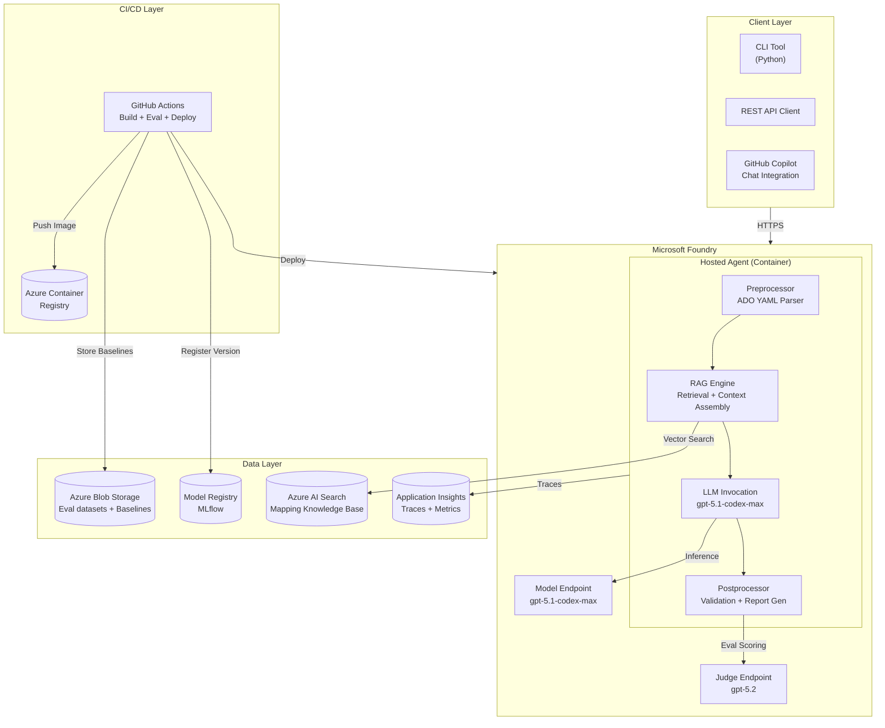
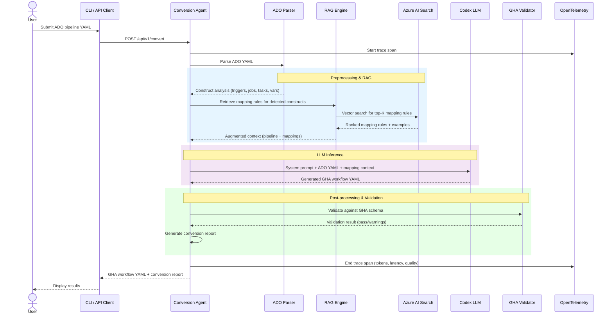
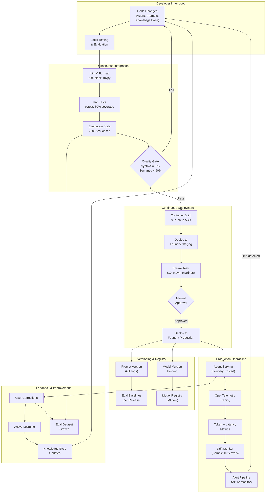
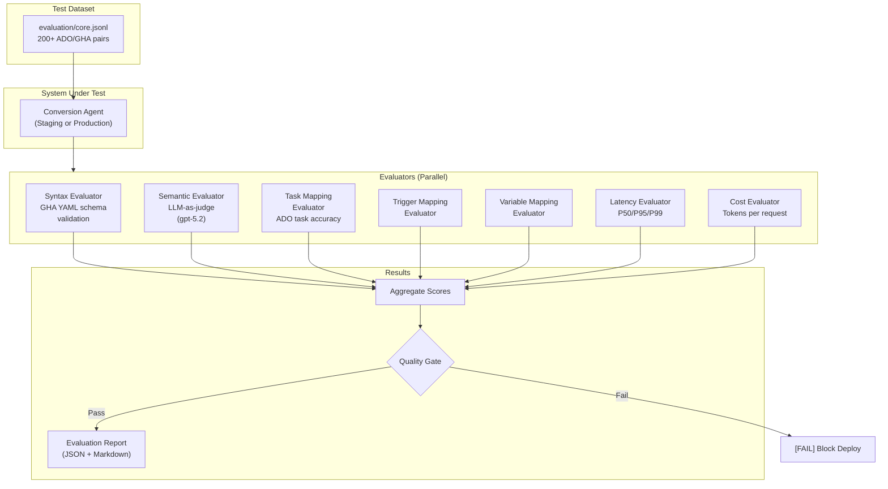
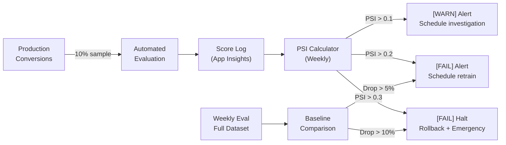
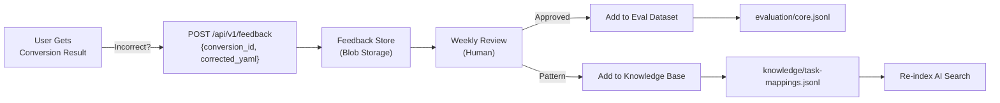

# Technical Specification: ADO Pipeline to GitHub Actions Conversion Agent

**Issue**: ADO-GHA-001
**Epic**: ADO-to-GHA-Agent
**Status**: Draft
**Author**: Solution Architect Agent
**Date**: 2026-03-03
**Related ADR**: [ADR-ADO-to-GHA-Agent.md](../adr/ADR-ADO-to-GHA-Agent.md)
**Related PRD**: [PRD-ADO-to-GHA-Agent.md](../prd/PRD-ADO-to-GHA-Agent.md)

> **Acceptance Criteria**: Defined in the PRD user stories -- see [PRD-ADO-to-GHA-Agent.md](../prd/PRD-ADO-to-GHA-Agent.md#5-user-stories--features).

---

## Table of Contents

1. [Overview](#1-overview)
2. [Architecture Diagrams](#2-architecture-diagrams)
3. [API Design](#3-api-design)
4. [Data Model](#4-data-model)
5. [Agent Design](#5-agent-design)
6. [CI/CD Pipeline](#6-cicd-pipeline)
7. [Evaluation Framework](#7-evaluation-framework)
8. [Model Drift Management](#8-model-drift-management)
9. [Model & Prompt Versioning](#9-model--prompt-versioning)
10. [Observability](#10-observability)
11. [Security](#11-security)
12. [Infrastructure](#12-infrastructure)
13. [Feedback & Continuous Improvement](#13-feedback--continuous-improvement)
14. [Implementation Plan](#14-implementation-plan)
15. [Risks & Mitigations](#15-risks--mitigations)

---

## 1. Overview

Build a Codex LLM-powered agent hosted on Microsoft Foundry that converts Azure DevOps YAML pipelines to GitHub Actions workflows. The agent uses retrieval-augmented generation (RAG) grounded in a curated mapping knowledge base to achieve >= 95% syntax correctness and >= 90% semantic equivalence.

**Scope:**
- In scope: ADO YAML pipeline conversion, validation, reporting, full agentic DevOps lifecycle management
- Out of scope: Reverse conversion (GHA to ADO), classic pipelines, source code migration

**Success Criteria:**
- Syntax correctness >= 95% on evaluation suite
- Semantic equivalence >= 90% on evaluation suite
- Conversion latency < 30 seconds P95
- Cost < $0.50 per conversion
- All 8 agentic lifecycle areas operational

---

## 2. Architecture Diagrams

### 2.1 High-Level System Architecture



### 2.2 Conversion Flow Sequence Diagram



### 2.3 Agentic DevOps Lifecycle Architecture



---

## 3. API Design

### 3.1 Endpoints

| Method | Endpoint | Description | Auth | Rate Limit |
|--------|----------|-------------|------|------------|
| POST | `/api/v1/convert` | Convert single ADO pipeline to GHA workflow | Entra ID | 50/min |
| POST | `/api/v1/convert/batch` | Convert multiple ADO pipelines | Entra ID | 10/min |
| GET | `/api/v1/convert/{id}` | Get conversion result by ID | Entra ID | 100/min |
| GET | `/api/v1/health` | Health check | None | Unlimited |
| GET | `/api/v1/metrics` | Agent metrics (token usage, latency) | Entra ID | 20/min |
| POST | `/api/v1/feedback` | Submit user correction for a conversion | Entra ID | 50/min |

### 3.2 Request/Response Contracts

#### POST /api/v1/convert

**Request:**
```json
{
  "pipeline_yaml": "string (required, raw ADO YAML content)",
  "templates": {
    "template-name.yml": "string (optional, template YAML content)"
  },
  "options": {
    "resolve_templates": true,
    "include_comments": true,
    "target_runner": "ubuntu-latest"
  }
}
```

**Response (200 OK):**
```json
{
  "id": "uuid",
  "status": "success | partial | failed",
  "workflow_yaml": "string (generated GHA workflow YAML)",
  "conversion_report": {
    "constructs_mapped": 42,
    "constructs_flagged": 3,
    "warnings": [
      {
        "type": "unsupported_task",
        "ado_construct": "AzureKeyVault@2",
        "suggestion": "Use azure/login + az keyvault commands",
        "line": 45
      }
    ],
    "mapping_summary": [
      {
        "ado_element": "trigger: [main]",
        "gha_element": "on: push: branches: [main]",
        "mapping_type": "direct"
      }
    ]
  },
  "quality_scores": {
    "syntax_valid": true,
    "confidence": 0.92,
    "tokens_used": { "prompt": 4500, "completion": 2100 },
    "latency_ms": 8500
  },
  "model_version": "gpt-5.1-codex-max-2026-02-15",
  "agent_version": "1.2.0"
}
```

### 3.3 Error Responses

| Status | Error | When |
|--------|-------|------|
| 400 | `InvalidYAML` | Input is not valid YAML |
| 400 | `PipelineTooLarge` | Input exceeds 272K token context limit |
| 401 | `Unauthorized` | Missing or invalid Entra ID token |
| 429 | `RateLimit` | Too many requests |
| 500 | `ConversionFailed` | LLM returned invalid output after retries |
| 503 | `ModelUnavailable` | Foundry model endpoint temporarily unavailable |

---

## 4. Data Model

### 4.1 Knowledge Base Schema (Azure AI Search)

| Field | Type | Description |
|-------|------|-------------|
| `id` | string | Unique mapping rule ID |
| `ado_construct_type` | string | `trigger`, `task`, `variable`, `template`, `condition`, `stage`, `job`, `step` |
| `ado_pattern` | string | ADO YAML pattern or task name (e.g., `DotNetCoreCLI@2`) |
| `gha_equivalent` | string | Equivalent GHA construct or action |
| `mapping_type` | string | `direct`, `transform`, `no-equivalent`, `manual` |
| `example_ado` | string | Example ADO YAML snippet |
| `example_gha` | string | Example GHA YAML snippet |
| `notes` | string | Conversion notes, caveats, version constraints |
| `confidence` | float | Mapping confidence (0.0 - 1.0) |
| `content_vector` | vector | Embedding for semantic search |

### 4.2 Evaluation Dataset Schema

```jsonl
{
  "id": "eval-001",
  "ado_yaml": "trigger: [main]\npool: ...",
  "expected_gha_yaml": "on:\n  push:\n    branches: [main]\n...",
  "constructs": ["trigger", "pool", "steps"],
  "complexity": "simple | medium | complex",
  "ado_tasks": ["DotNetCoreCLI@2", "PublishPipelineArtifact@1"],
  "metadata": { "source": "real-world", "client": "anonymized" }
}
```

### 4.3 Conversion Audit Log Schema

| Field | Type | Description |
|-------|------|-------------|
| `conversion_id` | UUID | Unique conversion request ID |
| `timestamp` | datetime | Request timestamp |
| `input_hash` | string | SHA-256 hash of input YAML (not stored raw) |
| `model_version` | string | Pinned model version used |
| `agent_version` | string | Agent container version |
| `prompt_version` | string | Git tag of system prompt |
| `tokens_prompt` | int | Prompt tokens consumed |
| `tokens_completion` | int | Completion tokens consumed |
| `latency_ms` | int | End-to-end conversion time |
| `syntax_valid` | bool | Output passes GHA schema validation |
| `confidence_score` | float | Agent's self-reported confidence |
| `eval_score` | float | Sampled evaluation score (null if not sampled) |
| `user_feedback` | string | Optional user correction feedback |

---

## 5. Agent Design

### 5.1 Project Structure

```
ado-to-gha-agent/
  pyproject.toml                    # Python project config
  azure.yaml                       # azd configuration
  Dockerfile                       # Container definition
  config/
    models.yaml                    # Model versions + test matrix
    settings.yaml                  # Agent configuration
  prompts/
    system.md                      # Main conversion system prompt
    templates-resolver.md          # Template resolution sub-prompt
    report-generator.md            # Conversion report sub-prompt
  templates/
    conversion-report.md           # Output report template
  knowledge/
    task-mappings.jsonl             # ADO task -> GHA action mappings
    trigger-mappings.jsonl          # Trigger conversion rules
    variable-mappings.jsonl         # Variable/secret mapping rules
    syntax-rules.jsonl              # Syntax transformation rules
  src/
    agent/
      __init__.py
      app.py                       # Agent entry point
      converter.py                 # Core conversion orchestrator
      parser.py                    # ADO YAML parser
      rag.py                       # RAG retrieval engine
      validator.py                 # GHA schema validator
      reporter.py                  # Conversion report generator
    api/
      __init__.py
      routes.py                    # FastAPI routes
      models.py                    # Pydantic request/response models
    tools/
      __init__.py
      parse_ado.py                 # Tool: parse ADO YAML
      search_mappings.py           # Tool: search knowledge base
      validate_gha.py              # Tool: validate GHA output
      generate_report.py           # Tool: generate conversion report
    utils/
      tracing.py                   # OpenTelemetry setup
      logging.py                   # Structured logging
      retry.py                     # Retry with backoff
  evaluation/
    core.jsonl                     # Core evaluation dataset (200+ pairs)
    construct-coverage.jsonl       # Per-construct test cases
    regression.jsonl               # Regression test cases
    evaluators/
      syntax_evaluator.py          # GHA YAML syntax validator
      semantic_evaluator.py        # LLM-as-judge semantic comparison
      task_mapping_evaluator.py    # ADO task -> GHA action accuracy
      trigger_mapping_evaluator.py # Trigger conversion accuracy
      variable_evaluator.py        # Variable mapping accuracy
    run_eval.py                    # Evaluation runner script
    compare_models.py              # Multi-model comparison script
  tests/
    unit/
      test_parser.py
      test_validator.py
      test_rag.py
      test_converter.py
    integration/
      test_api.py
      test_foundry_deploy.py
  infra/
    main.bicep                     # Azure infrastructure
    modules/
      foundry.bicep                # Foundry project + model
      search.bicep                 # Azure AI Search
      acr.bicep                    # Container registry
      monitoring.bicep             # App Insights + alerts
  scripts/
    seed-knowledge-base.py         # Seed AI Search with mapping rules
    index-knowledge-base.py        # Re-index knowledge base
    run-drift-check.py             # Manual drift check
  .github/
    workflows/
      ci.yml                       # Build + test + eval
      cd-staging.yml               # Deploy to staging
      cd-production.yml            # Deploy to production
      eval-weekly.yml              # Weekly evaluation + drift check
      model-comparison.yml         # Multi-model comparison
```

### 5.2 System Prompt Design

The system prompt is stored at `prompts/system.md` and follows this structure:

```
## Role
You are a DevOps pipeline conversion specialist. You convert Azure DevOps
YAML pipelines to equivalent GitHub Actions workflows.

## Rules
1. Produce ONLY valid GitHub Actions YAML
2. Map all ADO constructs to their closest GHA equivalents
3. Use the provided mapping rules as ground truth
4. When no direct mapping exists, add a TODO comment explaining what needs manual attention
5. Preserve the original pipeline's intent and behavior
6. Always add explicit `permissions:` block (principle of least privilege)
7. Use `actions/checkout@v4` (always pin action versions)
8. Map ADO `pool.vmImage` to GHA `runs-on`
9. Map ADO `trigger` to GHA `on.push.branches`
10. Map ADO `pr` to GHA `on.pull_request.branches`

## Mapping Rules (from knowledge base)
{RAG_CONTEXT}

## Input
{ADO_YAML}

## Output Format
Return ONLY the GitHub Actions workflow YAML. No explanations or markdown fences.
```

### 5.3 Tool Definitions

| Tool | Input | Output | Side Effects |
|------|-------|--------|--------------|
| `parse_ado_yaml` | Raw ADO YAML string | Structured construct analysis (triggers, stages, jobs, steps, vars, tasks) | None |
| `search_mappings` | Construct type + name | Top-K mapping rules from Azure AI Search | None |
| `validate_gha_yaml` | Generated GHA YAML string | Validation result (valid/invalid, errors, warnings) | None |
| `generate_report` | ADO analysis + GHA output + mapping decisions | Conversion report markdown | None |

### 5.4 Model Configuration

```yaml
# config/models.yaml
primary:
  model: "gpt-5.1-codex-max"
  version: "2026-02-15"
  provider: "microsoft-foundry"
  endpoint_env: "FOUNDRY_ENDPOINT"
  api_key_env: "FOUNDRY_API_KEY"
  temperature: 0.1
  max_tokens: 16384
  timeout_seconds: 60

fallback:
  model: "gpt-5.1"
  version: "2026-02-01"
  provider: "microsoft-foundry"
  endpoint_env: "FOUNDRY_ENDPOINT"
  api_key_env: "FOUNDRY_API_KEY"
  temperature: 0.1
  max_tokens: 16384
  timeout_seconds: 60

judge:
  model: "gpt-5.2"
  version: "2026-02-20"
  provider: "microsoft-foundry"
  endpoint_env: "FOUNDRY_ENDPOINT"
  api_key_env: "FOUNDRY_API_KEY"
  temperature: 0.0
  max_tokens: 4096

thresholds:
  syntax_correctness: 0.95
  semantic_equivalence: 0.90
  task_mapping_accuracy: 0.85
  trigger_mapping_accuracy: 0.95
  variable_mapping_accuracy: 0.90
  max_latency_p95_ms: 30000
  max_cost_per_conversion: 0.50
  regression_tolerance: 0.05

evaluation:
  dataset: "evaluation/core.jsonl"
  sample_rate_production: 0.10
  judge_calibration_target: 0.80
  weekly_comparison_models:
    - "gpt-5.1-codex-max"
    - "gpt-5.1"
```

---

## 6. CI/CD Pipeline

### 6.1 CI Pipeline (`ci.yml`)

```yaml
name: CI - Build + Test + Evaluate
on:
  push:
    branches: [main, develop]
    paths: ['src/**', 'prompts/**', 'knowledge/**', 'evaluation/**', 'config/**']
  pull_request:
    branches: [main]

permissions:
  contents: read

concurrency:
  group: ${{ github.workflow }}-${{ github.ref }}
  cancel-in-progress: true

jobs:
  lint-and-test:
    runs-on: ubuntu-latest
    timeout-minutes: 15
    steps:
      - uses: actions/checkout@v4
      - uses: actions/setup-python@v5
        with: { python-version: '3.11', cache: 'pip' }
      - run: pip install -e ".[dev]"
      - run: ruff check src/ tests/
      - run: mypy src/
      - run: pytest tests/unit/ --cov=src --cov-report=xml --cov-fail-under=80
      - uses: codecov/codecov-action@v4

  evaluation:
    runs-on: ubuntu-latest
    needs: lint-and-test
    timeout-minutes: 30
    environment: evaluation
    steps:
      - uses: actions/checkout@v4
      - uses: actions/setup-python@v5
        with: { python-version: '3.11', cache: 'pip' }
      - run: pip install -e ".[dev,eval]"
      - name: Run evaluation suite
        env:
          FOUNDRY_ENDPOINT: ${{ secrets.FOUNDRY_ENDPOINT }}
          FOUNDRY_API_KEY: ${{ secrets.FOUNDRY_API_KEY }}
        run: |
          python evaluation/run_eval.py \
            --dataset evaluation/core.jsonl \
            --config config/models.yaml \
            --output evaluation/results.json
      - name: Quality gate check
        run: |
          python -c "
          import json, sys
          results = json.load(open('evaluation/results.json'))
          thresholds = {
            'syntax_correctness': 0.95,
            'semantic_equivalence': 0.90,
            'task_mapping_accuracy': 0.85
          }
          failed = []
          for metric, threshold in thresholds.items():
            score = results['scores'][metric]
            if score < threshold:
              failed.append(f'{metric}: {score:.3f} < {threshold}')
          if failed:
            print('[FAIL] Quality gate failed:')
            for f in failed: print(f'  - {f}')
            sys.exit(1)
          print('[PASS] All quality gates passed')
          "
      - name: Save evaluation baseline
        if: github.ref == 'refs/heads/main'
        run: |
          cp evaluation/results.json evaluation/baselines/baseline-$(date +%Y%m%d).json
      - uses: actions/upload-artifact@v4
        with: { name: eval-results, path: evaluation/results.json }
```

### 6.2 CD Staging Pipeline (`cd-staging.yml`)

```yaml
name: CD - Deploy to Staging
on:
  workflow_run:
    workflows: ["CI - Build + Test + Evaluate"]
    types: [completed]
    branches: [main]

permissions:
  contents: read
  id-token: write

jobs:
  deploy-staging:
    runs-on: ubuntu-latest
    if: ${{ github.event.workflow_run.conclusion == 'success' }}
    environment: staging
    timeout-minutes: 20
    steps:
      - uses: actions/checkout@v4
      - uses: azure/login@v2
        with:
          client-id: ${{ secrets.AZURE_CLIENT_ID }}
          tenant-id: ${{ secrets.AZURE_TENANT_ID }}
          subscription-id: ${{ secrets.AZURE_SUBSCRIPTION_ID }}
      - name: Build and push container
        run: |
          az acr build \
            --registry ${{ vars.ACR_NAME }} \
            --image ado-to-gha-agent:${{ github.sha }} \
            --image ado-to-gha-agent:staging \
            .
      - name: Deploy to Foundry staging
        run: azd deploy --environment staging
      - name: Smoke tests
        env:
          STAGING_ENDPOINT: ${{ vars.STAGING_ENDPOINT }}
        run: |
          python tests/smoke/run_smoke_tests.py \
            --endpoint $STAGING_ENDPOINT \
            --test-cases tests/smoke/known-pipelines/
```

### 6.3 CD Production Pipeline (`cd-production.yml`)

```yaml
name: CD - Deploy to Production
on:
  workflow_dispatch:
    inputs:
      version:
        description: 'Version tag to deploy'
        required: true

permissions:
  contents: read
  id-token: write

jobs:
  deploy-production:
    runs-on: ubuntu-latest
    environment: production  # Requires manual approval
    timeout-minutes: 20
    steps:
      - uses: actions/checkout@v4
        with: { ref: ${{ inputs.version }} }
      - uses: azure/login@v2
        with:
          client-id: ${{ secrets.AZURE_CLIENT_ID }}
          tenant-id: ${{ secrets.AZURE_TENANT_ID }}
          subscription-id: ${{ secrets.AZURE_SUBSCRIPTION_ID }}
      - name: Tag and push production image
        run: |
          az acr import \
            --name ${{ vars.ACR_NAME }} \
            --source ${{ vars.ACR_NAME }}.azurecr.io/ado-to-gha-agent:${{ inputs.version }} \
            --image ado-to-gha-agent:production \
            --image ado-to-gha-agent:${{ inputs.version }}
      - name: Deploy to Foundry production
        run: azd deploy --environment production
      - name: Register model version
        run: |
          python scripts/register-version.py \
            --version ${{ inputs.version }} \
            --model-config config/models.yaml \
            --eval-baseline evaluation/baselines/latest.json
```

### 6.4 Weekly Evaluation & Drift Check (`eval-weekly.yml`)

```yaml
name: Weekly Evaluation & Drift Check
on:
  schedule:
    - cron: '0 6 * * 1'  # Every Monday at 6 AM UTC
  workflow_dispatch: {}

permissions:
  contents: read

jobs:
  weekly-eval:
    runs-on: ubuntu-latest
    environment: evaluation
    timeout-minutes: 45
    steps:
      - uses: actions/checkout@v4
      - uses: actions/setup-python@v5
        with: { python-version: '3.11', cache: 'pip' }
      - run: pip install -e ".[dev,eval]"
      - name: Run evaluation against production
        env:
          FOUNDRY_ENDPOINT: ${{ secrets.FOUNDRY_PROD_ENDPOINT }}
          FOUNDRY_API_KEY: ${{ secrets.FOUNDRY_API_KEY }}
        run: |
          python evaluation/run_eval.py \
            --dataset evaluation/core.jsonl \
            --config config/models.yaml \
            --output evaluation/weekly-results.json \
            --compare-baseline evaluation/baselines/latest.json
      - name: Drift detection
        run: |
          python scripts/run-drift-check.py \
            --current evaluation/weekly-results.json \
            --baseline evaluation/baselines/latest.json \
            --threshold 0.05
      - name: Multi-model comparison
        run: |
          python evaluation/compare_models.py \
            --config config/models.yaml \
            --dataset evaluation/core.jsonl \
            --output evaluation/model-comparison.json
```

---

## 7. Evaluation Framework

### 7.1 Evaluator Architecture



### 7.2 Quality Gate Thresholds

| Metric | Minimum (Blocking) | Target | Regression Tolerance |
|--------|-------------------|--------|---------------------|
| **Syntax Correctness** | 0.95 | 0.98 | -0.03 |
| **Semantic Equivalence** | 0.90 | 0.95 | -0.05 |
| **Task Mapping Accuracy** | 0.85 | 0.92 | -0.05 |
| **Trigger Mapping** | 0.95 | 0.98 | -0.03 |
| **Variable Mapping** | 0.90 | 0.95 | -0.05 |
| **Latency P95** | < 30s | < 15s | +100% |
| **Cost per Conversion** | < $0.50 | < $0.25 | +50% |
| **Toxicity Rate** | < 0.01 | 0.00 | Any increase |

### 7.3 LLM-as-Judge Configuration

```
Model: gpt-5.2 (stronger than conversion model)
Temperature: 0.0
Structured output: JSON

Judge Prompt:
You are evaluating the quality of an ADO-to-GitHub Actions pipeline conversion.

## Criteria
- Syntactic equivalence: Is the GHA YAML structurally correct? (1-5)
- Semantic equivalence: Does the GHA workflow produce the same behavior? (1-5)
- Completeness: Are all ADO constructs accounted for? (1-5)
- Best practices: Does the GHA workflow follow GHA best practices? (1-5)

## Input
Original ADO Pipeline:
{ado_yaml}

Expected GHA Workflow:
{expected_gha_yaml}

Generated GHA Workflow:
{generated_gha_yaml}

## Output
{
  "syntactic": N, "semantic": N, "completeness": N,
  "best_practices": N, "reasoning": "..."
}
```

### 7.4 Evaluation Dataset Requirements

| Category | Count | Examples |
|----------|-------|---------|
| **Simple pipelines** (1 stage, basic tasks) | 50 | Build-only, test-only |
| **Multi-stage** (build + test + deploy) | 40 | Standard CI/CD |
| **Templates** (template references) | 30 | Shared build templates |
| **Complex triggers** (schedule, PR, multi-branch) | 25 | Cron, path filters |
| **Variable groups & secrets** | 20 | Environment-specific configs |
| **Deployment strategies** (environments, slots) | 20 | Blue-green, canary |
| **Matrix builds** | 15 | Cross-platform, multi-version |
| **Edge cases** (custom tasks, scripts, conditions) | 20+ | Custom conditions, PowerShell |
| **TOTAL** | 200+ | |

---

## 8. Model Drift Management

### 8.1 Drift Detection Strategy

| Drift Type | What Changes | Detection Method | Response Tier |
|------------|-------------|-----------------|---------------|
| **Output Quality Drift** | Conversion quality degrades | Weekly eval score comparison | Medium -> High |
| **ADO Syntax Evolution** | New ADO YAML features released | Monitor ADO release notes + failing conversions | Low -> Medium |
| **GHA Syntax Evolution** | New GHA features or deprecated actions | Monitor GitHub Actions changelog | Low -> Medium |
| **Model Behavior Change** | Provider updates model weights | Eval baseline comparison after provider announcements | Medium -> High |
| **Input Distribution Shift** | Users submit different pipeline types | Monitor construct frequency distribution (PSI) | Low |

### 8.2 Monitoring Pipeline



### 8.3 Severity Response Matrix

| Severity | Threshold | Automated Action | Manual Action | SLA |
|----------|-----------|-----------------|---------------|-----|
| **Low** | PSI 0.05-0.1 or score drop < 3% | Log to dashboard | Review in next sprint | 1 week |
| **Medium** | PSI 0.1-0.2 or score drop 3-5% | Alert via Teams/Slack | Investigate + schedule retrain | 48 hours |
| **High** | PSI 0.2-0.3 or score drop 5-10% | Alert + auto-trigger retrain pipeline | Review retrained model, approve promotion | 24 hours |
| **Critical** | PSI > 0.3 or score drop > 10% | Alert + rollback to previous version | Root cause analysis, emergency fix | 4 hours |

---

## 9. Model & Prompt Versioning

### 9.1 Version Strategy

| Artifact | Versioning Scheme | Storage | Rollback |
|----------|-------------------|---------|----------|
| **Model** | Provider-pinned date (`gpt-5.1-codex-max-2026-02-15`) | `config/models.yaml` + MLflow registry | Change config + redeploy |
| **System Prompt** | Git-tagged (`prompt-v1.3.0`) | `prompts/system.md` in Git | Git revert + redeploy |
| **Knowledge Base** | Semantic versioned (`kb-v2.1.0`) | `knowledge/*.jsonl` in Git + AI Search index | Re-index previous version |
| **Agent Container** | SemVer + SHA (`1.2.0-abc1234`) | ACR | `az acr import` previous tag |
| **Eval Dataset** | Append-only with version tags | `evaluation/core.jsonl` in Git | Git checkout previous tag |
| **Eval Baselines** | Timestamped (`baseline-20260303.json`) | `evaluation/baselines/` in Git + Blob | Reference previous baseline |

### 9.2 Model Change Process

```
1. Update `config/models.yaml` with new model version
2. Run full eval suite against new model: `python evaluation/run_eval.py`
3. Run multi-model comparison: `python evaluation/compare_models.py`
4. Review comparison report (JSON + human-readable)
5. If new model scores >= baseline - regression_tolerance:
   a. Open PR with model config change + eval results
   b. PR triggers CI evaluation pipeline
   c. Review and merge
   d. CD deploys to staging -> smoke test -> manual approve -> production
6. If new model scores < baseline:
   a. Do NOT merge
   b. Investigate regression areas
   c. Consider prompt adjustments or knowledge base updates
7. Update eval baseline for new model version
8. Document change in CHANGELOG.md
```

### 9.3 Prompt Change Process

```
1. Edit prompt in `prompts/system.md`
2. Run local eval subset: `python evaluation/run_eval.py --subset 50`
3. If scores look good, push to feature branch
4. CI runs full eval suite automatically
5. Quality gate blocks merge if scores regress
6. After merge, tag prompt version: `git tag prompt-v1.X.0`
7. CD deploys new prompt via container rebuild
```

---

## 10. Observability

### 10.1 Tracing

All agent operations instrumented with OpenTelemetry:

| Span | Attributes | Duration Target |
|------|-----------|-----------------|
| `convert_pipeline` (root) | `pipeline_size`, `construct_count`, `model_version` | < 30s |
| `parse_ado_yaml` | `trigger_type`, `stage_count`, `task_count`, `variable_count` | < 500ms |
| `rag_retrieval` | `query_count`, `results_count`, `relevance_scores` | < 2s |
| `llm_invocation` | `model`, `prompt_tokens`, `completion_tokens`, `temperature` | < 25s |
| `validate_gha_yaml` | `valid`, `warning_count`, `error_count` | < 500ms |
| `generate_report` | `constructs_mapped`, `constructs_flagged` | < 1s |

### 10.2 Metrics Dashboard

| Metric | Type | Alert Threshold |
|--------|------|-----------------|
| `conversion.request_rate` | Counter | > 200/min (scaling trigger) |
| `conversion.error_rate` | Ratio | > 5% for 5 min |
| `conversion.latency_p95` | Histogram | > 30s |
| `conversion.token_usage` | Counter | > 50K tokens/request |
| `conversion.cost_per_request` | Gauge | > $0.50 |
| `conversion.syntax_valid_rate` | Ratio | < 95% for 1 hour |
| `conversion.confidence_avg` | Gauge | < 0.80 for 1 hour |
| `model.availability` | Ratio | < 99% for 10 min |
| `rag.retrieval_latency_p95` | Histogram | > 3s |
| `drift.psi_score` | Gauge | > 0.2 |

### 10.3 Structured Logging Format

```json
{
  "timestamp": "2026-03-03T12:00:00Z",
  "level": "INFO",
  "service": "ado-to-gha-agent",
  "trace_id": "abc123",
  "span_id": "def456",
  "conversion_id": "uuid",
  "event": "conversion_complete",
  "model_version": "gpt-5.1-codex-max-2026-02-15",
  "agent_version": "1.2.0",
  "prompt_tokens": 4500,
  "completion_tokens": 2100,
  "latency_ms": 8500,
  "syntax_valid": true,
  "confidence": 0.92,
  "constructs_mapped": 42,
  "constructs_flagged": 3
}
```

---

## 11. Security

### 11.1 Threat Model (OWASP AI Top 10)

| Threat | Risk | Mitigation |
|--------|------|------------|
| **Prompt Injection** (LLM01) | Malicious YAML manipulates agent behavior | YAML-only parsing, no code execution, output schema validation |
| **Sensitive Information Disclosure** (LLM06) | Pipeline YAML may contain sensitive config | Process in-memory only, redact secrets in logs, no raw YAML storage |
| **Supply Chain** (LLM03) | Compromised dependencies | Dependency scanning in CI, pinned versions |
| **Model Denial of Service** (LLM04) | Large pipelines exhaust context/budget | Token budget per request, pipeline size limits |
| **Insecure Output Handling** (LLM02) | Generated YAML contains insecure patterns | Post-processing security checks (no hardcoded secrets, permissions block) |

### 11.2 Security Controls

| Control | Implementation |
|---------|---------------|
| **Authentication** | Microsoft Entra ID (Managed Identity for service, user tokens for API) |
| **Authorization** | Foundry RBAC - `Contributor` for deploy, `Reader` for invoke |
| **Secret Management** | Azure Key Vault for API keys; `FOUNDRY_API_KEY` via env var |
| **Input Validation** | YAML parsing with size limits (5000 lines max); reject non-YAML |
| **Output Validation** | GHA schema validation; check for hardcoded secrets in output |
| **Audit Trail** | Immutable log per conversion (input hash, model version, scores) |
| **Network** | VNET-integrated Foundry endpoint; private ACR |
| **Dependency Scanning** | Dependabot + `pip-audit` in CI |

---

## 12. Infrastructure

### 12.1 Azure Resources

| Resource | SKU/Tier | Purpose |
|----------|----------|---------|
| **AI Foundry Project** | Standard | Agent hosting + model endpoints |
| **Azure AI Search** | Standard S1 | RAG knowledge base (vector index) |
| **Azure Container Registry** | Standard | Agent container images |
| **Application Insights** | Standard | Tracing, metrics, logs |
| **Azure Key Vault** | Standard | Secret management |
| **Azure Blob Storage** | Standard LRS | Eval baselines, audit logs |
| **Azure Monitor** | Standard | Alerts, dashboards |

### 12.2 Infrastructure as Code

```
infra/
  main.bicep                    # Orchestrator
  modules/
    foundry.bicep               # AI Foundry project + model deployments
    search.bicep                # Azure AI Search + index definition
    acr.bicep                   # Container registry
    monitoring.bicep            # App Insights + alert rules + dashboards
    keyvault.bicep              # Key Vault + access policies
    storage.bicep               # Blob storage for baselines
```

Provisioned via: `azd provision --environment <env>`

### 12.3 Environments

| Environment | Purpose | Approval Gate | Model |
|-------------|---------|---------------|-------|
| **dev** | Local development + testing | None | gpt-5.1 (cost-saving) |
| **staging** | Pre-production validation | Auto (after CI passes) | gpt-5.1-codex-max |
| **production** | Live conversion service | Manual approval | gpt-5.1-codex-max |

---

## 13. Feedback & Continuous Improvement

### 13.1 Feedback Collection



### 13.2 Active Learning Pipeline

1. **Confidence Scoring**: Agent reports confidence per conversion (0.0-1.0)
2. **Low-Confidence Flagging**: Conversions with confidence < 0.70 are flagged for human review
3. **Human Review Queue**: Weekly batch of flagged conversions reviewed by DevOps engineer
4. **Corrections -> Dataset**: Corrected conversions added to evaluation dataset
5. **Pattern Discovery -> Knowledge Base**: Repeated correction patterns become new mapping rules

### 13.3 Knowledge Base Evolution

| Trigger | Action | Frequency |
|---------|--------|-----------|
| New ADO task version released | Add mapping to `task-mappings.jsonl` + re-index | As needed |
| New GHA action version released | Update action versions in mappings | Monthly |
| User feedback reveals missing mapping | Add to knowledge base after validation | Weekly review |
| Evaluation failure on new construct | Add test case + mapping rule | As discovered |
| ADO/GHA deprecation announcement | Update mappings + add migration notes | As announced |

---

## 14. Implementation Plan

### Phase 1: Foundation (Weeks 1-3)

| Week | Deliverable | Owner |
|------|-------------|-------|
| 1 | Scaffold Foundry hosted agent project (Python) | AI Engineer 1 |
| 1 | ADO YAML parser + construct analyzer | AI Engineer 2 |
| 1 | GitHub Actions CI pipeline (`ci.yml`) | DevOps Engineer |
| 2 | System prompt v1 + tool definitions | AI Engineer 1 |
| 2 | RAG engine + Azure AI Search knowledge base setup | AI Engineer 2 |
| 2 | Evaluation dataset (100 pairs) + evaluators | AI Engineer 1 |
| 3 | Core conversion flow end-to-end | Both AI Engineers |
| 3 | CI evaluation quality gate | DevOps Engineer |
| 3 | CD staging pipeline + Foundry deploy | DevOps Engineer |

### Phase 2: Quality & Lifecycle (Weeks 4-6)

| Week | Deliverable | Owner |
|------|-------------|-------|
| 4 | Post-processing validation (GHA schema) | AI Engineer 2 |
| 4 | Conversion report generation | AI Engineer 1 |
| 4 | Evaluation dataset expansion (200+ pairs) | Both AI Engineers |
| 5 | LLM-as-judge evaluator (semantic equivalence) | AI Engineer 1 |
| 5 | Model drift monitoring pipeline | AI Engineer 2 |
| 5 | Observability (OpenTelemetry, dashboards, alerts) | DevOps Engineer |
| 6 | Model version registry + rollback testing | DevOps Engineer |
| 6 | CD production pipeline with approval gate | DevOps Engineer |
| 6 | Weekly evaluation + drift check workflow | AI Engineer 2 |

### Phase 3: Enterprise & Hardening (Weeks 7-8)

| Week | Deliverable | Owner |
|------|-------------|-------|
| 7 | Batch conversion mode | AI Engineer 1 |
| 7 | ADO template resolution | AI Engineer 2 |
| 7 | Security hardening (OWASP AI review) | DevOps Engineer |
| 8 | Feedback API + active learning pipeline | AI Engineer 1 |
| 8 | Production deployment + smoke tests | DevOps Engineer |
| 8 | Demo scenario + documentation | All |

---

## 15. Risks & Mitigations

| Risk | Impact | Probability | Mitigation |
|------|--------|-------------|------------|
| Codex model produces invalid YAML frequently | High | Medium | Schema validation + retry with error context + fallback to rule-based for simple patterns |
| Evaluation dataset not representative | High | Medium | Curate from real ADO pipelines across clients; include all construct types |
| RAG retrieval returns irrelevant mappings | Medium | Medium | Tune relevance threshold + top-K; audit retrieval quality weekly |
| Foundry deployment issues | Medium | Low | Staging environment + smoke tests; document rollback procedure |
| Model version deprecated by provider | Medium | Low | Multi-model testing; fallback model always ready; pin to date versions |
| Context window exceeded for large pipelines | Low | Medium | Pipeline size check pre-processing; chunking strategy for large pipelines |
| Cost exceeds budget | Low | Low | Token budgets per request; model tiering; caching for repeated patterns |

---

**Generated by AgentX Architect Agent**
**Last Updated**: 2026-03-03
**Version**: 1.0
