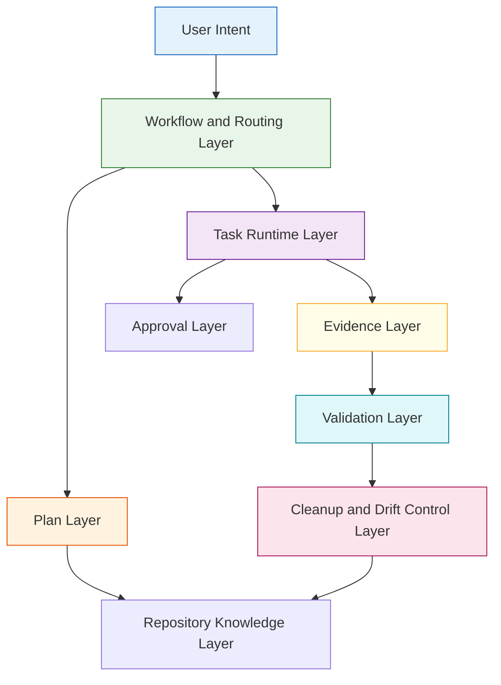
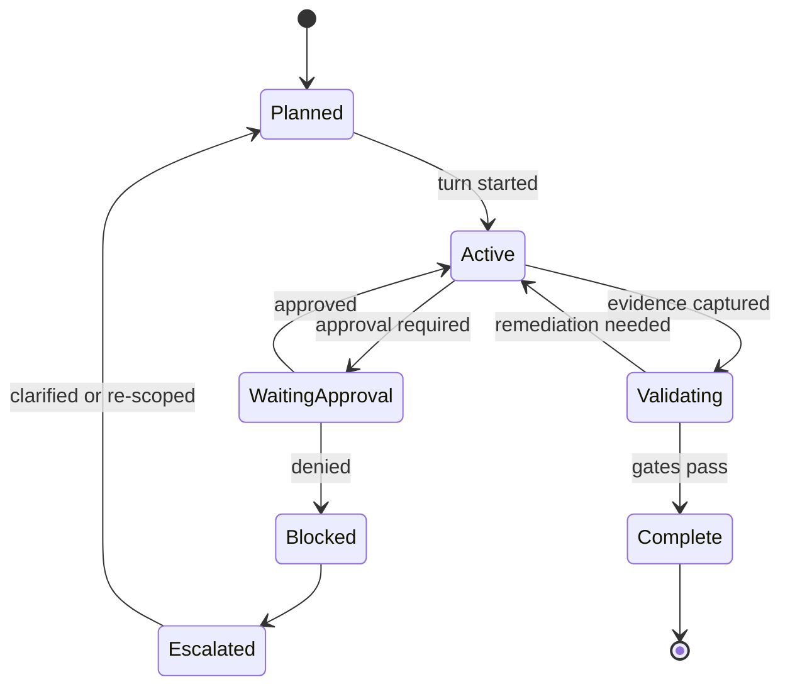
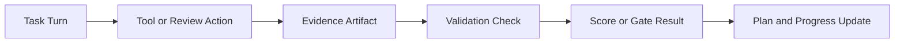
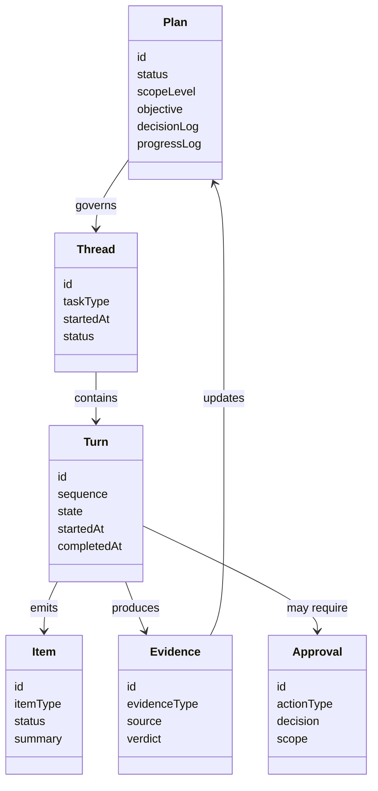
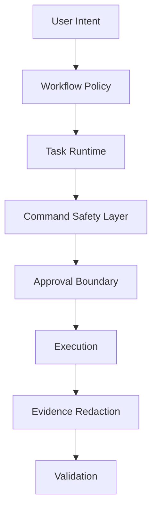

# Technical Specification: Harness Engineering For AgentX

**Issue**: N/A
**Epic**: N/A
**Status**: Draft
**Author**: GitHub Copilot, Solution Architect Agent
**Date**: 2026-03-08
**Related ADR**: [ADR-Harness-Engineering.md](../adr/ADR-Harness-Engineering.md)

---

## Table of Contents

1. [Overview](#1-overview)
2. [Goals And Non-Goals](#2-goals-and-non-goals)
3. [Architecture](#3-architecture)
4. [Component Design](#4-component-design)
5. [Data Model](#5-data-model)
6. [API Design](#6-api-design)
7. [Security](#7-security)
8. [Performance](#8-performance)
9. [Error Handling](#9-error-handling)
10. [Monitoring](#10-monitoring)
11. [Testing Strategy](#11-testing-strategy)
12. [Migration Plan](#12-migration-plan)
13. [Open Questions](#13-open-questions)

---

## 1. Overview

This specification defines a phased harness architecture that makes AgentX more legible, controllable, and scalable for agent-driven work. The design adds stronger plan management, durable task-state primitives, evidence capture, recurring cleanup, and measurable validation while preserving the current issue-first and role-based workflow. [Confidence: HIGH]

### Scope

- In scope: plan-first workflow rules, task thread and turn concepts, evidence artifacts, cleanup automation, harness scoring, extension and CLI runtime primitives, and policy enforcement. [Confidence: HIGH]
- Out of scope: a full protocol re-platform, direct adoption of an external app-server stack, autonomous merging by default, or replacement of the current hub-and-spoke workflow. [Confidence: HIGH]

### Success Criteria

- Complex work is always backed by a living execution plan and observable evidence. [Confidence: HIGH]
- AgentX can represent task progress, approvals, and validation artifacts in a stable way across sessions. [Confidence: HIGH]
- Repo drift is reduced through recurring automated cleanup and stronger validation gates. [Confidence: HIGH]
- Harness maturity can be scored independently from general code quality. [Confidence: MEDIUM]

---

## 2. Goals And Non-Goals

### Goals

- Make repository knowledge operational, not merely descriptive. [Confidence: HIGH]
- Ensure complex tasks can restart from repo-local artifacts without hidden context. [Confidence: HIGH]
- Give agents richer access to task state, approvals, and validation outcomes. [Confidence: HIGH]
- Strengthen safety and architectural coherence through mechanical enforcement. [Confidence: HIGH]
- Add recurring entropy cleanup so bad patterns do not compound. [Confidence: HIGH]

### Non-Goals

- Do not mandate "no manually written code" as a project principle. [Confidence: HIGH]
- Do not remove human approval and escalation paths for risky actions. [Confidence: HIGH]
- Do not depend on an external runtime protocol before the local harness model is stable. [Confidence: HIGH]
- Do not attempt to solve browser automation, observability plumbing, and protocol abstraction in the first milestone. [Confidence: HIGH]

---

## 3. Architecture

### 3.1 High-Level Harness Architecture

**Architectural decision:** AgentX should add a Harness layer above raw tool use and below high-level workflow policy. This layer coordinates plan state, task state, evidence, approvals, and validation signals. [Confidence: HIGH]

### 3.2 Task Lifecycle Model

**Architectural decision:** AgentX should use explicit lifecycle states for complex task execution instead of treating a task as a single opaque loop. [Confidence: HIGH]

### 3.3 Evidence Flow

**Architectural decision:** Every meaningful validation event should produce evidence that can be reviewed by agents and humans later. [Confidence: HIGH]

---

## 4. Component Design

### 4.1 Plan Layer

The Plan layer governs when execution plans are required and what they must contain. It extends the current execution-plan template into a living artifact that records progress, discoveries, decision changes, evidence references, and rollback guidance. [Confidence: HIGH]

**Primary responsibilities:**

- Determine whether a task is simple, moderate, or complex.
- Require a plan for multi-hour, multi-file, or multi-phase work.
- Keep plan status aligned with actual task state.
- Link plan sections to evidence and validation outcomes. [Confidence: HIGH]

**Primary file impact:**

- [AGENTS.md](../../AGENTS.md)
- [docs/WORKFLOW.md](../../docs/WORKFLOW.md)
- [.github/templates/EXEC-PLAN-TEMPLATE.md](../../.github/templates/EXEC-PLAN-TEMPLATE.md)
- [.github/templates/PROGRESS-TEMPLATE.md](../../.github/templates/PROGRESS-TEMPLATE.md) [Confidence: HIGH]

### 4.2 Task Runtime Layer

The Task Runtime layer gives AgentX stable primitives for Threads, Turns, Items, and Approvals. It does not need a full external protocol in the first phase. It only needs a coherent internal model so the extension and CLI can represent progress, pauses, retries, and completions consistently. [Confidence: HIGH]

**Primary responsibilities:**

- Represent durable task sessions.
- Record individual turns of work.
- Represent typed items such as user request, tool action, review finding, approval request, and evidence artifact.
- Pause and resume safely on approval boundaries. [Confidence: HIGH]

**Primary file impact:**

- [vscode-extension/src/extension.ts](../../vscode-extension/src/extension.ts)
- [vscode-extension/src/agentxContext.ts](../../vscode-extension/src/agentxContext.ts)
- [vscode-extension/src/commands/loopCommand.ts](../../vscode-extension/src/commands/loopCommand.ts)
- [vscode-extension/src/utils/loopStateChecker.ts](../../vscode-extension/src/utils/loopStateChecker.ts) [Confidence: MEDIUM]

### 4.3 Evidence Layer

The Evidence layer stores the minimum artifacts needed to prove work quality. Early evidence types should include validation summaries, review findings, loop completion state, and plan-linked proof points. Richer observability or browser artifacts can be added later. [Confidence: HIGH]

**Primary responsibilities:**

- Normalize evidence types.
- Associate evidence with a plan, thread, turn, and validation result.
- Keep evidence concise, durable, and repo-legible. [Confidence: HIGH]

### 4.4 Validation Layer

The Validation layer expands existing quality checks into harness-aware gates. It should validate plans, evidence completeness, doc/runtime consistency, and drift indicators in addition to existing skill, doc, and extension checks. [Confidence: HIGH]

**Primary file impact:**

- [.github/workflows/quality-gates.yml](../../.github/workflows/quality-gates.yml)
- [docs/GOLDEN_PRINCIPLES.md](../../docs/GOLDEN_PRINCIPLES.md)
- [docs/QUALITY_SCORE.md](../../docs/QUALITY_SCORE.md) [Confidence: HIGH]

### 4.5 Cleanup And Drift Control Layer

The Cleanup layer performs recurring entropy reduction. It identifies stale docs, broken cross-links, quality-score drift, and golden-principle violations, then creates small corrective actions. [Confidence: HIGH]

**Primary file impact:**

- [.github/workflows/weekly-status.yml](../../.github/workflows/weekly-status.yml)
- [docs/tech-debt-tracker.md](../../docs/tech-debt-tracker.md)
- [docs/QUALITY_SCORE.md](../../docs/QUALITY_SCORE.md) [Confidence: HIGH]

---

## 5. Data Model

### 5.1 Conceptual Entity Model

### 5.2 Required Logical Fields

| Entity | Required Fields | Purpose |
|-------|------------------|---------|
| Plan | identifier, status, objective, progress log, decision log | Make complex work restartable and inspectable |
| Thread | identifier, task type, status, associated plan | Durable container for ongoing task state |
| Turn | sequence, state, start and end time | Represent one bounded unit of work |
| Item | type, status, summary, origin | Fine-grained progress and action representation |
| Evidence | type, source, verdict, link target | Prove validation outcomes |
| Approval | action type, scope, decision, timestamp | Preserve safety and auditability |

**Data decision:** Start with file-backed, repo-legible artifacts and lightweight extension state rather than introducing a separate service. [Confidence: HIGH]

---

## 6. API Design

This specification does not require a public network API in the first phase. It requires an internal command and event contract between workflow logic, CLI commands, and the VS Code extension. [Confidence: HIGH]

### 6.1 Required Internal Operations

| Operation | Purpose | Output |
|----------|---------|--------|
| classify task scope | Determine whether a plan is required | scope level and plan requirement |
| start thread | Initialize durable task state | thread identifier and initial turn |
| record item | Persist a typed action or progress artifact | item record |
| request approval | Pause on risky actions | approval record and task pause |
| attach evidence | Link validation output to task state | evidence record |
| evaluate gates | Produce harness verdict | pass, fail, or remediation needed |
| run cleanup | Generate drift findings | cleanup report or action list |

### 6.2 Interface Guidance

- Prefer stable, typed internal contracts over ad hoc message strings. [Confidence: HIGH]
- Keep client-facing surfaces event-oriented so progress can stream incrementally. [Confidence: MEDIUM]
- Preserve a clear separation between workflow policy, runtime task state, and tool execution safety. [Confidence: HIGH]

---

## 7. Security

The harness must strengthen security by design rather than relying on trust in model behavior. [Confidence: HIGH]

### Security Requirements

- Approval boundaries must remain explicit for risky or non-allowlisted actions. [Confidence: HIGH]
- Evidence artifacts must not expose secrets or sensitive content. [Confidence: HIGH]
- Plan and progress artifacts must not encourage unsafe replay instructions. [Confidence: HIGH]
- Validation of boundaries must remain mechanical and tool-enforced where possible. [Confidence: HIGH]
- The harness must preserve existing blocked-command and confirmation policies as a lower layer. [Confidence: HIGH]

### Security Model

**Security decision:** The harness must add new safety layers without bypassing existing command validation and explicit approvals. [Confidence: HIGH]

---

## 8. Performance

The harness should optimize for clarity and durable state first, then for throughput. [Confidence: HIGH]

### Performance Targets

| Concern | Target | Rationale |
|--------|--------|-----------|
| plan detection overhead | negligible in normal chat turns | Simple tasks should not pay a heavy tax |
| thread and turn state updates | lightweight and incremental | Progress visibility must not block work |
| evidence write cost | small, bounded artifacts | Evidence must remain cheap enough to capture routinely |
| cleanup workload | off critical path | Entropy control should not slow interactive work |

### Performance Decision

- Keep the first phase file-based and additive. [Confidence: HIGH]
- Avoid large, chat-context-heavy artifacts in default paths. [Confidence: HIGH]
- Add summarization and compaction only where evidence volume actually becomes a problem. [Confidence: MEDIUM]

---

## 9. Error Handling

Harness failures must degrade predictably rather than silently disappearing into agent text. [Confidence: HIGH]

### Error-Handling Rules

- If a plan is required but missing, block the complex workflow path and surface a specific remediation reason. [Confidence: HIGH]
- If an approval is denied, persist the denial and move the task into a blocked state rather than retrying implicitly. [Confidence: HIGH]
- If evidence capture fails, continue only when the task is explicitly configured to allow advisory evidence. [Confidence: MEDIUM]
- If cleanup automation finds drift, report it as targeted remediation items instead of generic failure output. [Confidence: HIGH]
- All harness validators should emit remediation-oriented messages that can be used directly by an agent. [Confidence: HIGH]

---

## 10. Monitoring

Harness monitoring should focus on controllability and maturity, not only runtime health. [Confidence: HIGH]

### Key Signals

| Signal | Meaning |
|-------|---------|
| plan adoption rate | Percentage of complex tasks backed by plans |
| evidence completeness rate | Percentage of validated tasks with usable proof artifacts |
| approval interruption rate | Frequency of risky actions requiring user intervention |
| validation remediation rate | How often tasks re-enter active state after failed validation |
| cleanup finding rate | Drift and stale-doc pressure in the repo |
| harness maturity score | Overall quality of plan, runtime, evidence, and cleanup layers |

### Monitoring Decision

- Extend [docs/QUALITY_SCORE.md](../../docs/QUALITY_SCORE.md) with harness maturity dimensions. [Confidence: HIGH]
- Extend [.github/workflows/weekly-status.yml](../../.github/workflows/weekly-status.yml) to report entropy and cleanup trends. [Confidence: HIGH]
- Add richer observability integration only after the first harness artifacts are stable. [Confidence: MEDIUM]

---

## 11. Testing Strategy

The harness must be validated at three levels: policy, runtime state, and end-to-end workflow behavior. [Confidence: HIGH]

### Test Layers

| Layer | Focus | Example Outcomes |
|------|-------|------------------|
| Policy tests | plan requirements, golden principles, validator behavior | complex task blocked without plan |
| Runtime tests | thread and turn state transitions, approval pauses, evidence linking | denied approval moves task to blocked |
| Workflow tests | issue-first flow, iterative remediation, cleanup automation | task reaches complete with evidence and updated plan |

### Testing Decisions

- Add deterministic tests for task-state transitions and plan gating. [Confidence: HIGH]
- Add regression tests for remediation-oriented validator output. [Confidence: HIGH]
- Add scenario tests that prove the harness improves restartability and reviewability, not just static validation. [Confidence: HIGH]
- Keep observability and browser-surface tests out of the first milestone unless the runtime layer already exists. [Confidence: MEDIUM]

---

## 12. Migration Plan

### Phase 1: Plan-First Foundation

- Update workflow docs and templates to require plans for complex work.
- Add harness concepts and invariants to golden principles.
- Add harness debt and maturity placeholders to quality docs. [Confidence: HIGH]

### Phase 2: Mechanical Enforcement

- Extend quality gates to validate plan presence, plan freshness, and evidence references where required.
- Extend weekly status into entropy and cleanup reporting.
- Add targeted doc-gardening and drift-remediation automation. [Confidence: HIGH]

### Phase 3: Runtime Harness Primitives

- Add internal thread, turn, item, and approval concepts to the extension and CLI.
- Expose stable progress and evidence surfaces for bounded autonomous workflows.
- Keep the current outer workflow model unchanged. [Confidence: MEDIUM]

### Phase 4: Advanced Legibility

- Add richer observability and validation evidence.
- Expand harness evaluation and maturity scoring.
- Reassess whether a more explicit protocol layer is justified. [Confidence: MEDIUM]

### Backward Compatibility

- Existing simple-task flows remain valid without a plan. [Confidence: HIGH]
- Existing loop and command safety behavior remains the lower-layer control plane. [Confidence: HIGH]
- Documentation and validators must explain the new behavior in repo-local terms so older workflows fail clearly rather than silently. [Confidence: HIGH]

---

## 13. Open Questions

1. What exact threshold should classify a task as complex enough to require a plan? [Confidence: MEDIUM]
2. Should evidence artifacts live only in repo files, only in extension state, or in a hybrid model? [Confidence: MEDIUM]
3. How much autonomous sub-agent review should be allowed before explicit user-mediated handoff remains mandatory? [Confidence: MEDIUM]
4. When should AgentX introduce a richer event protocol instead of continuing with internal runtime primitives? [Confidence: LOW]
5. Which observability surfaces should be added first after plan and evidence primitives are stable: logs, traces, test artifacts, or browser-state evidence? [Confidence: MEDIUM]

---

**Generated by AgentX Architect Agent**
**Last Updated**: 2026-03-08
**Version**: 1.0