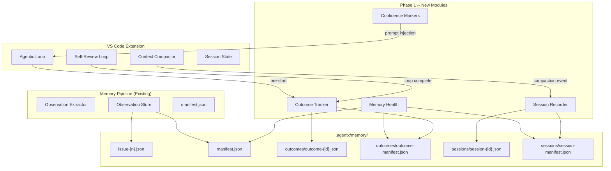
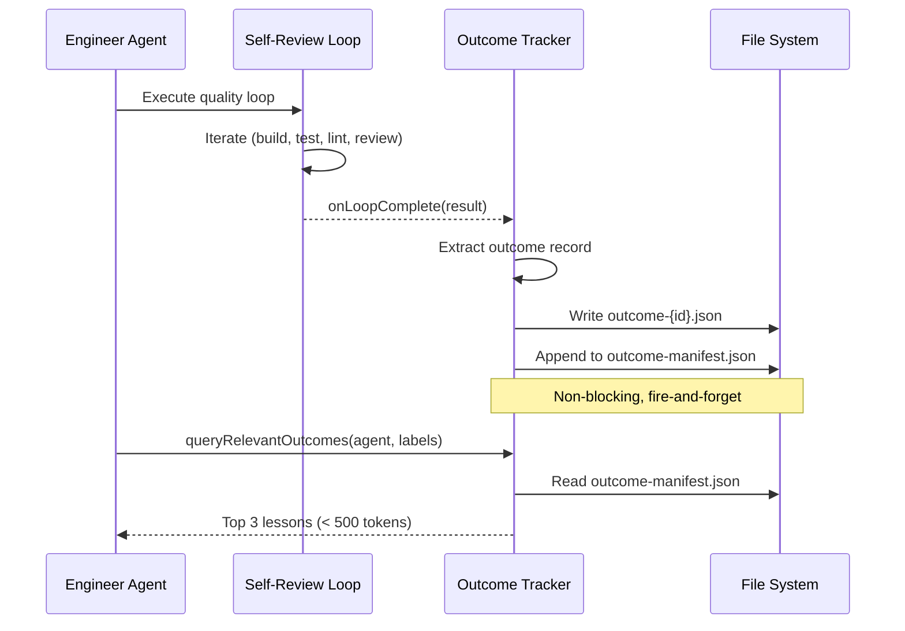
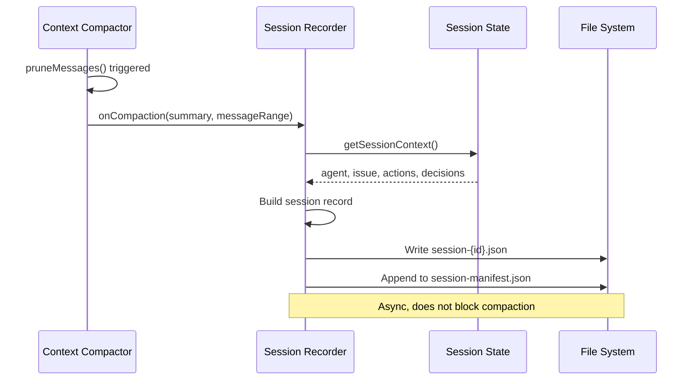

# Technical Specification: Cognitive Foundation -- Outcome Learning, Episodic Memory, Confidence Markers & Memory Health

**Epic**: Phase 1 -- Cognitive Foundation
**Status**: Draft
**Author**: Solution Architect Agent
**Date**: 2026-03-04
**Related PRD**: [PRD-Phase1-Cognitive-Foundation.md](../prd/PRD-Phase1-Cognitive-Foundation.md)

---

## Table of Contents

1. [Overview](#1-overview)
2. [Architecture Diagrams](#2-architecture-diagrams)
3. [Data Model](#3-data-model)
4. [Module Specifications](#4-module-specifications)
5. [Integration Points](#5-integration-points)
6. [Commands & UI](#6-commands--ui)
7. [Performance](#7-performance)
8. [Testing Strategy](#8-testing-strategy)
9. [Implementation Notes](#9-implementation-notes)
10. [Rollout Plan](#10-rollout-plan)
11. [Risks & Mitigations](#11-risks--mitigations)

---

## 1. Overview

This spec covers four new capabilities for the AgentX memory pipeline, all implemented as TypeScript modules in the VS Code extension with no external dependencies.

**Scope:**
- In scope: Outcome tracker, session recorder, confidence markers, memory health command
- Out of scope: Global knowledge base, forgetting curve, MCP server, background intelligence

**Success Criteria:**
- All 4 features compile clean, lint clean, >= 80% coverage
- Outcome records survive extension restart
- Session summaries auto-captured without blocking compaction
- Memory health scan completes in < 2 seconds for 5000-observation stores

---

## 2. Architecture Diagrams

### 2.1 Phase 1 Memory Pipeline Extension



### 2.2 Outcome Learning Flow



### 2.3 Session Recording Flow



---

## 3. Data Model

### 3.1 Outcome Record

```typescript
// vscode-extension/src/memory/outcomeTypes.ts

export type OutcomeResult = 'pass' | 'fail' | 'partial';

export interface OutcomeRecord {
  readonly id: string;                    // out-{agent}-{issue}-{timestamp}
  readonly agent: string;                 // e.g. "engineer"
  readonly issueNumber: number;
  readonly result: OutcomeResult;
  readonly actionSummary: string;         // What was attempted (< 200 chars)
  readonly rootCause: string | null;      // Why it failed (null if pass)
  readonly lesson: string;                // Key takeaway (< 300 chars)
  readonly iterationCount: number;        // How many loop iterations
  readonly timestamp: string;             // ISO-8601
  readonly sessionId: string;
  readonly labels: string[];              // Issue labels for similarity matching
}

export interface OutcomeIndex {
  readonly id: string;
  readonly agent: string;
  readonly issueNumber: number;
  readonly result: OutcomeResult;
  readonly lesson: string;
  readonly labels: string[];
  readonly timestamp: string;
}

export interface OutcomeManifest {
  readonly version: 1;
  updatedAt: string;
  entries: OutcomeIndex[];
}

export const MAX_OUTCOMES_PER_ISSUE = 100;
export const MAX_LESSON_TOKENS = 500;      // Max tokens for prompt injection
```

### 3.2 Session Record

```typescript
// vscode-extension/src/memory/sessionTypes.ts

export interface SessionRecord {
  readonly id: string;                    // ses-{date}-{shortId}
  readonly agent: string;
  readonly issueNumber: number | null;
  readonly startTime: string;             // ISO-8601
  readonly endTime: string;               // ISO-8601
  readonly summary: string;               // Compaction summary text
  readonly actions: string[];             // List of actions performed
  readonly decisions: string[];           // Key decisions made
  readonly filesChanged: string[];        // Workspace-relative paths
  readonly messageCount: number;          // Messages in the session
}

export interface SessionIndex {
  readonly id: string;
  readonly agent: string;
  readonly issueNumber: number | null;
  readonly startTime: string;
  readonly endTime: string;
  readonly summary: string;               // First 200 chars
}

export interface SessionManifest {
  readonly version: 1;
  updatedAt: string;
  entries: SessionIndex[];
}

export const MAX_SESSIONS_RETAINED = 200;
```

### 3.3 Memory Health Report

```typescript
// vscode-extension/src/memory/healthTypes.ts

export interface HealthReport {
  readonly scanTime: string;              // ISO-8601
  readonly durationMs: number;
  readonly observations: {
    readonly total: number;
    readonly stale: number;               // > STALE_ARCHIVE_AFTER_DAYS
    readonly orphanedFiles: string[];     // Files on disk not in manifest
    readonly missingFiles: string[];      // Manifest entries with no file
    readonly corruptFiles: string[];      // JSON parse failures
  };
  readonly outcomes: {
    readonly total: number;
    readonly orphanedFiles: string[];
    readonly corruptFiles: string[];
  };
  readonly sessions: {
    readonly total: number;
    readonly orphanedFiles: string[];
    readonly corruptFiles: string[];
  };
  readonly diskSizeBytes: number;
  readonly healthy: boolean;              // true if no issues found
}
```

### 3.4 File Layout

```
.agentx/memory/
  manifest.json                           # Existing observation manifest
  issue-{n}.json                          # Existing per-issue observations
  outcomes/
    outcome-manifest.json                 # Outcome index
    outcome-{agent}-{issue}-{ts}.json     # Individual outcome records
  sessions/
    session-manifest.json                 # Session index
    session-{date}-{id}.json             # Individual session records
  .archive/                               # Quarantine for orphaned/stale files
```

---

## 4. Module Specifications

### 4.1 Outcome Tracker (`memory/outcomeTracker.ts`)

**Responsibilities:**
- Record outcome after quality loop completion
- Query relevant outcomes for prompt injection
- Manage outcome manifest

**Public API:**

```typescript
export interface IOutcomeTracker {
  /** Record an outcome from a completed quality loop. */
  record(outcome: OutcomeRecord): Promise<void>;

  /** Query outcomes matching agent + labels. Returns newest first. */
  query(agent: string, labels?: string[], limit?: number): Promise<OutcomeIndex[]>;

  /** Search outcomes by keyword across lessons. */
  search(keyword: string, limit?: number): Promise<OutcomeIndex[]>;

  /** Get full outcome record by ID. */
  getById(id: string): Promise<OutcomeRecord | null>;

  /** Format top relevant lessons for prompt injection (< MAX_LESSON_TOKENS). */
  formatLessonsForPrompt(agent: string, labels?: string[]): Promise<string>;

  /** Get outcome statistics. */
  getStats(): Promise<{ total: number; byResult: Record<OutcomeResult, number> }>;
}
```

**Implementation Notes:**
- File I/O uses `fs.promises` (async, non-blocking)
- Manifest loaded into memory on first access, cached with 30s TTL (same pattern as observation store)
- `record()` is fire-and-forget from the caller's perspective -- errors logged, not thrown
- When outcomes exceed `MAX_OUTCOMES_PER_ISSUE`, oldest are moved to `.archive/`
- `formatLessonsForPrompt()` returns a plain-text block with at most 3 lessons, formatted as:
  ```
  ## Lessons from Past Work
  - [PASS] On issue #42 (auth-flow): Always validate token expiry before caching
  - [FAIL] On issue #38 (api-design): Missing null check on optional params caused test failures
  ```

### 4.2 Session Recorder (`memory/sessionRecorder.ts`)

**Responsibilities:**
- Auto-capture session summary when context compactor triggers
- Provide session query and listing
- Support session resume

**Public API:**

```typescript
export interface ISessionRecorder {
  /** Record a session from compaction context. */
  capture(session: SessionRecord): Promise<void>;

  /** List recent sessions, newest first. */
  list(limit?: number): Promise<SessionIndex[]>;

  /** List sessions for a specific issue. */
  listByIssue(issueNumber: number, limit?: number): Promise<SessionIndex[]>;

  /** Get full session record by ID. */
  getById(id: string): Promise<SessionRecord | null>;

  /** Get the most recent session (optionally filtered by issue). */
  getMostRecent(issueNumber?: number): Promise<SessionRecord | null>;

  /** Search sessions by keyword. */
  search(keyword: string, limit?: number): Promise<SessionIndex[]>;
}
```

**Implementation Notes:**
- Triggered from `contextCompactor.ts` via an event callback (not direct import)
- Uses the same filesystem pattern as observation store
- Session ID format: `ses-{YYYYMMDD}-{6-char-random}`
- When sessions exceed `MAX_SESSIONS_RETAINED`, oldest auto-pruned
- `capture()` is wrapped in try/catch -- never blocks or crashes the compactor

### 4.3 Memory Health (`memory/memoryHealth.ts`)

**Responsibilities:**
- Scan all memory subdirectories for integrity issues
- Generate structured health report
- Auto-repair when `--fix` mode is requested

**Public API:**

```typescript
export interface IMemoryHealth {
  /** Scan memory store and return health report. */
  scan(): Promise<HealthReport>;

  /** Scan and auto-repair: rebuild manifests, quarantine orphans. */
  repair(): Promise<HealthReport>;
}
```

**Implementation Notes:**
- Scans three stores: observations, outcomes, sessions
- For each store:
  1. Read manifest entries
  2. List actual files on disk via `fs.readdir`
  3. Cross-reference: files not in manifest = orphaned, manifest entries without files = missing
  4. Attempt JSON parse on each file: parse failure = corrupt
  5. Check timestamp on observations: older than `STALE_ARCHIVE_AFTER_DAYS` = stale
- `repair()` does everything `scan()` does, plus:
  - Moves orphaned files to `.agentx/memory/.archive/{timestamp}/`
  - Removes missing entries from manifest
  - Rebuilds manifest from disk files if manifest itself is corrupt
- Calculates `diskSizeBytes` via `fs.stat` on all memory files

### 4.4 Confidence Markers (Prompt Template Updates)

**Responsibilities:**
- Add confidence marker instructions to Architect and Reviewer agent prompts

**Implementation:**
- Update `.github/agents/architect.agent.md` -- add to output format section:
  ```
  ## Confidence Markers (REQUIRED)
  Every major recommendation MUST include a confidence tag:
  - [Confidence: HIGH] -- Strong evidence, proven pattern, low risk
  - [Confidence: MEDIUM] -- Reasonable approach, some uncertainty, may need validation
  - [Confidence: LOW] -- Speculative, limited evidence, requires further research
  ```
- Update `.github/agents/reviewer.agent.md` -- add same section
- Update `.github/agents/data-scientist.agent.md` -- add for model evaluation recommendations

---

## 5. Integration Points

### 5.1 Self-Review Loop -> Outcome Tracker

**File**: `vscode-extension/src/agentic/selfReviewLoop.ts`

Hook into the loop completion callback:

```typescript
// After loop completes (success or max iterations)
const outcome: OutcomeRecord = {
  id: `out-${agent}-${issueNumber}-${Date.now()}`,
  agent,
  issueNumber,
  result: allTestsPass && coverageMet ? 'pass' : 'fail',
  actionSummary: buildActionSummary(iterations),
  rootCause: !allTestsPass ? extractRootCause(lastFindings) : null,
  lesson: extractLesson(iterations, result),
  iterationCount: iterations.length,
  timestamp: new Date().toISOString(),
  sessionId,
  labels: issueLabels,
};
outcomeTracker.record(outcome); // fire-and-forget
```

### 5.2 Context Compactor -> Session Recorder

**File**: `vscode-extension/src/utils/contextCompactor.ts`

Hook into the post-compaction event:

```typescript
// After pruneMessages() completes
const session: SessionRecord = {
  id: `ses-${formatDate(new Date())}-${randomId(6)}`,
  agent: currentAgent,
  issueNumber: currentIssue ?? null,
  startTime: oldestPrunedMessage.timestamp,
  endTime: new Date().toISOString(),
  summary: compactionSummary.substring(0, 500),
  actions: extractActions(prunedMessages),
  decisions: extractDecisions(prunedMessages),
  filesChanged: extractFileChanges(prunedMessages),
  messageCount: prunedMessages.length,
};
sessionRecorder.capture(session).catch(err => console.warn('Session capture failed:', err));
```

### 5.3 Agentic Loop -> Outcome Query

**File**: `vscode-extension/src/agentic/agenticLoop.ts`

Before starting a new task, query relevant lessons:

```typescript
// During system prompt construction
const lessons = await outcomeTracker.formatLessonsForPrompt(agent, issueLabels);
if (lessons) {
  systemPrompt += '\n\n' + lessons;
}
```

### 5.4 Extension Activation -> Commands

**File**: `vscode-extension/src/extension.ts`

Register new commands:

```typescript
context.subscriptions.push(
  vscode.commands.registerCommand('agentx.memoryHealth', memoryHealthHandler),
  vscode.commands.registerCommand('agentx.sessionHistory', sessionHistoryHandler),
  vscode.commands.registerCommand('agentx.resumeSession', resumeSessionHandler),
);
```

### 5.5 Barrel Export

**File**: `vscode-extension/src/memory/index.ts`

```typescript
export { OutcomeTracker } from './outcomeTracker';
export { SessionRecorder } from './sessionRecorder';
export { MemoryHealth } from './memoryHealth';
export type { OutcomeRecord, OutcomeIndex, OutcomeManifest } from './outcomeTypes';
export type { SessionRecord, SessionIndex, SessionManifest } from './sessionTypes';
export type { HealthReport } from './healthTypes';
```

---

## 6. Commands & UI

### 6.1 Command: `agentx.memoryHealth`

**Trigger**: Command palette or CLI
**Output**: Health report in output channel

```
=== AgentX Memory Health Report ===
Scan time: 2026-03-04T10:30:00Z (342ms)

Observations: 1,247 total | 23 stale (> 90 days)
Outcomes:     89 total    | 0 issues
Sessions:     42 total    | 0 issues
Disk usage:   2.1 MB

Issues Found:
  [WARN] 3 orphaned observation files (not in manifest)
  [WARN] 1 corrupt session file (invalid JSON)

Status: NEEDS REPAIR
Run with --fix to auto-repair.
```

With `--fix`:
```
=== AgentX Memory Health Repair ===
[PASS] Rebuilt observation manifest (3 orphans added)
[PASS] Quarantined 1 corrupt session file to .archive/
[PASS] Store healthy after repair

Status: HEALTHY
```

### 6.2 Command: `agentx.sessionHistory`

**Trigger**: Command palette
**Output**: QuickPick list of recent sessions

Items show: `{date} | {agent} | Issue #{n} | {summary preview}`

Selecting a session opens the full JSON in a read-only editor.

### 6.3 Command: `agentx.resumeSession`

**Trigger**: Command palette
**Output**: Chat message with session context

Loads the most recent session for the active issue (or overall) and formats it as a Copilot Chat context message:

```
## Session Resume (2026-03-04 09:15)
**Agent**: Engineer | **Issue**: #42

### Summary
Implemented pagination for the /api/users endpoint. Added offset/limit params.

### Decisions
- Used cursor-based pagination over offset-based for performance
- Set default page size to 25

### Files Changed
- src/routes/users.ts
- tests/routes/users.test.ts

### Actions Taken
- Created pagination utility function
- Updated API route handler
- Added integration tests (3 new)
```

---

## 7. Performance

| Operation | Target | Approach |
|-----------|--------|----------|
| Outcome record write | < 50ms | Append to file, async manifest update |
| Outcome query (label match) | < 500ms | In-memory manifest scan |
| Session capture | < 200ms | Async write, no blocking |
| Session list | < 100ms | Manifest scan |
| Memory health scan | < 2s (5K obs) | Streaming fs.readdir + parallel stat |
| Memory health repair | < 5s (5K obs) | Sequential file moves + manifest rebuild |

---

## 8. Testing Strategy

### 8.1 Unit Tests

**Coverage Target**: >= 80% per module

| Module | Test File | Key Scenarios |
|--------|-----------|---------------|
| `outcomeTracker.ts` | `test/memory/outcomeTracker.test.ts` | record, query by agent, query by label, search, format lessons, max limit |
| `sessionRecorder.ts` | `test/memory/sessionRecorder.test.ts` | capture, list, listByIssue, getMostRecent, search, max retention prune |
| `memoryHealth.ts` | `test/memory/memoryHealth.test.ts` | scan healthy, detect orphans, detect missing, detect corrupt, detect stale, repair |
| `outcomeTypes.ts` | Covered by outcomeTracker tests | Type validation |
| `sessionTypes.ts` | Covered by sessionRecorder tests | Type validation |
| `healthTypes.ts` | Covered by memoryHealth tests | Type validation |

### 8.2 Integration Tests

- Self-review loop -> outcome tracker: verify outcome file written after loop
- Context compactor -> session recorder: verify session file written after compaction
- Memory health scan on a directory with intentional corruption
- Extension activation registers all 3 new commands

### 8.3 Test Fixtures

Create fixture directories with:
- Healthy store (all manifests consistent)
- Store with orphaned files
- Store with corrupt JSON
- Store with stale observations (timestamp > 90 days ago)
- Empty store (zero files)

---

## 9. Implementation Notes

### File Naming Conventions

| Type | Pattern | Example |
|------|---------|---------|
| Outcome | `outcome-{agent}-{issue}-{timestamp}.json` | `outcome-engineer-42-1709553600000.json` |
| Session | `session-{YYYYMMDD}-{6char}.json` | `session-20260304-a1b2c3.json` |
| Manifest | `{type}-manifest.json` | `outcome-manifest.json` |

### Error Handling

- All write operations wrapped in try/catch -- log warning, never throw
- All read operations handle missing files gracefully (return empty/null)
- JSON parse errors handled: skip corrupt file, include in health report
- Manifest cache invalidated on write operations

### Thread Safety

- VS Code extensions run single-threaded (Node.js event loop)
- Concurrent writes to the same manifest handled via in-memory queue
- `fileLock.ts` (existing utility) used for manifest writes

---

## 10. Rollout Plan

### Phase 1a: Core Modules (v7.4.0-alpha)

1. Create type files: `outcomeTypes.ts`, `sessionTypes.ts`, `healthTypes.ts`
2. Implement `outcomeTracker.ts` with full test coverage
3. Implement `sessionRecorder.ts` with full test coverage
4. Implement `memoryHealth.ts` with full test coverage
5. Update barrel export in `memory/index.ts`

### Phase 1b: Integration (v7.4.0-beta)

1. Hook outcome tracker into `selfReviewLoop.ts`
2. Hook session recorder into `contextCompactor.ts`
3. Hook outcome query into `agenticLoop.ts` pre-start
4. Register commands in `extension.ts`
5. Update agent prompts with confidence markers

### Phase 1c: Release (v7.4.0)

1. Full test suite passing
2. VSIX package built and tested
3. Documentation updated (AGENTS.md, Skills.md if needed)
4. Version stamped to 7.4.0

---

## 11. Risks & Mitigations

| Risk | Impact | Probability | Mitigation |
|------|--------|-------------|------------|
| Manifest file locking contention | Medium | Low | Use existing `fileLock.ts`, single-threaded Node.js minimizes risk |
| Outcome extraction quality (lesson text) | Medium | Medium | Use structured extraction from self-review findings, not free-text LLM |
| Session capture missing critical context | Medium | Medium | Include all compacted messages in summary, not just final state |
| Memory health false positives | Low | Low | Conservative detection: only flag clear issues (missing file, parse error) |

---

**Generated by AgentX Solution Architect Agent**
**Last Updated**: 2026-03-04
**Version**: 1.0
