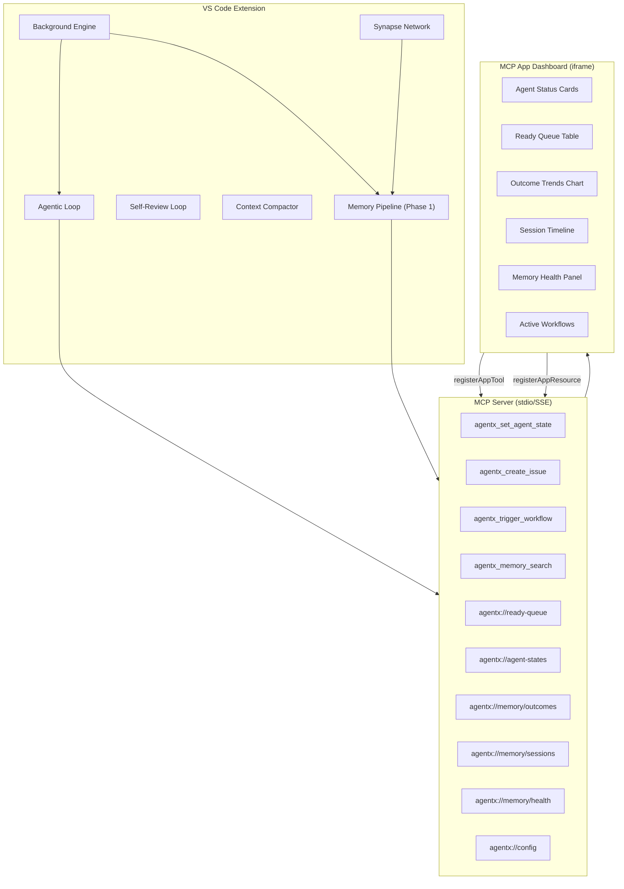
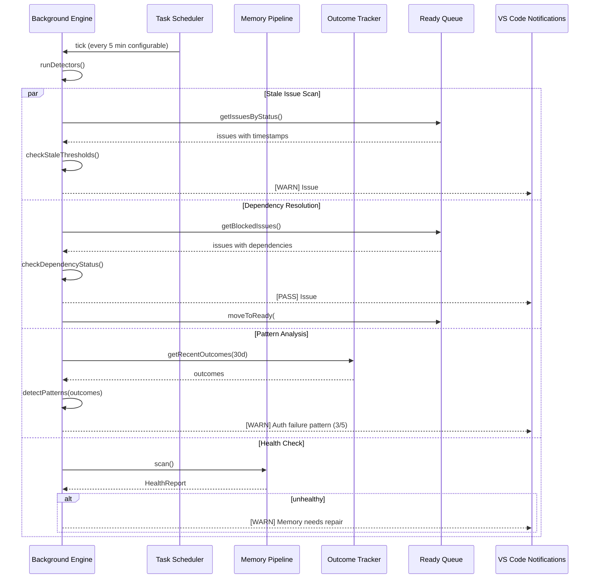
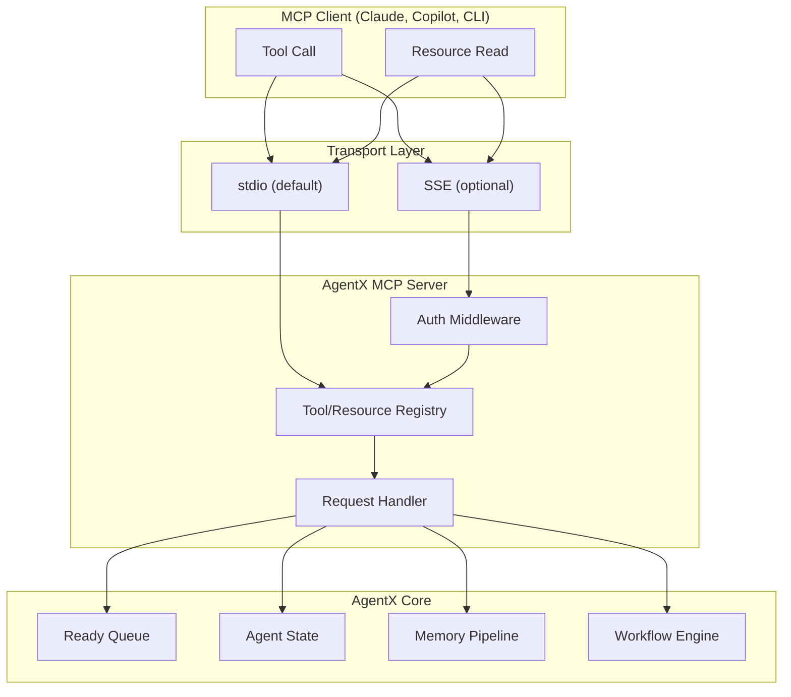
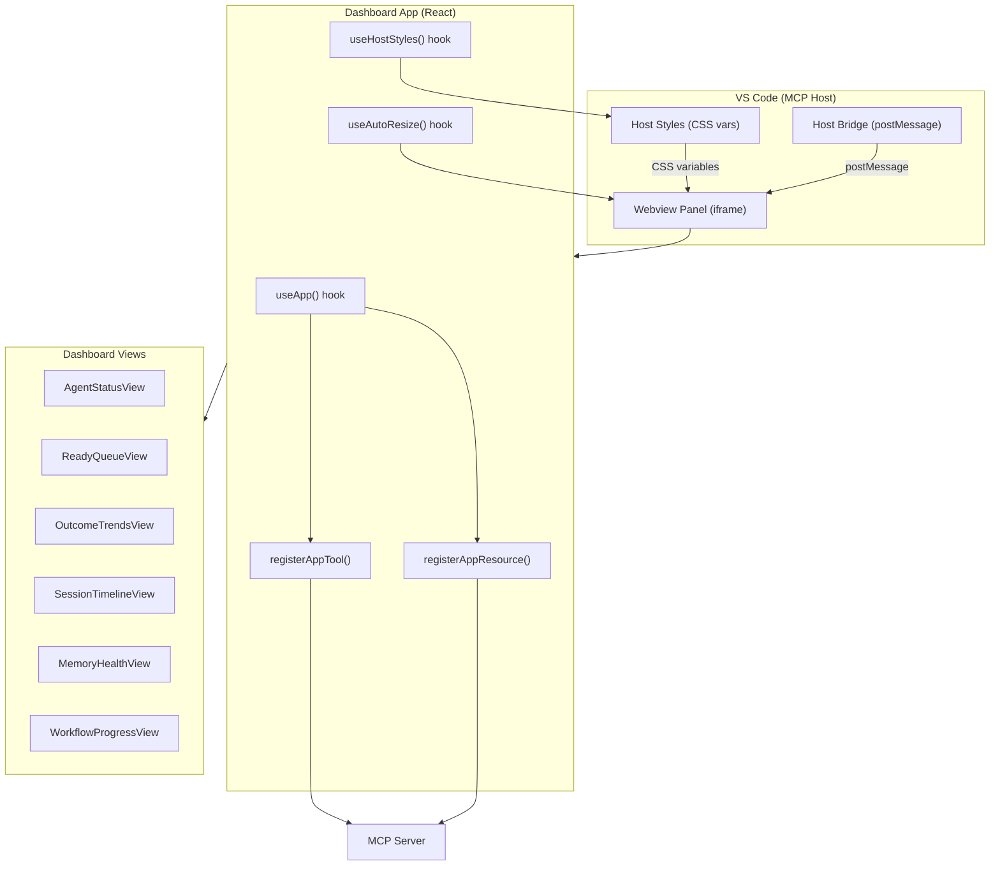
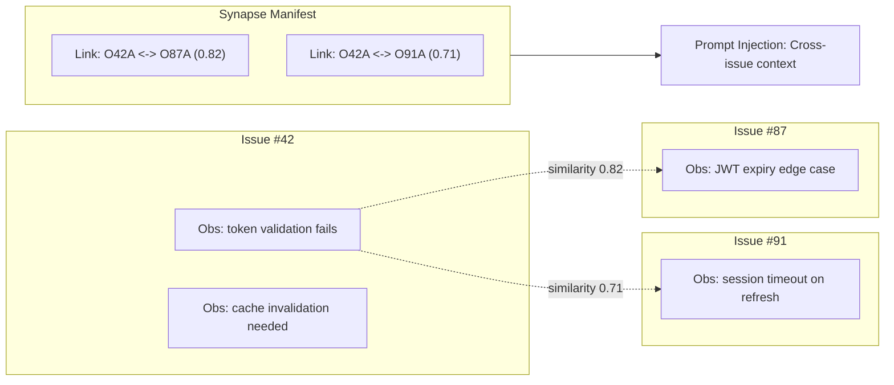
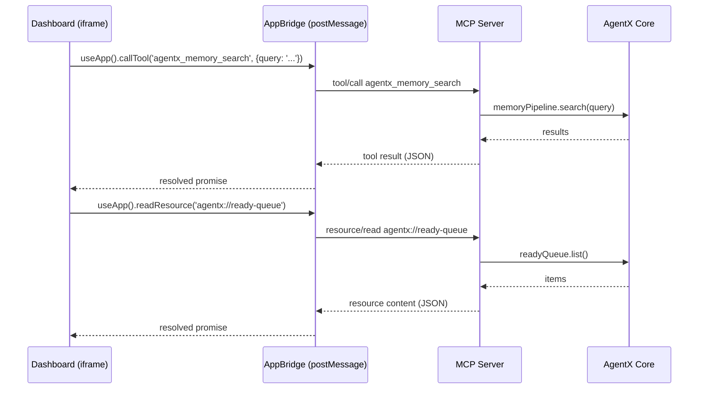

# Technical Specification: Proactive Intelligence -- Background Engine, MCP Server, MCP App Dashboard & Synapse Network

**Epic**: Phase 3 -- Proactive Intelligence
**Status**: Draft
**Author**: Solution Architect Agent
**Date**: 2026-03-04
**Related PRD**: [PRD-Phase3-Proactive-Intelligence.md](../prd/PRD-Phase3-Proactive-Intelligence.md)

---

## Table of Contents

1. [Overview](#1-overview)
2. [Architecture Diagrams](#2-architecture-diagrams)
3. [Data Model](#3-data-model)
4. [Module Specifications](#4-module-specifications)
5. [MCP Server Specification](#5-mcp-server-specification)
6. [MCP App Dashboard Specification](#6-mcp-app-dashboard-specification)
7. [Integration Points](#7-integration-points)
8. [Performance](#8-performance)
9. [Testing Strategy](#9-testing-strategy)
10. [Rollout Plan](#10-rollout-plan)
11. [Risks & Mitigations](#11-risks--mitigations)

---

## 1. Overview

Phase 3 transforms AgentX from a reactive orchestrator into a proactive intelligence platform. It builds on the Phase 1 cognitive foundation (outcomes, sessions, health) and adds four major capabilities:

1. **Background Intelligence Engine** -- Smart scheduling that detects stale issues, resolved dependencies, and failure patterns
2. **MCP Server** -- Standard MCP protocol server exposing AgentX tools and resources
3. **MCP App Dashboard** -- Interactive single-page UI within VS Code via MCP Apps framework
4. **Synapse Network** -- Cross-issue observation linking for pattern propagation

**Constraints:**
- All modules must be TypeScript, compile clean, lint clean, >= 80% coverage
- MCP server uses stdio transport by default (SSE optional)
- Dashboard uses MCP Apps `@modelcontextprotocol/ext-apps` (single-file HTML bundle)
- No new external runtime dependencies beyond MCP SDK and React (already used in extension)

---

## 2. Architecture Diagrams

### 2.1 Phase 3 High-Level Architecture



### 2.2 Background Intelligence Flow



### 2.3 MCP Server Architecture



### 2.4 MCP App Dashboard Architecture



### 2.5 Synapse Network Data Flow



---

## 3. Data Model

### 3.1 Background Intelligence Types

```typescript
// vscode-extension/src/intelligence/backgroundTypes.ts

export interface StaleIssueThresholds {
  readonly inProgressHours: number;       // Default: 24
  readonly inReviewHours: number;         // Default: 48
  readonly backlogDays: number;           // Default: 7
}

export interface DetectorResult {
  readonly detector: 'stale' | 'dependency' | 'pattern' | 'health';
  readonly severity: 'info' | 'warning' | 'critical';
  readonly message: string;
  readonly issueNumber?: number;
  readonly actionLabel?: string;
  readonly actionCommand?: string;
}

export interface PatternAlert {
  readonly patternId: string;             // pat-{label}-{hash}
  readonly label: string;                 // Common label across outcomes
  readonly matchCount: number;            // How many outcomes match
  readonly totalCount: number;            // How many outcomes with this label
  readonly commonRootCause: string;       // Extracted common root cause
  readonly relatedIssues: number[];
}

export interface BackgroundEngineConfig {
  readonly enabled: boolean;              // Default: true
  readonly scanIntervalMs: number;        // Default: 300_000 (5 min)
  readonly staleThresholds: StaleIssueThresholds;
  readonly patternMinCount: number;       // Default: 3
  readonly healthScanEnabled: boolean;    // Default: true
}
```

### 3.2 MCP Server Types

```typescript
// vscode-extension/src/mcp/mcpTypes.ts

export interface AgentXMcpConfig {
  readonly transport: 'stdio' | 'sse';
  readonly port?: number;                 // SSE port, default 3100
  readonly authToken?: string;            // Optional for SSE mode
  readonly enableTools: boolean;
  readonly enableResources: boolean;
}

export interface ReadyQueueItem {
  readonly issueNumber: number;
  readonly title: string;
  readonly type: string;                  // type:story, type:bug, etc.
  readonly priority: string;              // p0, p1, p2, p3
  readonly status: string;
  readonly assignedAgent: string | null;
  readonly blockedBy: number[];
  readonly createdAt: string;
}

export interface AgentStateItem {
  readonly agent: string;
  readonly state: 'idle' | 'working' | 'blocked' | 'error';
  readonly issueNumber: number | null;
  readonly since: string;                 // ISO-8601
  readonly lastAction: string | null;
}
```

### 3.3 Dashboard Types

```typescript
// vscode-extension/src/dashboard/dashboardTypes.ts

export interface DashboardData {
  readonly agentStates: AgentStateItem[];
  readonly readyQueue: ReadyQueueItem[];
  readonly outcomeTrends: OutcomeTrendPoint[];
  readonly recentSessions: SessionIndex[];
  readonly healthReport: HealthReport | null;
  readonly activeWorkflows: WorkflowStatus[];
  readonly lastUpdated: string;
}

export interface OutcomeTrendPoint {
  readonly date: string;                  // YYYY-MM-DD
  readonly pass: number;
  readonly fail: number;
  readonly partial: number;
}

export interface WorkflowStatus {
  readonly issueNumber: number;
  readonly workflowType: string;
  readonly currentStep: number;
  readonly totalSteps: number;
  readonly agent: string;
  readonly iterationCount: number;
  readonly status: 'running' | 'paused' | 'blocked';
}
```

### 3.4 Synapse Network Types

```typescript
// vscode-extension/src/memory/synapseTypes.ts

export interface SynapseLink {
  readonly id: string;                    // syn-{obsId1}-{obsId2}
  readonly sourceObservation: string;     // Observation ID
  readonly targetObservation: string;     // Observation ID
  readonly sourceIssue: number;
  readonly targetIssue: number;
  readonly similarity: number;            // 0.0 - 1.0
  readonly linkType: 'auto' | 'manual';
  readonly createdAt: string;
}

export interface SynapseManifest {
  readonly version: 1;
  updatedAt: string;
  links: SynapseLink[];
}

export const SIMILARITY_THRESHOLD = 0.70;
export const MAX_LINKS_PER_OBSERVATION = 10;
export const MAX_CROSS_ISSUE_CONTEXT_TOKENS = 300;
```

### 3.5 File Layout (Phase 3 Additions)

```
.agentx/
  memory/
    outcomes/                              # Phase 1
    sessions/                              # Phase 1
    synapse-manifest.json                  # NEW: Cross-issue links
  config.json                              # Existing + backgroundEngine config
  mcp-server.json                          # NEW: MCP server config

vscode-extension/src/
  intelligence/                            # NEW: Background engine
    backgroundEngine.ts
    backgroundTypes.ts
    detectors/
      staleIssueDetector.ts
      dependencyMonitor.ts
      patternAnalyzer.ts
  mcp/                                     # NEW: MCP server
    mcpServer.ts
    mcpTypes.ts
    tools/
      setAgentState.ts
      createIssue.ts
      triggerWorkflow.ts
      memorySearch.ts
    resources/
      readyQueueResource.ts
      agentStatesResource.ts
      memoryOutcomesResource.ts
      memorySessionsResource.ts
      memoryHealthResource.ts
      configResource.ts
  dashboard/                               # NEW: MCP App Dashboard
    dashboardTypes.ts
    dashboardApp.tsx                        # React root component
    components/
      AgentStatusCards.tsx
      ReadyQueueTable.tsx
      OutcomeTrendsChart.tsx
      SessionTimeline.tsx
      MemoryHealthPanel.tsx
      WorkflowProgress.tsx
    hooks/
      useDashboardData.ts
      useAutoRefresh.ts
    styles/
      dashboard.css
    build/
      vite.config.ts                       # Single-file bundle config
      dist/
        dashboard.html                     # Output: single-file bundle
  memory/
    synapseNetwork.ts                      # NEW: Observation linking
    synapseTypes.ts                        # NEW
```

---

## 4. Module Specifications

### 4.1 Background Engine (`intelligence/backgroundEngine.ts`)

**Responsibilities:**
- Run detector cycle on configurable interval
- Aggregate results from all detectors
- Dispatch VS Code notifications for actionable findings
- Respect CPU budget (skip cycle if system is busy)

**Public API:**

```typescript
export interface IBackgroundEngine {
  /** Start the background engine. */
  start(config?: Partial<BackgroundEngineConfig>): void;

  /** Stop the background engine. */
  stop(): void;

  /** Run all detectors immediately (for testing/manual trigger). */
  runNow(): Promise<DetectorResult[]>;

  /** Get current configuration. */
  getConfig(): BackgroundEngineConfig;

  /** Update configuration at runtime. */
  updateConfig(config: Partial<BackgroundEngineConfig>): void;

  /** Subscribe to detector results. */
  onResult(callback: (result: DetectorResult) => void): vscode.Disposable;
}
```

**Detector Implementations:**

| Detector | File | Logic |
|----------|------|-------|
| Stale Issue | `detectors/staleIssueDetector.ts` | Compare `updatedAt` against thresholds for each status |
| Dependency Monitor | `detectors/dependencyMonitor.ts` | Parse `Blocked-by: #N` from issue bodies, check if blocking issues are closed |
| Pattern Analyzer | `detectors/patternAnalyzer.ts` | Group outcomes by label, find clusters with >= N similar root causes |

### 4.2 Synapse Network (`memory/synapseNetwork.ts`)

**Responsibilities:**
- Compute similarity between observations across issues
- Create and manage bidirectional links
- Provide cross-issue context for prompt injection

**Public API:**

```typescript
export interface ISynapseNetwork {
  /** Compute links for a new observation against recent observations. */
  processNewObservation(observation: Observation): Promise<SynapseLink[]>;

  /** Get all links for an observation. */
  getLinks(observationId: string): Promise<SynapseLink[]>;

  /** Get cross-issue context for prompt injection. */
  getCrossIssueContext(issueNumber: number, limit?: number): Promise<string>;

  /** Get all links (for dashboard visualization). */
  getAllLinks(): Promise<SynapseLink[]>;

  /** Remove stale links (target observation archived). */
  prune(): Promise<number>;
}
```

**Similarity Algorithm:**

Lightweight keyword + label overlap (no embeddings in v1):

```
similarity(a, b) = 0.4 * jaccard(a.labels, b.labels)
                 + 0.4 * jaccard(keywords(a.content), keywords(b.content))
                 + 0.2 * (a.category === b.category ? 1.0 : 0.0)
```

Where `jaccard(A, B) = |A intersection B| / |A union B|` and `keywords()` extracts significant words (>= 4 chars, not in stop list).

---

## 5. MCP Server Specification

### 5.1 Server Setup (`mcp/mcpServer.ts`)

Uses `@modelcontextprotocol/sdk` to create a standards-compliant MCP server.

```typescript
import { Server } from '@modelcontextprotocol/sdk/server/index.js';
import { StdioServerTransport } from '@modelcontextprotocol/sdk/server/stdio.js';

export function createAgentXMcpServer(context: AgentXContext): Server {
  const server = new Server(
    { name: 'agentx', version: '7.6.0' },
    { capabilities: { tools: {}, resources: {} } }
  );

  // Register tools
  registerTools(server, context);
  // Register resources
  registerResources(server, context);

  return server;
}
```

### 5.2 Tools

#### `agentx_set_agent_state`

```json
{
  "name": "agentx_set_agent_state",
  "description": "Set the state of an AgentX agent for a specific issue",
  "inputSchema": {
    "type": "object",
    "properties": {
      "agent": { "type": "string", "enum": ["engineer", "reviewer", "architect", "pm", "ux", "devops", "data-scientist", "tester", "powerbi-analyst"] },
      "state": { "type": "string", "enum": ["idle", "working", "blocked", "error"] },
      "issueNumber": { "type": "number" }
    },
    "required": ["agent", "state"]
  }
}
```

#### `agentx_create_issue`

```json
{
  "name": "agentx_create_issue",
  "description": "Create a new issue in the AgentX tracking system",
  "inputSchema": {
    "type": "object",
    "properties": {
      "title": { "type": "string" },
      "type": { "type": "string", "enum": ["epic", "feature", "story", "bug", "spike", "docs", "devops", "testing", "powerbi"] },
      "priority": { "type": "string", "enum": ["p0", "p1", "p2", "p3"] },
      "description": { "type": "string" },
      "labels": { "type": "array", "items": { "type": "string" } }
    },
    "required": ["title", "type"]
  }
}
```

#### `agentx_trigger_workflow`

```json
{
  "name": "agentx_trigger_workflow",
  "description": "Trigger an AgentX workflow for a specific issue",
  "inputSchema": {
    "type": "object",
    "properties": {
      "issueNumber": { "type": "number" },
      "workflowType": { "type": "string", "enum": ["story", "feature", "bug", "devops", "docs", "testing"] }
    },
    "required": ["issueNumber", "workflowType"]
  }
}
```

#### `agentx_memory_search`

```json
{
  "name": "agentx_memory_search",
  "description": "Search AgentX memory store for observations, outcomes, and sessions",
  "inputSchema": {
    "type": "object",
    "properties": {
      "query": { "type": "string" },
      "store": { "type": "string", "enum": ["observations", "outcomes", "sessions", "all"] },
      "limit": { "type": "number", "default": 10 }
    },
    "required": ["query"]
  }
}
```

### 5.3 Resources

| URI | Description | Returns |
|-----|-------------|---------|
| `agentx://ready-queue` | Unblocked issues sorted by priority | `ReadyQueueItem[]` |
| `agentx://agent-states` | All agent states | `AgentStateItem[]` |
| `agentx://memory/outcomes` | Outcome statistics + recent entries | `{ stats, recent: OutcomeIndex[] }` |
| `agentx://memory/sessions` | Session history (last 50) | `SessionIndex[]` |
| `agentx://memory/health` | Latest health report | `HealthReport` |
| `agentx://config` | Current AgentX configuration | `AgentXConfig` |

Each resource returns JSON with `mimeType: 'application/json'`.

### 5.4 Transport

- **stdio** (default): Launched via `node ./dist/mcp-server.js --stdio`. Used by VS Code, Claude Desktop.
- **SSE** (optional): Launched via `node ./dist/mcp-server.js --sse --port 3100`. Used by web clients, remote access. Requires `--auth-token` for security.

---

## 6. MCP App Dashboard Specification

### 6.1 Registration

The dashboard is registered as both an MCP App tool and resource:

```typescript
// In VS Code extension activation
import { registerAppTool, registerAppResource } from '@modelcontextprotocol/ext-apps';

// Tool: Open dashboard in response to user request
registerAppTool(server, 'agentx_dashboard', {
  title: 'AgentX Dashboard',
  description: 'Open the AgentX monitoring dashboard',
  appUrl: dashboardBundleUrl,
  params: {
    type: 'object',
    properties: {
      view: { type: 'string', enum: ['overview', 'outcomes', 'sessions', 'health'] }
    }
  }
});

// Resource: Dashboard data endpoint for the iframe
registerAppResource(server, 'agentx://dashboard/data', {
  title: 'AgentX Dashboard Data',
  description: 'Real-time dashboard data for the AgentX MCP App',
  mimeType: 'application/json',
  read: async () => JSON.stringify(await collectDashboardData())
});
```

### 6.2 React Component Tree

```
DashboardApp (root)
  |-- ThemeProvider (host CSS variables)
  |-- Header (title, last-updated timestamp, refresh button)
  |-- Grid (2-column responsive layout)
  |   |-- AgentStatusCards
  |   |   |-- AgentCard (x12, one per agent)
  |   |-- ReadyQueueTable
  |   |   |-- QueueRow (per issue)
  |   |   |-- QueueDetailPanel (expandable)
  |   |-- OutcomeTrendsChart
  |   |   |-- TrendBar (per day, stacked pass/fail/partial)
  |   |   |-- FilterBar (agent, label, date range)
  |   |-- SessionTimeline
  |   |   |-- TimelineEntry (per session)
  |   |-- MemoryHealthPanel
  |   |   |-- HealthIndicator (green/yellow/red)
  |   |   |-- StatRow (observations, outcomes, sessions, disk)
  |   |   |-- RepairButton
  |   |-- WorkflowProgress
  |       |-- WorkflowCard (per active workflow)
  |       |-- StepIndicator (current step highlighted)
  |-- Footer (version, docs link)
```

### 6.3 Host Style Integration

The dashboard MUST use MCP Apps host styling for theme compatibility:

```css
/* dashboard/styles/dashboard.css */
:root {
  --bg-primary: var(--host-bg, #1e1e1e);
  --bg-secondary: var(--host-bg-secondary, #252526);
  --text-primary: var(--host-fg, #cccccc);
  --text-secondary: var(--host-fg-secondary, #999999);
  --accent: var(--host-accent, #007acc);
  --border: var(--host-border, #3c3c3c);
  --success: var(--host-success, #4caf50);
  --warning: var(--host-warning, #ff9800);
  --error: var(--host-error, #f44336);
}

body {
  background: var(--bg-primary);
  color: var(--text-primary);
  font-family: var(--host-font-family, -apple-system, BlinkMacSystemFont, 'Segoe UI', sans-serif);
  font-size: var(--host-font-size, 13px);
}
```

### 6.4 Data Flow



### 6.5 Auto-Refresh Hook

```typescript
// dashboard/hooks/useAutoRefresh.ts
export function useAutoRefresh(intervalMs: number = 30_000) {
  const { readResource } = useApp();
  const [data, setData] = useState<DashboardData | null>(null);
  const [loading, setLoading] = useState(true);

  const refresh = useCallback(async () => {
    try {
      const result = await readResource('agentx://dashboard/data');
      setData(JSON.parse(result.content));
    } catch (err) {
      console.warn('Dashboard refresh failed:', err);
    } finally {
      setLoading(false);
    }
  }, [readResource]);

  useEffect(() => {
    refresh();
    const timer = setInterval(refresh, intervalMs);
    return () => clearInterval(timer);
  }, [refresh, intervalMs]);

  return { data, loading, refresh };
}
```

### 6.6 Build Configuration

Single-file HTML bundle using Vite:

```typescript
// dashboard/build/vite.config.ts
import { defineConfig } from 'vite';
import react from '@vitejs/plugin-react';
import { viteSingleFile } from 'vite-plugin-singlefile';

export default defineConfig({
  plugins: [react(), viteSingleFile()],
  build: {
    outDir: 'dist',
    assetsInlineLimit: 100000,      // Inline all assets
    cssCodeSplit: false,
    rollupOptions: {
      output: {
        inlineDynamicImports: true,
      },
    },
  },
});
```

Output: `dashboard/build/dist/dashboard.html` (< 500 KB target)

### 6.7 Component Specifications

#### AgentStatusCards

```typescript
interface AgentCardProps {
  agent: AgentStateItem;
}

// Visual:
// +------------------+
// | [icon] Engineer   |
// | Working           |  <- color-coded: green=idle, blue=working, red=blocked
// | Issue #42         |
// | 12 min ago        |
// +------------------+
```

- 12 cards in a responsive grid (4 per row desktop, 2 per row narrow)
- Click opens agent detail with recent activity

#### ReadyQueueTable

```typescript
interface QueueRowProps {
  item: ReadyQueueItem;
  onSelect: (issueNumber: number) => void;
}

// Columns: Priority | Issue | Title | Type | Agent | Created
// Sort: Priority (P0 first), then created date
// Click: Expands detail panel below row
```

- Paginated (10 per page)
- Priority cell: colored badge (P0=red, P1=orange, P2=blue, P3=gray)

#### OutcomeTrendsChart

```typescript
interface TrendChartProps {
  data: OutcomeTrendPoint[];
  filters: { agent?: string; label?: string; days: number };
  onFilterChange: (filters: Partial<TrendChartProps['filters']>) => void;
}

// Stacked bar chart: horizontal bars per day
// Colors: pass=green, fail=red, partial=yellow
// Default: last 30 days
```

- Pure CSS implementation (no chart library to keep bundle small)
- Filter bar: agent dropdown, label dropdown, date range preset (7d/30d/90d)

#### MemoryHealthPanel

```typescript
interface HealthPanelProps {
  report: HealthReport | null;
  onRepair: () => void;
  onScan: () => void;
}

// Status indicator: green circle=healthy, yellow=warnings, red=needs repair
// Stats grid: Observations | Outcomes | Sessions | Disk
// Action buttons: [Scan Now] [Repair]
```

- Repair button triggers `agentx_memory_health --fix` via tool call
- Shows last scan timestamp

---

## 7. Integration Points

### 7.1 Extension Activation

**File**: `vscode-extension/src/extension.ts`

```typescript
// New registrations in activate()
const bgEngine = new BackgroundEngine(context);
bgEngine.start();
context.subscriptions.push(bgEngine);

const mcpServer = createAgentXMcpServer(context);
const transport = new StdioServerTransport();
mcpServer.connect(transport);
context.subscriptions.push(mcpServer);

// Register dashboard command
context.subscriptions.push(
  vscode.commands.registerCommand('agentx.openDashboard', () => {
    // Open MCP App Dashboard
  })
);
```

### 7.2 Background Engine -> Event Bus

```typescript
// Background engine emits events via the existing typed event bus
eventBus.emit('background:staleIssue', { issueNumber: 42, hours: 26 });
eventBus.emit('background:unblocked', { issueNumber: 55, unblockedBy: 38 });
eventBus.emit('background:patternDetected', { pattern: alert });
```

### 7.3 Observation Store -> Synapse Network

```typescript
// In observationStore.ts, after storing a new observation:
const links = await synapseNetwork.processNewObservation(observation);
if (links.length > 0) {
  eventBus.emit('synapse:linksCreated', { observation: observation.id, links });
}
```

### 7.4 Agentic Loop -> Cross-Issue Context

```typescript
// In agenticLoop.ts, during system prompt construction:
const crossIssueContext = await synapseNetwork.getCrossIssueContext(issueNumber, 3);
if (crossIssueContext) {
  systemPrompt += '\n\n## Related Observations from Other Issues\n' + crossIssueContext;
}
```

### 7.5 Package.json Configuration

```json
{
  "contributes": {
    "commands": [
      { "command": "agentx.openDashboard", "title": "AgentX: Open Dashboard" }
    ],
    "configuration": {
      "properties": {
        "agentx.backgroundEngine.enabled": {
          "type": "boolean",
          "default": true,
          "description": "Enable the background intelligence engine"
        },
        "agentx.backgroundEngine.scanIntervalMinutes": {
          "type": "number",
          "default": 5,
          "description": "Background engine scan interval in minutes"
        },
        "agentx.mcpServer.transport": {
          "type": "string",
          "enum": ["stdio", "sse"],
          "default": "stdio",
          "description": "MCP server transport type"
        },
        "agentx.mcpServer.port": {
          "type": "number",
          "default": 3100,
          "description": "MCP server SSE port"
        },
        "agentx.dashboard.autoRefreshSeconds": {
          "type": "number",
          "default": 30,
          "description": "Dashboard auto-refresh interval in seconds"
        }
      }
    }
  }
}
```

### 7.6 Barrel Exports

```typescript
// vscode-extension/src/intelligence/index.ts
export { BackgroundEngine } from './backgroundEngine';
export type { BackgroundEngineConfig, DetectorResult, PatternAlert } from './backgroundTypes';

// vscode-extension/src/mcp/index.ts
export { createAgentXMcpServer } from './mcpServer';
export type { AgentXMcpConfig, ReadyQueueItem, AgentStateItem } from './mcpTypes';

// vscode-extension/src/memory/index.ts (additions)
export { SynapseNetwork } from './synapseNetwork';
export type { SynapseLink, SynapseManifest } from './synapseTypes';
```

---

## 8. Performance

| Operation | Target | Approach |
|-----------|--------|----------|
| Background engine cycle | < 5s total, < 5% CPU | Parallel detectors, async I/O, skip if busy |
| MCP server tool response | < 200ms p95 | In-memory caches, pre-computed state |
| MCP server resource read | < 100ms p95 | Cached data, TTL-based refresh |
| Dashboard initial render | < 2s | Single-file bundle, lazy data load |
| Dashboard data refresh | < 500ms | Delta updates where possible |
| Dashboard bundle size | < 500 KB | Tree-shaking, no heavy chart libraries |
| Synapse similarity computation | < 1s per observation | Precomputed keyword sets, cached labels |
| Synapse manifest load | < 100ms | In-memory cache with 60s TTL |

---

## 9. Testing Strategy

### 9.1 Unit Tests

| Module | Test File | Key Scenarios |
|--------|-----------|---------------|
| `backgroundEngine.ts` | `test/intelligence/backgroundEngine.test.ts` | start/stop, detector cycle, config update, CPU throttle |
| `staleIssueDetector.ts` | `test/intelligence/staleIssueDetector.test.ts` | threshold detection, configurable hours, no false positives |
| `dependencyMonitor.ts` | `test/intelligence/dependencyMonitor.test.ts` | blocked detection, unblock on close, multi-dependency |
| `patternAnalyzer.ts` | `test/intelligence/patternAnalyzer.test.ts` | pattern detection >= N, root cause grouping, label filtering |
| `mcpServer.ts` | `test/mcp/mcpServer.test.ts` | server creation, tool registration, resource registration |
| Tool handlers | `test/mcp/tools/*.test.ts` | Input validation, response format, error handling |
| Resource handlers | `test/mcp/resources/*.test.ts` | Data format, empty state, large data sets |
| `synapseNetwork.ts` | `test/memory/synapseNetwork.test.ts` | similarity computation, link creation, threshold, prune |
| Dashboard components | `test/dashboard/*.test.ts` | Render, data binding, theme integration, empty states |

### 9.2 Integration Tests

- Background engine detects stale issue from real state files
- MCP server responds to tool calls via stdio transport
- Dashboard loads data from MCP server resources
- Synapse network links observations across real issue files
- Extension activation registers all new commands and starts services

### 9.3 Performance Tests

- Background engine cycle completes < 5s with 1000 issues
- MCP server handles 100 concurrent tool calls < 200ms p95
- Dashboard renders with 50 agents, 200 queue items < 2s
- Synapse computation for 5000 observations < 10s total

---

## 10. Rollout Plan

### Sprint 1: Background Intelligence (v7.6.0-alpha.1)

1. Create `intelligence/backgroundTypes.ts`
2. Implement `backgroundEngine.ts` with start/stop/runNow
3. Implement all 3 detectors
4. Wire to event bus and VS Code notifications
5. Unit tests (>= 80%)

### Sprint 2: MCP Server (v7.6.0-alpha.2)

1. Create `mcp/mcpTypes.ts`
2. Implement `mcpServer.ts` with stdio transport
3. Implement 4 tool handlers
4. Implement 6 resource handlers
5. Unit tests (>= 80%)

### Sprint 3: Dashboard Scaffold (v7.6.0-beta.1)

1. Set up React + Vite single-file build pipeline
2. Register MCP App tool and resource
3. Implement `AgentStatusCards` and `ReadyQueueTable`
4. Implement host style integration
5. Dashboard renders and loads data

### Sprint 4: Dashboard Completion (v7.6.0-beta.2)

1. Implement `OutcomeTrendsChart`, `SessionTimeline`, `MemoryHealthPanel`, `WorkflowProgress`
2. Implement `useAutoRefresh` hook
3. Responsive layout testing
4. Theme testing (light + dark)
5. Bundle size optimization (target < 500 KB)

### Sprint 5: Synapse Network (v7.6.0-rc.1)

1. Create `memory/synapseTypes.ts`
2. Implement `synapseNetwork.ts` with similarity algorithm
3. Wire to observation store (post-store hook)
4. Implement cross-issue context for prompt injection
5. Unit tests (>= 80%)

### Sprint 6: Cross-Session + Polish (v7.6.0)

1. Implement auto-resume in agentic loop
2. Full integration testing
3. Performance testing and optimization
4. Documentation (AGENTS.md, Skills.md updates)
5. Version stamp and VSIX build

---

## 11. Risks & Mitigations

| Risk | Impact | Probability | Mitigation |
|------|--------|-------------|------------|
| MCP Apps SDK breaking changes | High | Medium | Pin to specific version, abstract via adapter layer, monitor changelog |
| Dashboard bundle size > 500 KB | Medium | Medium | Pure CSS charts (no chart libraries), tree-shaking, lazy sections |
| Background engine battery drain | Medium | Low | CPU check before cycle, configurable interval, respect system idle state |
| Synapse false positive links | Medium | Medium | Conservative threshold (0.70), user feedback mechanism, manual unlink |
| MCP server security (SSE mode) | High | Low | Localhost-only default, auth token required, rate limiting |
| Phase 1 not delivered yet | High | Low | Phase 3 design is modular; can proceed with MCP server and dashboard independently |

---

**Generated by AgentX Solution Architect Agent**
**Last Updated**: 2026-03-04
**Version**: 1.0
