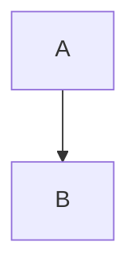

# AgentX Troubleshooting Guide

Common issues and solutions when using AgentX multi-agent orchestration.

---

## Installation Issues

### Pre-commit Hooks Not Working

**Symptom**: Commits go through without validation.

**Solution**:
```bash
# Reinstall hooks
cp .github/hooks/pre-commit .git/hooks/pre-commit
cp .github/hooks/commit-msg .git/hooks/commit-msg
chmod +x .git/hooks/pre-commit .git/hooks/commit-msg
```

### Permission Denied on Scripts

**Symptom**: `Permission denied` when running scripts.

**Solution**:
```bash
# Linux/Mac
chmod +x .github/scripts/*.sh
chmod +x .github/hooks/*

# Windows (PowerShell)
Set-ExecutionPolicy -Scope CurrentUser -ExecutionPolicy RemoteSigned
```

### GitHub CLI Not Authenticated

**Symptom**: `gh: command not found` or authentication errors.

**Solution**:
```bash
# Install GitHub CLI
# Windows: winget install GitHub.cli
# Mac: brew install gh
# Linux: See https://cli.github.com/

# Authenticate
gh auth login
```

---

## Workflow Issues

### "Issue Reference Required" Error

**Symptom**: Commit blocked with "must reference a GitHub Issue".

**Solution**:
```bash
# Include issue number in commit message
git commit -m "feat: add login feature (#123)"

# Or use emergency bypass (use sparingly)
git commit -m "chore: quick fix [skip-issue]"
```

### Status Not Updating

**Symptom**: Issue status doesn't change after agent completes work.

**Solution**:
1. Verify you're using GitHub Projects V2 (not V1)
2. Check the Status field exists with correct values
3. Manually update via GitHub Projects UI
4. Verify agent has correct permissions

**Required Status Values:**
- Backlog
- In Progress
- In Review
- Ready
- Done

### Agent Not Triggering

**Symptom**: Workflow doesn't start when status changes.

**Solution**:
1. Check GitHub Actions is enabled for the repository
2. Verify workflow file syntax is valid
3. Check workflow trigger conditions
4. Review Actions tab for failure details

```bash
# Manually trigger workflow
gh workflow run agent-x.yml -f issue_number=123
```

---

## Validation Failures

### PRD Validation Failed

**Symptom**: `PRD missing required sections`

**Solution**:
Ensure PRD includes all required sections:
- Problem Statement
- Target Users
- Goals
- Requirements
- User Stories

```bash
# Check PRD
./validate-handoff.sh 123 pm
```

### ADR Validation Failed

**Symptom**: `ADR missing required sections`

**Solution**:
Ensure ADR includes:
- Context
- Decision
- Options Considered (3+ options)
- Consequences

### Test Coverage Validation Failed

**Symptom**: `Test coverage below 80%`

**Solution**:
```bash
# Check current coverage
dotnet test /p:CollectCoverage=true
pytest --cov=src --cov-report=term

# Add more tests to increase coverage
```

---

## Agent-Specific Issues

### Product Manager Issues

**Q**: PRD created but child issues not appearing.

**A**: Ensure GitHub CLI is authenticated and has write permissions.
```bash
gh auth refresh -s write:project
```

### UX Designer Issues

**Q**: Wireframes not rendering correctly in markdown.

**A**: Use code blocks for ASCII art wireframes:
```markdown
```
┌─────────────┐
│  Wireframe  │
└─────────────┘
```
```

### Architect Issues

**Q**: Diagrams not showing in GitHub.

**A**: GitHub supports Mermaid diagrams. Wrap in code block:
```markdown

```

### Engineer Issues

**Q**: Tests pass locally but fail in CI.

**A**: Common causes:
1. Environment differences (OS, Node version)
2. Missing environment variables
3. Database connection issues
4. Timing/async issues

```bash
# Debug CI locally with act
act -j build
```

### Reviewer Issues

**Q**: Can't approve PR due to branch protection.

**A**: Ensure you're not the PR author (self-review not allowed with branch protection).

---

## Local Mode Issues

### Local Issues Not Creating

**Symptom**: `local-issue-manager.ps1` fails.

**Solution**:
```powershell
# Ensure .agentx directory exists
mkdir .agentx -Force
mkdir .agentx/issues -Force

# Initialize config
@{ mode = "local"; nextIssueNumber = 1 } | ConvertTo-Json | Set-Content .agentx/config.json
```

### Switching from Local to GitHub Mode

**Steps**:
```bash
# Add GitHub remote
git remote add origin https://github.com/owner/repo.git

# Migrate local issues (optional)
# Export local issues to GitHub
gh issue create --title "..." --body "..."
```

---

## Performance Issues

### Slow Workflow Execution

**Causes and Solutions**:

1. **Large repository**: Use shallow clone
   ```yaml
   - uses: actions/checkout@v4
     with:
       fetch-depth: 1
   ```

2. **No caching**: Add dependency caching
   ```yaml
   - uses: actions/cache@v4
     with:
       path: ~/.npm
       key: ${{ runner.os }}-npm-${{ hashFiles('**/package-lock.json') }}
   ```

3. **Serial execution**: Run independent jobs in parallel

### Context Capture Taking Too Long

**Solution**: Ensure git history isn't too large:
```bash
# Limit log depth
git log --oneline -n 50
```

---

## Security Issues

### Secrets Exposed in Logs

**Symptom**: Sensitive data visible in GitHub Actions logs.

**Solution**:
1. Never echo secrets directly
2. Use `::add-mask::` to mask values
3. Review workflow for accidental exposure

```yaml
- name: Mask secret
  run: echo "::add-mask::${{ secrets.API_KEY }}"
```

### Pre-commit Hook Blocked Dangerous Command

**Symptom**: Commit blocked with security warning.

**Solution**:
1. Review the flagged command
2. If legitimate, add to allowlist (with justification)
3. If suspicious, remove the code

---

## Common Error Messages

| Error | Cause | Solution |
|-------|-------|----------|
| `VALIDATION_FAILED` | Missing required artifacts | Run `validate-handoff.sh` to see details |
| `STATUS_NOT_READY` | Prerequisite not complete | Wait for previous agent to finish |
| `PERMISSION_DENIED` | Script not executable | `chmod +x script.sh` |
| `GH_AUTH_REQUIRED` | GitHub CLI not logged in | `gh auth login` |
| `ISSUE_NOT_FOUND` | Invalid issue number | Verify issue exists |
| `BRANCH_PROTECTED` | Can't push to protected branch | Create PR instead |

---

## Getting Help

### Check Logs
```bash
# Recent workflow runs
gh run list --limit 5

# Specific run logs
gh run view <run-id> --log
```

### Debug Mode
```bash
# Enable debug logging for scripts
DEBUG=1 ./validate-handoff.sh 123 engineer
```

### Report Issues
- [GitHub Issues](https://github.com/jnPiyush/AgentX/issues)
- Use `type:bug` label
- Include reproduction steps

---

## Quick Reference

### Useful Commands
```bash
# Check workflow status
gh workflow list

# View issue details
gh issue view 123

# List project items
gh project item-list 1

# Run validation
./validate-handoff.sh <issue> <role>

# Capture context
./capture-context.sh <role> <issue>
```

### File Locations
| Purpose | Location |
|---------|----------|
| Agent definitions | `.github/agents/` |
| Templates | `.github/templates/` |
| Skills | `.github/skills/` |
| Workflows | `.github/workflows/` |
| Hooks | `.github/hooks/` |
| Documentation | `docs/` |

---

**Last Updated**: February 5, 2026
