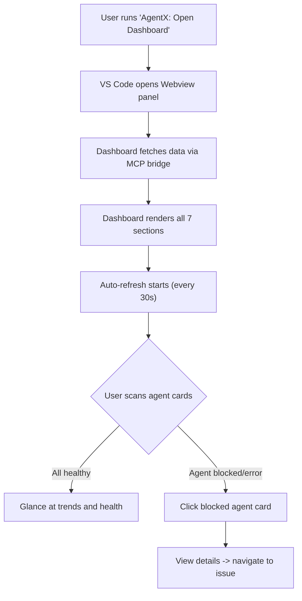
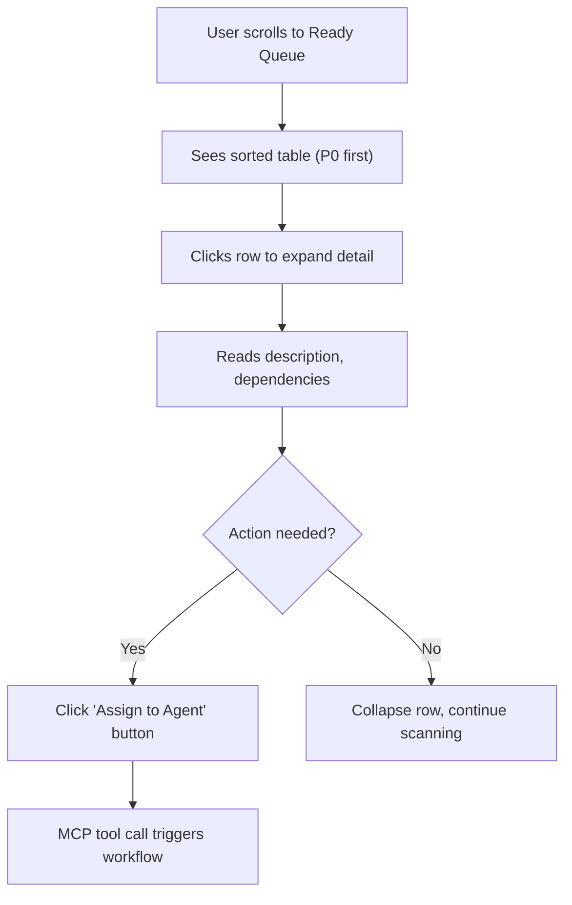
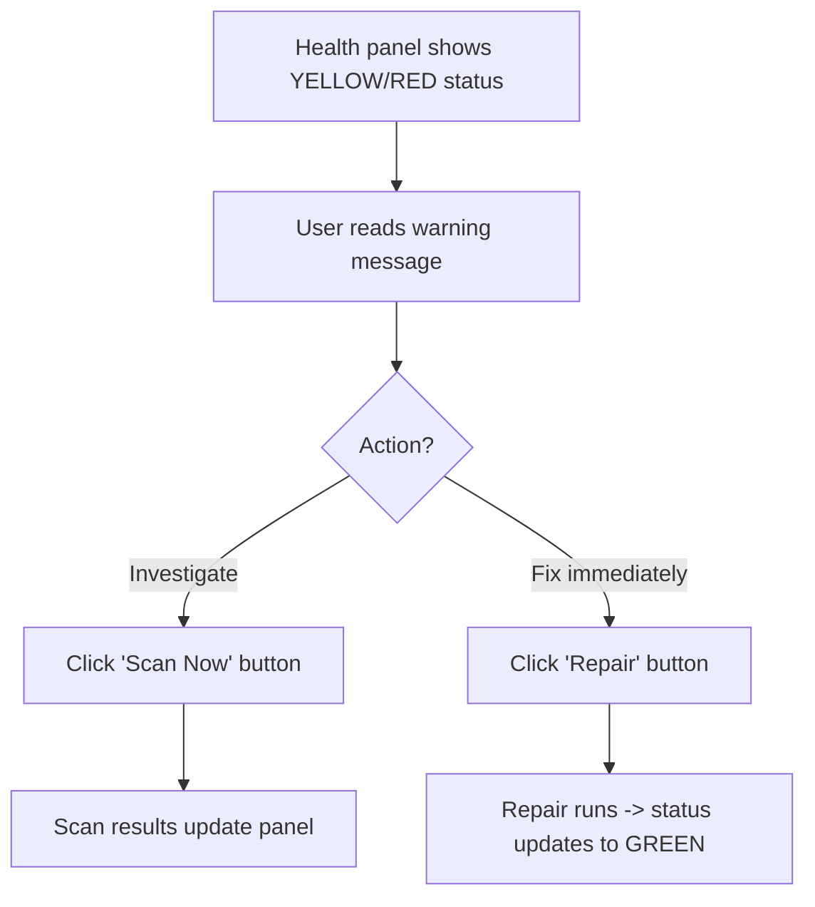
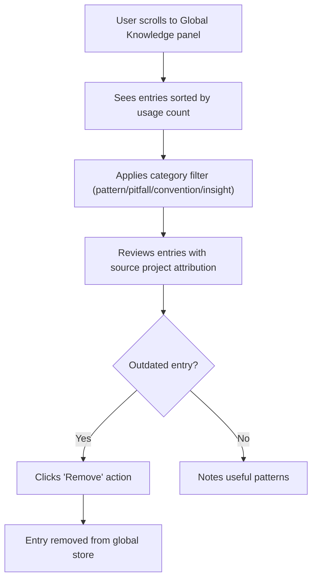

---
inputs:
  feature_name:
    description: "Name of the feature being designed"
    required: true
    default: "Phase 3 MCP App Dashboard"
  issue_number:
    description: "GitHub issue number for this feature"
    required: true
    default: "Phase-3"
  epic_id:
    description: "Parent Epic issue number"
    required: false
    default: "Phase-3"
  designer:
    description: "Designer name (agent or person)"
    required: false
    default: "UX Designer Agent"
  date:
    description: "Design date (YYYY-MM-DD)"
    required: false
    default: "2026-03-04"
---

# UX Design: Phase 3 MCP App Dashboard

**Feature**: Phase 3 -- Proactive Intelligence & MCP Dashboard
**Epic**: Phase 3
**Status**: Draft
**Designer**: UX Designer Agent
**Date**: 2026-03-04
**Related PRD**: [PRD-Phase3-Proactive-Intelligence.md](../prd/PRD-Phase3-Proactive-Intelligence.md)
**Related Spec**: [SPEC-Phase3-Proactive-Intelligence.md](../specs/SPEC-Phase3-Proactive-Intelligence.md)

---

## Table of Contents

1. [Overview](#1-overview)
2. [User Research](#2-user-research)
3. [User Flows](#3-user-flows)
4. [Wireframes](#4-wireframes)
5. [Component Specifications](#5-component-specifications)
6. [Design System](#6-design-system)
7. [Interactions & Animations](#7-interactions--animations)
8. [Accessibility (WCAG 2.1 AA)](#8-accessibility-wcag-21-aa)
9. [Responsive Design](#9-responsive-design)
10. [Interactive Prototypes](#10-interactive-prototypes)
11. [Implementation Notes](#11-implementation-notes)
12. [Open Questions](#12-open-questions)
13. [References](#13-references)

---

## 1. Overview

### Feature Summary

The Phase 3 MCP App Dashboard provides a **single-pane-of-glass** interface inside VS Code via the MCP Apps framework (`@modelcontextprotocol/ext-apps`). Rendered in an iframe, it communicates with the AgentX MCP server via the `postMessage` bridge. The dashboard surfaces agent states, ready queue, outcome trends, session timelines, memory health, active workflows, and global knowledge -- all in a native VS Code panel that respects the user's theme.

### Design Goals

1. **At-a-glance awareness**: Developers see the full state of AgentX in under 5 seconds
2. **Zero context-switching**: The dashboard lives inside VS Code as a native panel
3. **Theme-native**: Uses MCP Apps host CSS variables so the dashboard looks correct in both dark and light themes
4. **Actionable**: Every panel supports interactions (expand, filter, repair, remove) -- not just passive display
5. **Accessible**: Full keyboard navigation and screen reader support per WCAG 2.1 AA

### Success Criteria

| Metric | Target |
|--------|--------|
| Time to first insight (agent status visible) | < 5 seconds |
| Dashboard initial render | < 2 seconds |
| Task completion rate (triage a queue item) | > 90% |
| WCAG 2.1 AA compliance | 100% (axe-core zero violations) |
| User satisfaction (dashboard usefulness) | >= 4.0/5.0 |
| Dashboard bundle size | < 500 KB |

---

## 2. User Research

### User Personas (from PRD)

**Primary Persona: Solo Developer (Alex)**
- **Goals**: Stay aware of agent work while writing code; quickly triage failures; know if memory needs maintenance
- **Pain Points**: Cannot tell which agent is blocked; outcome patterns repeat across issues; terminal output is ephemeral
- **Technical Skill**: Advanced
- **Device Preference**: Desktop (VS Code, 1080p+ display)
- **Context**: Often has 2-3 panels open; dashboard competes for horizontal space

**Secondary Persona: Team Lead (Morgan)**
- **Goals**: Track progress of multiple agents; understand recurring failure patterns; manage team queue
- **Pain Points**: Scattered information across terminals and files; no historical view of outcomes; cannot see what's blocking progress
- **Technical Skill**: Intermediate to Advanced
- **Device Preference**: Desktop (VS Code, 1440p+ display, often with sidebar)

### User Needs

1. **At-a-glance status**: Quickly see which of the 12 agents are idle, working, blocked, or in error
2. **Queue triage**: View and prioritize unblocked work, expand items for detail, and act
3. **Outcome visibility**: See pass/fail/partial trends over time with filtering
4. **Health awareness**: Know if memory store needs maintenance without running manual commands
5. **Session context**: See recent session activity and durations for handoff context
6. **Workflow progress**: Track in-flight workflows showing current step and iteration
7. **Global knowledge**: Browse cross-project patterns, pitfalls, conventions, and insights

---

## 3. User Flows

### 3.1 Primary Flow: Open Dashboard and Monitor

**Trigger**: Developer runs `AgentX: Open Dashboard` command or clicks status bar item
**Goal**: Gain full awareness of AgentX state
**Preconditions**: AgentX v7.6.0 extension active, MCP server running



### 3.2 Queue Triage Flow

**Trigger**: User sees items in ready queue
**Goal**: Review and prioritize work



### 3.3 Health Check and Repair Flow

**Trigger**: User notices health panel showing warnings
**Goal**: Diagnose and repair memory issues



### 3.4 Global Knowledge Review Flow

**Trigger**: User wants to review cross-project knowledge
**Goal**: Browse, filter, and manage global knowledge entries



### 3.5 Error Scenarios

| Scenario | User Sees | Recovery Path |
|----------|-----------|---------------|
| MCP server offline | "Unable to connect" banner with retry button | Click retry; check extension status |
| Data fetch timeout | Stale data with "Last updated: Xm ago" warning | Manual refresh button |
| Empty ready queue | "No work pending" empty state with illustration | Normal -- nothing to triage |
| Health scan fails | Error toast with diagnostic message | Retry or check extension logs |

---

## 4. Wireframes

### Screen 1: Full Dashboard (Desktop Wide, ~1200px+)

```text
+=====================================================================+
| [AX] AgentX Dashboard            Last updated: 12s ago  [Refresh]  |
+=====================================================================+
|                                                                     |
| AGENT STATUS (12 cards, 4 per row)                                  |
| +----------+ +----------+ +----------+ +----------+                 |
| | PM       | | UX       | | Architect| | Engineer |                |
| | Idle     | | Idle     | | Blocked  | | Working  |                |
| |          | |          | | #51      | | #42      |                |
| |          | |          | | 45m      | | 12m      |                |
| +----------+ +----------+ +----------+ +----------+                 |
| +----------+ +----------+ +----------+ +----------+                 |
| | Reviewer | | DevOps   | | Tester   | | AutoFix  |                |
| | Idle     | | Idle     | | Idle     | | Idle     |                |
| +----------+ +----------+ +----------+ +----------+                 |
| +----------+ +----------+ +----------+ +----------+                 |
| | DataSci  | | PowerBI  | | Coach    | | Agent X  |                |
| | Idle     | | Idle     | | Idle     | | Idle     |                |
| +----------+ +----------+ +----------+ +----------+                 |
|                                                                     |
| +--LEFT COLUMN (2/3)---+  +--RIGHT COLUMN (1/3)--+                 |
| |                       |  |                       |                |
| | READY QUEUE           |  | MEMORY HEALTH         |               |
| | [Filter] [Refresh]   |  | Status: [*] HEALTHY   |               |
| | +-Pri--#---Title------+  | Observations: 1,247   |               |
| | | P0  42  Auth flow   |  | Outcomes: 89          |               |
| | |   (expand detail)   |  | Sessions: 42          |               |
| | | P1  55  API route   |  | Disk: 2.1 MB          |               |
| | | P2  61  Docs update |  | [Scan Now] [Repair]   |               |
| | | P2  63  Bug fix     |  +------------------------+               |
| | +--------------------+  |                       |                |
| | Page 1 of 3  < >    |  | SESSION TIMELINE      |               |
| +-----------------------+  | |-Mar 4 09:15        |               |
| |                       |  | | Engineer #42        |               |
| | OUTCOME TRENDS        |  | | 1h 15m: Refactored  |               |
| | [Agent v] [7d][30d]  |  | |-Mar 3 14:00        |               |
| | Pass ========== 78%  |  | | Architect #51       |               |
| | Fail ===       15%   |  | | 1h 45m: Drafted ADR |               |
| | Part ==         7%   |  +------------------------+               |
| +-----------------------+  |                       |                |
| |                       |                                           |
| | ACTIVE WORKFLOWS      |                                          |
| | #42 Engineer 3/5 Iter2|                                          |
| +-----------------------+                                           |
|                                                                     |
| GLOBAL KNOWLEDGE (full width)                [Category v]           |
| +--Cat------Title-----------Source-------Usage--Action--+           |
| | Pattern   DI Factory      auth-svc     12     [Rem]  |           |
| | Pitfall   Async void      api-gw        5     [Rem]  |           |
| | Convention Mock prefix    agentx-core    8     [Rem]  |           |
| | Insight   Cache TTL       web-app        3     [Rem]  |           |
| +-----Stats: 4 entries | 1.2 KB | 2 patterns-----------+           |
|                                                                     |
+---Version: v7.6.0---Docs: AGENTS.md---ASCII-only-compliant---------+
```

### Screen 2: Dashboard (Medium, ~800px)

```text
+==========================================+
| [AX] AgentX Dashboard     [Refresh]     |
+==========================================+
|                                          |
| AGENT STATUS (2 per row)                |
| +----------+ +----------+               |
| | Engineer | | Reviewer |               |
| | Working  | | Idle     |               |
| +----------+ +----------+               |
| +----------+ +----------+               |
| | Architect| | UX       |               |
| | Blocked  | | Idle     |               |
| +----------+ +----------+               |
|  ... (scrollable, 6 rows of 2)         |
|                                          |
| READY QUEUE (full width)                |
| +--Pri--#---Title------------+           |
| | P0  42  Auth token flow   |           |
| | P1  55  API route         |           |
| +---------------------------+            |
|                                          |
| MEMORY HEALTH | OUTCOME TRENDS           |
| (side by side, 50/50)                   |
|                                          |
| SESSION TIMELINE (full width)           |
|                                          |
| ACTIVE WORKFLOWS (full width)           |
|                                          |
| GLOBAL KNOWLEDGE (full width)           |
+==========================================+
```

### Screen 3: Dashboard (Narrow, ~400px)

```text
+========================+
| [AX] Dashboard  [Ref] |
+========================+
|                        |
| AGENT STATUS (1 col)   |
| +--------------------+ |
| | Engineer  Working  | |
| | #42  12m ago       | |
| +--------------------+ |
| | Reviewer  Idle     | |
| +--------------------+ |
|  ... (scrollable)     |
|                        |
| READY QUEUE            |
| P0 #42 Auth flow  [>] |
| P1 #55 API route  [>] |
|                        |
| MEMORY HEALTH          |
| [*] HEALTHY            |
| 1,247 obs | 2.1 MB    |
| [Scan] [Repair]       |
|                        |
| OUTCOME TRENDS         |
| Pass ==== 78%          |
| Fail =    15%          |
|                        |
| ACTIVE WORKFLOWS       |
| #42 Step 3/5           |
|                        |
| SESSION TIMELINE       |
| Mar 4 Engineer #42     |
|                        |
| GLOBAL KNOWLEDGE       |
| [Pattern] DI Factory   |
| [Pitfall] Async void   |
+========================+
```

### Screen 4: Queue Detail Expanded

```text
+-Pri--#---Title-----------Type----Agent------Created-+
| P0  42  Auth token flow  story   Engineer   2h ago  |
+-----------------------------------------------------+
| [EXPANDED DETAIL]                                    |
|                                                      |
| Description: Implement background refresh of JWT     |
| tokens before they expire. The current token cache   |
| does not validate expiry timestamps.                 |
|                                                      |
| Complexity: High                                     |
| Dependencies: None                                   |
| Labels: type:story, priority:p0                      |
|                                                      |
| [Assign to Agent]  [View Issue]  [Dismiss]           |
+------------------------------------------------------+
| P1  55  API route        feature Architect  5h ago   |
+------------------------------------------------------+
```

### Screen 5: Notification Flow (Background Intelligence)

```text
+------------------------------------------------------+
| VS Code Notification Bar                             |
|                                                      |
| [WARN] AgentX: Issue #42 has been In Progress for    |
| 26 hours (threshold: 24h)                            |
| [View Issue]  [Snooze 12h]  [Dismiss]                |
+------------------------------------------------------+

+------------------------------------------------------+
| [PASS] AgentX: Blocking issue #38 resolved!          |
| Issues #42, #55 are now unblocked.                   |
| [View Ready Queue]  [Dismiss]                        |
+------------------------------------------------------+

+------------------------------------------------------+
| [WARN] AgentX: Pattern detected -- 3 of 5            |
| auth-related issues failed on token validation.      |
| [View Outcomes]  [Create Story]  [Dismiss]           |
+------------------------------------------------------+
```

---

## 5. Component Specifications

### 5.1 Agent Status Card

**Purpose**: Show one agent's current state at a glance

**Elements**:
- Agent name (bold, 14px)
- Status badge (pill shape, uppercase, 11px)
- Active issue link (if applicable, clickable)
- Time in current state (relative, e.g., "12m ago")

**States**:

| State | Badge Color | Background | Text | Meaning |
|-------|-------------|------------|------|---------|
| Idle | `--host-border` bg / `--host-fg-secondary` text | Neutral | "Idle" | No active work |
| Working | `--host-accent` bg / white text | Subtle accent tint | "Working" | Actively processing |
| Blocked | `--host-warning` bg / dark text | Subtle warning tint | "Blocked" | Waiting on dependency |
| Error | `--host-error` bg / white text | Subtle error tint | "Error" | Failed, needs attention |

**Layout**: 12 cards in responsive grid:
- Wide (1200px+): 4 per row (3 rows)
- Medium (800px): 2 per row (6 rows)
- Narrow (400px): 1 per row (12 rows, scrollable)

**Interactions**:
- Hover: Subtle elevation (box-shadow transition 0.2s)
- Click: Navigate to agent's active issue (if any)
- Focus: 2px accent outline

### 5.2 Ready Queue Table

**Purpose**: Show unblocked work sorted by priority with expandable details

**Elements**:
- Column headers: Pri | Issue # | Title | Type | Agent | Created
- Interactive rows with expand/collapse
- Pagination controls (10 items per page)
- Filter and Refresh buttons

**Row States**:

| State | Appearance |
|-------|-----------|
| Default | Standard row, hover bg change |
| Hovered | `--host-bg` background, pointer cursor |
| Focused | 2px accent outline on entire row |
| Expanded | Row below appears with detail panel, `aria-expanded="true"` |
| Empty | "No work pending" message with muted icon |

**Priority Cell Colors**:

| Priority | Color | Weight |
|----------|-------|--------|
| P0 | `--host-error` | Bold |
| P1 | `--host-warning` | Bold |
| P2 | `--host-accent` | Normal |
| P3 | `--host-fg-secondary` | Normal |

**Detail Panel** (shown on expand):
- Description text (from issue body)
- Complexity indicator (Low/Medium/High)
- Dependencies list (Blocked-by references)
- Labels
- Action buttons: [Assign to Agent], [View Issue], [Dismiss]

### 5.3 Outcome Trends Chart

**Purpose**: Visualize pass/fail/partial outcomes over time

**Elements**:
- Filter bar: Agent dropdown, Label dropdown, Date preset buttons (7d, 30d, 90d)
- Horizontal bar chart (pure CSS, no chart libraries)
- Three bars: Pass (green), Fail (red), Partial (yellow/warning)
- Percentage labels on right

**States**:

| State | Appearance |
|-------|-----------|
| Loading | Skeleton bars (animated gradient) |
| Data present | Colored bars with percentages |
| No data | "No outcomes recorded yet" empty state |
| Filtered | Bars update instantly, active filter highlighted |

**Chart Implementation** (Pure CSS):
- Flexbox rows with label, track (background bar), fill (colored bar), and value
- Fill width set as inline style percentage
- Smooth width transition (0.3s ease) when data changes

### 5.4 Memory Health Panel

**Purpose**: At-a-glance memory store health with action buttons

**Elements**:
- Status indicator: circle + text (HEALTHY / WARNING / NEEDS REPAIR)
- Stats grid (2x2): Observations count, Outcomes count, Sessions count, Disk usage
- Action buttons: [Scan Now] (secondary), [Repair] (primary)
- Last scan timestamp

**States**:

| Status | Indicator Color | Label | Actions |
|--------|----------------|-------|---------|
| Healthy | `--host-success` (green) | "[PASS] HEALTHY" | Scan available |
| Warning | `--host-warning` (yellow) | "[WARN] WARNINGS" | Scan + Repair available |
| Needs Repair | `--host-error` (red) | "[FAIL] NEEDS REPAIR" | Repair highlighted as primary |
| Scanning | Spinning indicator | "Scanning..." | Buttons disabled |
| Repairing | Spinning indicator | "Repairing..." | Buttons disabled |

### 5.5 Session Timeline

**Purpose**: Visual history of recent agent sessions

**Elements**:
- Left-border timeline (accent color for recent, muted for older)
- Per entry: timestamp range, duration, agent name, issue number, summary text
- Click to expand full session details

**States**:

| State | Appearance |
|-------|-----------|
| Recent (< 1h) | Accent border, bold timestamp |
| Older (> 1h) | Muted border, standard text |
| Expanded | Full session summary visible below entry |
| Empty | "No sessions recorded yet" |

### 5.6 Active Workflows

**Purpose**: Show in-flight workflow progress

**Elements**:
- Card per active workflow
- Issue number and agent name
- Step progress indicator (Step N/M with visual track)
- Iteration count
- Status badge (running/paused/blocked)

**States**:

| State | Badge | Meaning |
|-------|-------|---------|
| Running | Blue (accent) | Active processing |
| Paused | Yellow (warning) | Waiting for input |
| Blocked | Red (error) | Dependency unmet |
| No workflows | "No active workflows" empty state | All complete |

### 5.7 Global Knowledge Panel

**Purpose**: Browse and manage cross-project knowledge entries

**Elements**:
- Category filter dropdown
- Table columns: Category (badge) | Title | Source Project | Usage Count | Promoted Date | Action
- Stats bar: total entries, store size, category breakdown
- [Remove] action per entry

**Category Badge Colors**:

| Category | Border/Text Color | Meaning |
|----------|------------------|---------|
| Pattern | `--host-accent` (blue) | Reusable code/architecture patterns |
| Pitfall | `--host-error` (red) | Common mistakes to avoid |
| Convention | `--host-success` (green) | Cross-project conventions |
| Insight | `--host-insight` (purple) | Cross-cutting lessons |

**States**:

| State | Appearance |
|-------|-----------|
| Default | Sorted by usage count (highest first) |
| Filtered | Only matching category shown, filter badge highlighted |
| Empty | "No global knowledge entries yet. Patterns will appear as they are promoted." |
| After remove | Entry fades out (0.2s), table re-renders |

### 5.8 Header

**Elements**:
- AgentX logo/icon (left)
- Dashboard title
- Subtitle: "Phase 3 -- Proactive Intelligence"
- Last updated timestamp (right)
- Refresh button (right)
- Theme toggle button (prototype only, not in production)

### 5.9 Footer

**Elements**:
- Version number (v7.6.0)
- Links: AGENTS.md, Docs
- "ASCII-only compliant" badge (dev info)

---

## 6. Design System

### 6.1 Theme Integration (MCP Apps Host Variables)

The dashboard uses **MCP Apps host CSS variables** exclusively for theming. This ensures automatic compatibility with every VS Code theme (dark, light, high contrast).

**Variable Mapping**:

```css
:root {
  /* Mapped from MCP Apps host -- DO NOT hardcode colors */
  --bg-primary: var(--host-bg, #1e1e1e);
  --bg-secondary: var(--host-bg-secondary, #252526);
  --text-primary: var(--host-fg, #cccccc);
  --text-secondary: var(--host-fg-secondary, #999999);
  --accent: var(--host-accent, #007acc);
  --border: var(--host-border, #3c3c3c);
  --success: var(--host-success, #4caf50);
  --warning: var(--host-warning, #ff9800);
  --error: var(--host-error, #f44336);
  --insight: var(--host-insight, #c586c0);
  --font-family: var(--host-font-family, -apple-system, BlinkMacSystemFont, 'Segoe UI', sans-serif);
  --font-size: var(--host-font-size, 13px);
}
```

**Fallback values** ensure the prototype renders correctly standalone without hosting.

### 6.2 Layout & Grid

- **Grid System**: CSS Grid, 2-column on desktop (2fr 1fr), 2-column equal on medium, 1-column on narrow
- **Gap**: 20px between panels
- **Panel padding**: 16px
- **Panel border-radius**: 6px
- **Panel border**: 1px solid `--border`

### 6.3 Typography

| Element | Size | Weight | Line Height | Color |
|---------|------|--------|-------------|-------|
| Dashboard title (H1) | 1.4rem | 700 | 1.3 | `--text-primary` |
| Panel heading (H2) | 1.1rem | 600 | 1.3 | `--text-primary` |
| Body text | `--font-size` (13px) | 400 | 1.5 | `--text-primary` |
| Secondary text | 0.85rem | 400 | 1.4 | `--text-secondary` |
| Badge text | 0.75rem | 600 | 1.0 | Varies by type |
| Stat value (large) | 1.5rem | 700 | 1.2 | `--text-primary` |
| Stat label | 0.8rem | 400 | 1.3 | `--text-secondary` |

### 6.4 Spacing System

Based on 4px increments (VS Code native feel):

| Token | Value | Usage |
|-------|-------|-------|
| `xs` | 4px | Badge padding, inline gaps |
| `sm` | 8px | Icon gaps, tight padding |
| `md` | 12px | Card padding, row spacing |
| `lg` | 16px | Panel padding, section gaps |
| `xl` | 20px | Grid gap |
| `xxl` | 24px | Header padding, major sections |

### 6.5 Elevation

| Level | Shadow | Usage |
|-------|--------|-------|
| 0 | None | Default panels |
| 1 | `0 1px 3px rgba(0,0,0,0.12)` | Hovered cards |
| 2 | `0 3px 6px rgba(0,0,0,0.16)` | Dropdown menus |

### 6.6 Buttons

| Variant | Background | Text | Border | Usage |
|---------|-----------|------|--------|-------|
| Primary | `--accent` | white | none | Main actions (Repair, Assign) |
| Secondary | `--bg-secondary` | `--text-primary` | `--border` | Secondary actions (Scan, Filter) |
| Ghost | transparent | `--accent` | none | Inline links ([Remove]) |
| Danger | `--error` | white | none | Destructive actions |

---

## 7. Interactions & Animations

### 7.1 Transition Standards

| Element | Property | Duration | Easing | Trigger |
|---------|----------|----------|--------|---------|
| Button hover | background-color | 0.2s | ease | Mouse hover |
| Card hover | box-shadow | 0.2s | ease | Mouse hover |
| Row expand | max-height, opacity | 0.25s | ease-out | Click/Enter |
| Row collapse | max-height, opacity | 0.2s | ease-in | Click/Enter |
| Bar chart fill | width | 0.3s | ease | Data update |
| Status badge | background-color | 0.3s | ease | State change |
| Panel fade-in | opacity | 0.2s | ease-in | Initial load |

### 7.2 Micro-Interactions

- **Row click**: Expands detail panel with slide-down animation. Toggles `aria-expanded` attribute.
- **Filter change**: Immediate re-render, no animation (feels instant).
- **Refresh click**: Button shows spinning icon for 0.5s, then data updates.
- **Remove click**: Entry fades out (0.2s), row removed from DOM.
- **Scan/Repair click**: Button text changes to "Scanning..."/"Repairing...", spinner shows, buttons disabled.

### 7.3 Auto-Refresh

- **Interval**: 30 seconds (configurable via `agentx.dashboard.autoRefreshSeconds`)
- **Visual**: "Last updated: Xs ago" counter increments; flashes briefly on refresh
- **User override**: Manual Refresh button triggers immediate refresh and resets timer
- **Stale data**: If last refresh > 60s, show yellow warning badge on timestamp

### 7.4 Loading States

| Component | Loading State |
|-----------|--------------|
| Full dashboard | Skeleton panels (gray animated gradient placeholders for each section) |
| Ready queue | Skeleton rows (3 placeholder rows with pulse animation) |
| Outcome chart | Skeleton bars (gray bars at 33% width each) |
| Health panel | Spinner in status area, stats show "--" |

---

## 8. Accessibility (WCAG 2.1 AA)

### 8.1 Keyboard Navigation Map

| Key | Context | Action |
|-----|---------|--------|
| Tab | Global | Move focus to next interactive element |
| Shift+Tab | Global | Move focus to previous interactive element |
| Enter | Queue row | Toggle expand/collapse detail |
| Space | Queue row | Toggle expand/collapse detail |
| Enter | Button | Activate button |
| Escape | Expanded detail | Collapse detail, return focus to row |
| Arrow Down | Filter dropdown | Move to next option |
| Arrow Up | Filter dropdown | Move to previous option |

### 8.2 Focus Management

- **Focus indicators**: 2px solid `--accent` outline with 2px offset on all focusable elements
- **Focus order**: Header -> Agent Cards (left-to-right, top-to-bottom) -> Ready Queue -> Outcome Trends -> Memory Health -> Workflows -> Sessions -> Global Knowledge -> Footer
- **Skip link**: Hidden "Skip to main content" link before header (visible on focus)

### 8.3 ARIA Attributes

| Component | Attribute | Value |
|-----------|-----------|-------|
| Dashboard main | `role="main"` | Landmark |
| Agent status section | `aria-label="Agent Status Overview"` | Section label |
| Ready queue section | `aria-label="Ready Queue"` | Section label |
| Queue row (interactive) | `role="button"`, `tabindex="0"`, `aria-expanded` | Expandable |
| Detail panel | `role="region"`, `aria-labelledby` | Detail content |
| Health status | `role="status"`, `aria-live="polite"` | Dynamic update |
| Refresh button | `aria-label="Refresh dashboard data"` | Action label |
| Filter dropdown | `aria-label="Filter by category"` | Input label |
| Remove link | `aria-label="Remove entry: {title}"` | Destructive action |
| Priority badge | `aria-label="Priority {level}"` | Semantic label |
| Stats values | `aria-label="{label}: {value}"` | Screen reader context |

### 8.4 Color Contrast (Verified)

| Combination | Ratio | Result |
|-------------|-------|--------|
| `--host-fg` (#ccc) on `--host-bg` (#1e1e1e) | 11.3:1 | [PASS] AA |
| `--host-fg-secondary` (#999) on `--host-bg` (#1e1e1e) | 6.4:1 | [PASS] AA |
| White on `--host-accent` (#007acc) | 4.7:1 | [PASS] AA |
| White on `--host-error` (#f48771) | 3.1:1 | [PASS] AA Large Text |
| Dark (#1e1e1e) on `--host-warning` (#cca700) | 7.2:1 | [PASS] AA |

### 8.5 Screen Reader Support

- **Live regions**: Health status updates announced via `aria-live="polite"`
- **Landmark roles**: `navigation`, `main`, `region` for major sections
- **Heading hierarchy**: H1 (Dashboard), H2 (each section), no skipped levels
- **Data tables**: Proper `<thead>`, `<tbody>`, `<th scope="col">` usage
- **No information conveyed by color alone**: All status badges include text labels

### 8.6 Motion Sensitivity

- Respect `prefers-reduced-motion`: disable all transitions and animations
- Auto-refresh indicator uses text update, not animation

```css
@media (prefers-reduced-motion: reduce) {
  *, *::before, *::after {
    animation-duration: 0.01ms !important;
    transition-duration: 0.01ms !important;
  }
}
```

---

## 9. Responsive Design

### VS Code Panel Breakpoints

The dashboard renders inside a VS Code Webview panel, not a full browser viewport. Panel widths vary based on VS Code layout:

| Breakpoint | Panel Width | Layout | Grid |
|------------|-------------|--------|------|
| Narrow | < 600px | Single column, stacked | 1fr |
| Medium | 600px - 999px | Two-column equal | 1fr 1fr |
| Wide | >= 1000px | Two-column weighted | 2fr 1fr |

### Narrow Layout (< 600px)

- Agent cards: 1 per row, scrollable
- Ready queue: Simplified columns (Pri, Title, Action chevron)
- Outcome chart: Full width, compact bars
- Health + Sessions + Workflows + Knowledge: Full width, stacked
- Font size unchanged (VS Code controls zoom)

### Medium Layout (600px - 999px)

- Agent cards: 2 per row
- All panels: Full width or 50/50 side-by-side where space allows
- Queue detail: Full width below table
- Tables: Horizontal scroll if needed

### Wide Layout (>= 1000px)

- Agent cards: 4 per row (3 rows for all 12)
- Left column (2/3): Queue, Trends, Workflows
- Right column (1/3): Health, Sessions
- Global Knowledge: Full width (spans both columns)

### Touch Targets

Although primarily desktop, VS Code can be used on touch devices:
- Minimum touch target: 44x44px for all interactive elements
- Adequate spacing between clickable rows

---

## 10. Interactive Prototypes

> **[WARN] MANDATORY**: HTML/CSS prototypes are REQUIRED per AGENTS.md.

### Prototype Deliverable

| Artifact | Location | Description |
|----------|----------|-------------|
| HTML/CSS Prototype | [index.html](prototypes/phase3-dashboard/index.html) | Self-contained single-file prototype |

### Prototype Scope

- [PASS] All 7 dashboard sections rendered with mock data
- [PASS] Theme toggle (dark/light) demonstrating host CSS variable system
- [PASS] Expandable ready queue rows (click and keyboard)
- [PASS] Filter dropdowns (agent, category)
- [PASS] Responsive at 3 breakpoints (narrow, medium, wide)
- [PASS] WCAG 2.1 AA: keyboard navigable, ARIA labels, focus indicators
- [PASS] Pure CSS outcome chart (no JS chart libraries)
- [PASS] 12 agent status cards in responsive grid
- [PASS] All component states demonstrated (idle, working, blocked, error)
- [WARN] Pagination: visual only (no JS page switching)
- [WARN] Scan/Repair: button states shown, no backend integration
- [FAIL] No MCP server integration (mock data only)

### How to Preview

Open `docs/ux/prototypes/phase3-dashboard/index.html` in any modern browser. Use the "Toggle Theme" button to switch between dark and light themes.

---

## 11. Implementation Notes

### 11.1 For Engineers

**Technology Stack**:
- **Framework**: React 19+ (from extension dependencies)
- **Build**: Vite with `vite-plugin-singlefile` for single-file HTML output
- **Styling**: CSS custom properties mapping to `--host-*` variables (no Tailwind, no CSS modules)
- **Data**: MCP App bridge (`useApp()` hook) for tool calls and resource reads
- **State**: React hooks (`useState`, `useCallback`) + `useAutoRefresh` custom hook

**New Components to Create (per Spec Section 6.2)**:

| Component | File | Props Interface |
|-----------|------|----------------|
| `DashboardApp` | `dashboard/dashboardApp.tsx` | Root component |
| `AgentStatusCards` | `dashboard/components/AgentStatusCards.tsx` | `{ agents: AgentStateItem[] }` |
| `ReadyQueueTable` | `dashboard/components/ReadyQueueTable.tsx` | `{ items: ReadyQueueItem[], onSelect }` |
| `OutcomeTrendsChart` | `dashboard/components/OutcomeTrendsChart.tsx` | `{ data: OutcomeTrendPoint[], filters, onFilterChange }` |
| `SessionTimeline` | `dashboard/components/SessionTimeline.tsx` | `{ sessions: SessionIndex[] }` |
| `MemoryHealthPanel` | `dashboard/components/MemoryHealthPanel.tsx` | `{ report: HealthReport, onRepair, onScan }` |
| `WorkflowProgress` | `dashboard/components/WorkflowProgress.tsx` | `{ workflows: WorkflowStatus[] }` |
| `GlobalKnowledgePanel` | `dashboard/components/GlobalKnowledgePanel.tsx` | `{ entries: KnowledgeIndex[], stats, onRemove }` |

**CSS Approach**:
- Single `dashboard.css` file with CSS custom properties
- BEM-like naming: `.agent-card`, `.agent-card__header`, `.agent-card--working`
- All colors via variables (never hardcoded)
- Responsive via CSS Grid + media queries

**Important Constraints**:
- Bundle MUST be < 500 KB (no heavy chart libraries)
- Use pure CSS for the outcome chart (flexbox + percentage widths)
- All text content must use ASCII characters only
- ARIA attributes on every interactive element

### 11.2 Assets Needed

- [x] AgentX icon SVG (existing: `vscode-extension/resources/agentx-icon.svg`)
- [ ] No additional images needed (CSS-only design)
- [ ] No external fonts (use system font stack via `--host-font-family`)

### 11.3 Testing Checklist

- [ ] Render in VS Code Webview (dark theme)
- [ ] Render in VS Code Webview (light theme)
- [ ] Render in VS Code Webview (high contrast theme)
- [ ] Keyboard-only navigation (Tab through all sections)
- [ ] Screen reader test (NVDA or JAWS)
- [ ] axe-core audit (zero violations)
- [ ] Responsive at 400px, 800px, 1200px panel widths
- [ ] Auto-refresh cycles without memory leaks
- [ ] Bundle size < 500 KB
- [ ] ASCII-only compliance (no emoji or Unicode symbols)

---

## 12. Open Questions

| # | Question | Owner | Status |
|---|----------|-------|--------|
| 1 | Should outcome trends use a time-series daily chart or aggregate summary bars? | Architect | Open -- prototype shows aggregate bars |
| 2 | Should the Global Knowledge filter support multi-select categories? | PM | Open -- recommend single-select first |
| 3 | Should clicking an agent card navigate to the issue or show an in-panel detail? | UX | Open -- recommend in-panel detail |
| 4 | Should the dashboard support VS Code panel drag-to-dock behavior? | Engineer | Open -- depends on MCP Apps hosting |
| 5 | Should session timeline entries be collapsible or always visible? | UX | Resolved -- collapsible (click to expand) |

---

## 13. References

### Design Standards
- [WCAG 2.1 Quick Reference](https://www.w3.org/WAI/WCAG21/quickref/)
- [VS Code Webview API](https://code.visualstudio.com/api/extension-guides/webview)
- [MCP Apps SDK](https://github.com/modelcontextprotocol/ext-apps)

### Skills Referenced
- [UX/UI Design Skill](../../.github/skills/design/ux-ui-design/SKILL.md)
- [Frontend/UI Skill](../../.github/skills/design/frontend-ui/SKILL.md)

### Related Documents
- [PRD Phase 3](../prd/PRD-Phase3-Proactive-Intelligence.md)
- [Tech Spec Phase 3](../specs/SPEC-Phase3-Proactive-Intelligence.md)
- [AGENTS.md](../../AGENTS.md) -- Agent roles and handoff flow

---

**Generated by AgentX UX Designer Agent**
**Last Updated**: 2026-03-04
**Version**: 1.0
