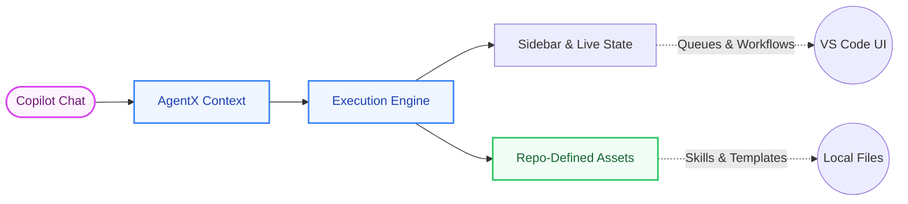

# AgentX for VS Code

**The IDE Orchestrator for Multi-Agent Software Delivery**

*Bring structured multi-agent workflows directly into your editor with chat execution, live workspace state, and seamless repo integration.*

---

## Why Use the Extension?

Running autonomous agents from the CLI lacks visibility. The AgentX VS Code extension bridges the gap, allowing you to trigger complex delivery pipelines while retaining absolute visibility and control over what the agents are thinking, validating, and writing.

> **"Full autonomous orchestration, deeply integrated with your local workspace."**

---

## The Extension Surface

| Feature | Description |
|:--------|:------------|
| **Copilot Chat Integration** | Native chat participant for triggering AgentX routines seamlessly. |
| **Workspace Setup Wizard** | Single-click initialization of local, GitHub, or Azure DevOps setups. |
| **Live Sidebar Views** | Instantly visualize queues, active workflows, agent roles, and output templates. |
| **Quality & Integration Gates** | Sidebar dashboards that track loop states, unresolved dependencies, and constraints. |
| **Command Palette Access** | Fast workflow-oriented actions like Status sync, Ready Queue checks, Digests, brainstorm, and compound-loop inspection. |
| **Knowledge Compounding Surfaces** | Ranked learnings, compound-loop visibility, learning-capture scaffolds, and durable review-finding promotion directly inside the IDE. |

---

## Architecture Flow

* **Inputs:** VS Code Chat drives intent into the orchestrator.
* **Control:** The IDE tracks progress and state live via dedicated UI extensions.
* **Outputs:** Everything resolves natively into your repository as standard Markdown tracking, code, and CI manifests.

---

## Requirements

To run AgentX successfully within VS Code:

- **VS Code:** 1.85.0 or newer
- **System:** Git configured on your PATH
- **Runtime:** PowerShell 7.4+ (`pwsh`) on Windows, or Bash on Linux/macOS
- **Integrations:** gh (GitHub CLI) optional for extended GitHub mode operations

---

## Quick Start

1. **Install** the extension from the VS Code Marketplace.
2. **Open** to your target project workspace.
3. **Initialize** the environment by running AgentX: Initialize Project in the Command Palette.
4. **Brainstorm or run work** from Copilot Chat with prompts like `@agentx brainstorm rollout constraints`, `@agentx run engineer "implement the health endpoint"`, or `@agentx compound`.
5. **Capture reusable outcomes** with `AgentX: Create Learning Capture` once review confirms the result should compound future work.

## Compound Loop In The IDE

AgentX exposes the compound-engineering loop directly in VS Code instead of leaving it implicit in docs alone.

### Chat Entry Points

- `@agentx brainstorm <topic>` to start planning from ranked prior learnings
- `@agentx learnings planning` and `@agentx learnings review <topic>` to inspect curated guidance
- `@agentx compound` to view the current compound loop state
- `@agentx create learning capture` to scaffold a durable learning artifact for the active issue context
- `@agentx review findings` and `@agentx agent-native review` to inspect review-time follow-up surfaces

### Sidebar And Command Palette

- Work sidebar: `Brainstorm`, `Planning learnings`, `Review learnings`, `Compound loop`, `Create learning capture`
- Quality sidebar: `Compound loop`, `Create learning capture`, `Agent-native review`, `Review findings`
- Command palette equivalents exist for each of the same surfaces under the `AgentX:` prefix

---

## Learn More

- [AgentX Core Repository](https://github.com/jnPiyush/AgentX)
- [AGENTS.md & Routing Setup](https://github.com/jnPiyush/AgentX/blob/master/AGENTS.md)
- [Detailed Workflow Guide](https://github.com/jnPiyush/AgentX/blob/master/docs/WORKFLOW.md)
- [Full Setup Instructions](https://github.com/jnPiyush/AgentX/blob/master/docs/GUIDE.md)
