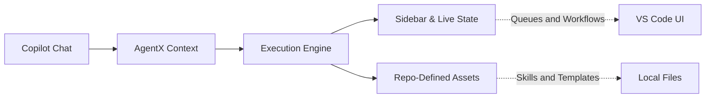
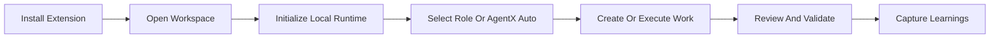

# AgentX for VS Code

**The IDE Orchestrator for Multi-Agent Software Delivery**

[](https://marketplace.visualstudio.com/items?itemName=jnPiyush.agentx)
[](LICENSE)

*Bring structured multi-agent workflows directly into your editor with chat execution, live workspace state, and seamless repo integration.*

---

## Why Use the Extension?

Running autonomous agents from the CLI lacks visibility. The AgentX VS Code extension bridges the gap, allowing you to trigger complex delivery pipelines while retaining absolute visibility and control over what the agents are thinking, validating, and writing.

> **"Full autonomous orchestration, deeply integrated with your local workspace."**

---

## The Extension Surface

| Feature | Description |
|:--------|:------------|
| **13 Declarative Chat Agents** | Role-specific agents (PM, UX, Architect, Engineer, Reviewer, DevOps, Tester, Data Scientist, Power BI, Consulting Research, Agile Coach, Auto-Fix Reviewer) plus AgentX Auto for end-to-end orchestration. |
| **Model Council (core)** | Multi-model deliberation on high-stakes decisions -- **Analyst + Strategist + Skeptic** debate PRD scope, ADR options, AI design, code reviews, and deep research before they ship. Agent-internal by default; optional `gh models` multi-vendor auto-invoke. Mandatory gate for PM, Architect, Reviewer, Data Scientist, and Consulting Research on high-stakes work. |
| **Copilot Chat Participant** | Native `@agentx` chat participant for triggering routines, brainstorm, learnings, and compound-loop inspection. |
| **Karpathy Guidelines (built-in)** | The `karpathy-guidelines` skill is auto-loaded for Engineer, Architect, Reviewer, Auto-Fix Reviewer, DevOps, Tester, and Data Scientist -- enforcing *think before coding*, surgical diffs, assumption audits, and goal-driven execution to block common LLM coding pitfalls at authoring and review time. |
| **Workspace Setup Wizard** | Local-runtime-first setup with optional remote adapters for GitHub or Azure DevOps and configurable LLM adapters. |
| **4 Sidebar Views** | **Work** (queues, workflow next step, brainstorm, learnings), **Status** (agent states, loop, dependencies, evaluation), **Templates** (output templates), **Skills** (77 production skills). |
| **45 Commands** | Workflow, loop management, knowledge compounding, AI evaluation, task bundles, bounded parallel delivery, and plugin management from the Command Palette. |
| **Knowledge Compounding** | Ranked learnings, compound-loop visibility, learning-capture scaffolds, durable review-finding promotion, and agent-native review parity checks. |
| **AI Evaluation** | Scaffold, run, and inspect AI evaluation contracts with rubric-based quality gates. |
| **Task Bundles & Bounded Parallel** | Create, resolve, and promote scoped task bundles; run and reconcile bounded parallel delivery slices. |
| **Plugin System** | Extend the workspace with `Add Skill`, `Add Agent`, and `Add Plugin` commands. |

---

## Architecture Flow



* **Inputs:** VS Code Chat drives intent into the orchestrator.
* **Control:** The IDE tracks progress and state live via dedicated UI extensions.
* **Outputs:** Everything resolves natively into your repository as standard Markdown tracking, code, and CI manifests.

---

## Requirements

To run AgentX successfully within VS Code:

- **VS Code:** 1.85.0 or newer
- **System:** Git configured on your PATH
- **Runtime:** PowerShell 7.4+ (`pwsh`) on Windows, or Bash on Linux/macOS
- **Integrations:** gh (GitHub CLI) optional for extended GitHub mode operations

---

## Quick Start

1. **Install** the extension from the [VS Code Marketplace](https://marketplace.visualstudio.com/items?itemName=jnPiyush.agentx).
2. **Open** your target project workspace in VS Code.
3. **Initialize** the workspace by running `AgentX: Initialize Local Runtime` from the Command Palette, or start the same flow in chat with `@agentx initialize local runtime`.
4. **Optionally add a remote adapter** with `AgentX: Add Remote Adapter` or start it in chat with `@agentx connect github`, `@agentx connect ado`, `@agentx use local`, or `@agentx add remote adapter`.
5. **Optionally switch the workspace LLM adapter** with `AgentX: Add LLM Adapter` or start it in chat with `@agentx switch llm`, `@agentx connect claude`, `@agentx connect claude local`, `@agentx connect openai`, or `@agentx use copilot`.
6. **Select a role in Copilot Chat** and run the next step for that role, or select **AgentX Auto** to orchestrate the full flow in one session.
7. **Capture reusable outcomes** with `AgentX: Create Learning Capture` once review confirms the result should compound future work.

### Workspace Initialization

AgentX initialization is workspace-scoped. After opening a repository or project folder in VS Code, run:

```text
AgentX: Initialize Local Runtime
```

You can also start the same flow in chat with:

```text
@agentx initialize local runtime
```

This prepares the local AgentX runtime for the current workspace by:

- creating local runtime folders and state files
- preparing repo-local execution artifacts such as plans, progress, reviews, and learnings
- writing stable `.agentx/*` workspace entrypoints that delegate into the bundled runtime
- keeping the executable runtime bundled while workspace state stays local to the repo

Repeat this step for each workspace where you want AgentX to run.

### Optional Remote Integration

If you want GitHub or Azure DevOps issue and workflow operations, run:

```text
AgentX: Add Remote Adapter
```

You can also start repo-adapter setup in chat with:

- `@agentx add remote adapter`
- `@agentx connect github`
- `@agentx connect ado`
- `@agentx use local`

The extension now keeps repo-adapter setup conversational. Non-secret values are collected in chat, pending setup survives between turns, and the chat UI offers follow-up actions to continue or cancel the flow.

Stay on local runtime only when you want repo-local planning, implementation, and review without remote backlog integration.

### Workspace LLM Adapter Setup

If you want to switch the workspace away from the default Copilot-backed path, run:

```text
AgentX: Add LLM Adapter
```

You can also start LLM setup in chat with:

- `@agentx switch llm`
- `@agentx connect claude`
- `@agentx connect claude local`
- `@agentx connect openai`
- `@agentx use copilot`

The extension now keeps LLM setup conversational. Non-secret values are collected in chat, pending setup survives between turns, and secret-bearing steps use VS Code's secure password prompt instead of asking you to paste keys into the chat transcript.

Available workspace LLM adapters include GitHub Copilot, Claude Subscription, Claude Code + LiteLLM + Ollama, Claude API, and OpenAI API. The local Claude option keeps `claude-code` as the execution transport while injecting Anthropic-compatible LiteLLM gateway settings and pinning the runner to the configured local coding model.

## Build Software With AgentX

Once a workspace is initialized, you can use AgentX inside VS Code to move an app from planning through review.



### Recommended Flow

In VS Code, select the role in chat first, then send a prompt for that role. For example, if you are building a simple task-tracker app for small teams:

| Step | Role | What To Do | Sample Prompt |
|:-----|:-----|:-----------|:--------------|
| **1. Define the product** | **Product Manager** | Create the product scope, goals, and acceptance criteria | `Create a PRD for a task-tracker app for small teams with email login, task CRUD, due dates, and a dashboard for overdue work.` |
| **2. Shape the UX** | **UX Designer** | Turn the PRD into user flows and prototype-ready screens | `Create the user flow and prototype plan for the task-tracker app, covering sign-in, task creation, task filtering, and dashboard views.` |
| **3. Design the architecture** | **Architect** | Define the technical approach and key tradeoffs | `Create an ADR and tech spec for the task-tracker app using a web frontend, backend API, persistence, and role-based access.` |
| **4. Implement the app** | **Engineer** | Build the code and tests from the approved artifacts | `Implement the task-tracker app from the PRD and spec, including authentication, task CRUD APIs, dashboard data, and automated tests.` |
| **5. Review the result** | **Reviewer** | Check correctness, risk, and missing coverage before sign-off | `Review the task-tracker implementation for correctness, security, regressions, and missing tests.` |
| **6. Preserve the learning** | **AgentX Auto** | Capture reusable guidance from the work you just completed | `Create a learning capture for the task-tracker delivery workflow and major implementation lessons.` |

If you want one orchestrated session instead of switching roles manually, select **AgentX Auto** and use one prompt such as:

```text
Build a task-tracker app for small teams. Start by creating the PRD, then produce UX and architecture guidance, implement the app, review it, and capture reusable learnings.
```

### Typical Chat Prompts

```text
[Product Manager selected] Create a PRD for a task-tracker app for small teams
[UX Designer selected] Create the primary flows and screen plan for the task-tracker app
[Architect selected] Create an ADR and implementation spec for the task-tracker app
[Engineer selected] Implement the task-tracker app and its tests from the approved artifacts
[Reviewer selected] Review the task-tracker app implementation before sign-off
[AgentX Auto selected] Create a learning capture
```

### When To Use Which Mode

- Use **AgentX Auto** when you want end-to-end orchestration in one session.
- Use a specialist role such as **Product Manager**, **Architect**, **Engineer**, or **Reviewer** when you want tighter control over one phase.
- Use the Command Palette and sidebars when you want a more guided workflow inside VS Code.

## Compound Loop In The IDE

AgentX exposes the compound-engineering loop directly in VS Code instead of leaving it implicit in docs alone.

### Chat Entry Points

- `@agentx brainstorm <topic>` to start planning from ranked prior learnings
- `@agentx learnings planning` and `@agentx learnings review <topic>` to inspect curated guidance
- `@agentx compound` to view the current compound loop state
- `@agentx create learning capture` to scaffold a durable learning artifact for the active issue context
- `@agentx review findings` and `@agentx agent-native review` to inspect review-time follow-up surfaces

### Sidebar And Command Palette

- Work sidebar: `Brainstorm`, `Planning learnings`, `Review learnings`, `Compound loop`, `Create learning capture`
- Status sidebar: `Compound loop`, `Create learning capture`, `Agent-native review`, `Review findings`, `AI Evaluation Status`
- Command palette equivalents exist for each of the same surfaces under the `AgentX:` prefix

---

## Sidebar Views

| View | Contents |
|:-----|:---------|
| **Work** | Workflow next step, brainstorm guidance, planning and review learnings, compound loop, learning capture, ready queue, and workflow rollout surfaces. |
| **Status** | Agent status, loop state, dependency checks, AI evaluation, review findings, task bundles, bounded parallel runs, and digests. |
| **Templates** | All output templates (PRD, ADR, Spec, UX, Review, Security Plan, Progress, Roadmap, Exec Plan, Contract, Evidence). |
| **Skills** | 77 production skills across 10 categories (architecture, development, languages, operations, infrastructure, data, AI systems, design, testing, domain). |

---

## Command Reference

### Workspace Setup

| Command | Description |
|:--------|:------------|
| Initialize Local Runtime | Prepare local runtime for the current workspace |
| Add Remote Adapter | Connect GitHub or Azure DevOps for backlog integration |
| Add LLM Adapter | Switch the workspace LLM adapter (Copilot, Claude, OpenAI) |
| Add Plugin | Extend the workspace with additional capabilities |
| Add Skill | Add a production skill to the workspace |
| Add Agent | Add an agent definition to the workspace |

### Workflow

| Command | Description |
|:--------|:------------|
| Show Workflow Next Step | Show the recommended next action based on current checkpoint |
| Deepen Plan | Refine the current execution plan |
| Kick Off Review | Initiate the review phase |
| Show Workflow Steps | Display the full workflow step list for a role |
| Show Workflow Rollout Scorecard | View rollout readiness scores |
| Show Operator Enablement Checklist | View the operator enablement checklist |

### Quality Loop

| Command | Description |
|:--------|:------------|
| Loop: Start | Start a new quality loop iteration |
| Loop: Status | Check current loop state |
| Loop: Iterate | Record a loop iteration pass |
| Loop: Complete | Mark the loop as complete |
| Loop: Cancel | Cancel the active loop |
| Iterative Loop | Run the full iterative loop flow |

### Knowledge Compounding

| Command | Description |
|:--------|:------------|
| Show Brainstorm Guide | Start planning with ranked prior learnings |
| Show Planning Learnings | View ranked planning learnings |
| Show Review Learnings | View ranked review learnings |
| Show Knowledge Capture Guidance | View capture guidance for the current context |
| Show Compound Loop | Inspect the compound-engineering loop state |
| Create Learning Capture | Scaffold a durable learning artifact |
| Show Agent-Native Review | Run advisory agent-native review parity checks |
| Show Review Findings | Inspect durable review findings |
| Promote Review Finding | Promote a finding into a standard AgentX issue |

### AI Evaluation

| Command | Description |
|:--------|:------------|
| Show AI Evaluation Status | View AI evaluation contract and results |
| Scaffold AI Evaluation Contract | Create a new evaluation contract |
| Run AI Evaluation | Execute an evaluation run |

### Task Bundles & Parallel Delivery

| Command | Description |
|:--------|:------------|
| Show Task Bundles | View scoped task bundles |
| Create Task Bundle | Create a new task bundle |
| Resolve Task Bundle | Mark a task bundle as resolved |
| Promote Task Bundle | Promote a bundle to an issue |
| Show Bounded Parallel Runs | View active parallel delivery runs |
| Assess Bounded Parallel Delivery | Assess readiness for parallel delivery |
| Start Bounded Parallel Delivery | Launch a bounded parallel delivery slice |
| Reconcile Bounded Parallel Run | Reconcile a completed parallel run |

### Status & Diagnostics

| Command | Description |
|:--------|:------------|
| Show Agent Status | View agent states and active work |
| Check Dependencies | Check issue dependency blockers |
| Generate Weekly Digest | Generate a weekly status digest |
| Show Issue Detail | View detailed issue information |
| Show Pending Clarification | Check for pending clarification requests |
| Check Environment | Validate the AgentX runtime environment |
| Refresh | Refresh all sidebar views |

---

## Chat Agents

The extension registers 13 declarative chat agents, each mapped to an AgentX role:

| Agent | Role | Use For |
|:------|:-----|:--------|
| **AgentX Auto** | Autonomous orchestrator | End-to-end delivery in one session |
| **Product Manager** | PRD and backlog | Product scope, goals, stories |
| **UX Designer** | UX and prototypes | User flows, wireframes, HTML/CSS prototypes |
| **Architect** | Architecture | ADR, tech spec, tradeoff analysis |
| **Engineer** | Implementation | Code, tests, quality loop |
| **Reviewer** | Code review | Review, findings, approve/reject |
| **Auto-Fix Reviewer** | Review + fix | Review with safe auto-applied fixes |
| **DevOps** | CI/CD | Pipelines, deployment automation |
| **Data Scientist** | ML/AI | ML pipelines, evaluation, drift |
| **Tester** | Testing | Test suites, certification |
| **Power BI Analyst** | Reports | Power BI, DAX, semantic models |
| **Consulting Research** | Research | Domain research, client materials |
| **Agile Coach** | Stories | Story creation, INVEST refinement |

---

## Recent Changes

### 8.4.36

- New `product/prd` skill: PRD authoring available to non-PM agents (Engineer, Architect, Auto) with a requirements-quality catalogue, vague-vs-concrete examples, and an AI-contract worked example
- New `diagrams/diagram-as-code` skill: Mermaid, PlantUML, C4/Structurizr, Graphviz, and draw.io patterns with first-class support for cross-functional swimlanes, BPMN, and Visio (`.vsdx`) interop
- New internal `diagram-specialist` sub-agent wired into Architect, Engineer, PM, UX Designer, Data Scientist, Reviewer, and Power BI Analyst

### 8.4.35

- Model Council mechanism: opt-in multi-perspective brief (Analyst, Strategist, Skeptic) for PRD scope, ADR options, AI design, code review, and research, completed agent-internally without involving the user
- New `karpathy-guidelines` skill wired into Engineer, Architect, Reviewer, Auto-Fix Reviewer, DevOps, Tester, and Data Scientist to reduce common LLM coding pitfalls

### 8.4.30

- Updated agent model assignments across core roles (AgentX Auto, PM, Architect, Engineer, Reviewer, Auto-Fix Reviewer)

### 8.4.29

- Fixed ADO provider `--project` flag handling for work item operations
- Provider-aware issue counting in the Work sidebar
- Closed stale issues with evidence-backed comments

### 8.4.28

- Bounded parallel delivery: assess, start, and reconcile parallel work slices
- Task bundle create, resolve, and promote commands
- Plugin system with `Add Plugin`, `Add Skill`, `Add Agent`
- AI evaluation contract scaffolding and execution

### 8.4.25

- Workspace LLM adapter setup (Claude, OpenAI, Claude Code + LiteLLM)
- Conversational repo-adapter setup with pending state across turns
- Secure secret collection via VS Code password prompt

### Earlier

- Compound loop, brainstorm, and knowledge-capture surfaces (8.4.7)
- Workspace initialization and remote adapter setup (8.4.0)
- Full sidebar views for Work, Status, Templates, Skills

---

## Learn More

- [AgentX Core Repository](https://github.com/jnPiyush/AgentX)
- [AGENTS.md & Routing Setup](https://github.com/jnPiyush/AgentX/blob/master/AGENTS.md)
- [Detailed Workflow Guide](https://github.com/jnPiyush/AgentX/blob/master/docs/WORKFLOW.md)
- [Full Setup Instructions](https://github.com/jnPiyush/AgentX/blob/master/docs/GUIDE.md)
