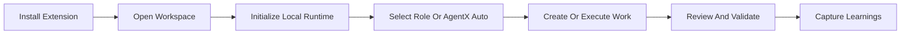

# AgentX for VS Code

**The IDE Orchestrator for Multi-Agent Software Delivery**

[](https://marketplace.visualstudio.com/items?itemName=jnPiyush.agentx)
[](LICENSE)

*Bring structured multi-agent workflows directly into your editor with chat execution, live workspace state, and seamless repo integration.*

---

## Why Use the Extension?

Running autonomous agents from the CLI lacks visibility. The AgentX VS Code extension bridges the gap, allowing you to trigger complex delivery pipelines while retaining absolute visibility and control over what the agents are thinking, validating, and writing.

> **"Full autonomous orchestration, deeply integrated with your local workspace."**

---

## The Extension Surface

| Feature | Description |
|:--------|:------------|
| **Copilot Chat Integration** | Native chat participant for triggering AgentX routines seamlessly. |
| **Workspace Setup Wizard** | Local-runtime-first setup with optional remote adapters for GitHub or Azure DevOps. |
| **Live Sidebar Views** | Instantly visualize queues, active workflows, agent roles, and output templates. |
| **Quality & Integration Gates** | Sidebar dashboards that track loop states, unresolved dependencies, and constraints. |
| **Command Palette Access** | Fast workflow-oriented actions like Status sync, Ready Queue checks, Digests, brainstorm, and compound-loop inspection. |
| **Knowledge Compounding Surfaces** | Ranked learnings, compound-loop visibility, learning-capture scaffolds, and durable review-finding promotion directly inside the IDE. |

---

## Architecture Flow


* **Inputs:** VS Code Chat drives intent into the orchestrator.
* **Control:** The IDE tracks progress and state live via dedicated UI extensions.
* **Outputs:** Everything resolves natively into your repository as standard Markdown tracking, code, and CI manifests.

---

## Requirements

To run AgentX successfully within VS Code:

- **VS Code:** 1.85.0 or newer
- **System:** Git configured on your PATH
- **Runtime:** PowerShell 7.4+ (`pwsh`) on Windows, or Bash on Linux/macOS
- **Integrations:** gh (GitHub CLI) optional for extended GitHub mode operations

---

## Quick Start

1. **Install** the extension from the [VS Code Marketplace](https://marketplace.visualstudio.com/items?itemName=jnPiyush.agentx).
2. **Open** your target project workspace in VS Code.
3. **Initialize** the workspace by running `AgentX: Initialize Local Runtime` from the Command Palette.
4. **Optionally add a remote adapter** with `AgentX: Add Remote Adapter` or start it in chat with `@agentx connect github`, `@agentx connect ado`, `@agentx use local`, or `@agentx add remote adapter`.
5. **Optionally switch the workspace LLM adapter** with `AgentX: Add LLM Adapter` or start it in chat with `@agentx switch llm`, `@agentx connect claude`, `@agentx connect openai`, or `@agentx use copilot`.
6. **Select a role in Copilot Chat** and run the next step for that role, or select **AgentX Auto** to orchestrate the full flow in one session.
7. **Capture reusable outcomes** with `AgentX: Create Learning Capture` once review confirms the result should compound future work.

### Workspace Initialization

AgentX initialization is workspace-scoped. After opening a repository or project folder in VS Code, run:

```text
AgentX: Initialize Local Runtime
```

This prepares the local AgentX runtime for the current workspace by:

- creating local runtime folders and state files
- preparing repo-local execution artifacts such as plans, progress, reviews, and learnings
- writing stable `.agentx/*` workspace entrypoints that delegate into the bundled runtime
- keeping the executable runtime bundled while workspace state stays local to the repo

Repeat this step for each workspace where you want AgentX to run.

### Optional Remote Integration

If you want GitHub or Azure DevOps issue and workflow operations, run:

```text
AgentX: Add Remote Adapter
```

You can also start repo-adapter setup in chat with:

- `@agentx add remote adapter`
- `@agentx connect github`
- `@agentx connect ado`
- `@agentx use local`

The extension now keeps repo-adapter setup conversational. Non-secret values are collected in chat, pending setup survives between turns, and the chat UI offers follow-up actions to continue or cancel the flow.

Stay on local runtime only when you want repo-local planning, implementation, and review without remote backlog integration.

### Workspace LLM Adapter Setup

If you want to switch the workspace away from the default Copilot-backed path, run:

```text
AgentX: Add LLM Adapter
```

You can also start LLM setup in chat with:

- `@agentx switch llm`
- `@agentx connect claude`
- `@agentx connect openai`
- `@agentx use copilot`

The extension now keeps LLM setup conversational. Non-secret values are collected in chat, pending setup survives between turns, and secret-bearing steps use VS Code's secure password prompt instead of asking you to paste keys into the chat transcript.

## Build Software With AgentX

Once a workspace is initialized, you can use AgentX inside VS Code to move an app from planning through review.



### Recommended Flow

In VS Code, select the role in chat first, then send a prompt for that role. For example, if you are building a simple task-tracker app for small teams:

| Step | Role | What To Do | Sample Prompt |
|:-----|:-----|:-----------|:--------------|
| **1. Define the product** | **Product Manager** | Create the product scope, goals, and acceptance criteria | `Create a PRD for a task-tracker app for small teams with email login, task CRUD, due dates, and a dashboard for overdue work.` |
| **2. Shape the UX** | **UX Designer** | Turn the PRD into user flows and prototype-ready screens | `Create the user flow and prototype plan for the task-tracker app, covering sign-in, task creation, task filtering, and dashboard views.` |
| **3. Design the architecture** | **Architect** | Define the technical approach and key tradeoffs | `Create an ADR and tech spec for the task-tracker app using a web frontend, backend API, persistence, and role-based access.` |
| **4. Implement the app** | **Engineer** | Build the code and tests from the approved artifacts | `Implement the task-tracker app from the PRD and spec, including authentication, task CRUD APIs, dashboard data, and automated tests.` |
| **5. Review the result** | **Reviewer** | Check correctness, risk, and missing coverage before sign-off | `Review the task-tracker implementation for correctness, security, regressions, and missing tests.` |
| **6. Preserve the learning** | **AgentX Auto** | Capture reusable guidance from the work you just completed | `Create a learning capture for the task-tracker delivery workflow and major implementation lessons.` |

If you want one orchestrated session instead of switching roles manually, select **AgentX Auto** and use one prompt such as:

```text
Build a task-tracker app for small teams. Start by creating the PRD, then produce UX and architecture guidance, implement the app, review it, and capture reusable learnings.
```

### Typical Chat Prompts

```text
[Product Manager selected] Create a PRD for a task-tracker app for small teams
[UX Designer selected] Create the primary flows and screen plan for the task-tracker app
[Architect selected] Create an ADR and implementation spec for the task-tracker app
[Engineer selected] Implement the task-tracker app and its tests from the approved artifacts
[Reviewer selected] Review the task-tracker app implementation before sign-off
[AgentX Auto selected] Create a learning capture
```

### When To Use Which Mode

- Use **AgentX Auto** when you want end-to-end orchestration in one session.
- Use a specialist role such as **Product Manager**, **Architect**, **Engineer**, or **Reviewer** when you want tighter control over one phase.
- Use the Command Palette and sidebars when you want a more guided workflow inside VS Code.

## Compound Loop In The IDE

AgentX exposes the compound-engineering loop directly in VS Code instead of leaving it implicit in docs alone.

### Chat Entry Points

- `@agentx brainstorm <topic>` to start planning from ranked prior learnings
- `@agentx learnings planning` and `@agentx learnings review <topic>` to inspect curated guidance
- `@agentx compound` to view the current compound loop state
- `@agentx create learning capture` to scaffold a durable learning artifact for the active issue context
- `@agentx review findings` and `@agentx agent-native review` to inspect review-time follow-up surfaces

### Sidebar And Command Palette

- Work sidebar: `Brainstorm`, `Planning learnings`, `Review learnings`, `Compound loop`, `Create learning capture`
- Quality sidebar: `Compound loop`, `Create learning capture`, `Agent-native review`, `Review findings`
- Command palette equivalents exist for each of the same surfaces under the `AgentX:` prefix

## New In 8.4.7

- Explicit `brainstorm`, `compound`, and `create learning capture` surfaces in chat, sidebars, and commands
- Ranked curated learnings for planning and review entry points
- Explicit knowledge-capture guidance, scaffolding, and durable learnings artifacts
- Advisory agent-native review with parity and context checks
- Harness evaluation summaries in the Quality sidebar
- Durable review findings with promotion into standard AgentX issues

---

## Learn More

- [AgentX Core Repository](https://github.com/jnPiyush/AgentX)
- [AGENTS.md & Routing Setup](https://github.com/jnPiyush/AgentX/blob/master/AGENTS.md)
- [Detailed Workflow Guide](https://github.com/jnPiyush/AgentX/blob/master/docs/WORKFLOW.md)
- [Full Setup Instructions](https://github.com/jnPiyush/AgentX/blob/master/docs/GUIDE.md)
